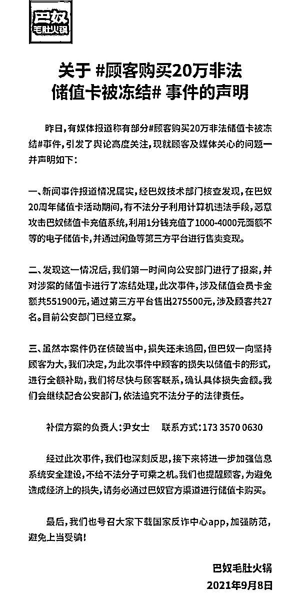

# 河南省郑州市巴奴火锅储值卡遭黑客盗刷 54 万：多位顾客图便宜购买后无法使用

> 原文：[`mp.weixin.qq.com/s?__biz=MzIyMDYwMTk0Mw==&mid=2247520439&idx=3&sn=102e17218b6351c7afc738c99ff37698&chksm=97cb5b8fa0bcd2990d04585995cfedb5a705194c9a786b97ba9c6e155aff7bafaf60d7f51752&scene=27#wechat_redirect`](http://mp.weixin.qq.com/s?__biz=MzIyMDYwMTk0Mw==&mid=2247520439&idx=3&sn=102e17218b6351c7afc738c99ff37698&chksm=97cb5b8fa0bcd2990d04585995cfedb5a705194c9a786b97ba9c6e155aff7bafaf60d7f51752&scene=27#wechat_redirect)

[`mp.weixin.qq.com/mp/readtemplate?t=pages/video_player_tmpl&action=mpvideo&auto=0&vid=wxv_2037968205578584068`](https://mp.weixin.qq.com/mp/readtemplate?t=pages/video_player_tmpl&action=mpvideo&auto=0&vid=wxv_2037968205578584068)

    现在，一些连锁超市和餐厅都有自己的会员充值卡，但充值时最好去实体店充值。不要试图在一些在线平台上低价购买，因为它们可能来自非法的途径。

     据媒体报道，河南省郑州市的一些消费者近日向媒体求助，称他们通过闲置交易平台咸鱼购买的巴奴火锅储值卡被冻结，无法使用。

报道中指出，三名消费者被冻结的储值卡都是来自闲鱼上的同一卖家，当时是以八折的价格购入的充值卡。其中一位消费者甚至充值了六万多块钱，三人的充值卡金额加起来基本上在十万元左右。消费者表示，对于充值卡被冻结的原因，巴奴方面表示是由于他们的系统被黑客入侵，手中的充值卡都是非法卡。在联系闲鱼买家后，自己却被买家拉黑了。目前，闲鱼平台出售充值的账号由于“违反法规或闲鱼相关规则”，已经被闲鱼官方给处置了。对此，巴奴毛肚火锅软件研发经理表示，在 6 月份的时候做了一个线上会员卡活动，但系统被一个黑客攻破了。该黑客支付 1 分钱后篡改了数据，花费了 1 块 9 盗刷了 54 万的金额。在后台发现了大量 1 分钱订单后，系统就将这些违规充值卡冻结了，并且第一时间给联系警方报案，巴奴方面也是受害者。消费者指出，目前的诉求是希望巴奴方面做出一个方案，虽然巴奴已经报案，但是如果最终案件没有侦破，针对自己的损失希望做出一个承诺，因为毕竟是他们系统漏洞造成的。巴奴毛肚火锅外联经理表示，这件事对消费者来说的确是一个不好的体验，作为企业也发现了自己线上或者系统中的漏洞。目前企业内部正在研究针对消费者损失方面的相关问题，最终肯定会拿出相关方案。目前公安机关已立案调查，案件还在进一步侦破当中。对此，律师表示，黑客就是利用了企业数据信息系统的漏洞，不法侵入企业来获取了一些经济利益，同时造成了企业的巨大损失。这种行为已经不简简单单是违法行为，而是犯罪行为，应当被追究刑事责任。作为消费者而言，如果是通过第三方的一些线上平台以合理的市场价格去购买的这些充值卡，这种情况下他们的行为是善意的，并不会被追究法律责任。但是如果他们明知这些充值卡属于赃物还购买，那这种行为就属于销赃行为，也是一种违法行。

来源：安全圈

← 向右滑动与灰产圈互动交流 →

