# pi 币暴富谎言、优米心选、拍呱呱、拼拼有礼、易拼购、友盟云商骗局

> 原文：[`mp.weixin.qq.com/s?__biz=MzIyMDYwMTk0Mw==&mid=2247520439&idx=4&sn=b0e356ed35e66ad3b8c0f4b5d0749ae9&chksm=97cb5b8fa0bcd29966127afe207ef053d36587a56a4a51662729893d463e49ebb3c5b467323c&scene=27#wechat_redirect`](http://mp.weixin.qq.com/s?__biz=MzIyMDYwMTk0Mw==&mid=2247520439&idx=4&sn=b0e356ed35e66ad3b8c0f4b5d0749ae9&chksm=97cb5b8fa0bcd29966127afe207ef053d36587a56a4a51662729893d463e49ebb3c5b467323c&scene=27#wechat_redirect)

1、pi 币：最近，很多币圈简讯的粉丝后台留言咨询关于 pi 币的情况，小编已经聊过很多次了，pi 币就是一个无聊的骗局，pi 币没有任何价值，就是一个空气币，最后终将以很不体面的方式收场！

而且，小编根据目前掌握的消息，pi 币大概率就是一个国内操盘手通过出口转内销的方式搞的一个零撸盘子而已，最初也没有想到能够坚持这么久，后来发现花几个小钱找了几个老外包装之后忽悠了这么多韭菜进来，于是现在更是肆无忌惮的拉人头。

当然，大家都知道，随着国家对于币圈乱相整治力度加大，pi 币这种伪区块链首当其冲被限制了，目前国内用户已经不能正常登录，很多用户通过非法途径登录 pi 软件，而且很多所谓 pi 币超级信仰者每天给新用户洗脑，鼓吹 1π＝1000 美金，只不过是痴人说梦而已，小编曾经预演过即便是 piz 真能上主网，也是一文不值！大家千万不要相信那些人所谓的暴富神话，不过是为了自己有一天能够出货而已！

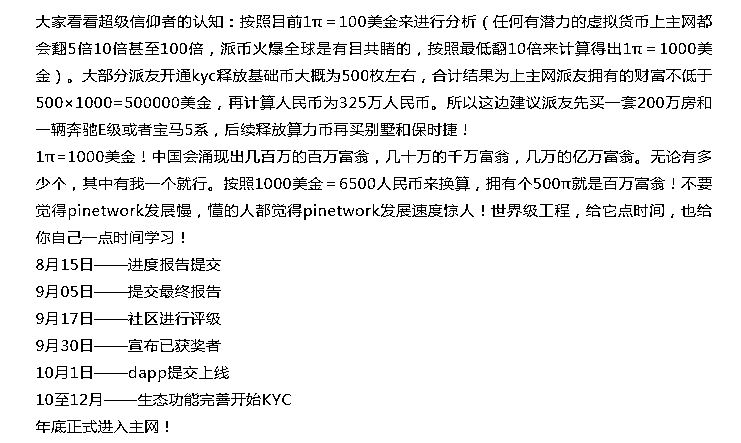

币圈老矿工都知道，真正的正规挖矿背后其实是有一整套复杂机制的运行，而保证绝对的去中心化。而 pi 币只要用邮箱注册，然后每天的话只要点一下，就能所谓的自动挖矿。显然 pi 币背后一定有一个中心化机构在运作。

pi 币这样宣传自己：Pi Network 是由斯坦福大学一批博士创业者新推出的一个智能手机区块链公链项目，其实据小编了解，这个所谓 pi 币主要用户来自国内，而这个所谓的尼古拉斯不过是一个给钱就办事的演员而已，不知道这位老哥何时能来国内走两步，毕竟没少收出台费！

   pi 币就是一个骗局而已，不管操盘手怎么精心包装 ，但是其本质是令人深恶的非法骗局、掘金模式，现在打着手机挖矿的软件多的很，如果随便拉几个人就能挖矿那还要矿机这个东西干嘛。

pi 币这种明显的骗局被币圈的人大佬不齿，而且有位币圈知名大咖曾经直言，PI Network 是个无聊的骗局......，而且 当时这位在一场直播中中戏谑的将 pi 币称为屁币，pi 民称为屁民。让人搞笑的一幕来了，pi 的粉丝居然大幅宣传认为是李笑来在为 pi 币站台。可见 pi 币这些所谓的信仰者多么恬不知耻！

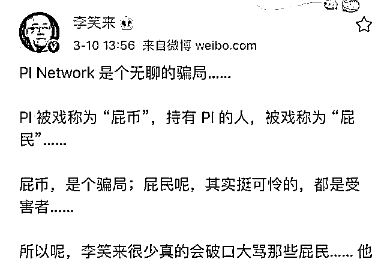

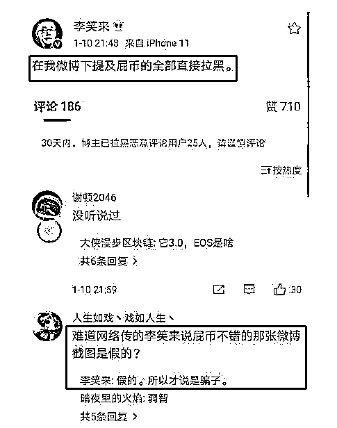

        pi 币快两年了，到现在还没有开通交易。也没有主网，目前软件植入了不少广告，笔者估计这些小广告也是和斯坦福大学的那几位教授合作的吧。如果 pi 民不看广告估计 pi 的维护费都维持不了。

2、拼拼有礼：这个项目就是一个拼团类骗局，小编反复预警多次，现在项目方自己宣布已经资金链断了，已经没有现金。这次因为广大网友行动迅速，很多受害人都是第一时间赶到公司直接报案，所以现在拼拼有礼部分负责人迫于压力，回到公司配合警方处理后续问题！

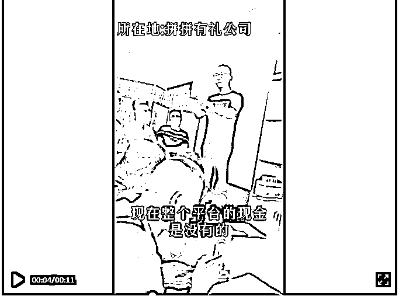

据网友反映，拼拼有礼的负责人竟然把“资金链的断裂”推脱至所谓的负面消息上，本身就是一个拼团类骗局，项目方操盘手依靠谎言收割韭菜，不断被自媒体曝光，才避免了更多人上当受骗！

另外据在公司的受害人反映，最早去公司那批人已经全额退款了，第二批去公司的受害人只退了一部分，第三批去的现在别凉着，暂时未有消息！由此可见，如果此类平台出现问题，第一时间去公司报警有多重要！ 

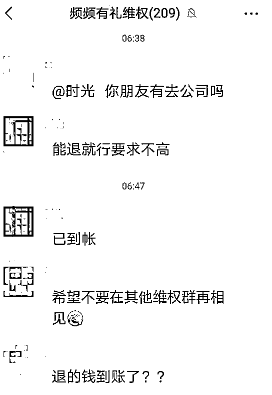

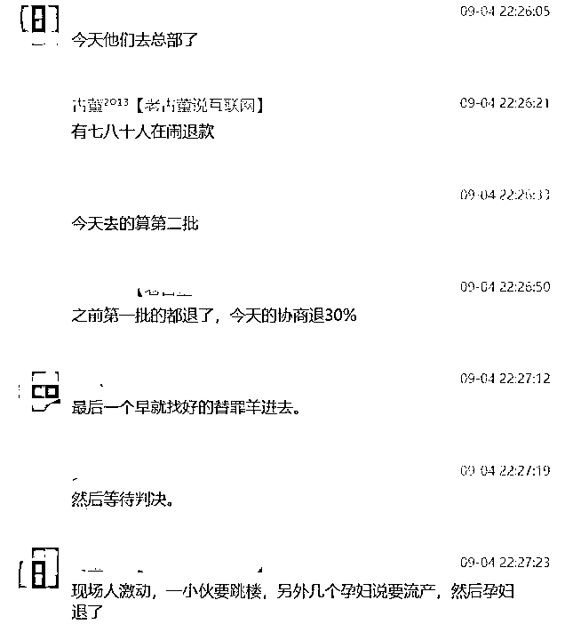

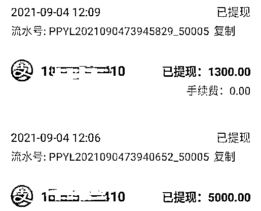

最新消息，据现场的受害人反映，拼拼有礼项目方目前安排现场受害人填写亏损金额，然后统一解决，至于那些不在现场的，只能接受 30%的方案。

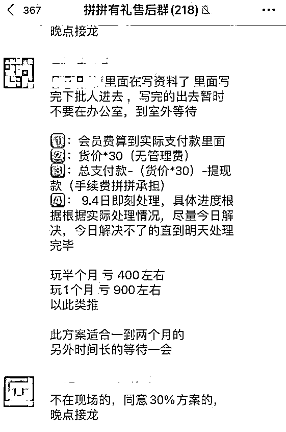

3、易拼购：大家都知道，今年不管是什么项目方都要借拼团的幌子搞个盘子圈一波，没错，易拼购的项目方也是来收割韭菜的。

小编在这里提醒大家，易拼购和刚刚崩盘的拼拼有礼一样都是拼团类骗局，建议远离！

   易拼购自称是由重庆创达大数据集团有限公司发起。公司主要拥有大数据存储、互联网技术、餐饮文化、广告传媒四大核心产业板块，现整合所有企业资源，发起【易拼购】小编通过第三方查询后发现，该公司有两个自身风险，本月 13 号该公司还有一场官司，具体见下图：

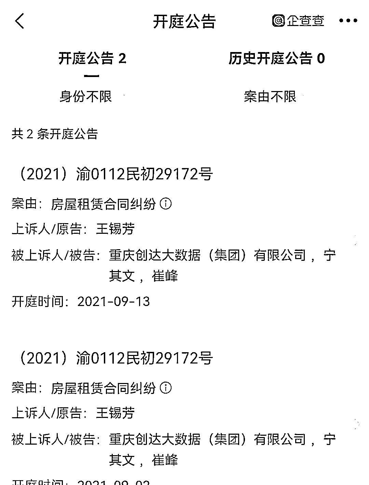

4、友盟云商：这个项目又一个“拼团”类资金盘骗局，根据资料查询得知，其运营主体为友盟天下科技（成都）有限公司，而且这家公司已经被三次列入异常经营！

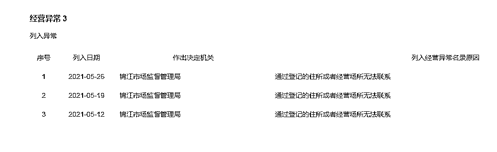

2021 年 8 月 30 日， 成都市公安局龙泉驿区分局对外发布了 关于成都友盟天下科技有限公司涉嫌非吸案的情况通报。建议大家远离友盟云商这个平台!

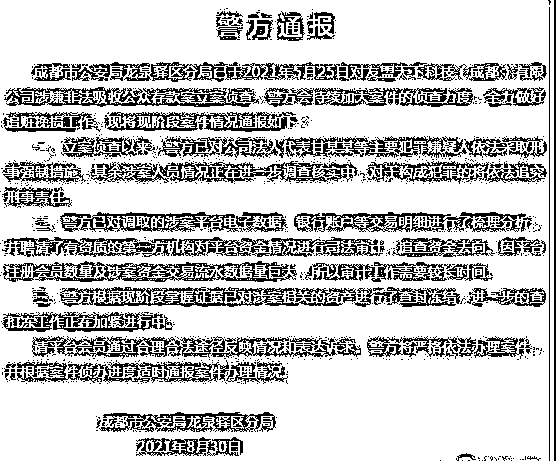

5、拍呱呱：这个项目就是一个秘乐的重启盘，现在处于不死不活的状态，反正就是拖着，看谁先受不了！据说，现在很多用户已经出现提现不到账的情况了！

提现本来就是 72 小时才到，现在又失败，再次提又 72 小时，在商城买抢不到单，钱退回商城，提现搭进去 5%手续费，并且最快还得 72 小时到账，会员们都感觉他想用这个钱周转广告卡。

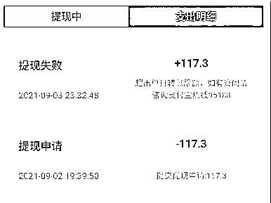

6、优米心选：昨日，有币圈简讯的粉丝后台留言咨询优米心选这个项目有什么消息吗？小编了解到，这个项目方又搞了新盘子，所以基本上已经放弃了，这个项目方办公地址不明，不像拼拼有礼出事后第一时间去公司报警还能挽回损失。

今年，这种拼团类骗局太多了，三天两头的崩盘，但是依然有人参与，小编建议大家尽量远离此类骗局，现在知道的有不少都已经有跑路征兆，比如见康乘,优速,优米心选,易拼购,红豆角等。

来源：捉销师

← 向右滑动与灰产圈互动交流 →

