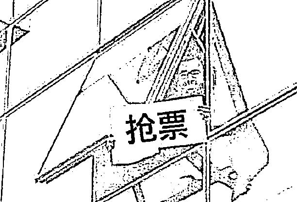
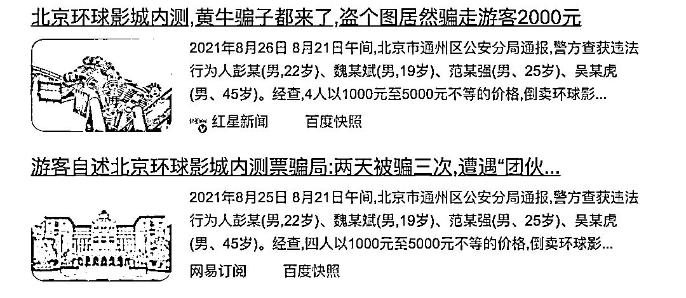
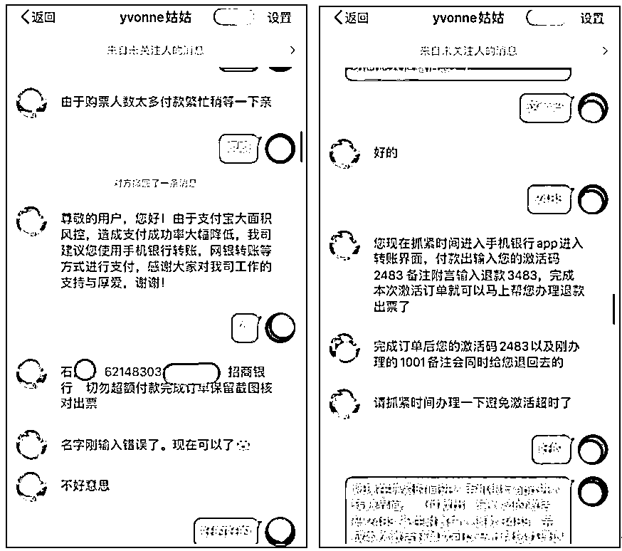
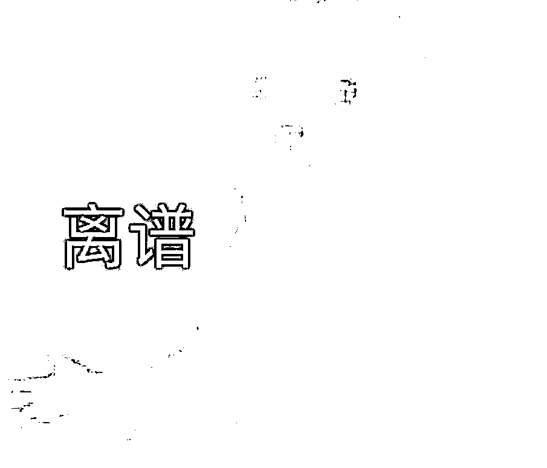
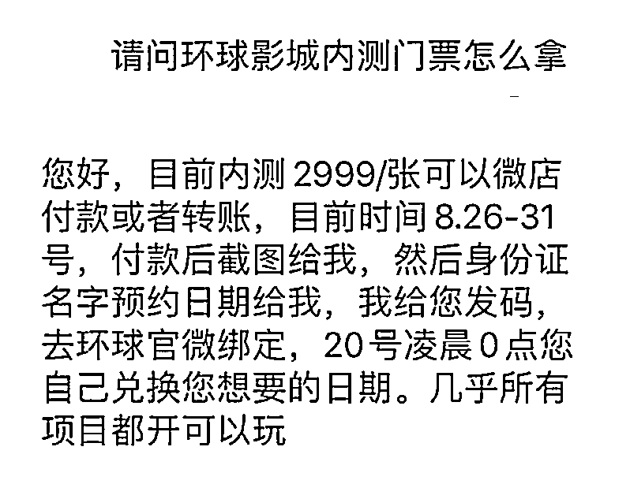

# 环球影城内测票 2999 元 1 张，你别买啊！

> 原文：[`mp.weixin.qq.com/s?__biz=MzIyMDYwMTk0Mw==&mid=2247520510&idx=2&sn=7bdf9e64a68be427d62636411455c331&chksm=97cb5bc6a0bcd2d07449f37e09b4cc23c1be748bacf07f811267ede748366ae93c83ed847d96&scene=27#wechat_redirect`](http://mp.weixin.qq.com/s?__biz=MzIyMDYwMTk0Mw==&mid=2247520510&idx=2&sn=7bdf9e64a68be427d62636411455c331&chksm=97cb5bc6a0bcd2d07449f37e09b4cc23c1be748bacf07f811267ede748366ae93c83ed847d96&scene=27#wechat_redirect)

让人开心的事情是什么？

放假

让人更开心的是什么？

再过十几天，就放七天假！

在马上到来的国庆假期

估计大家已经开始策划去哪里玩了

但去哪玩总离不开一件事

那就是**买票，买票，还是买票**

不管是交通票，还是景区票

票到手了才是王道

但是俗话说

大众越需要什么，骗子就越在哪里活跃

在国庆假期这个节骨眼上

更是出现**黄牛横行**和**诈骗频出**的现象

比如近期

万众瞩目的**北京环球影城**开园在即

▎北京环球影城  图源 21 世纪经济报道  

这个亚洲第三座、世界第五座环球主题公园

吸引诸多网红明星前去打卡

但目前处于试运营阶段

内测票已经被黄牛炒出了

**1000-5000 元**不等的价格

而同时，一些诈骗党也开始活跃

这些互联网诈骗党

配着北京环球影城内的照片

披着“**官方票源**”的外衣

在社交平台发布售票消息

据被骗人表示

这些人会让你提供购票需要的

**姓名、身份证号、手机号等信息**

然后你会收到一条订单短信通知

让你支付票款

这钱还不能用支付宝付

得打到个人银行卡账号

 ▍骗子诈骗手段，图源网络

等你付了钱后

对方又会跟你说购票流程出了问题

需要重新转账 1001 元

之前的 1000 元会退回

**就这样以各种名义**

**诱导用户一步步打钱**

**你什么时候发现不对**

**他便什么时候失联！**

 

还有用**“兑换券”**诈骗的

用户付款将个人信息发给票贩后

会得到一个兑换码

然而这个兑换码并不能兑出票

▍骗子诈骗手段，图源网络

我们可以看到

新一代互联网技术流“票贩子”

都深谙网上购票的套路

会给出一些看似非常合理的理由

**然后利用“短信提示”或者“兑换码信息”**

引导用户不知不觉就把钱打过去了

纵观票贩子的“发展史” 

可以从黄牛说起

无论是人潮拥挤火车站

还是电影院和热门景区

你都有可能看到一个热心的身影

走到你跟前小声说：

“**兄弟，票要伐？**”

那个时候，黄牛们还只是

做垄断票源和倒卖票的事

主要瞄准春运这个节点 

他们一开始倒卖火车票

选得是最直接最野的路子——

**把售票厅的票全部买走**

然后**抬价转卖**

后来，这些黄牛被严打了

以前那种明目张胆硬抢票的事不能干了

▍图源网络：“东北帮”大佬周广龙，被指控七项涉黑罪名

黄牛们迅速转化了思路

不再团体行动

**化整为零打起了游击战**

以北京西站为例

最红火的时候

车站里有上万名黄牛

由于**竞争太激烈**

黄牛们不但要发展顾客

又要时刻提防警察和记者

不过，**有江湖的地方**

**就一定有大佬**

在普通黄牛费尽心思

只能赚到一点辛苦钱的时候

一群**互联网技术流票贩子**们

**对自己的灵魂发出了拷问：**

**为什么**

**我们不能站着把钱挣了呢？？**

于是掌握了珍稀票源的黄牛们

以各种隐蔽的姿势

或者打着“个人票转卖”的旗号

开始在各大**互联网社交平台发布消息**

一步步控制市场的票源

把价格炒上去

不用再冒风里雨里甚至被抓去牢里的险

而另一种“**互联网技术流诈骗党**”

就不是你加钱就能买到票这么简单了

比如文章开头出现的

打着环球影城官方票源售卖渠道的旗号

实施诈骗的套路

骗子们的骚操作引来许多用户投诉

为避免更多人上当受骗

北京环球度假区已官方发布消息

提醒大家警惕相关风险

中秋假国庆假将近

也在此提醒大家

**网上购票一定要在官方途径购买！**

毕竟，**放假虽香**

**但不要被票贩子坑了啊**

灰产圈在线客服

← 向右滑动与灰产圈互动交流 →

