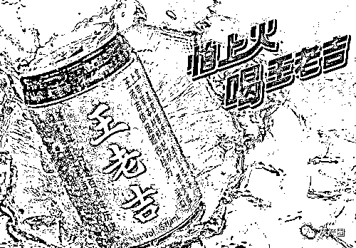
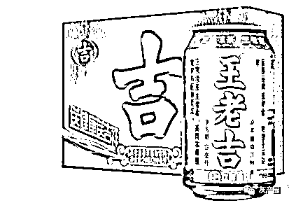
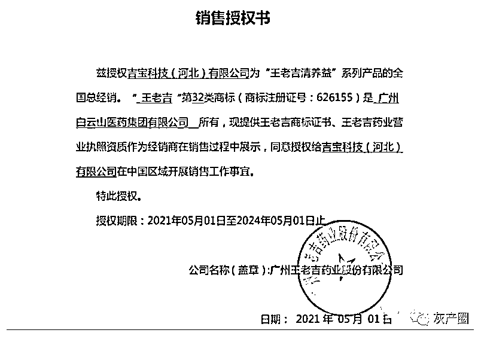
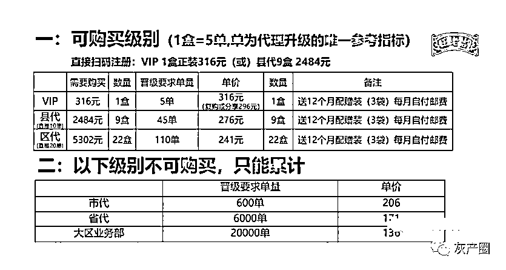
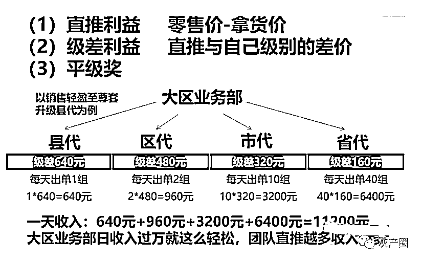

# 王老吉，陷入舆论风波！

> 原文：[`mp.weixin.qq.com/s?__biz=MzIyMDYwMTk0Mw==&mid=2247520510&idx=3&sn=421e0363f770dad7d3d383adfbe3c302&chksm=97cb5bc6a0bcd2d011631edc126cc94e499361af8c8837d404b3430c7ac327faccfe9c93dc9b&scene=27#wechat_redirect`](http://mp.weixin.qq.com/s?__biz=MzIyMDYwMTk0Mw==&mid=2247520510&idx=3&sn=421e0363f770dad7d3d383adfbe3c302&chksm=97cb5bc6a0bcd2d011631edc126cc94e499361af8c8837d404b3430c7ac327faccfe9c93dc9b&scene=27#wechat_redirect)

最近，王老吉这家国民凉茶品牌因虚假招商、不兑现承诺等原因，遭加盟商集体控诉，陷入舆论风波。近日，《财经》新媒体记者调查发现，除了上述问题外，一款名为王老吉“吉宝清养益”的固体饮料在微商圈开始兴起，该产品以“广药大健康产品”为背书，在宣传上声称具有“通宿便、调肝胆、补肾阳、养血液”等功效，是一款主打减肥的产品。按照相关法规，普通食品宣传有保健功效，涉嫌虚假宣传。 

记者调查了解到，该产品市场零售价格高达 316 元/盒，而出厂价仅有 14 元/盒。暴利背后通过微商模式逐层分级，从 VIP、县代、区代、市代、省代、大区业务部共六个层级，通过层层发展下线，最终一款只有十几元出厂价的产品被推高到几百元。

值得关注的是，“吉宝清养益”系列产品并非广药集团及相关子公司生产，而是由白云山集团股份有限公司（下称“白云山”）子公司广州王老吉药业股份有限公司授权的贴牌产品。其生产商为贴牌代工厂和宜佳（广东）健康科技有限公司，而全国总经销商为吉宝科技（河北）有限公司（下称“吉宝”）。

业内人士透露，这类产品的运作手法是项目操盘手找到品牌方获得品牌授权，然后找代加工厂商进行贴牌生产，再通过专业机构打造一套多层分销系统，将产品通过社交裂变的方式分发获得收益。律师认为，从该产品的销售模式来看涉嫌传销。

事实上，广药集团以 13.89 亿元将王老吉 420 项等商标专用权系列授权白云山使用，市场上出现了涌现了大量打着“王老吉”品牌旗号的授权产品，很多产品都是昙花一现、乱象丛生。就销售授权书的真伪、授权收益等问题，《财经》新媒体记者向王老吉药业及广药集团授权的广州白云山医药集团股份有限公司（下称“白云山”）求证，白云山方面对记者表示并不清楚，需要向王老吉方面求证，记者又多次拨打王老吉药业的官方电话，截止记者发稿一直无法接通。

**真减肥还是虚假宣传？成本 14 元售价 316 元******

****根据经销商提供销售授权书显示，广州王老吉药业股份有限公司（下称“王老吉药业”）授权吉宝科技（河北）有限公司（下称“吉宝”）为“王老吉清养益”系列产品的全国总经销，王老吉商标证书及王老吉药业营业执照资质可以作为经销商在销售过程中展示。这意味着王老吉吉葆项目实际由吉宝公司运作。****

********

****从网上的宣传资料来看，“王老吉清养益”系列产品标榜为王老吉新零售项目，也称王老吉吉葆新零售，属于“广药大健康产品”，但旗下仅有三款产品，包括王老吉清养益、吉葆徘油宝、吉葆幸福燃，三款产品均属于主打瘦身的固体饮料。****

****根据王老吉清养益包装背面的产品信息表显示，产品名称为：刺梨胶原蛋白肽固体饮料；产品标准代号为：GB/T 29602。记者查询国标发现，该款产品只是一款普通的固体饮料，并不属于保健品范畴。****

****但三款产品在宣传中鼓吹具有“排毒、排油、增强免疫、补肾阳”等功效，已超出普通食品宣传的范畴。知名律师，太琨律创始合伙人律师朱界平向记者介绍，根据《食品安全法实施条例》第三十八条第一款规定，保健食品之外的其他食品，不得声称具有保健功能。****

****朱界平还表示，对于是否违反《广告法》的问题，一般来说，对于普通食品的标签、说明书通常不认定为广告，这种情形不受《广告法》的调整；如果确实是在产品广告中对普通食品进行保健作用的宣传，是对普通食品本身性能和功能的虚假描述，容易引起消费者的误解。根据《广告法》第二十八条第二款第(二)项规定，商品的性能、功能与实际情况不符，对购买行为有实质性影响的，可以认定为虚假广告。****

****除了产品上夸大宣传外，王老吉清养益还是一款彻头彻尾的贴牌代工产品，根据产品生产信息显示，该款产品的生产商为和宜佳（广东）健康科技有限公司（下称“和宜佳公司”）。记者查询该公司相关信息发现，和宜佳公司是一家专注于 OEM 贴牌代加工的企业，2020 年因违反《食品安全法》，两次被相关部门处罚。****

****记者还在和宜佳公司官网找到了，王老吉清养益同款产品——刺梨胶原蛋白肽固体饮料，从官网宣传来看，并未像王老吉清养益宣传的那样，具有众多功效。****

****记者以做贴牌代工为由联系到了这家企业，该公司相关负责人透露，王老吉品牌刺梨胶原蛋白肽固体饮料确实由该公司生产，每小袋的批发价格为 1-2 元左右，每盒的售价也就在 10-20 不等，产品外形包装也是由该公司设计。****

****“王老吉清养益相关产品一单是 200 多万，我们给到的价格是一盒 14 块左右，其中包含包装、原料加工费等，工厂有专业的包装设计团队，免费设计，设计包装前支付定金款 5000 元即可，定金后期抵扣货款。”该负责人对记者表示。****

****这意味终端售价 300 多元的产品，实际批发价格仅有 14 元左右，可谓是暴利。相关业内人士对记者表示，微商核心逻辑是，项目操盘手找到品牌方获得品牌授权，然后找代加工厂商进行贴牌生产，在通过专业机构打造一套多层分销系统，将产品通过社交裂变的方式分发出去获得收益。由此可见，产品不是核心要素，关键在于制定一套行之有效的销售模式。****

******卖产品还是拉人头？销售模式涉嫌传销******************

******记者以加盟代理商为由，联系了多名该项目的代理商，浙江地区大区业务部经销商李亚清（化名）对记者表示，“王老吉吉葆新零售项目 6 月底开始启动，7 月赚了 2 万多元，8 月赚了 3 万多元，现在入局刚刚好。”******

******代理商是如何轻松月入过万的？该项目有一整套的销售模式，根据经销商提供的资料显示，VIP、县代、区代三个级别的经销商直接可以通过购买产品获得相应的级别，级别越高享受单价越低，以县代为例，花费 2484 元购买 9 盒产品即可成为县代。而市代、省代、大区业务部三个级别，不能通过直接购买产品完成经销商级别的升级，累计销量超过 2 万单才能成为大区业务部。******

************

******另外，还有一种直接成为县代的方式，即购买一组王老吉轻盈至尊套装（1896 元）可成为县代，包涵 6 盒产品，并赠送王老吉清养益 10 袋、吉葆徘油宝 10 袋以及赠价值 198 元广药暖秀瘦身精油 1 盒。******

******据该项目大区级经销商向记者介绍，该项目由此便产生直推利益、级差利益、平级奖三种获利方式，以销售王老吉轻盈至尊套装为例，直推利润就是零售价减去拿货价所得的利润，级别越高拿货价越低利润越高。******

******“级差利益简单讲，就是经销商间接赚取自己下级经销商销售利润的差价，以大区业务部销售一个 1896 元王老吉轻盈至尊套装为例，大区业务部以下还有省代、市代、区代、县代，每个级别差价为 160 元，省代每推出一个该套装，大区业务部赚 160 元，市代每推一个套装，大区业务部是赚 320 元，区代推出这样一个套装，大区业务部赚 480 元，以此类推，赚每个级别间的差价。而平级奖是经销商发展一个同一级别的经销商所赚取的利润。”该经销商称。******

************

******这意味着，各个层级的经销商只有通过无限地发展自己的线下人员才能得到更低的拿货价、获取更高的级别，最终赚取更多利润。显然，经过层层经销商赚取利润，终端售价 300 多元的到大区级经销商拿货价也只有 100 多元，不免让外界怀疑此项目是卖产品还是拉人头。******

******北京云嘉律师事务所副主任、中国政法大学知识产权研究中心研究员赵占领表示，从该产品的销售模式来看，涉嫌传销，理由是该模式满足了传销的组织要件，组成上下线的人际网络，形成传销的“人员链”，但是否真正构成传销，还要看计酬方面，是否形成传销的“金钱链”。对于计酬要件的判定，最终还要由公安和市场监管部门做正式认定。******

******陕西迈盛律师事务所合伙人、党支部书记陈川认为，这一模式主要目的是拉人头，赚的是发展人头的利益或者利益差，而不是靠出售商品获利，特别是层层设置各级别的不同代理权限，而各个级别又有不同的利益，其实就是引诱各级代理层层向上晋级，层层向下发展人员参与，符合传销组织的组织特性。******

******被授权玩坏的王老吉品牌 谁来担责？******************

******除了王老吉吉葆相关产品，市场涌现出越来越多打着 “王老吉品牌”旗号的产品，从茶饮连锁品牌 1828 王老吉到火锅品牌 1828 王老吉小吉锅派，从白酒品牌王老吉 “岁岁牛”到王老吉啤酒，再到牛奶品牌王老吉吉如意，一时间王老吉品牌从多个品类中冒出，但很多品牌又快速消失，雷声大雨点小。******

******除了上述品类之外，王老吉还推出了清味乐、虫草饮、大红杞枸杞饮料、桂花酸梅汤、藕汁、诺丽果饮品等饮料产品，另外还有润喉糖、龟苓膏、川贝味枇杷糖等零食产品，甚至还涉足日化领域，推出王老吉牙膏，很多产品都是仅是在刚推出时已发关注，随后便石沉大海。******

******值得关注的是，2018 年 12 月，广药集团以 13.89 亿元将王老吉 420 项等商标专用权系列授权白云山使用。按照当时双方签订的《业绩补偿协议书》，王老吉商标资产的业绩承诺期为 3 年，分别于 2019 年、2020 年和 2021 年完成 1.53 亿元、1.63 亿元和 1.71 亿元的商标许可净收益。如累积实现的商标许可净收益未能达到上述要求，则广药集团要对白云山进行现金补偿。******

******记者查询年报发现，广药集团授权白云山使用王老吉商标后，业绩承诺完成并不理想，除了第一年踩线完成外，2020 年实现商标许可净收益 1.2 亿元，业绩承诺的完成率仅为 75.03%。今年 8 月 19 日白云山与广药集团签署延期协议，同时将此前的考核指标顺延一年。******

******香颂资本沈萌对记者表示，广药集团对王老吉品牌授权给白云山后，初衷应该是希望利用社会资源更大范围更深领域的开发王老吉品牌的价值，但是目前来看这个初衷没有得到很好执行，反而出现被滥用、削弱王老吉品牌价值的情况。而这些非广药系推出的王老吉产品，都缺乏统一的严格标准，导致其中出现鱼龙混杂、良莠不齐。******

******基于王老吉的品牌影响力，还很多微商也盯上了这一品牌。例如：今年 7 月，王老吉与微商思埠集团在发布会上签署下合作协议，宣布哔嗨啤正式进入市场。据了解，哔嗨啤共推出了 2 款精酿啤酒，分别是艾尔精酿白啤酒和精酿全麦啤酒。******

******与王老吉吉葆项目类似，销售模式走的是微商模式。根据宣传资料显示，哔嗨啤代理可分为三个级别，分别是 VIP 批发商、高级批发商、全国总代，购买相应数量的产品就能成为相应级别的代理商。记者查询该款啤酒产品信息发现，该产品也是贴牌代工产品，生产商为山东雪野啤酒有限公司，将军啤酒是其主打品牌。******

******       长期品牌授权也为王老吉品牌埋下了祸根，一些对外授权正不断消耗王老吉知名品牌，还影响了品牌的声誉。2019 年，一款名为王老吉“吉悠”的产品因涉嫌传销站上舆论的风口，尽管广药集团迅速回应称，王老吉与“吉悠”不存在任何关系，并指出“吉悠与王老吉的关系是假冒的，从未授权使用王老吉商标”。但吉悠关联方的确曾经获得广药集团授权，只是已经过期。******

******       中国酒业分析师蔡学飞表示，王老吉作为知名快销品牌，已经成为一种无形资产。过多的对外授权，导致王老吉品牌价值正在快速流失。王老吉是一个品牌资源非常强势的快消品牌，但它也仅仅停留在凉茶这个品类，它本身也是凉茶品类的开创者。而在啤酒、白酒这样的品类上，实际上并没有太多优势，甚至反而会造成一种“战略失焦”，导致消费者辨识度下降等问题。******

******       那么广药集团将王老吉品牌授权白云山后，大肆授权各种产品使用这一品牌，导致授权品牌乱象丛生，谁该为这些“乱象”买单？******

******来源：《财经》新媒体，网议视点******

******灰产圈在线客服******

************

******← 向右滑动与灰产圈互动交流 →******

************