# “欠费”12 亿？！华尔街英语全部停业！

> 原文：[`mp.weixin.qq.com/s?__biz=MzIyMDYwMTk0Mw==&mid=2247520510&idx=4&sn=712a89368145affc0884812f755729bb&chksm=97cb5bc6a0bcd2d07605564440bac7b3b9aa53d77a648e8136aaf28fae7779db4892df9e0e30&scene=27#wechat_redirect`](http://mp.weixin.qq.com/s?__biz=MzIyMDYwMTk0Mw==&mid=2247520510&idx=4&sn=712a89368145affc0884812f755729bb&chksm=97cb5bc6a0bcd2d07605564440bac7b3b9aa53d77a648e8136aaf28fae7779db4892df9e0e30&scene=27#wechat_redirect)

前不久，知名培训机构华尔街英语，被曝出“将宣布破产”的传闻。根据公开的信息显示，这家成人英语培训企业欠下了高达 12 亿元的学费。值得注意的是，这笔巨额的学费，是大量学员通过预付的形式支付给培训机构的，其中还有贷款的方式。这样的消费背后又有着怎样的玄机呢？

****华尔街英语停止营业 学员依然要还贷款****

 **[`mp.weixin.qq.com/mp/readtemplate?t=pages/video_player_tmpl&action=mpvideo&auto=0&vid=wxv_2038520802144223234`](https://mp.weixin.qq.com/mp/readtemplate?t=pages/video_player_tmpl&action=mpvideo&auto=0&vid=wxv_2038520802144223234)** 

**△央视财经《经济半小时》栏目视频**

**2000 年就进入中国市场的成人英语培训机构华尔街英语，将自己的客户定位为中高端人群，课程报价虽高，但却并不妨碍其成为教培市场的“宠儿”，曾经一度年均收入增长率超过 40%。**

****

**然而如今，**一夜之间，华尔街英语在全国 11 个城市的 39 个学习中心**，全部停止了营业。**

**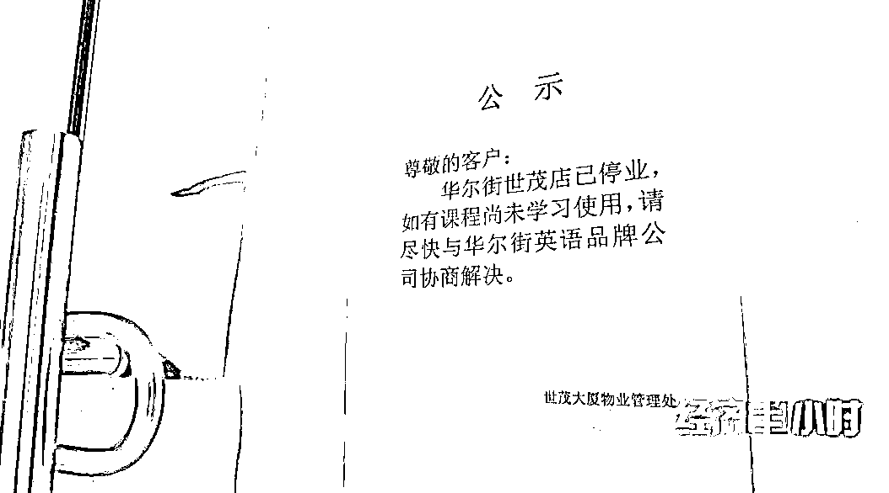**

**根据天眼查的查询结果显示，华尔街英语培训中心（上海）有限公司因“通过登记的住所或者经营场所无法联系”被上海市市场监督管理局列为经营异常；同时，天眼查风险信息也显示，**华尔街英语数家分公司因登记的住所或经营场所无法联系被列入企业经营异常名录。****

**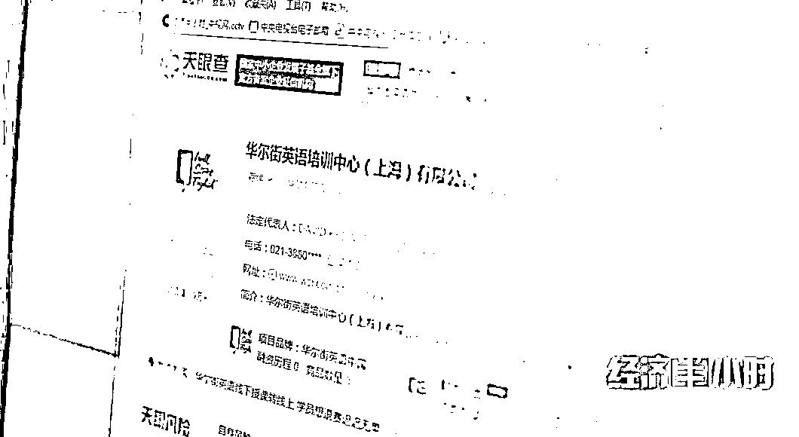**

**一夜之间关门停业，让华尔街英语的学员感到无助，众多学员在当地派出所、线上法院、消费者热线上不断反映自己的遭遇，寻求退还学费的解决之道。**

**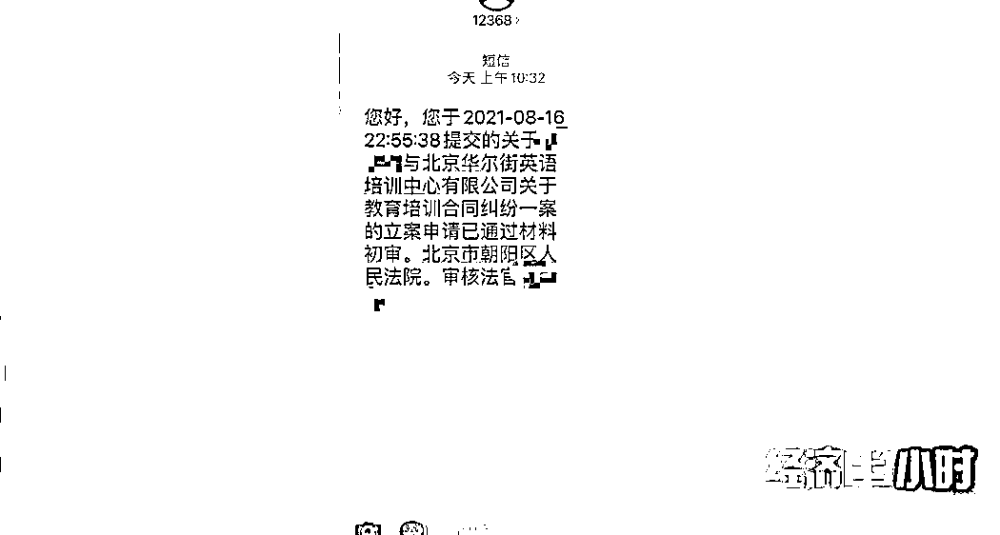**

**与此同时，一段 8 月 11 日华尔街英语高管与员工的对话录音也在网上流传，虽然管理层对“华尔街英语将破产”的传闻不置可否，但却让消费者的维权之路，成为了网络的热门话题。**

****

****

****

**培训机构关门停业了，学员的学费能不能及时退还呢？目前华尔街英语没有给出任何官方的答复，而其中更为复杂的问题，也浮出了水面，那就是**贷款进行培训学习的学员，现在深陷“没学上仍要背贷款”的尴尬境地。****

**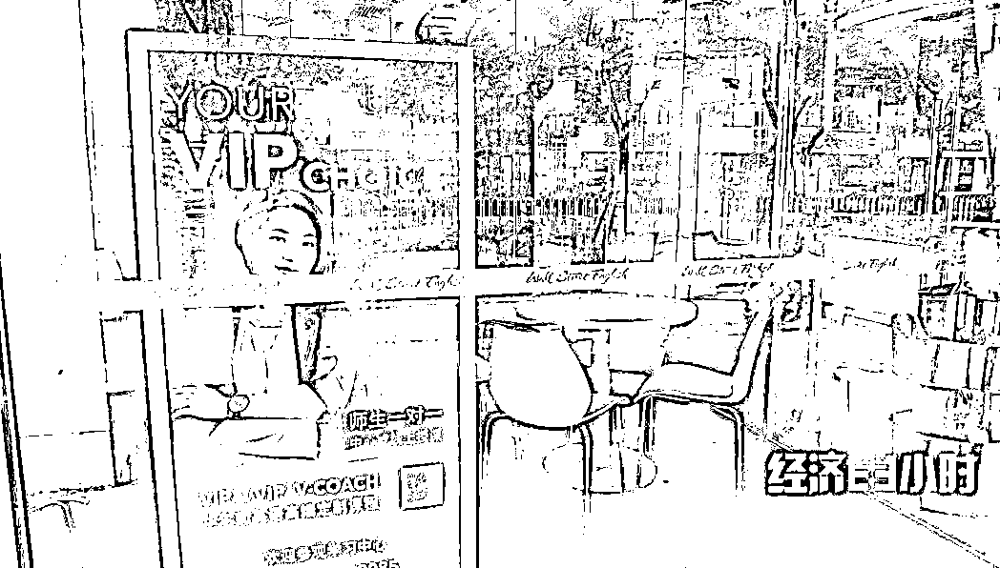**

**23 岁的小罗是一名普通白领，2021 年 1 月，她以 22600 元的价格在华尔街英语培训机构，购买了为期一年的培训课程。在销售顾问的介绍下，她通过一个名叫“度小满”的应用程序，以贷款的方式完成了支付。**

**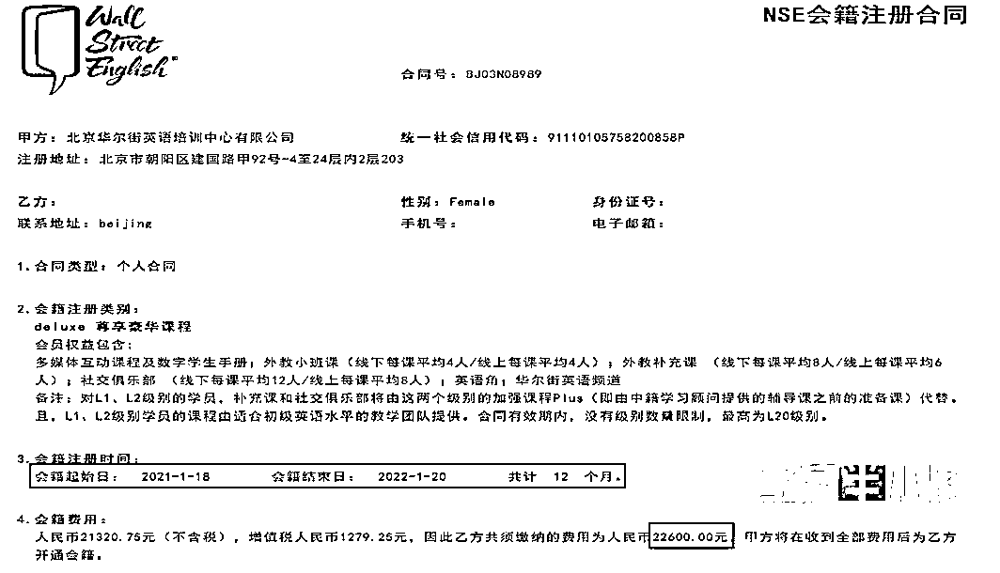**

**短短两个月之后，小罗又在华尔街英语销售顾问的极力推荐下，以 20500 元的价格续费购买了一年的培训课程，这一次她是通过办理信用卡的方式完成支付的。**

**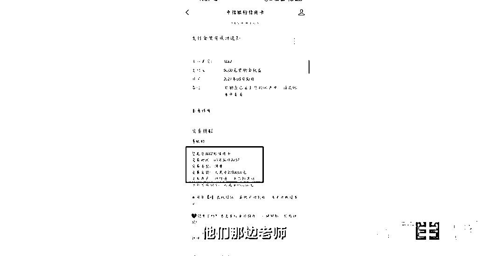**

****

**回忆起整个办卡过程，小罗说快得出乎意料，更让她没想到的是，自己月收入仅 5000 元，却轻而易举地获得 25000 元的贷款。但这也意味着，为了偿付两笔华尔街英语的学费，小罗每月光是还贷就需要开支 3000 元左右。**

****

****

**一份由学员自发填写的华尔街英语维权统计表显示，仅北京大望路中心，就有 49 名用户的购课合同金额超过 10 万元，**最高一笔购课合同金额高达 57 万元**。**

**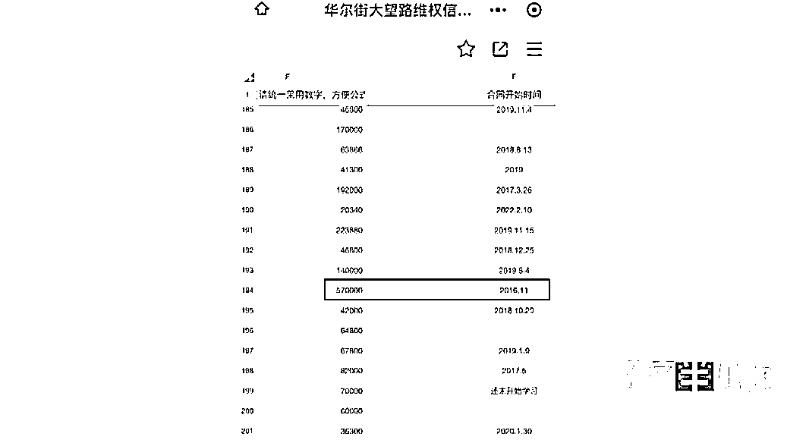**

**而网上一份来自广州华尔街英语培训机构学员自发填写的维权统计表显示，购课合同金额超过 10 万元的用户有 65 位，**最高一笔购课合同的金额更是高达 151.8 万余元**。**

**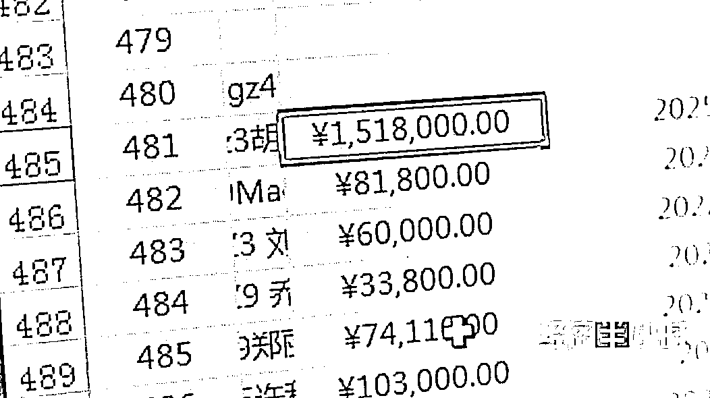**

**另外有志愿者对各地华学街英语学员的情况进行了统计，**截至 8 月 14 日中午 12 点，不到半天时间里，有 6000 多名学员参与登记，涉及合同金额 4.8 亿**。**

**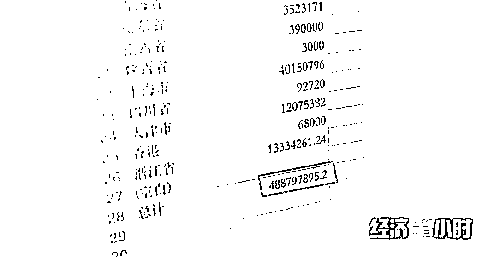**

**而这些学员中，52%的人是通过银行或金融平台贷款的方式支付学费。课程费用高昂，推荐贷款成为了华尔街英语销售顾问必备的售课流程。在两三个小时，甚至五六个小时强大推销话术的进攻下，让自己背上一身学费债的学员，不在少数。**

**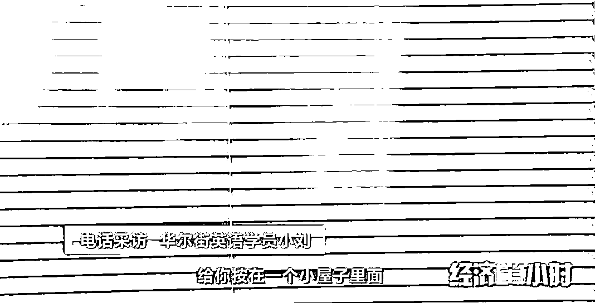**

****

**同时记者在调查中还发现，一些没有收入、没有还款能力的在校学生，也成为了华尔街英语销售顾问的销售目标。**

****

**2020 年 11 月，大学生小向在北京西环广场中心的华尔街英语以 18000 元的价格购买了一年的课程，其中贷款支付的部分将近 15000 元，每个月要还 1000 多元。作为一名生活费仅 2000 元的在校大学生，这笔钱大大超出了小向的支付能力。**

****

****

**不等小向过多思考，办理信用卡的工作人员第一时间出现在了现场，明明知道小向还是在校学生，**没有出具任何收入证明等的情况下，甚至连信用卡都还没拿到手，就直接在应用程序上开通了贷款额度，并当场支付**。**

****

****

**小向告诉记者，在华尔街英语，自己的情况并非个案。实际上，就在 2021 年 2 月，银保监会等五部委就联合印发了《关于进一步规范大学生互联网消费贷款监督管理工作的通知》，**明确小额贷款公司不得向大学生发放互联网消费贷款，明确未经监管部门批准设立的机构一律不得为大学生提供信贷服**务。**

**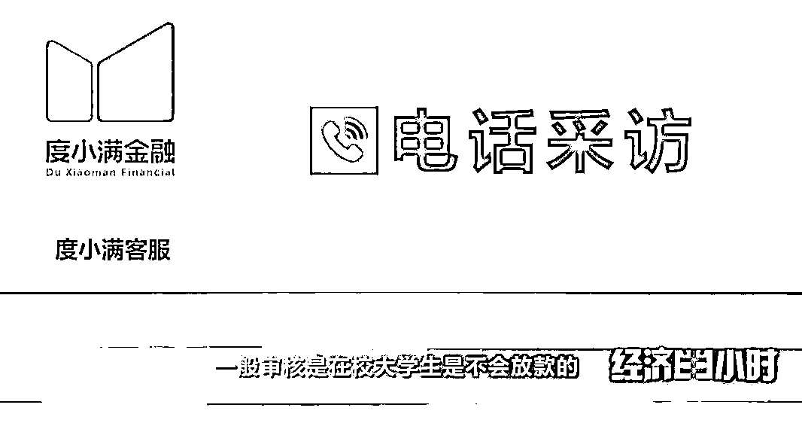**

**记者联系了借贷大学生们所提及的几家互联网金融机构，尽管他们的回答滴水不漏，但是在监管部门出台这份文件之后，依然有在校学生使用本人的身份信息，通过借呗贷款购买了华尔街英语的课程。**

**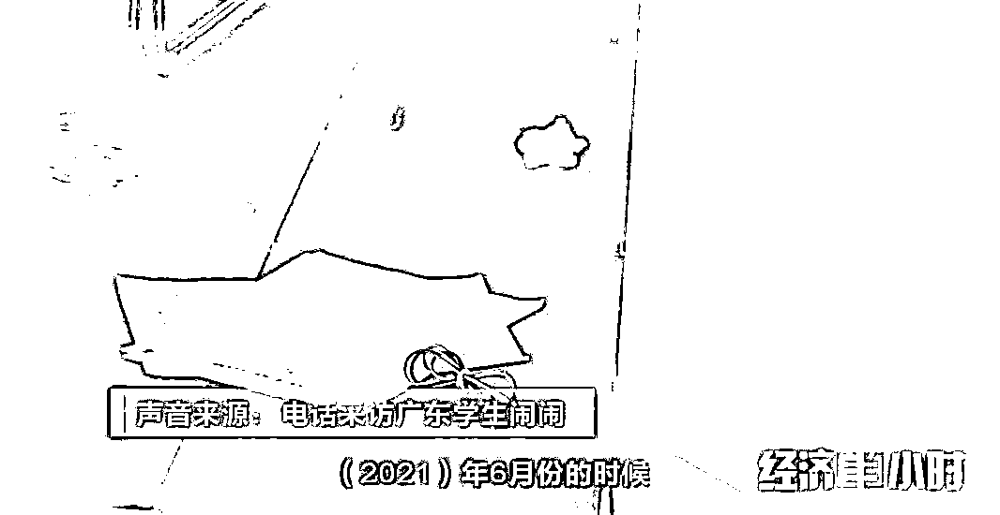**

****

****上不了课还要还贷款 学员欲哭无泪****

 **[`mp.weixin.qq.com/mp/readtemplate?t=pages/video_player_tmpl&action=mpvideo&auto=0&vid=wxv_2038521155942154243`](https://mp.weixin.qq.com/mp/readtemplate?t=pages/video_player_tmpl&action=mpvideo&auto=0&vid=wxv_2038521155942154243)** 

**△央视财经《经济半小时》栏目视频**

**随着华尔街英语线下门店的关闭，如今学员们普遍面临的窘境是：购买的课程既上不了，也退不了，但贷款却必须要还，否则会对个人征信产生负面影响。**

****

****

****

**为了挽回自己的经济损失，也有学员向贷款机构提出退贷申请，多家向学员提供贷款服务的金融机构都表示，**要想解除贷款合同，需要华尔街英语先向金融机构退款，并申请解除学员的贷款合同**。然而，当小罗再次拨打华尔街英语的热线电话时，电话已经无法拨通。**

**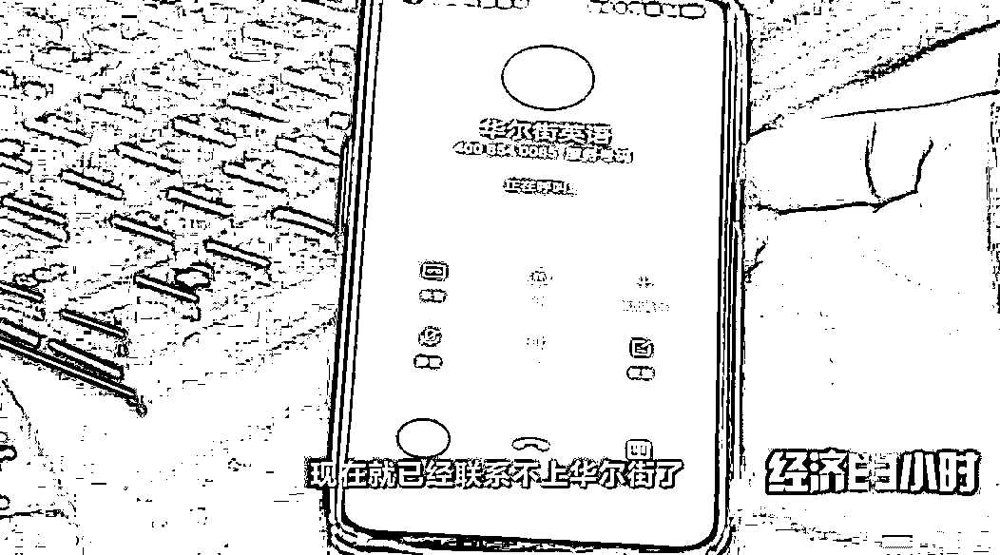**

**已经关门停业的华尔街英语，如果未来走到了破产清算的程序中，学员们是否就有机会退还学费呢？**

****

****

**早在 2019 年，成人英语培训的三巨头之一韦博英语就因为资金链断裂，关闭全国多家门店，相关负责人“跑路”。直到 2021 年 8 月，部分学员在深圳法院起诉该培训机构胜诉，但由于韦博英语无资产可供执行，最终仍然没能拿回学费。**

****

**作为消费金融行业的热门场景，“培训贷”一直受到很多金融机构青睐。但近年来，教育培训分期风险也逐渐暴露在大众面前。相关培训机构可以一夜关门、停课，学员贷款的钱，培训机构早已拿到了手，丝毫不会归还给消费者。**但金融机构更不会担心贷款的学员赖账，因为贷款者“逾期记录上征信”的规定，是卡住贷款消费者“命门”的一只“大手”**。最终，贷款消费的学员，只能自认倒霉。**

**
**

****

****

****

****消费金融呼唤有效监管****

**早在 2021 年年初，央行就发出了预警：要高度警惕居民杠杆率过快上升的透支效应和潜在风险，不宜依赖消费金融扩大消费。消费者不要轻信商家的忽悠，消费之前要想清楚自己的权益，会不会受到损害？同时，期待更多监管细则的出台。消费金融是要发展，但绝不能成为商家坑害消费者的一只黑手。**

**来源:央视财经** 

****

**← 向右滑动与灰产圈互动交流 →**

****