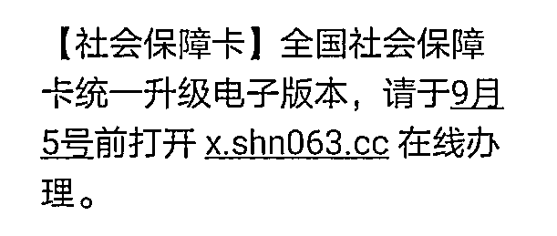
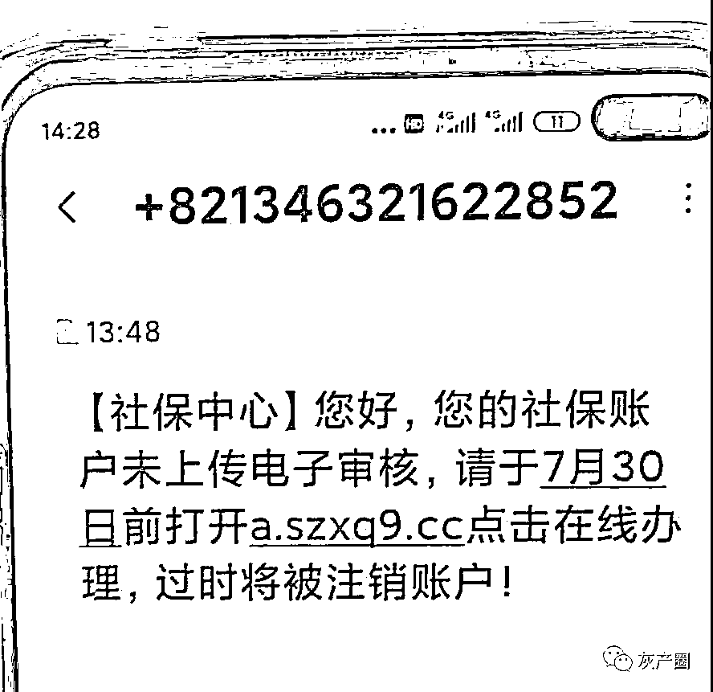
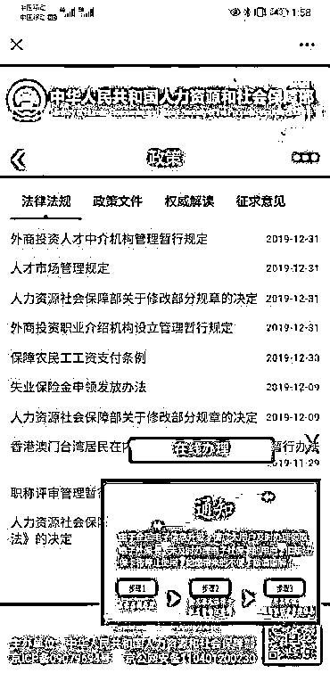
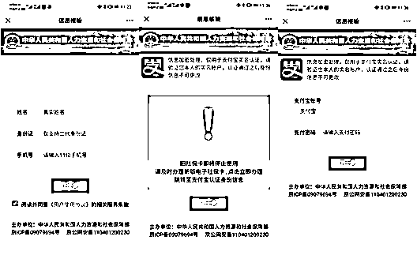

# @所有人，银行卡被偷偷扣款，已席卷全国！

> 原文：[`mp.weixin.qq.com/s?__biz=MzIyMDYwMTk0Mw==&mid=2247520510&idx=6&sn=50bb2595aef769a083ee6ed7d3b05d19&chksm=97cb5bc6a0bcd2d0aae481996cce70c163f1f251346ea2bda1d56cca484cb68105b121f3731a&scene=27#wechat_redirect`](http://mp.weixin.qq.com/s?__biz=MzIyMDYwMTk0Mw==&mid=2247520510&idx=6&sn=50bb2595aef769a083ee6ed7d3b05d19&chksm=97cb5bc6a0bcd2d0aae481996cce70c163f1f251346ea2bda1d56cca484cb68105b121f3731a&scene=27#wechat_redirect)

该公众号已被封禁““【社会保障卡】全国社会保障卡统一升级电子版，请于 x 月 x 号前打开 xxxxxxx（网址）再现办理。”“您好,您的社保账户未上传电子审核,请于 XX 月 XX 日前打开点击 X.XXXXX.XX(网站)在线办理,过时将被注销账户!”......

**紧急通知！**

**重要提醒！**

凡是收到**“全国社保卡升级”**的短信**不要点击链接**

更不能填写任何个人信息

请一律删除

信息虽看似正规

**实则为骗局**

**此网站为涉诈钓鱼网址**

近期

有不法分子冒用

社保部门名义发送短信

称全国社会保障卡统一升级电子版

或社保账户未上传电子审核

要求市民点击链接提供个人信息

已有不少市民险些被骗

**防诈警报再升级！**

**全国多地预警**

**案例**

**福建泉州晋江有人被骗 9999 元！**

**据晋江公安最新通报**

8 月 3 日，安海西垵村一男子收到自称是“社保中心”的短信，称其社保账户未上传电子审核需要点击链接**(p.uukp1.cc)在线办理**，过时将被注销账户。该男子按要求填写个人信息、银行卡号验证码后发现被骗 9999 元。

另外，厦门市民林先生

收到了类似短信

当他点击短信内的链接后

**近 2 万元，没了！**

▼

7 月 30 日 13 时许，林先生接到冒充社保局的短信，大致内容是：“【社保中心】，您好 ，你的社保账户未上传电子审核，请于 7 月 30 日前打开 a.szxq9.cc 点击在线办理，过时将被注销账户！”

林先生点击短信内链接，**手机界面显示出“中华人民共和国人力资源和社会保障部”**，对此，林先生没有产生怀疑。

林先生登录了

短信中提供的链接

他点击“在线办理”飘窗，并按照页面提示，一步步登录、填写个人信息、身份证号、手机号后，系统提示需要及时办理新版电子社保卡，并需要进行“支付宝认证身份信息”。

于是

林先生又在界面中

填写了支付宝账号、密码 

然而

当林先生填写完上述信息后

没等到新的电子社保卡

**却等来了支付宝**

**连续 4 次被扣款 4990 元**

**共计 19960 元的短信通知**

林先生这时才发现被骗并报警

**揭秘：骗子如何将钱转走** 

验证码是金融机构在用户进行诸如修改密码、转账等操作时，向用户预留手机号码中发送的一次性密码，没有验证码无法进行操作。**而要想获取验证码，犯罪分子最常用的手段就是向目标手机发送木马病毒。**

**植入木马**

骗子通过发送冒充官方、假扮熟人等短信

链接网址植入木马病毒

**运行病毒**

受害人点击后，木马就在手机运行

**监控手机**

骗子随时掌握受害人在手机操作过的银行卡信息

**盗取信息**

骗子盗取银行卡号，开通快捷支付，截获验证码

**刷走钱财**

骗子操纵开通手机理财服务，把钱从银行卡转走

**防范：陌生号码的短信不点**

骗子一般在手机短信木马病毒链接前加上一句话，诱导你点开网址链接，诸如“某某官方系统需要升级”“聚餐照片”“老同学照片”等等为切入点，还有就是以各种折扣优惠信息为诱饵，让接收方在不知不觉中随手点开病毒链接，植入了木马病毒。

而这种恶意程序，会优先运行，能盗取手机上一切跟账号、密码有关的资料，因此，只要是接收到类似短信，切记不点、不点，要马上删除。

如果不小心点了，要紧急挂失手机上的支付宝、股票等涉及到财产的账户，确保账户安全后，再将手机拿到维修点重新安装系统。

**警方提醒：**

首先，个人社保卡最近没有关于升级的政策。

其次，即便有关于办理社保卡等相关操作，社保部门也不会通过短信链接这一方式开展。

大家如果有社保相关问题，可拨打社保 12333 官方服务热线咨询。最后，警方请广大市民群众牢记一条，陌生短信链接切勿轻易点击，更不要向陌生人透露个人重要信息，有任何疑问都可以拨打 96110 全国反诈劝阻专线进行咨询举报。

**不要随便点击不明链接**

**或拨打不明电话**

**切记不能透露自己的**

**个人账户信息及身份信息**

**更不能按其提示**

**进行转账汇款等操作**

新型社保骗局！

**防诈警报再升级！**

**转发！扩散！提醒！**

来源：昆明反电信网络诈骗中心，反诈骗先锋

← 向右滑动与灰产圈互动交流 →

