# 疑似吴亦凡男子，出狱就诊视频疯传:10 年顶流，自毁只需 38 天

> 原文：[`mp.weixin.qq.com/s?__biz=MzIyMDYwMTk0Mw==&mid=2247520548&idx=1&sn=af6c15c26ce6a013c78172565388cb00&chksm=97cb5a1ca0bcd30add293bf22071e7f77621ad7c573b3ce53e6f3dacc391b991996439ad9bcd&scene=27#wechat_redirect`](http://mp.weixin.qq.com/s?__biz=MzIyMDYwMTk0Mw==&mid=2247520548&idx=1&sn=af6c15c26ce6a013c78172565388cb00&chksm=97cb5a1ca0bcd30add293bf22071e7f77621ad7c573b3ce53e6f3dacc391b991996439ad9bcd&scene=27#wechat_redirect)

滴滴滴滴....吃瓜<mpvideosnap class="js_uneditable custom_select_card channels_iframe" data-pluginname="videosnap" data-id="export/UzFfAgtgekIEAQAAAAAAXosvS3mA5wAAAAstQy6ubaLX4KHWvLEZgBPEnYJ0GkcodpD-zNPgMIt05NzVAKAjX8zTe8_1EeBq" data-url="https://findermp.video.qq.com/251/20350/stodownload?encfilekey=XGocBFxVWK5dcyOOqpEU47RpBHQIvlhnaySg4qrJ0Ok37D7DVBlt0KWzBPfyGLxHNxGrdBJS42DPSMnQIPnibCywRTiaVnia1cYemTplP1EjyFkw3B5G54lyHXt14Lzsy6FiaFbTFbeSicMy1xOFATaU6c1ffAic20Yn64IibHadxmVe6NIAQW049R8Mg&amp;adaptivelytrans=0&amp;bizid=1023&amp;dotrans=0&amp;hy=SH&amp;idx=1&amp;m=b1c9d7e73d832e88f1759e7ad9ff928e&amp;token=AxricY7RBHdVvJKYO7z5dxticOVztN4t6cARK3VV80vfxv6M7j3L2gc0pjr1zRdoeNO3SzJRlA5rs" data-headimgurl="http://wx.qlogo.cn/finderhead/PiajxSqBRaEISAKibugHhUQs74zK9sdqn9QvawbxCzU7AuxCgU4kpS0A/0" data-username="v2_060000231003b20faec8cae18b1bcad5cb00e937b0779ef044c516b0481d185bbca60dd9c21f@finder" data-nickname="灰产圈" data-desc="疑似吴亦凡出狱就诊视频#吴亦凡@灰产圈 " data-nonceid="11604280812263642106" data-type="video"></mpvideosnap>前几天，一段 5 秒视频在网上疯传：**吴亦凡疑似现身北京某医院看皮肤科。**视频里的人穿着囚服和不合脚的拖鞋，整个后脚跟都踩在地上，脚踝上还戴着电子锁。 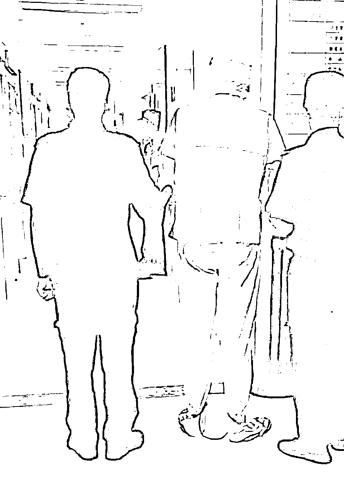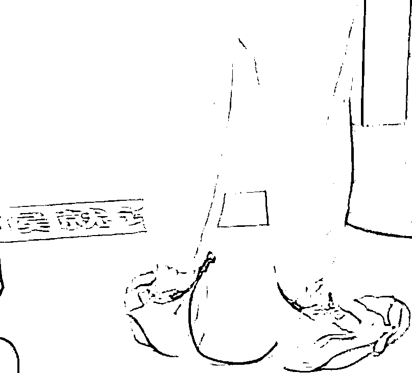根据该男子身高、体型、以及穿鞋方式，吃瓜网友们纷纷推测：**很有可能就是吴亦凡。 **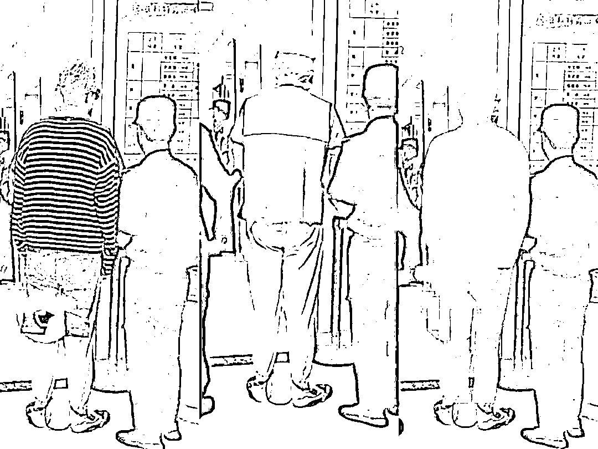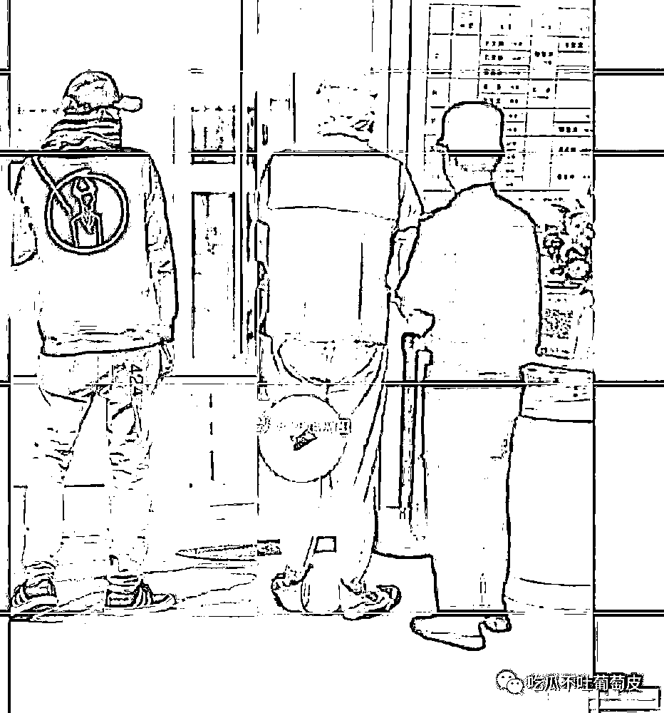 身高体型基本吻合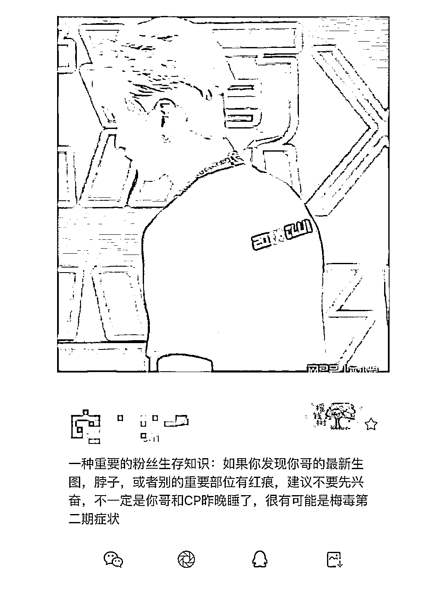吴亦凡上节目时，曾被拍到脖子后有粉红色印记。此前，就有网友拿他脖子后的粉红色印记调侃过：

> 如果发现你哥的最新生图，脖子，或是别的重要部位有红痕，建议先别激动：不一定是你哥和 CP 昨晚睡了，很有可能是梅毒第二期症状（狗头）~

**而如今回过神来，简直细思极恐…… ****事实上，不管视频中的人到底是不是吴亦凡，他真实的监狱生活，恐怕只会比视频中更惨。**

1

**名人入狱，生活心酸**吴亦凡，现在已经成为百度百科词条中，“涉强奸罪的加拿大籍男艺人”了。据法律专业人士科普，等到吴亦凡宣判有罪之后，他将会被送往北京监狱服刑。具体被关在哪里，目前还没有官方消息。不过，参考下其他名人的监狱生活，他过得如何，大致也可以想象了。 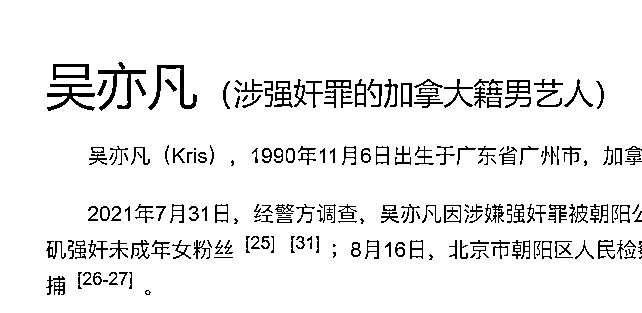成龙儿子房祖名，因为吸毒，曾被关押 6 个月。据他说，监狱里的伙食不太好（当然比不过外面花天酒地）。大部分时间都是吃馒头和白菜，偶尔会有鸡蛋。就算吃腻了，也只能花钱买泡面，稍微改善下伙食。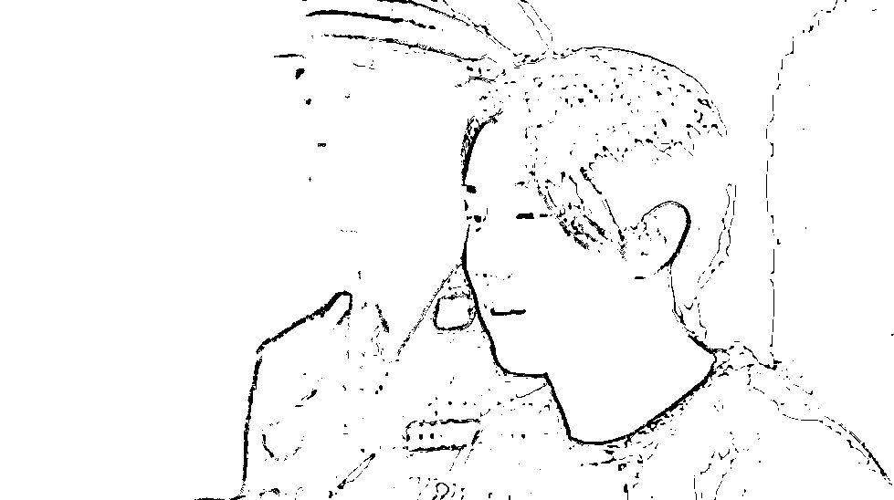高晓松因为酒驾，也进监狱呆了 6 个月。进看守所第二天，他就失眠了。他当时睡的是大通铺，犯人们磨牙、口臭、打呼噜，什么人都有。不仅如此，睡觉也没有枕头和床单，只有一床被子。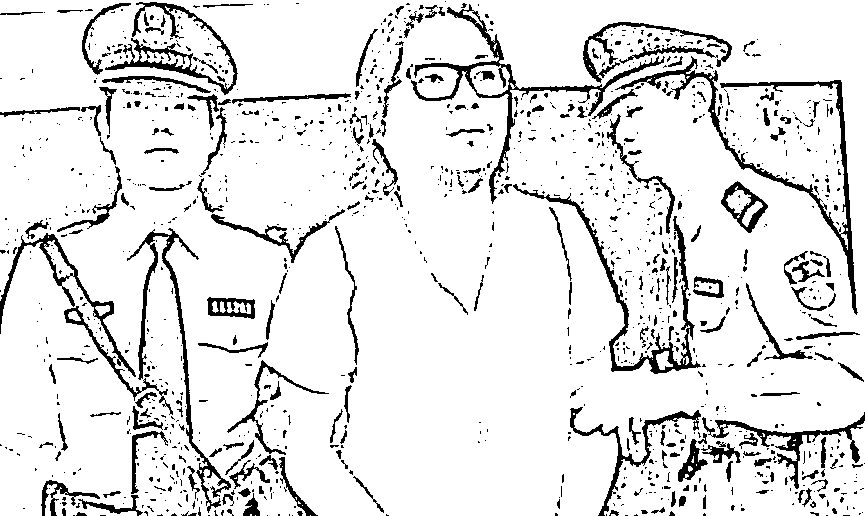有了前辈们的鲜活案例，网友们纷纷开始猜测吴亦凡的监狱生活：

> 6：30，按时起床，有秩序洗漱、如厕，衣被等个人物品摆放整齐。按要求穿着囚服，佩戴统一标识；按时清扫室内外卫生，保持环境整洁。然后去劳动，因为百无一用，只能先扫地，然后学别人如何做口罩。手笨做坏了好几个，狱警摇了摇头，心想这个绣花枕头，下次安排去做枕头。好不容易到了 11 点，该吃午餐了，今天午餐吃宽面，没错大碗的。清汤寡水，但凡凡还是忍着吃完了。

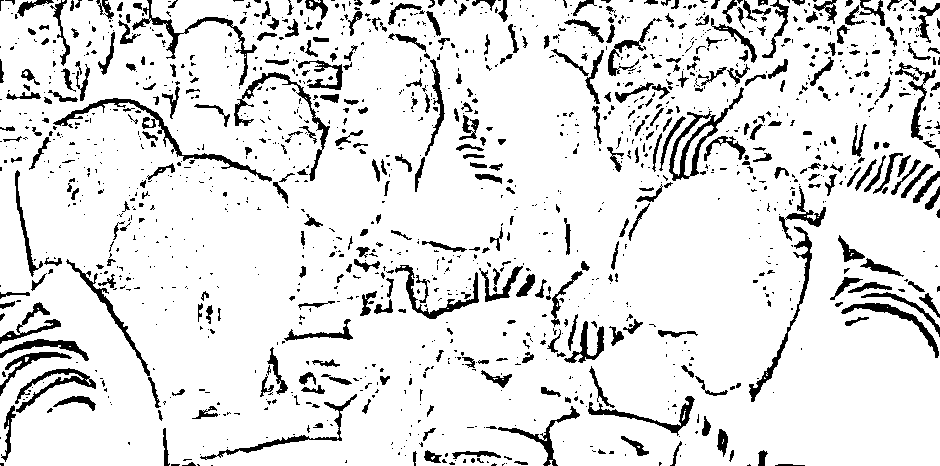

> 11 点半到 2 点半午休，但是凡凡睡不着。因为有人打呼噜，还非常有节奏，类似 skr 的声音，这个 flow 让他流下了泪水。下午继续做口罩，渐渐的凡凡越来越熟练。到了 5 点收工，该吃晚餐了，今天晚餐是馒头，青菜豆腐汤。

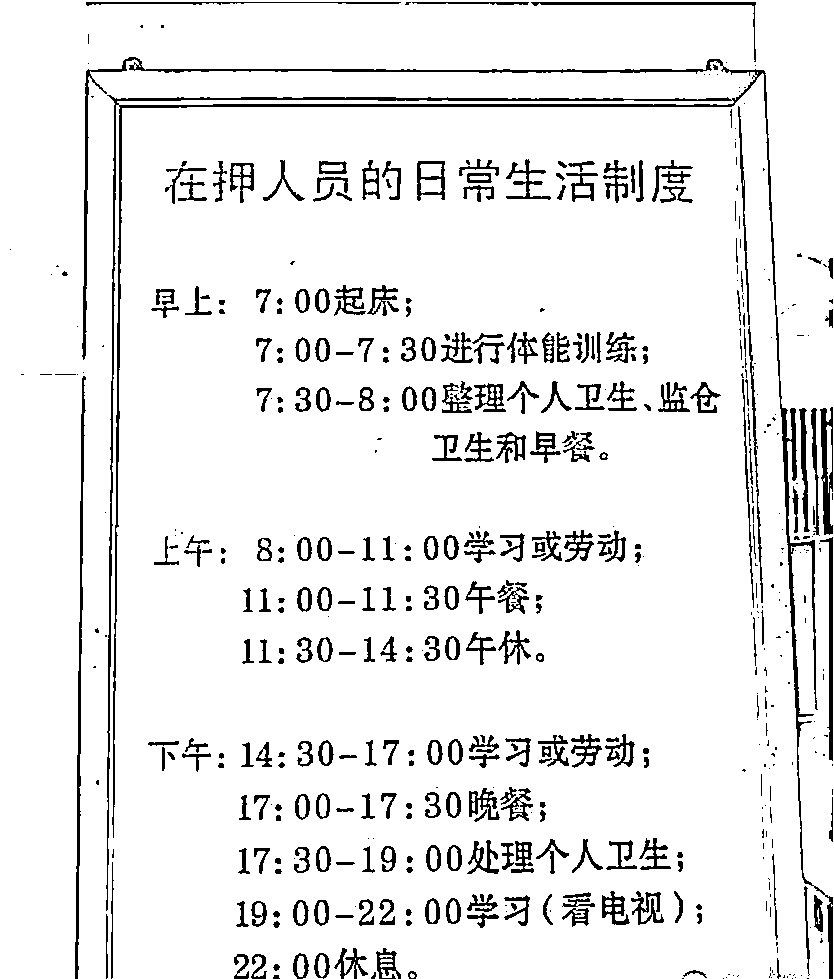

> 吃完饭，凡凡得去洗澡了。睡他边上的兄弟，笑眯眯看着他，很贴心的递给他一块香皂。19 点开始看电视，结果居然播出了自己的相关新闻，凡凡，冷汗直流。后面又接着学习，终于到了 22 点，凡凡拖着疲惫的身体，终于睡着了。

有关吴亦凡的一天，虽然我们不知道真实情况，但有一点很明确：在外面纸醉金迷，在里面凄凄惨惨。这种落差本身，对他而言就已经是巨大的折磨了。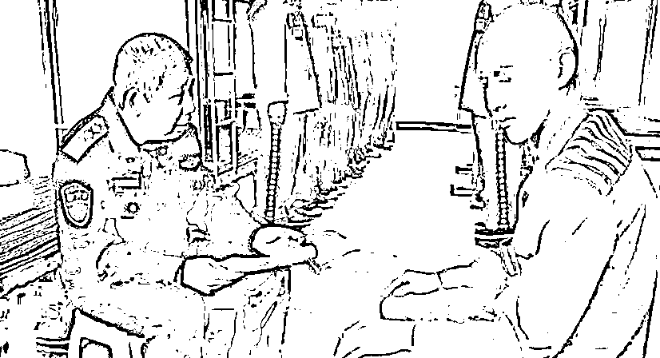

2

**名人作孽，终究受罚**

无独有偶，娱乐圈作死的人绝不止吴亦凡。作死后被社会毒打的方式，也远不止入狱一种。说实话，娱乐圈这么鱼龙混杂，你永远搞不懂明星们在想什么。 **你以为明星最擅长捞钱，其实他们最擅长花式作死、毁掉自己。 **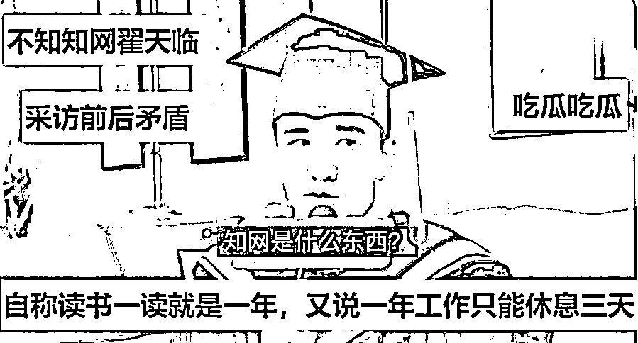**翟天临**，北影博士、北大博士后，号称娱乐圈文化水平最高。没想到，他直播时竟连“知网”都不知道。很快，他的文凭被取消，每年毕业季都被网友们骂上热搜。他明明不学无术、还偏要为了面子造假。 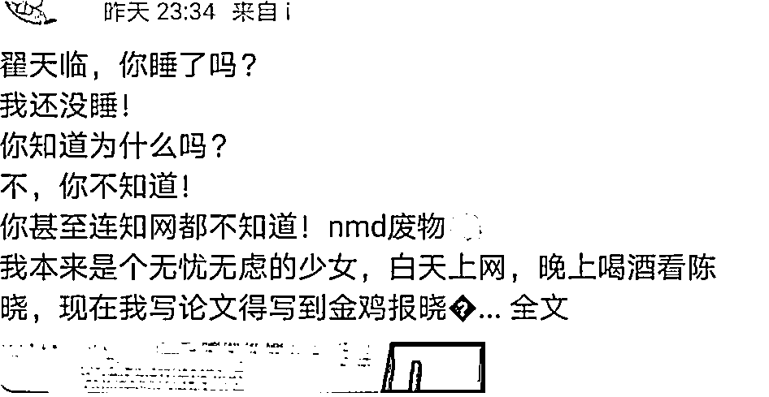**郑爽**，90 后四小花旦，“日薪 208 万”震惊全网。没想到，她代孕弃子+逃税被男友曝光。很快，她被罚近 3 亿，全平台账号强制关闭。最近喜提新词条：“中国 90 后女艺人，涉偷税漏税”；她赚了别人十辈子赚不到的钱，却连一份社会责任都不想尽。 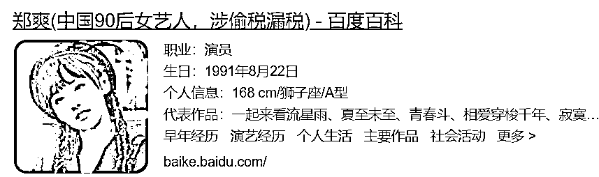**张哲瀚**，演完《山河令》红得一塌糊涂。没想到，他竟多次前往日本“靖国神社”，晒印有旭日旗的改装跑车，还与反华人物合影！他对我国民族苦难毫无知觉、严重伤害国人感情。很快，他的作品被全网下架、查无此人。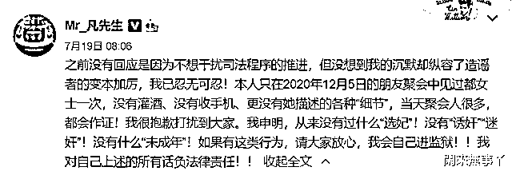不过，吴亦凡绝对是一骑绝尘：自己把自己送进监狱。 好家伙，原来明星的自我毁灭也“内卷”！学术造假、出轨、吸毒、代孕弃子、性侵、偷税漏税……只有你想不到的，没有明星干不出来的。**他们到底是自大到什么程度，才敢这样为所欲为？**

**难道非要等到进了监狱，才来上演一出铁窗泪吗？**

3

2012 年，吴亦凡出道。 此后拼搏 10 年，才换来如今的璀璨星途。 **但是，他从顶流到弃子，仅仅用了 38 天。**真可谓，眼见他高楼起，眼见他宴宾客，眼见他楼塌了。 还记得几年前，他最火时录下的一段视频。 当时，他参加一场活动。穿着剪裁得体的西装，戴着金丝眼镜，在人群簇拥中走出来，面无表情地抬眼看了看镜头。那斯文败类的感觉，瞬间击中万千少女。 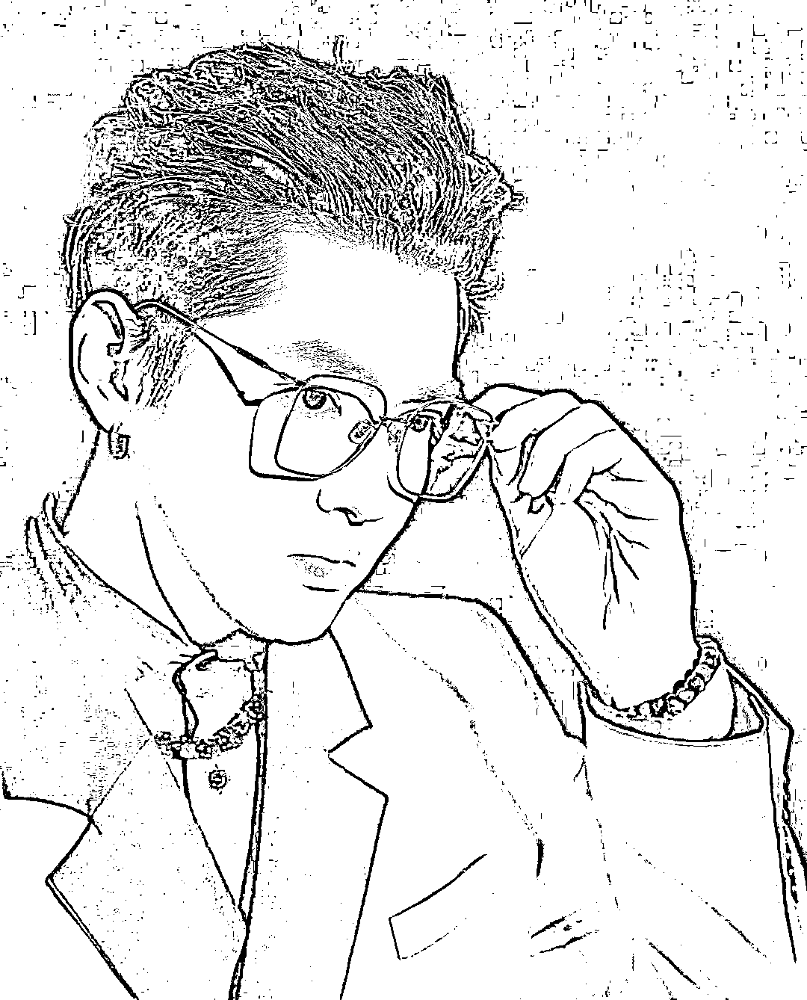仅仅一夜间，曾经那个光鲜亮丽、浑身上下都是高奢的人，就沦为阶下囚。 光看背影都能感觉到，他整个气质变了。这反差，实在太大，让人内心发凉。他用最愚蠢的方式，犯下不可原谅的大错，被所有人唾弃讨伐！他被纸醉金迷的圈子一步步腐蚀，不断堕落，直到突破底线！他没呵护心中的善念，好好的花路不走，非得走监狱的铁窗！ **当一个人想成就自己，他需要 10 年；****当一个人想要毁掉自己，他只需要 38 天。 **

4

我们常说，比“坏”更可怕的是“蠢”，是“弱”，是“无知”。 但吴亦凡告诉我们：**比“弱”更可怕的是“飘”。**很多人当初进娱乐圈，仅仅是为了作品被更多人看到。 结果走红以后，作品不搞了，人品也败坏了。殊不知，最毁前途的，不是没能力；而是自以为能力老高了，高到可以一手遮天，为所欲为。自作孽，真的连菩萨都救不了。 吴亦凡式悲剧，是典型的破窗效应。**一次作恶得逞，就在侥幸中开始第二次作恶，第三次作恶，直至最后，无法回头。 **当初那挑战规则的欲望，就像一丝危险的火苗。 **一次次肆无忌惮地伤害他人而不受惩罚，把这团火煨得越来越旺。 **最后，这团火把自己反噬，化成地上的灰烬。正如古话所说：“好一似食尽鸟投林，落了片白茫茫大地真干净。”娱乐圈总是新人换旧人，说到底，这世界少了谁都可以运转。无德无才的流量明星，我们都不欢迎。 而要说吴式悲剧的意义，大概就是，无论站在多高的位置，终究要守住底线。

5

“吴亦凡”，无疑是 2021 普法教育的代名词。 
短短 5 秒的视频，无论真假，都比法治纪录片深刻。因为，我们可以从中窥见一个顶流的堕落史。 吴亦凡号称自己是演员，但他没演出什么好戏。这人生的起起落落，反倒成了他演艺生涯的绝唱。 在他被千万人追捧的高光时刻，恐怕也没料到，自己拿的竟是自毁式的“影帝剧本”。 或许有人会说，吴亦凡翻车只是运气不好，娱乐圈谁不是这样？但我要说，毫无底线的人，终将受到正义的惩罚。他的经历，也撕开了娱乐圈最真实的一幕：**真正摧毁你的不是敌人，而是玩儿 High 了的你自己。**作者：小爽，来源：行动派（ID：xingdongpai77），吃瓜在行动

← 向右滑动与灰产圈互动交流 →

