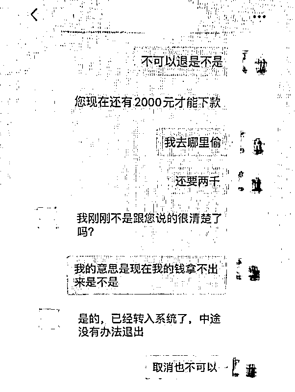

# 想贷款一万，付了七千打水漂！

> 原文：[`mp.weixin.qq.com/s?__biz=MzIyMDYwMTk0Mw==&mid=2247520548&idx=3&sn=a30fa59ec248c4e2cac7e357b52919ac&chksm=97cb5a1ca0bcd30afd3c8c9dbf19d23fc6e1e887eb1f5bb3fa23d8b4dd18b832387fb69b78de&scene=27#wechat_redirect`](http://mp.weixin.qq.com/s?__biz=MzIyMDYwMTk0Mw==&mid=2247520548&idx=3&sn=a30fa59ec248c4e2cac7e357b52919ac&chksm=97cb5a1ca0bcd30afd3c8c9dbf19d23fc6e1e887eb1f5bb3fa23d8b4dd18b832387fb69b78de&scene=27#wechat_redirect)

**无需资质审核**

**当天就能放款**

**无抵押还低利息**

**这样的贷款你敢借吗？**

昆明小伙小泽信了

然后悲剧了

7 月 31 日，昆明 18 岁小伙报警称自己被诈骗了。

7 月 30 日，小泽在安宁某医院做志愿者时，一个陌生人通过微信添加了小泽。因为小泽的微信没有设置好友验证，对方添加后，直接成了小泽的微信好友。

随后，对方把小泽拉进“企业微信”APP 自带的聊天界面，主动发信息问他是否想贷款。

“他告诉我他们公司的利息是月利息为 0.6%，如果贷款 10000 元，月利息就是 60 元，贷款 20000 元，月利息是 120 元，以此类推。”小泽说，看到这么低的利息，临近大专毕业想创业的他心动了。

于是，小泽回复对方想要贷款 10000 元。对方就在“企业微信”APP 的聊天界面上发送了自己的工作证，上面有姓名、单位以及工号，还有小额贷款机构经营许可证。

****▼**** 

| _ | _ | _ | _ | _ |

| _ | _ | _ | _ | _ |

| _ | _ | _ | _ | _ |

| _ | _ | _ | _ | _ |

| _ | _ | _ | _ | _ |

| _ | _ | _ | _ | _ |

（左右滑动进行翻看）

“看起来很正规”，小泽打消了网上贷款的疑虑。随后，对方又发送了一份电子合同。小泽看完合同，按照对方要求把身份证和银行卡的照片发给了对方。

“然后对方就给了我一个工商银行的收款账户，让我按照合同要求转账 1000 元，因为需要我本人的银行卡里最低有贷款额 10%的余额才能贷款成功”，小泽随后转了 1000 元到对方账户。

10 分钟后，对方又以银行卡里最低要有贷款额的 20%流水交易才能贷款的理由让小泽转了 1000 元。

15 时 56 分，对方以银行流水综合评分不足 50%，让小泽继续转账 2000 元。

16 时 55 分，对方以银行流水综合评分要到 100%才能贷款为由，让再转 5000 元。小泽告诉对方自己没有那么多钱了，对方告知帮承担 3000 元让再转 2000 元。

小泽转完钱后，对方告知他贷款办理成功，24 小时内到账。

7 月 31 日，小泽发现其所贷款 1 万元已过 24 小时但并未到账，联系不上对方，才意识到自己被诈骗，**7000 元打了水漂。**

只需交少量手续费，便能获得几万乃至几十万的贷款，等你相信后，骗子再不断以收取“手续费”“解冻金”“激活费”等等理由，让你进行打款，却迟迟不去兑现“马上到账”的承诺。

**网络贷款诈骗特点**

跟你联系的骗子，公司名头比较大，所谓的"人人贷" "小米贷款" 等，你一听，名头很大，**但是你点击进去的链接是他们提前做好的钓鱼链接。**

所谓的"诚信集团" "xx 贷款集团" "xx 贷款集团公司" 等，这类公司根本不可能存在，工商部门也不可能允许此类公司名称注册。有的会假冒银行或知名公司的名义，但是均没有办公地址，也无法提供真实的公司营业执照和个人身份证。

放贷条件容易，不需抵押也不需查看收入情况，基本上是一个身份证就可以贷款。当求贷者动心后，**骗子们会利用各种理由要求先收取费用，比如 "利息、律师费、核实费、保险费、手续费、保证金" 等等。**

当求贷者先付费后，发现骗子的手机再也拨打不通，甚至某些求贷者不知道对方的公司、个人姓名，身份证，甚至连对方身处何地都不知道就已经上当受骗。

骗子知道去网上找贷款的人都是有各种情况无法在银行贷款的人，他们抓住这一点，会以征信、方便、快捷为由挖下各种陷阱。

**反诈民警提示**

**承诺给你的钱不一定是真的**

**但从自己口袋出去的钱一定是真的**

**防范“网贷”诈骗！**

来源：昆明反电信网络诈骗中心

← 向右滑动与灰产圈互动交流 →

