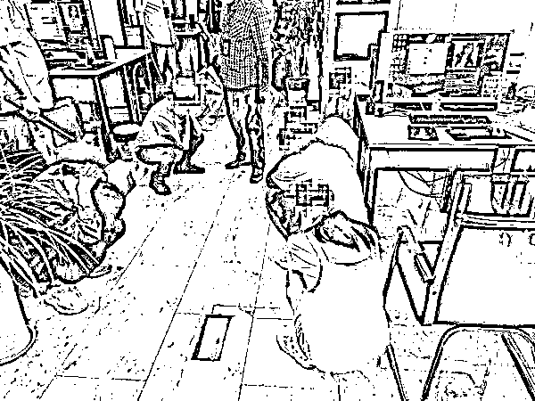
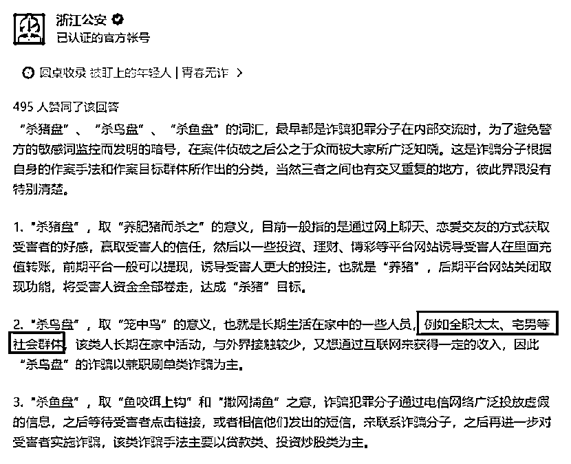

# "杀鸟盘"来势汹汹？

> 原文：[`mp.weixin.qq.com/s?__biz=MzIyMDYwMTk0Mw==&mid=2247520548&idx=4&sn=92e295fc1864b0d39292516599385fcc&chksm=97cb5a1ca0bcd30a3c525fcbbe454eac52c600fcf26a7cdc387a8d7016c7c62289c93a82d8eb&scene=27#wechat_redirect`](http://mp.weixin.qq.com/s?__biz=MzIyMDYwMTk0Mw==&mid=2247520548&idx=4&sn=92e295fc1864b0d39292516599385fcc&chksm=97cb5a1ca0bcd30a3c525fcbbe454eac52c600fcf26a7cdc387a8d7016c7c62289c93a82d8eb&scene=27#wechat_redirect)

听说过“杀猪盘”

但你听说过“杀鸟盘”吗？

近日

一种新型网络诈骗被警方破获

这种诈骗专门针对 20 岁至 40 岁男士们

男士们要警惕啦！

近日，重庆两江新区警方在重庆市公安局的统一指挥下，先后发起“杀鸟盘 1.0 行动”“杀鸟盘 2.0 行动”，连续摧毁两个网络直播诈骗犯罪集团，抓获犯罪嫌疑人 218 人，查扣涉案电脑 367 台、手机 360 部，捣毁诈骗窝点 16 处，初步查明涉案金额达 800 余万元。

今年 5 月下旬，两江新区警方在处理一起劳资纠纷警情时，发现报警人所在公司涉嫌网络诈骗。民警围绕相关信息立即开展线索核查，并抽调精干警力成立专案组同步上案侦查，两个特大直播诈骗犯罪集团逐步浮出水面。

经过两个月的侦查，警方发现两大网络直播团伙以犯罪嫌疑人韩某为首，打着代理“熊客直播”“嗨秀秀场”的旗号，通过交友软件有目标性的拉人并引流到特定直播间，在建立恋爱、暧昧等关系的基础上，诱使被害人充值打赏主播实施诈骗。

在全面掌握犯罪集团组织架构及人员组成，主要犯罪嫌疑人基本信息和日常动态，摸清 16 处诈骗窝点，掌握违法犯罪事实后。两江新区警方于今年 8 月 26 日、9 月 2 日，先后组织警力 500 余名发起突击行动，兵分多路，在重庆江北、渝中、南岸、铜梁、永川、合川、两江新区等地实施集中收网，**累计抓获犯罪嫌疑人 218 名，现场查扣涉案电脑 367 台、手机 360 部，捣毁诈骗窝点 16 处，初步查明涉案金额达 800 余万元。**

经审讯，主要犯罪嫌疑人韩某交代，其雇佣大量键盘手冒充女主播在各大交友软件上寻找“猎物”，以恋爱、交友的名义与被害人聊天，获取信任后便将被害人引流至直播平台观看直播。在此过程中，采取事先准备话术、固定“主播”出镜的传统套路，以假装完成任务、进行主播 PK、许诺“线下见面、结婚”等理由引诱被害人为女主播大肆充值刷虚拟礼物，并通过后台控制 PK 结果牟取暴利完成诈骗。

目前，两大团伙主要犯罪嫌疑人已被采取刑事强制措施，案件正在进一步侦办中。

办案民警介绍，该案中，犯罪嫌疑人作案方式不同于以往侦办的“杀猪盘”诈骗，“杀猪盘”诈骗主要针对女性，且单笔诈骗金额大、作案周期长，而此案将作案对象锁定在 20—40 岁的男性，以各种挑逗性的话语引诱打赏，诈骗金额从几百、几千、几万至几十万不等，采取短平快诈骗周期的新型“杀鸟盘”诈骗。

**何为“杀鸟盘”？******

****浙江公安在知乎上解释称，所谓“杀鸟盘”，取“笼中鸟”的意义，也就是长期生活在家中的一些人员，例如宅男等社会群体。该类人长期在家中活动，与外界接触较少，又想通过互联网来获得一定的收入，因此“杀鸟盘”的诈骗以兼职刷单类为主。****

********

****图片来源：知乎****

****据了解，不同于以往的“杀猪盘”主要针对女性且单笔诈骗金额大、作案周期长等作案方式，“杀鸟盘”将作案对象锁定在 20 至 40 岁的男性，以各种挑逗性的话语引诱打赏，诈骗金额从几百、几千、几万至几十万元不等，采取短平快诈骗周期的新型“杀鸟盘”诈骗。**** 

****同时，“杀猪盘”“杀鸟盘”“杀鱼盘”三者彼此交叉，诈骗犯罪分子往往三种手段交叉使用，以提高诈骗成功率。****

******网络直播成诈骗新渠道******

****需要注意的是，随着直播平台不断发展，不少不法分子开始盯上了直播平台，借以实施诈骗。****

****去年 12 月，太原市公安局尖草坪分局发布消息称，该局在相关部门的大力支持下，多警种合作，历时半个月艰苦侦查，成功打掉一个以平台女主播谈恋爱为幌子的网络诈骗团伙，抓获作案成员 13 人。受害人涉及全国各地 130 余名，涉案金额 80 余万元。****

****上述案件的犯罪嫌疑人在 2019 年 5 月在银川市以开办传媒公司的名义，招募年轻女子从事平台主播，使用婚恋平台物色单身人员确定作案对象，假意谈恋爱，步步引诱受害人添加微信、QQ，下载直播平台并进入指定直播房间观看表演，编造各种理由诱使受害人在平台充值、转账汇款。****

****今年 5 月，上海市公安局宝山分局在市局刑侦总队、网安总队等部门大力支撑下，出动 400 余名警力，在上海、安徽、江西、湖北、四川等地开展统一收网行动，成功捣毁一特大网络直播平台诈骗团伙，抓获诈骗嫌疑人郁某、谈某等 236 人，涉案金额达 700 余万元。****

****经查，所谓的“美女主播”竟然是一个团伙，他们一人多个角色，多人一个角色，分工明确，“恋爱”对象遍布全国各地。他们借助网络直播平台的外衣实施团伙作案，存在上、下游多个犯罪窝点。至此，一个特大网络直播平台类诈骗团伙浮出了水面。该团伙通过网络游戏直播方式吸引目标人群，再由一些男性业务员冒充女性玩家，通过游戏陪练、网恋交友等方式搭讪男性游戏玩家，并通过加微信、QQ 好友“联络情感”，以需要完成打赏业绩、与其他主播 PK 为由，诱使受害人不断充值打赏。****

********

****警方提示****

****网络是虚拟的****

****所谓的“女主播”****

****不会无缘无故****

****“垂青”某一个人****

****并以各种挑逗性的话语****

****引诱你“打赏”“刷礼物”****

****网民网络交友****

****要注意自身财产安全****

****更要提高警惕****

****以免落入不法分子设下的****

****“桃色陷阱****

****来源：人民日报************

****← 向右滑动与灰产圈互动交流 →****

********