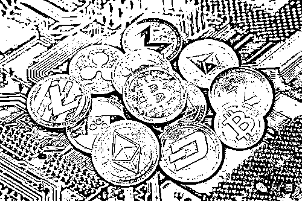
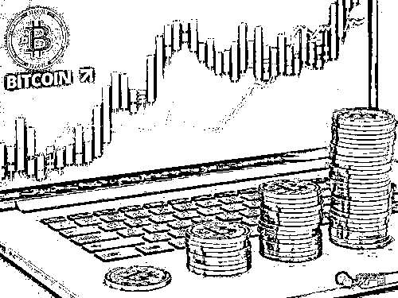
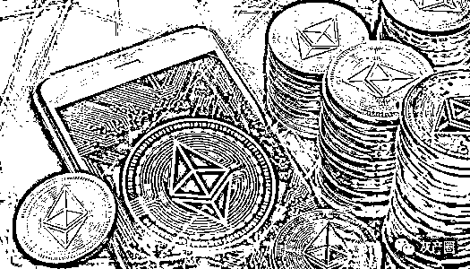

# 怎么知道项目什么时候崩盘？暗访虚拟币系统开发公司

> 原文：[`mp.weixin.qq.com/s?__biz=MzIyMDYwMTk0Mw==&mid=2247520601&idx=2&sn=3271113cbcefd38cf32a46302d4c67d0&chksm=97cb5a61a0bcd3776f2aa262098e46f6f32b161a2eebd8264ac7d63c81a960d684f94aeba15a&scene=27#wechat_redirect`](http://mp.weixin.qq.com/s?__biz=MzIyMDYwMTk0Mw==&mid=2247520601&idx=2&sn=3271113cbcefd38cf32a46302d4c67d0&chksm=97cb5a61a0bcd3776f2aa262098e46f6f32b161a2eebd8264ac7d63c81a960d684f94aeba15a&scene=27#wechat_redirect)

近两年来，成千上万资金盘的崛起。那么这些资金盘到底是谁开发的？其背后运作的模式是什么？为什么那么多人在资金盘上前仆后继？

8 万发一套虚拟货币，赚够了就下线

近日，记者暗访了一家虚拟矿机+交易的区块链传销坐庄系统开发公司，以下是暗访对话内容，其中 Q 代表记者，A 代表系统开发公司王先生。

Q：怎么坐庄呢？

A：就是自己发行一款虚拟币，名字可以自己取。咱们定制的软件里，支持币的交易转账、挖币系统。新用户注册平台，可以买矿机，每天都能产出币。然后软件里有交易市场，可以转账交易、挂单交易。

Q：能赚钱吗？

A：卖矿机赚钱，币交易赚钱，坐庄是稳赚的。

Q：币交易怎么赚钱？

A：第一，软件后台在你手里，你可以提前建一个用户屯大量币，后期币价涨起来抛售。第二，币交易可以收手续费。

 Q：怎么让币涨价呢？

 A：都可以自己设定。炒作宣传啊，人多币少，就涨价啦，市场规律。比如有人高价在收币，出币的人几乎没有，那就要一直涨价了。

 Q：投入成本多大，收益多大？

 A：投入下线差不多 8~10 万元，受益百万元以上，赚够了就下线了，重新换名字再上。

 Q：上线后要持续投入的吧？

 A：上线后只需要推广就行了，推广我们不负责的。就是打广告啊，发帖啊，拉群啊这些。就像组建微信群这种的，都是免费的。说实话前期参加早的都是赚钱的，因为买矿机早，自己的币也多，后期涨了，都赚钱的。这些忠实客户也会帮推拉人的，邀请人送算力，邀请人送小矿机。

 Q：一般怎么入金？

 A：这种模式一般都是直接钱包转账，私下里微信、支付宝交易。

 王先生说，做系统要先确定需求，是想做哪种的区块链，是虚拟矿机+交易这种吗？与此同时，王先生把一份类似的模式给记者发来，并特别备注，“此图尽量人手一份，以调动下线的积极性，努力推广才可能实现财富自由。”

 王先生向记者表示，矿机算力、每天收益，都是软件后台设定的，你可以自行设置规则。

Q：我这边都需要准备些什么？

 A：您这边需要先确定软件的需求，就是你需要哪些功能、几个等级的矿机。确定需求-报价-签合同-软件开发-成品交付。软件交付之后，直接就推广拉人就行。

 Q：发的币可以用区块链查询吗？

 A：钱包地址查询是吧，一般都是私链，不可查。做成可查的要加钱，也能做。

 Q：8 万~10 万元包含 App 和官网？

 A：嗯，可以送你个官网。反正就是一些国际化的介绍，都是这么做的。

 Q：什么是国际化的介绍？

 A：就是虚拟币的形势一片大好，定稿了咱们这边有设计师，会设计出草图先给您确定的。

 Q：上线了我这边怎么维护呢，复杂吗？

 A：首年是免费维护的，就是你想更新什么东西，找我们技术，都是免费的，你提需求，我们整改。

 Q：怎么保护好我们的隐私，不让别人知道呢？

 A：可以租用国外的服务器，把 App 和网站都存储在国外，这个都是我们包含的内容，咱们只需要做好推广就行。

 Q：我还得准备白皮书吧？

 A：可要可不要，都可以做的。你问很多炒币的，他们压根不知道白皮书是什么。若你想要，咱们能做白皮书，看您需求。

 Q：你们目前有在运作的项目吗？

 A：有，这个都是签订合同的，客户运营项目不能透露。

 与此同时，王先生随手向记者发来几张图片，“看别人都在群里推广币呢”、“名字叫核弹币”。

图片解释道：“核弹币由 BOMB 团队打造，总量 1000 万枚，每笔核弹的链上转账都会销毁交易量的 1%！核弹币是为了对抗传统金融的通货膨胀，核弹币给予每个需要金融自由的人，掌握财富的权利！”

Q：怎么签合同？你们公司在哪里，可以考察一下吗？

 A：可以考察，这边都是公司的专业技术团队，欢迎考察的。也可以先看看合同样板，您确定没问题了这边公司签字盖章发过去，您收到自己签字保存即可。

 选择我们这边合作还是完全放心的，一系列的全套服务后期有保障，PPT、白皮书、网站，包括后期上交易所都可以的。

 Q：上什么样的交易所？

 A：比如上火币网这种大交易所，这个需要付费的，需要 20~30 万元。

 Q：20~30 万元够吗？记得去年初要上千万。

 A：我们都是软件服务公司，有特殊通道的。这个咱们可以后期再考虑，前期先把软件做起来、推广起来，后期想上了再上就行。

最后，王先生还不断向记者推销，“咱们这边可以确定下名字，准备宣传”，“现在正是虚拟币的风光时期，咱们早点项目落地，早赚钱呀”。

资金链断了，重新换个马甲继续

对于这种区块链传销骗局，每日经济新闻记者发现，参与者不仅有对技术完全外行，单纯被超高收益所迷惑的普通受害者，还有一些高学历的从业人员。作为一个 IT 从业者，对于区块链，张先生有非常专业的认识。对于虚拟货币的传销，张先生参与多次，并向记者分享了他的经历。

张先生说，在本次币圈最大资金盘 plustoken 崩盘前，最出名的要数 3M 资金盘。张先生“投入 20 万，三天取 26 万”，“说的是 15 天 30%收益，但是大概在你下单 12 天左右才能轮到你打款，15 天就可以提款，所以算是 3 天取 26 万”，“我就干了几票，就不玩了，太刺激”张先生说。

 “怎么知道项目什么时候崩盘？”张先生说，“本来下单之后，第 12 天才打款，但后来一下单，过了一会就得打款。就说明提款的人多，进来的人少啦。到后来，一周、三天、一天，时间越来越短，我就赶紧撤了。”

 “你玩的时候知道它是传销吗？”，对于记者的提问，张先生说，“肯定知道啊，要不做啥能有一个月 30%的收益”。

 “你参与过别的数字货币传销盘吗？”张先生回忆称，“多了”。2017 年年底，因为参与一个虚拟货币资金盘，张先生赔了几十万。“开盘三天跑路···”、“XX 不按套路出牌”，张先生骂道。“现在不玩这些了，偶尔看看，老婆不让玩了”，张先生说。

 “综合下来你赚了还是赔了？” 张先生说，“赔了啊，毕竟耗费了时间，收益很小啊，还是老老实实上班实在”。

对于当前这种打着区块链名义的虚拟矿机，资深从业者胡先生对每日经济新闻记者说，“资金盘都是弄个 App，号称区块链。所谓的量化交易，都是噱头，只是为了好听而已。说白了，前面的人吃肉，后面的人喝汤，到最后资金链断了，重新换个马甲继续。”

来源：每日经济新闻 

← 向右滑动与灰产圈互动交流 →

