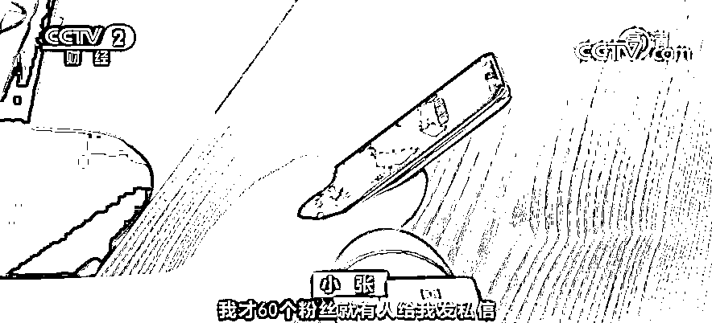

# “种草”笔记 3 元一篇，你被套路了吗？

> 原文：[`mp.weixin.qq.com/s?__biz=MzIyMDYwMTk0Mw==&mid=2247520601&idx=3&sn=b1d8e4cf97582483d96c2dc9f067f1c5&chksm=97cb5a61a0bcd3779b51f828f1f980c41265dad6b75a2ff8cb37787a9268ad6673d16ed8dc18&scene=27#wechat_redirect`](http://mp.weixin.qq.com/s?__biz=MzIyMDYwMTk0Mw==&mid=2247520601&idx=3&sn=b1d8e4cf97582483d96c2dc9f067f1c5&chksm=97cb5a61a0bcd3779b51f828f1f980c41265dad6b75a2ff8cb37787a9268ad6673d16ed8dc18&scene=27#wechat_redirect)

近期，“种草”笔记成为消费者了解商品行情的一种主要方式，但记者发现，一些平台上所谓“真人试用推荐”的“种草”笔记，却暗藏着一些猫腻。 

**“种草”笔记 3 元一篇 你被套路了吗？**

[`v.qq.com/iframe/preview.html?width=500&height=375&auto=0&vid=m32745jrjj3`](https://v.qq.com/iframe/preview.html?width=500&height=375&auto=0&vid=m32745jrjj3)

“95 后”的奚望是一名网购爱好者，她告诉记者，自己在购买商品前，经常会查看他人的使用心得，可是最近，她却感觉到，一些平台上的“种草”笔记，似乎并不真实客观。 

不只是奚望，在记者的采访中，有不少消费者表达了对目前一些平台上“种草”笔记和评论测评的质疑。 

**消费者：**我认为现在很多都是假的吧，因为我看到现在很多文案、评论基本都是格式化的东西，而且我在很多地方都看到有商家购买这种评论，去控评。

记者随即在豆瓣等多个平台进行搜索，发现确实有不少**针对小红书、抖音等平台的推广合作、代写代发、点赞评论的招募帖****，**这些帖子下面都有大量的回复和报名。采访中，记者还了解到，一些商家还会**通过发私信的方式，向一些素人用户提出推广合作的邀请：用户不需要使用体验任何的商品，只需复制粘贴商家提供的图文素材，发布在自己的账号下，就可以获得几元到几十元不等的报酬。 **

**小张：**我才 60 个粉丝就有人给我发私信，问接不接推广，我以为是寄产品，使用后发自己真实的感受，但是实际上他就是给一篇完整的图文，而且不能删改，直接发就可以，**一篇三块钱，如果后续点赞多的话还会有奖励。  **

**禁止虚假营销  “种草”经济监管亟待加强**

不用自己使用和体验产品，直接按照品牌方提供的素材发稿，这样的“种草”笔记，您敢相信吗？记者还发现，如今，这样的操作已经形成了一条产业链，一些商家甚至会雇佣专门的水军公司去进行这样的虚假营销。

**业内人士：**水军公司需要去分析每一个平台的规则，分析之后会给企业一个建议，需要有大量的评论转发，我们水军就去铺量，付费的方式是效果付费、项目付费，就是这个付费形式谈好就行了。

目前，虚假“种草”笔记涉及的法律问题已经引起业内关注。**“种草”经济“测评+销售”的模式具备了网络广告的性质，从这个意义上说，这些行为也受《广告法》等法律约束。**

**北京市两高律师事务所律师 甘巍宏：**商家找水军，不管是素人还是一般的达人，进行虚假宣传这种行为本身是违反《广告法》《反不正当竞争法》一系列的法律法规，肯定是对消费者知情权和选择权的一种侵犯，消费者因此遭受实际损失之后，是可以向商家提起索赔的。

**中国人民大学法学院教授 刘俊海：**素人为了两块三块的蝇头小利，实施了虚假广告和误导宣传，看似本人挣钱也不多，比大 V 挣得少多了，但素人这种行为本身也是构成了违法。平台对于经常采取虚假广告误导宣传的“种草”行为以及相关的代言人、相关的受益企业要通过大数据分析，精准锁定不诚信的行为，为消费者把好关。 

来源：央视财经

← 向右滑动与灰产圈互动交流 →

