# “虚拟”的骗局！警方打掉一个虚拟币投资诈骗团伙！

> 原文：[`mp.weixin.qq.com/s?__biz=MzIyMDYwMTk0Mw==&mid=2247520601&idx=4&sn=4ed46545925e10284bf34f350a9b26bd&chksm=97cb5a61a0bcd3776d6480392cdf69e3b532afdff7408f972578ec353c4be480820914e82a05&scene=27#wechat_redirect`](http://mp.weixin.qq.com/s?__biz=MzIyMDYwMTk0Mw==&mid=2247520601&idx=4&sn=4ed46545925e10284bf34f350a9b26bd&chksm=97cb5a61a0bcd3776d6480392cdf69e3b532afdff7408f972578ec353c4be480820914e82a05&scene=27#wechat_redirect)

2021 年 5 月 29 日，山东省东营市公安局对一个虚拟币投资诈骗团伙的收网行动正在紧锣密鼓地进行。这是山东省东营市公安局侦办的第一起关于虚拟币投资类的诈骗案件。而令人震惊的是，经现场调查，这几名嫌疑人大多是 30 岁左右的年轻人，最小的不过 24 岁......2021 年 9 月 5 日，中央电视台社会与法频道《从心开始》栏目对此案进行专题报道。

[`mp.weixin.qq.com/mp/readtemplate?t=pages/video_player_tmpl&action=mpvideo&auto=0&vid=wxv_2038192343043932162`](https://mp.weixin.qq.com/mp/readtemplate?t=pages/video_player_tmpl&action=mpvideo&auto=0&vid=wxv_2038192343043932162)

01

2021 年 4 月 19 日，一则《“币圈工兵连”排雷，结果推出了一个大雷》的文章，在很多虚拟币投资者的朋友圈里疯转。文章中说，一个在虚拟币投资领域小有名气的自媒体公众号——币圈工兵连，向粉丝推荐了一个虚拟币挖矿项目，谁知短短三四天时间，该项目便收割大量钱财跑路了。

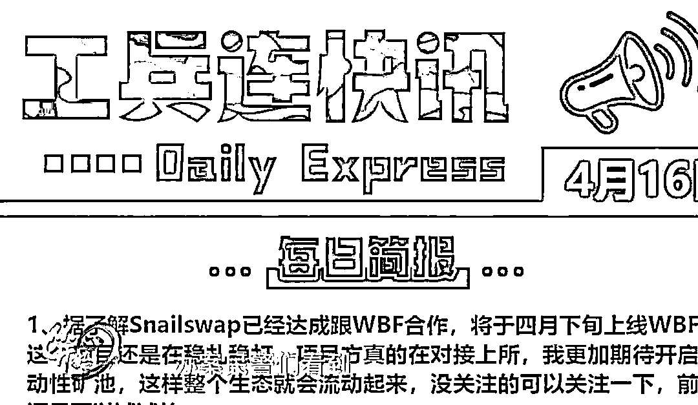

一时间，“币圈工兵连”推荐项目爆雷的消息大肆传播，许多虚拟币投资自媒体都对此事做了分析警示。而与此同时，东营市公安局新型犯罪研究作战中心也接到群众报警，称自己投资虚拟币被骗了。那么，这个犯罪团伙究竟是做什么的？这起案件又是怎么回事呢？

案情要从 2021 年 3 月 16 日说起，那天上午，东营市公安局新型犯罪研究作战中心突然接到一个市民的报案，声称自己被骗了。

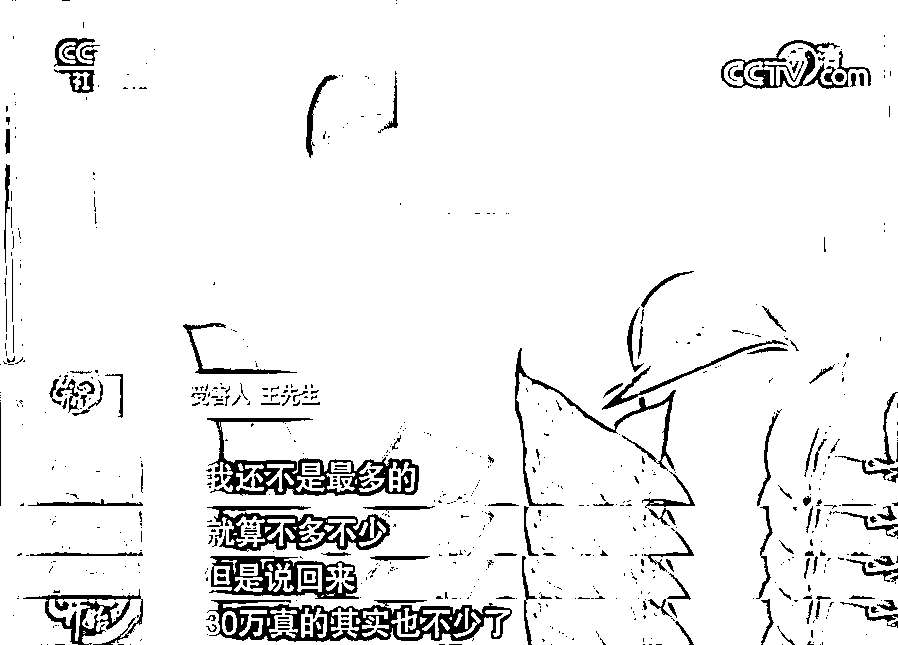

报案人王先生，是“币圈工兵连”推荐的爆雷项目的受害者之一，接警后东营市公安局新型犯罪研究作战中心的民警十分重视，立刻安排专人对王先生进行了询问。王先生告诉民警，**当时他被拉入群后，群里只是交流分享投资心得，**直到 2021 年 4 月 13 日，**群主开始推荐一个名为“蜗牛币”的流动性挖矿项目。** 

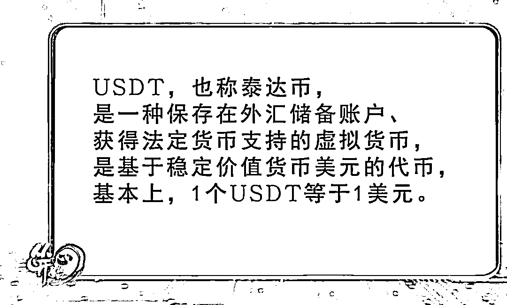

根据王先生的讲述以及提供的有关资料，东营警方迅速开始了侦查，他们首先将目光对准了疑似实施诈骗的“蜗牛币”交易平台，调查结果却令办案民警大吃一惊。

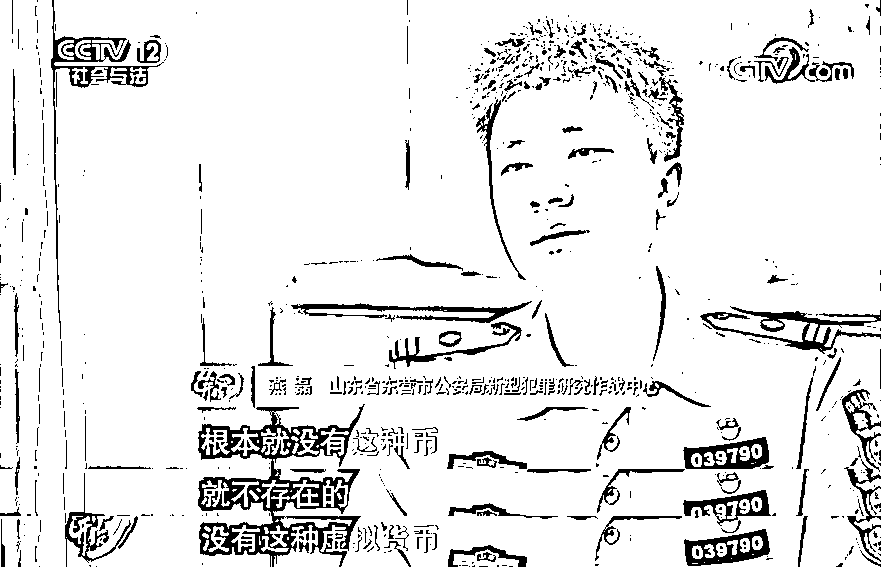

一开始，王先生以为，“币圈工兵连”公众号只是推荐了一个假的交易平台导致自己被骗，可根据警方的调查，**不仅这个交易平台是假的，所谓的“蜗牛币”挖矿项目也根本就不存在，**更不可能像公众号所说，会在交易所上市交易。那么，再根据之前将受害人踢出群聊的行为，办案民警几乎可以断定，“币圈工兵连”这个公众号有着极大问题。

知道了在这整个骗局中，连“币圈工兵连”的公众号都是骗局的一环时，王先生及所有的受害人都不禁有些懊恼，王先生告诉民警，自己投资虚拟币也有两年多的时间了，其他的受害人中还有时间更久的资深玩家，现在他们居然被一个完全不存在的项目骗倒，内心确实充满了后悔和不甘。

随着调查的深入，“币圈工兵连”的真相也将一点点被揭开。

02

2021 年 4 月 17 日，接到市民王先生的报警后，东营市公安局新型犯罪研究作战中心立刻开展了对“币圈工兵连”公众号的调查，据公开资料显示，该公众号于 2020 年 10 月 15 日开始运营，并且他们是这样介绍自己的：**币圈工兵连，排雷第一号！揭秘币圈骗局，曝光资金盘内幕！捍卫币圈环境，正准更狠的打击幕后黑手！**

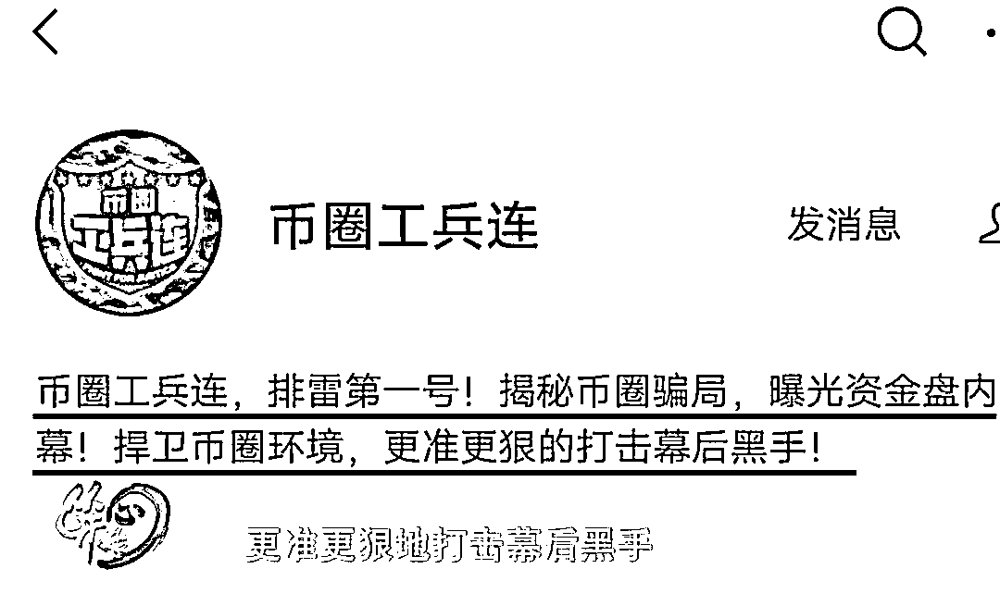

根据对该公众号发布内容的检索，办案民警们看到，从 2020 年 10 月开始运营以来，“币圈工兵连”每天都会发布一些虚拟币投资的资讯，并且揭露各种币圈项目的套路，慢慢地，**它便靠着“打假”的名号积累了大量粉丝。**

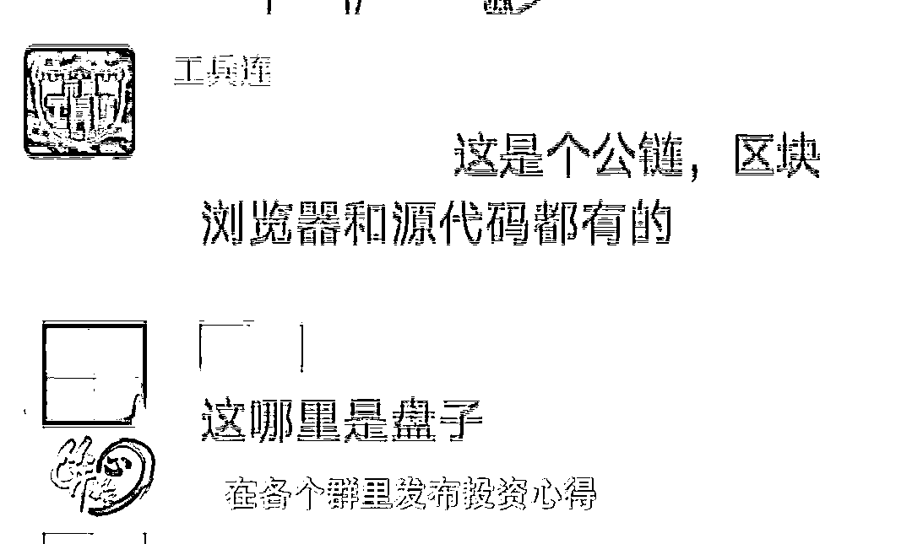

在比对了王先生及其他受害人提供的一些群聊信息后，民警们看到，每天都有很多相似的人在各个群里发布投资心得，**一来活跃气氛，二来吸引大家投资的兴趣，**而很多像王先生这样的受害人也就这样，渐渐被群里的气氛感染，成了“币圈工兵连”的忠实粉丝。

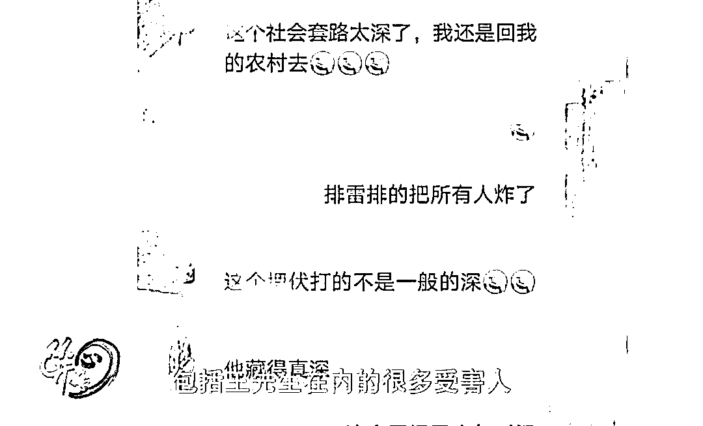

包括王先生在内的很多受害人已经明白了这群诈骗分子的套路，但在当时，他们却对这个公众号深信不疑，在币圈工兵连开始在群里推荐“蜗牛币”项目时，他们都认为赚钱的机会到了。

就这样，在“币圈工兵连”长达半年的设计下，很多人把自己的虚拟币资产都投入了“蜗牛币”这个根本就不存在的项目中，根据蜗牛币交易平台的数据显示，在它运营的短短三天时间里，质押资金就有 450 多万 USDT，折合人民币三千万之多。

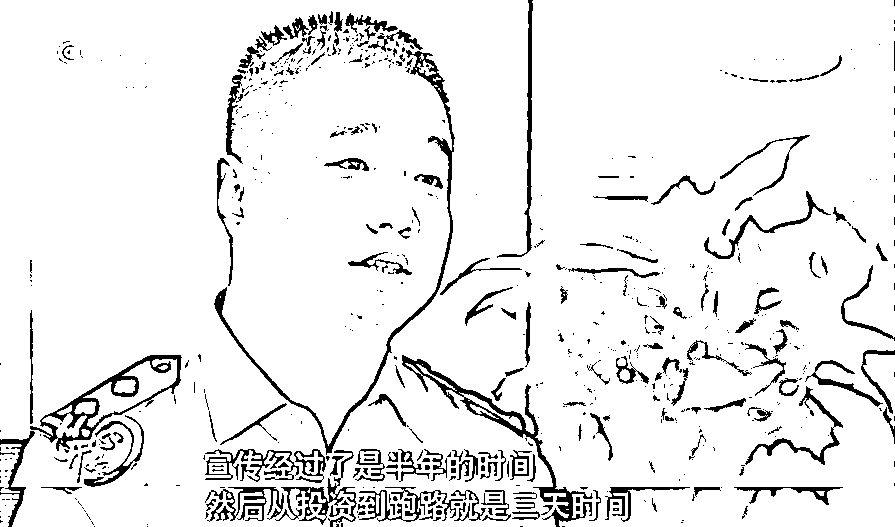

根据多年与诈骗分子的斗争经验，民警们知道，在巨大利益的诱惑下，这帮犯罪分子绝不会就此收手。确定了四个人的身份，后面的侦查就变得容易很多，办案民警根据对这四个人的调查，顺藤摸瓜，又找到了另外两个人的踪迹，至此，一个六人组成的诈骗团伙浮出水面。

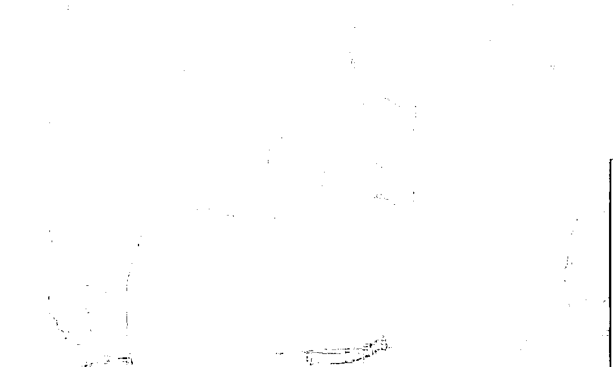

为了阻止这个诈骗团伙再次作案，避免更多的受害人出现，2021 年 5 月 28 日，在制订了详细的抓捕计划后，东营市公安局组成了十多人的抓捕小组，前往长沙，对这个“币圈工兵连”的幕后诈骗团伙实施收网行动。 

此嫌疑人行踪稳定，抓捕条件十分成熟，抓捕小组指挥员决定，第二天一早对该犯罪团伙进行收网。一切准备就绪，但一场意外已经悄然发生，整个抓捕计划都将被打乱。

03

2021 年 5 月 29 日早上八点，根据蹲守民警发回的消息，主犯应该只是回家探望亲属，并不存在得到风声逃跑的情况。最终，经过研究决定，由机动抓捕小组立即赶赴衡阳捉拿主犯，而其他民警则按原计划做好踩点、蹲守工作，随时待命。

在衡阳警方的配合下，主犯李某被抓获。随即，长沙的抓捕小组立刻开始行动。很快，二号、四号、五号和六号嫌疑人相继到案。而负责三号嫌疑人的抓捕小组却迟迟没有动静。

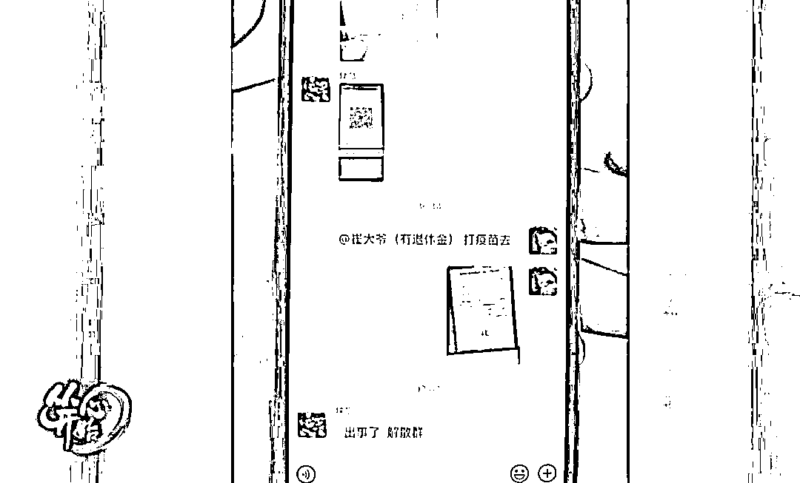

三号嫌疑人发在群里的消息让抓捕民警大吃一惊，很显然，他已经收到了风声，而庆幸的是，其余嫌疑人都已经在第一时间抓获，不会受到影响。

民警们决定，直接在同伙的住处等待三号。

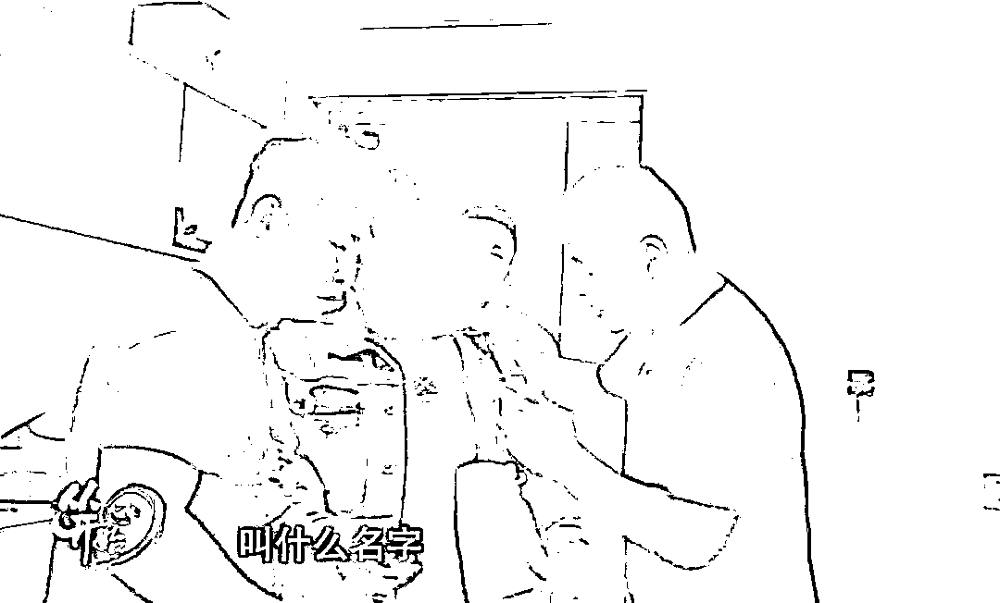

下午五点，三号嫌疑人李某终于到案，至此，这个六人诈骗团伙全部被东营警方抓获。

在随后的审讯中，六名犯罪嫌疑人如实向警方交待了他们的犯罪事实。**2020 年 5 月，主犯李某和朋友因为投资虚拟币，被骗了一大笔钱，**谁知，在懊恼之余，**他们竟从中看到了翻盘的机会。**利益的驱使下，李某二人和其余四个也想挣钱的朋友一拍即合，**决定按照他们被骗的套路，复制一套骗局。**

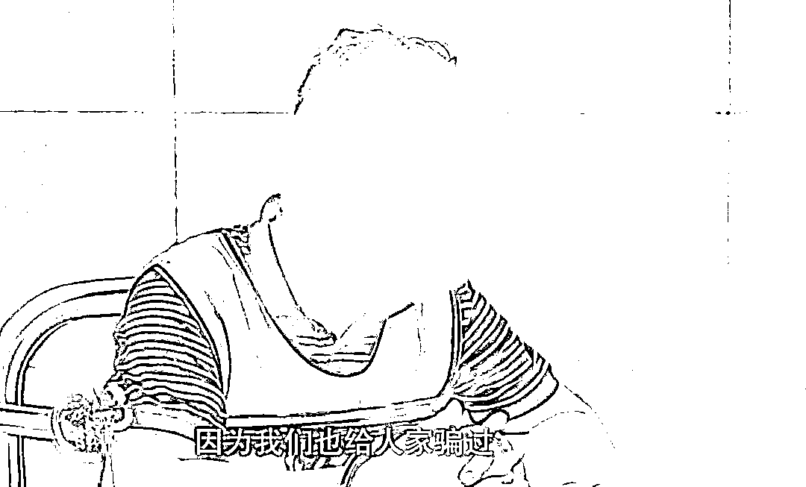

他们首先运营起了“币圈工兵连”这个公众号来吸引粉丝，在粉丝达到一定数量后，他们又找到一家公司为他们制作交易平台，并向粉丝们推出了所谓的“蜗牛币”挖矿项目。

**早在 2013 年，中国人民银行等五部委就发布了《关于防范比特币风险的通知》。**2017 年 9 月，中国人民银行等七部门联合发布《关于防范代币发行融资风险的公告》，其中明确说明，融资主体通过代币的违规发售、流通，向投资者筹集所谓“虚拟货币”，本质上是一种未经批准非法公开融资的行为，涉嫌非法发售代币票券、非法发行证券以及非法集资、金融诈骗、传销等违法犯罪活动。因此，无论“蜗牛币”是真是假，李某等六人的行为已经构成犯罪。

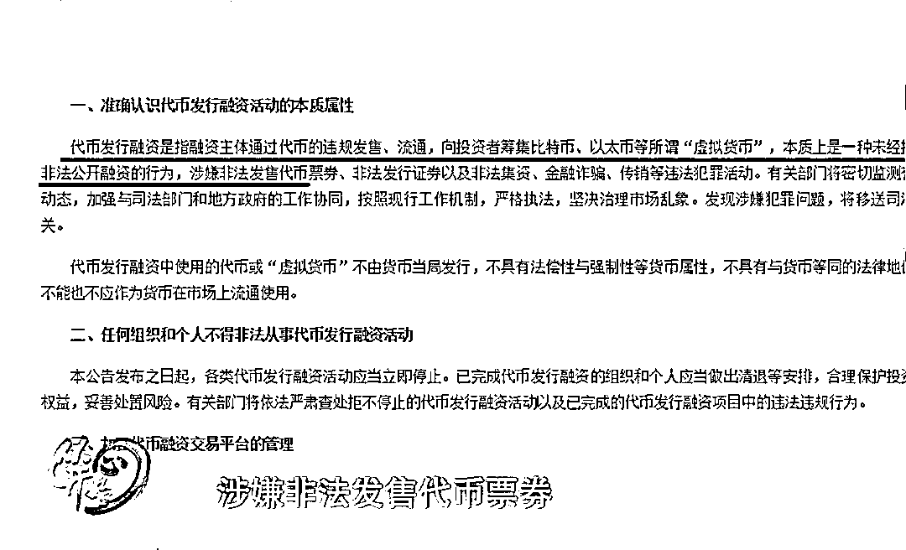

最后，经初步审查，李某等六人在短短三天的开盘交易中，共获利 300 多万，受害人达 100 余人。未来等待着他们的，将是法律的严惩。

**警方提示**

虚拟货币不由货币当局发行，不具有法偿性与强制性等货币属性，无真实价值支撑，价格极易被操纵，相关投机交易活动存在虚假资产风险、经营失败风险、投资炒作风险等多重风险。广大消费者要增强风险意识，树立正确的投资理念，不参与虚拟货币交易炒作活动，谨防个人财产及权益受损。

来源：山东公安、东营公安、央视新闻

← 向右滑动与灰产圈互动交流 →

