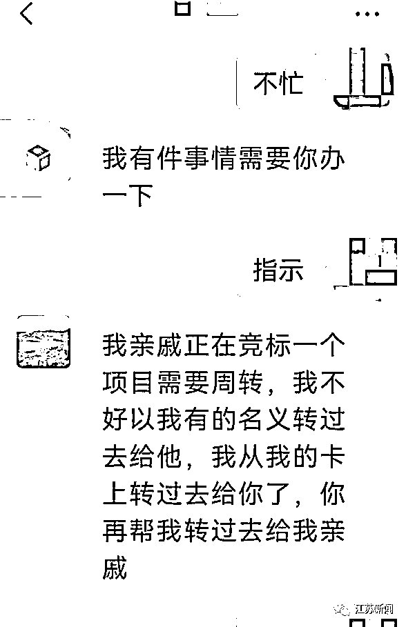
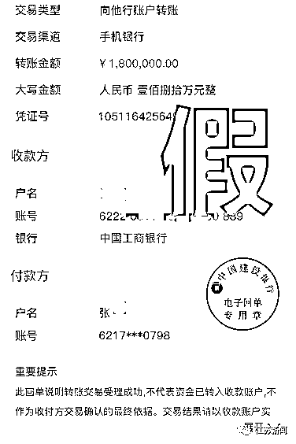
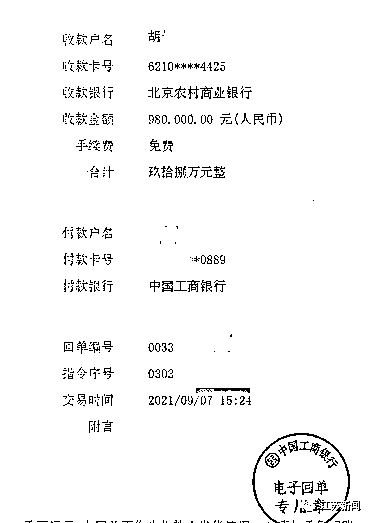
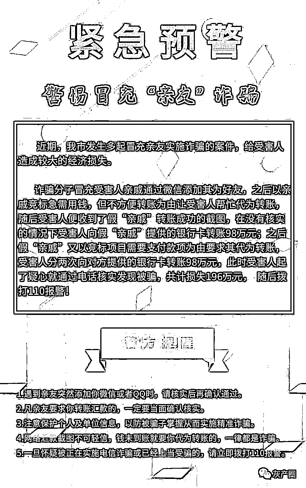

# 女子被骗 196 万元，竟是因为两张转账截图……

> 原文：[`mp.weixin.qq.com/s?__biz=MzIyMDYwMTk0Mw==&mid=2247520601&idx=5&sn=f89f5900e124cfad4dad96dbed0ada5b&chksm=97cb5a61a0bcd37740a32796f844cad7ca5236c2cc36bc6b7a8f5823232c05f0e2c14e49e2da&scene=27#wechat_redirect`](http://mp.weixin.qq.com/s?__biz=MzIyMDYwMTk0Mw==&mid=2247520601&idx=5&sn=f89f5900e124cfad4dad96dbed0ada5b&chksm=97cb5a61a0bcd37740a32796f844cad7ca5236c2cc36bc6b7a8f5823232c05f0e2c14e49e2da&scene=27#wechat_redirect)

**“就因为骗子冒充我亲戚，**

**又提供了转账记录，**

**一下子骗走了我 196 万元！”**

说起自己的被骗经历

江苏宿迁市的吴女士追悔莫及

↓↓↓

**因为两张转账截图**

**女子被骗 196 万元**

吴女士是宿迁市区某公司财务的负责人，9 月 7 日，她在微信上收到一个好友申请，**对方自称是其亲戚张某某**，吴女士便同意了好友请求。

一番寒暄后，“张某某”以亲戚要竞标，但对方不好转账为由，请求吴女士帮忙代为转款。为了打消吴女士的疑虑，**对方发来两张显示钱款已转账至吴女士账户的截图，一张显示已转账 98 万元，另一张显示已转账 180 万元**。

“我这个亲戚确实在大公司上班，又有‘转账记录’的截图，就信以为真了。”吴女士懊悔地说。她按照对方要求，**分三次将自己账户上的 196 万元转至对方提供的账户。**

转账之后，吴女士发现不对劲，于是打电话给真正的张某某核实，结果张某某称并没有让吴女士代为转款。吴女士这才发现自己受骗，立即报了警。

**警方提醒：****警惕冒充“亲友”诈骗**

****转账一定要小心！****

****目前，警方正在全力调查该案。同时，为了防止类似事情发生，**宿迁市反诈骗中心发出紧急预警，提醒大家警惕冒充“亲友”诈骗。******

****来源：央视新闻，江苏新闻****

********

****← 向右滑动与灰产圈互动交流 →****

********