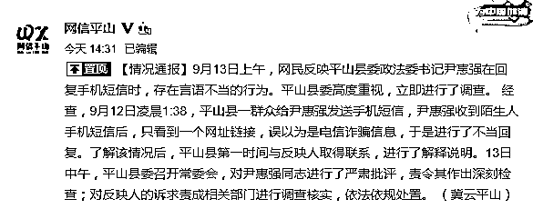
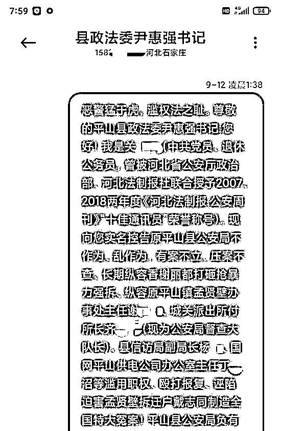
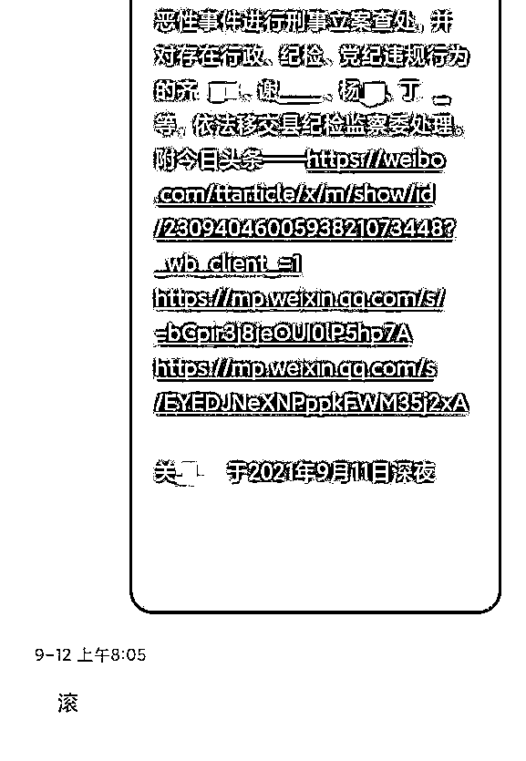

# 群众发短信反映情况，平山政法委书记回复“滚”

> 原文：[`mp.weixin.qq.com/s?__biz=MzIyMDYwMTk0Mw==&mid=2247520664&idx=1&sn=1e74ed5d081fc0a0697f611a8326738f&chksm=97cb5aa0a0bcd3b6adb5bdc188aa60ae36fe53b6d8b9cec4c9565444bff57f7cc93a1bff6fb6&scene=27#wechat_redirect`](http://mp.weixin.qq.com/s?__biz=MzIyMDYwMTk0Mw==&mid=2247520664&idx=1&sn=1e74ed5d081fc0a0697f611a8326738f&chksm=97cb5aa0a0bcd3b6adb5bdc188aa60ae36fe53b6d8b9cec4c9565444bff57f7cc93a1bff6fb6&scene=27#wechat_redirect)

13 日下午，平山县委政法委常务副书记马占军表示，信息里只有一个链接，没有其他具体内容和实名信息，尹惠强误以为是电信诈骗。

 **[`v.qq.com/iframe/preview.html?width=500&height=375&auto=0&vid=j3275fsmvql`](https://v.qq.com/iframe/preview.html?width=500&height=375&auto=0&vid=j3275fsmvql)** 

**▲河北一县政法委书记回复举报短信称“滚” 官方：不当回复 责令深刻检查。新京报我们视频出品（ID：wevideo）** 

**9 月 13 日上午，河北平山的关女士称，她在 9 月 12 日凌晨 1 点 38 分发短信向平山县委政法委书记尹惠强反映情况，12 日上午 8 点 05 分，尹惠强回复“滚”。** 

**关女士提供的短信截图显示，短信正文有 1000 字左右，她在开头介绍自己是中共党员、退休公务员，说明了反映的具体事由，并指出具体的控告人员，文中附有三个网页链接。** 

**13 日下午，平山县委宣传部就此事发布情况通报称，9 月 13 日上午，网民反映平山县委政法委书记尹惠强在回复手机短信时，存在言语不当的行为。平山县委高度重视，立即进行了调查。经查，9 月 12 日凌晨 1:38，平山县一群众给尹惠强发送手机短信，尹惠强收到陌生人手机短信后，只看到一个网址链接，误以为是电信诈骗信息，于是进行了不当回复。了解该情况后，平山县第一时间与反映人取得联系，进行了解释说明。13 日中午，平山县委召开常委会，**对尹惠强同志进行了严肃批评，责令其作出深刻检查；对反映人的诉求责成相关部门进行调查核实，依法依规处置。****

****

**13 日下午，平山县委政法委常务副书记马占军表示，信息里只有一个链接，没有其他具体内容和实名信息，尹惠强误以为是电信诈骗。** 

**马占军称，目前，他们已联系上关女士，希望将此事“当面解释清楚”。** 

****

**▲关女士和尹惠强的短信截图。受访者供图**

****当事人：****

****发短信向县委政法委书记反映情况，****

****对方回复“滚” ****

********

****关女士告诉新京报记者，2013 年，因平山县冶河西路拓宽，自家在孟贤壁村的三处房屋遭强拆，且没有任何赔偿。此后八年间，他们一直在各处信访维权。去年 10 月，丈夫戴志同到平山县信访局信访被派出所带走，随后被羁押至今，今年 5 月，法院二审判决戴志同无罪后，他仍未被释放。****

****因此，关女士通过中间人要到平山县委政法委书记尹惠强的联系方式，发短信反映此情况。****

****关女士提供的短信截图显示，短信正文有 1000 字左右，她在开头介绍自己是中共党员、退休公务员，随后说明了反映的具体事由，并指出具体的控告人员，文中附有三个网页链接。记者注意到，短息发布时间显示为 9 月 12 日凌晨 1 点 38 分。12 日上午 8 点 05 分，对方回复了一个字——“滚”。****

****关女士因病在河北石家庄治疗，收到回复后，她将上述情况反映给了媒体。****

****关女士称，13 日上午，平山县委副书记卢占军、平山县委政法委常务副书记马占军、平山镇党委书记陈龙三人先后联系她，“他们说我把消息发给媒体，影响了平山的形象，要求我发声明，解释这是一个误会，还说要到石家庄把我接回平山。”****

********

****▲关女士和尹惠强的短信截图。受访者供图****

******平山县委政法委常务副书记：******

******这是误会，书记以为是电信诈骗******

************

********9 月 13 日下午，新京报记者联系到平山县委政法委常务副书记马占军、平山镇党委书记陈龙，二人均称此事系误会，是领导将关女士的信息误认为了电信诈骗，并称他们的确已抵达石家庄，希望与当事人面谈。********

********“这是一个纯粹的误会，她发的是链接，又不是什么内容，她也没说自己是谁。（尹惠强）以为是电信诈骗。”马占军说。此外，陈龙提到，自己是独自一人来到石家庄，并不是为了接回关女士，只是希望核实情况。马占军则称，自己是与陈龙两个人来到石家庄。******** 

********新京报记者注意到，关女士在短信的开头和结尾均有介绍自己。********

********对此，马占军回应称，“我没有看到那个”，并称尹惠强之前就知道关女士反映的情况，“领导为了她这个事一直在开会，一直在给她争取权利，给她解决问题。她也理解。她说领导不应该这么说的。她实际上也挺感激领导的。”********

********新京报记者多次尝试联系尹惠强，截至发稿未获回应。********

********来源：新京报********

****************

********← 向右滑动与灰产圈互动交流 →********

****************