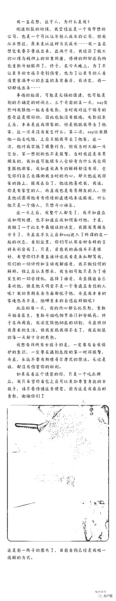
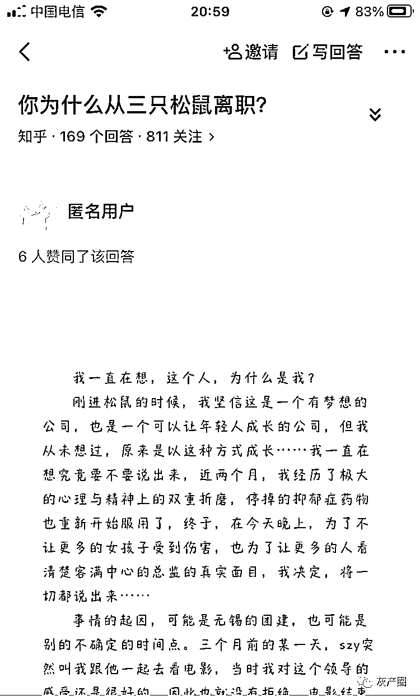
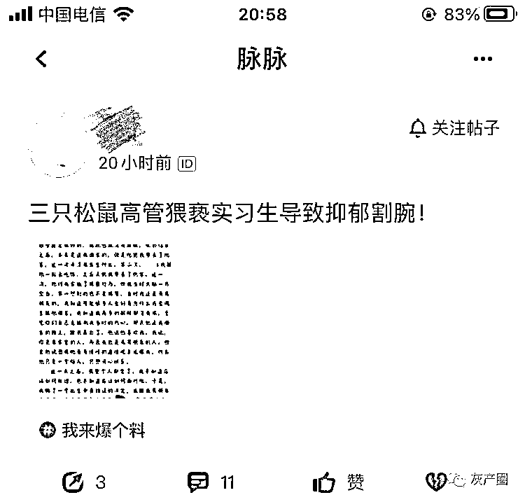
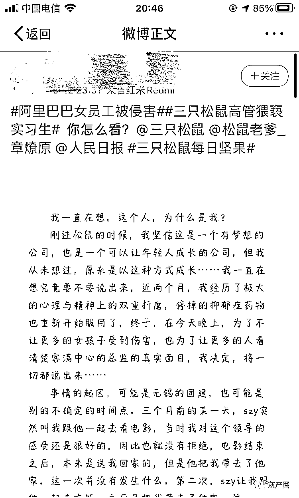
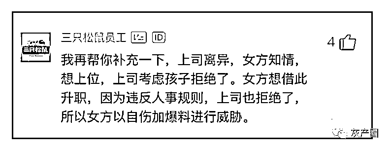
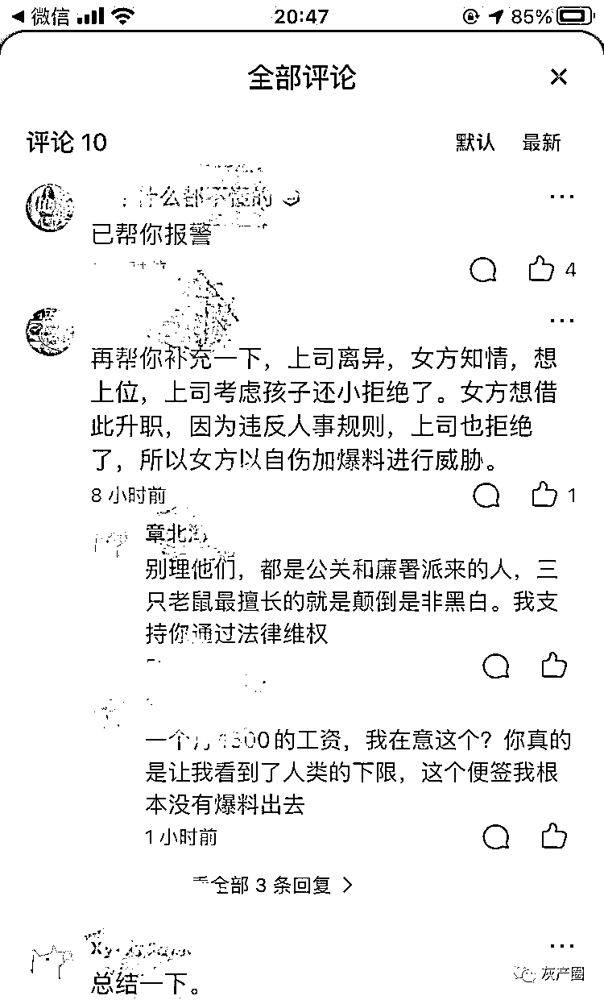
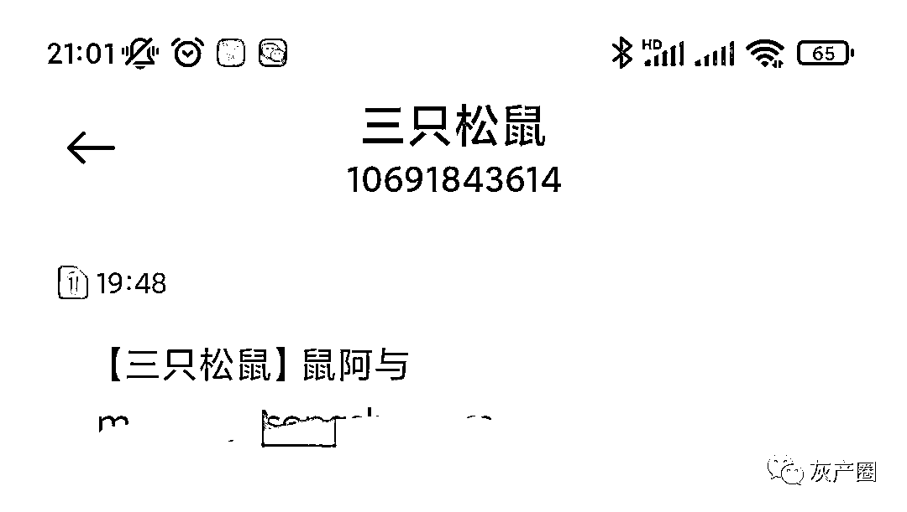
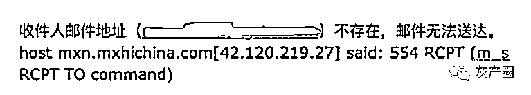

# 传三只松鼠某总监猥亵实习生致其抑郁割腕！

> 原文：[`mp.weixin.qq.com/s?__biz=MzIyMDYwMTk0Mw==&mid=2247520664&idx=2&sn=0e5725240ad645eb9eac3a1632258510&chksm=97cb5aa0a0bcd3b6cb2def0e18dd321c73dff134a3b6d95c2950f4c32fc5faaa7eb76b91ee2d&scene=27#wechat_redirect`](http://mp.weixin.qq.com/s?__biz=MzIyMDYwMTk0Mw==&mid=2247520664&idx=2&sn=0e5725240ad645eb9eac3a1632258510&chksm=97cb5aa0a0bcd3b6cb2def0e18dd321c73dff134a3b6d95c2950f4c32fc5faaa7eb76b91ee2d&scene=27#wechat_redirect)

三言财经消息，昨日，有网友爆料称，自己遭到了三只松鼠客满中心总监 szy 的猥亵，现在靠自伤来缓解。

该网友在文中称，三个月前的某一天，三只松鼠客满中心总监 szy 突然让自己跟他一起去看电影，电影结束之后还把自己带回了家，这一次并没有发生什么。

第二次，szy 让自己跟他一起去吃饭，之后又把自己带回了家。这次，szy 对自己实施了猥亵行为。

后来，自己跟男朋友分手，并且在不久之后和 szy 进入了所谓的在一起的状态。

此后的每一天,自己的内心都无比煎熬,重新开始看医生，重新开始吃帕罗西汀和安眠药。

在文章末尾，还附了一张手腕带血的照片，并声称现在自伤已经是自己唯一缓解的方式。

同样的爆料出现在知乎、脉脉、微博三个平台。 

在脉脉上，该爆料消息的评论区有认证为三只松鼠员工的网友称，上司离异，女方知情，想上位，上司考虑孩子拒绝了。女方想借此升职，因为违反人事规则，上司也拒绝了，所以女方以自伤加爆料进行威胁。 

在知乎，同样有说女方是以自伤加爆料进行威胁的评论。 

三言财经向三只松鼠方面进行了求证，添加其公关负责人微信未获通过，随后我们咨询了客服。客服表示并不知道此事，但会记录反馈，核实有无此事。 

通过三只松鼠客服，三言财经得知，客满中心总监花名为“鼠子阳”，与爆料文中的“szy”相吻合。

三只松鼠的客服给到三言财经一个对接媒体负责人“鼠阿与”的邮箱。 

三言财经向其发送邮件求证此事，但邮件被退回，显示“收件人邮件地址不存在，邮件无法送达”。

三言财经再次致电客服，询问是否给错了邮箱。客服回复称，她们能看到的邮箱就是这个，没有错。 

最后，三言财经在三只松鼠官网“媒体联络”版块对此事进行了留言询问，并留下了联系方式，暂未得到三只松鼠的回复。

三只松鼠上次引发公众关注是前员工“卖废纸箱”事件。

今年 6 月，中国裁判文书网公布的一份刑事判决书显示，三只松鼠原参谋部总监“鼠卫青”蒋某和员工童某分别涉嫌犯非国家工作人员受贿罪和职务侵占罪被判刑。（详情请看[三只松鼠员工卖公司废纸箱获刑：或卖了 300 吨，家庭贫困，母亲打工洗碗](http://mp.weixin.qq.com/s?__biz=MzIyMDYwMTk0Mw==&mid=2247516382&idx=6&sn=a4068dc45416be7114751d3bf41389b7&chksm=97cb4be6a0bcc2f0dc259adae2f2f683d5dc8299caac0a85082406db47c10e5ca535d1086a45&scene=21#wechat_redirect)）

2016 年 7 月至 2020 年 3 月，蒋某利用职务便利，先后收受北京龙金亿劳务服务有限公司法人代表王某赠送的现金 279041 元和价值 429000 元的宝马汽车一辆。

此外，蒋某还于 2018 年 10 月至 2020 年 4 月期间，利用职务便利，伙同童某采取销售不入账或者调整过磅表等方式，将三只松鼠公司出售的价值 684000 元废旧纸箱占为己有。其中，蒋某分得 344000 元，而童某分得 340000 元。

最终，蒋某犯非国家工作人员受贿罪，判处有期徒刑一年零二个月，并处罚金 50000 元；犯职务侵占罪，判处有期徒刑十一个月，并处罚金 50000 元。决定执行有期徒刑一年零十个月，并处罚金 100000 元； 

童某犯职务侵占罪，判处有期徒刑一年，缓刑二年，并处罚金 50000 元。

来源：三言财经

← 向右滑动与灰产圈互动交流 →

