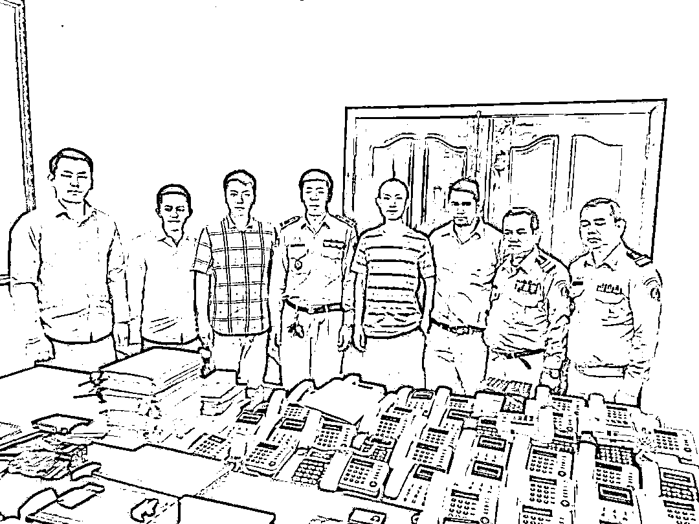
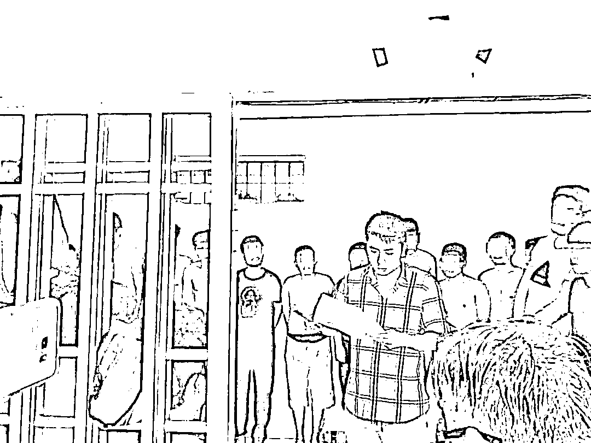
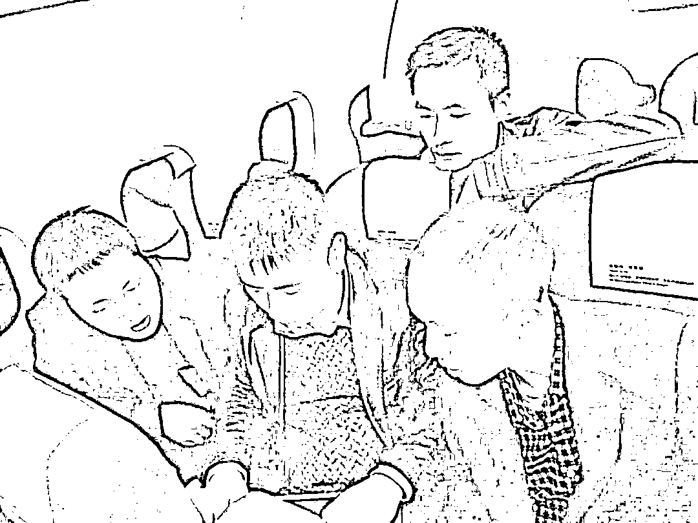
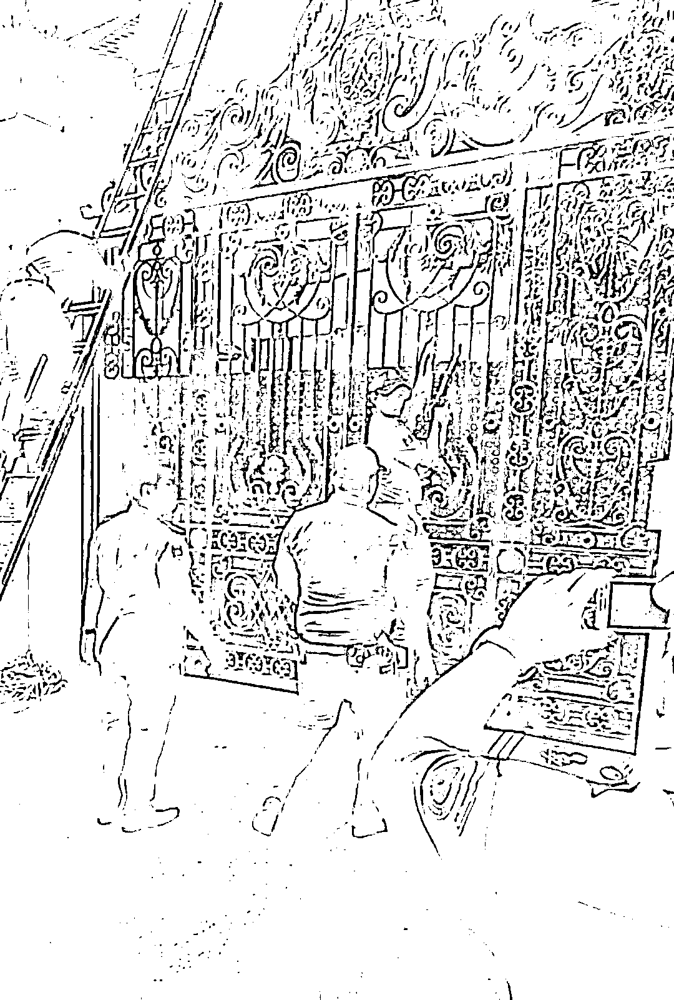
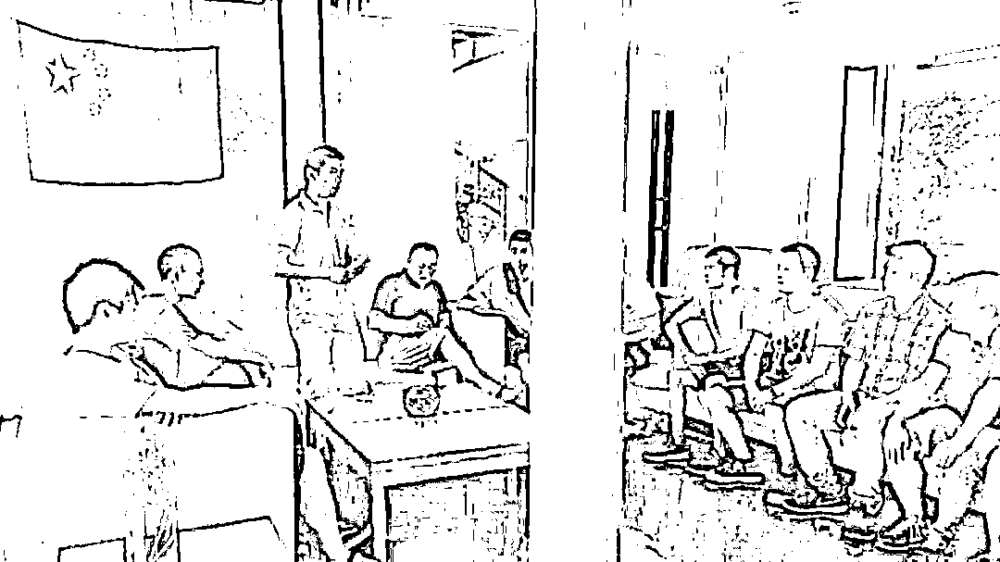
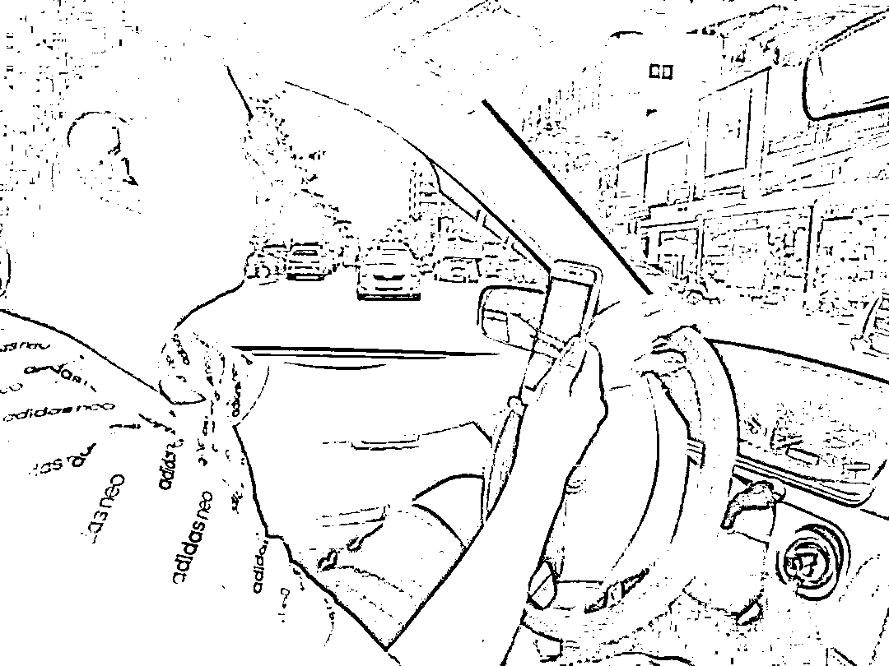

# 中国警察“误闯”柬埔寨将军府，结果……

> 原文：[`mp.weixin.qq.com/s?__biz=MzIyMDYwMTk0Mw==&mid=2247520664&idx=3&sn=468508b7ae8650ee29dac11ce1ba715c&chksm=97cb5aa0a0bcd3b6a7dcc96358f01a33a12b27205c9f67106800b1b7d3202c2d538cf3f72769&scene=27#wechat_redirect`](http://mp.weixin.qq.com/s?__biz=MzIyMDYwMTk0Mw==&mid=2247520664&idx=3&sn=468508b7ae8650ee29dac11ce1ba715c&chksm=97cb5aa0a0bcd3b6a7dcc96358f01a33a12b27205c9f67106800b1b7d3202c2d538cf3f72769&scene=27#wechat_redirect)

7 月的柬埔寨，野草长得和人一样高。

凌晨四点，中国警察陈界安开车来到一幢被沼泽地包围着的别墅，壁垒森严：四周布满摄像头，所有窗帘紧闭，空调全力运转，门口放着大量鞋子，还有人放哨。

有蹊跷！

陈界安刚拿出手机，准备偷偷拍照。突然，七八个持枪男子将他团团围住，拿枪抵住了他的头。

**“糟了！这下被别人包饺子了！”**

然而他怎么也没有想到，自己“误闯”的是一名柬埔寨将军的府邸，宪兵队平日就隐蔽在周围负责安保……

**扭送到军营，给宪兵队员看照片******

****后来，宪兵队把陈界安扭送到了附近的一个军营。由于身处柬埔寨，语言交流不通，陈界安一时无法解释清楚自己的身份。****

****忽然，他灵机一动！****

******就在几天前，2017 年 7 月 1 日，中柬双方进行了第一次联合执法，捣毁窝点 12 个，抓捕嫌疑人 74 人。**当地的新闻媒体进行了报道，还有自己穿着警服和柬埔寨警方的合照。****

********

****（左三为陈界安）****

****陈界安把照片和报道翻出来给宪兵队员看，对方这才明白了他的身份，并用仅会的英语称赞：**"China police,good !"******

****误会化解了，可是陈界安却非常沮丧。****

****此前，经过近一个月的努力，中国警方最终确定了 15 个在柬从事冒充公检法人员通讯诈骗、裸聊诈骗、网络赌博的犯罪窝点。但不知是哪个环节出了问题，最重要那些的嫌疑人却在行动前全部脱逃……****

******怎么办？是打道回府，还是继续蹲守？******

****一时间，陈界安和同事们不仅没有高兴，反而都陷入了深深的失望之中。团队也被迷茫的情绪笼罩着。****

********

****“跑这么老远，最想抓的没抓着，回去怎么交代？继续蹲守，等待时机！”陈界安斩钉截铁地说。****

****他忽然想起，曾经踩过点的一处别墅非常可疑，深夜独自前来打探，却闹了一场误会……****

****就像专案组来柬埔寨前一样，案件再次陷入了僵局，陈界安的心情几乎降到了冰点。****

******“烤老鼠，很大个儿的那种……”******************

******4 个月前，四川广安一位市民接到一名自称“南充市公安局民警”的电话，在其精心设计的骗局中，被诱骗了 105 万元，受害人几乎崩溃，把一线希望寄托在警察身上。******

******当警方迅速启动冻结机制后，那时全部钱财已被犯罪嫌疑人转移。******

******时任广安市公安局网安支队大队长的陈界安，带着团队在分析了海量数据信息后，发现了一个疑似嫌疑人访问过的国内网站。******

******之后，他和同事们顺藤摸瓜，通过进一步侦察，一个位于柬埔寨的冒充公检法人员的电信网络诈骗团伙逐渐浮出水面……******

********3 个月后，专案组踏上了前往柬埔寨的未知旅途。********

************

******“饭菜全是咖喱味，天天拉肚子；看不懂的路标、听不懂的语言、搞不清当地的法律、很差的治安状况，还有飞车贼晚上当街抢夺财物……”******

******在国内出差办案，路上再辛苦，嘴上不会太吃亏。但是在柬埔寨，尤其在一些偏远地区，吃的都是那种酸溜溜的鱼肉。**最令陈界安崩溃的是，居然还有烤老鼠，很大个儿的那种……********

****那样的条件下，他们最喜欢吃的还是方便面，但必须要放上一大勺从国内带的“老干妈”！****

******蓬头垢面的“流浪汉”，竟是中国警察！******************

******异国他乡，没有想象中的美好，除了苦就是累。******

******潮湿闷热的柬埔寨，臭水沟里令人作呕的味道和浑身上下被蚊虫叮咬的大包，更是让大家刻骨铭心。******

******他们蹲守在高高的草丛中，困了，就在原地打个盹；饿了，就吃一点方便食品。******

********时间不等人。********

******在国内有关部门支持下，专案组很快找到分散在柬埔寨各省份的多个疑似电诈窝点。******

************

******“这些疑似窝点，多数都是独栋别墅，和国内规划整齐、环境优美的别墅区不同，更像是农村自建的小洋楼，周围都是漂浮着垃圾的沼泽和水塘，被生活污水冲刷出来的小水沟遍地交错，野草长得和人一样高。”陈界安说。******

******由于窝点周围没有明显掩护，门口还有人巡逻，不方便靠近侦查。******

********所以，陈界安和同事们只能躲在附近的杂草丛中、臭水沟旁，或是密闭的车里，二十四小时不间断蹲守。甚至别墅里出来的生活垃圾，都不放过。********

************

******几天下来，个个都胡子拉碴、满脸冒油，身上的味道和臭水沟的味道早已经辨别不清了……******

******谁也想象不到，这群蓬头垢面、风餐露宿的“流浪汉”，竟是中国警察！******

******深夜车抛锚山谷，推了十公里！******************

********蹲守的日子难熬，“动”起来也不好过。********

******“我印象特别深刻的是有一天，我们 5 个人为了赶路，连夜开车，到一个荒无人烟的山谷时，车子出了故障，抛锚了。那真是叫一个荒郊野外，前不着村、后不着店啊！”******

******由于诈骗窝点分散，需要开车跨地区办案。为了避免泄密，他们拒绝聘请当地翻译和驾驶员，而是选择自驾。******

************

******睡一晚等待救援，这样暴露的风险太大，最后他们决定推车找店。******

******于是，5 个大男人竟合力推着那辆趴窝的汽车，整整走了数十公里的山路才找到了一家修车店。******

********“可能是老天爷眷顾，那旁边还有一个加油站，当时我们都高兴坏了！” ********

******尽管困难重重，都一一被克服了，但没想到最重要的抓捕对象，却在联合行动时扑了个空。******

******当陈界安在军营里一筹莫展的时候，了解情况后的宪兵队员告诉他，那附近有栋别墅中确实住着大量中国人！******

******经后来侦察确认，这正是他们要找的冒充公检法人员的诈骗窝点！******

********这一次，电诈团伙没能再次逃脱。********

****如今时隔 4 年多，已是四川省广安市公安局经开区分局政委的陈界安，提到这段惊心动魄的经历，有这样的感慨：****

******“在国外很多事情非常受限，******

******和当地政府、军方、警察需要协调的事情也很麻烦，******

******但我们还能圆满完成任务，******

******归根结底，******

******是因为我们背后有一个强大的祖国。”******

****  来源：环球时报，中央政法委长安剑****

********

****← 向右滑动与灰产圈互动交流 →****

********