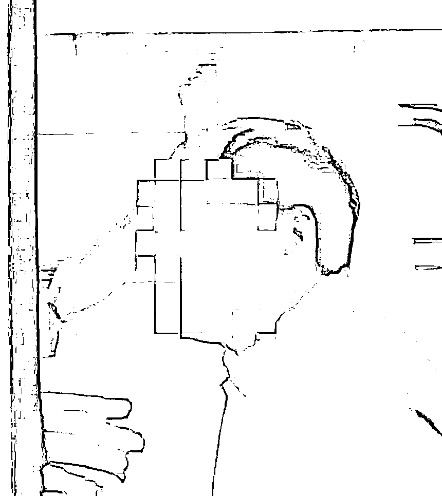
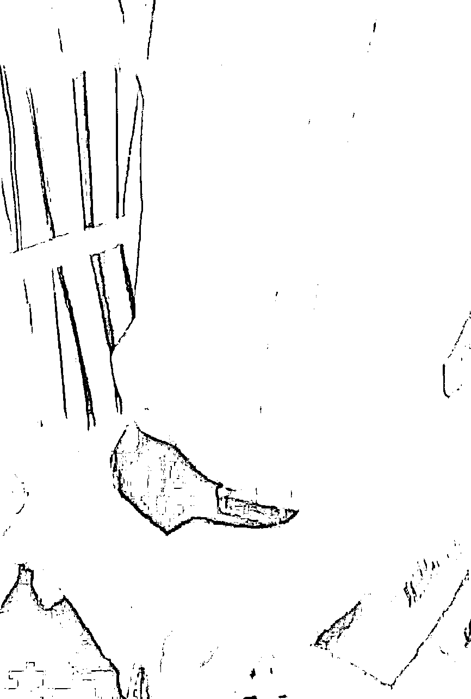
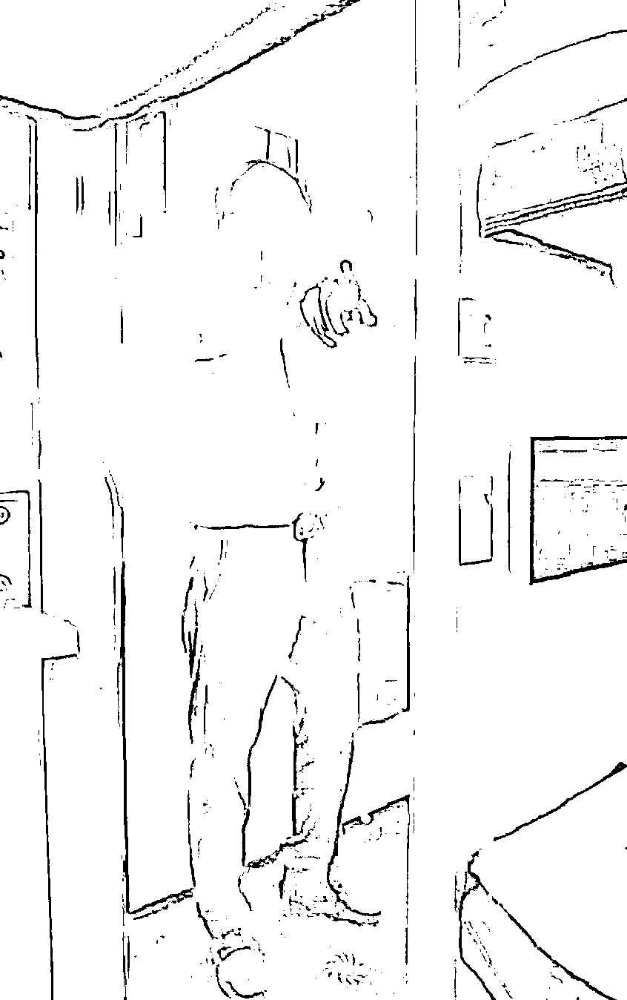
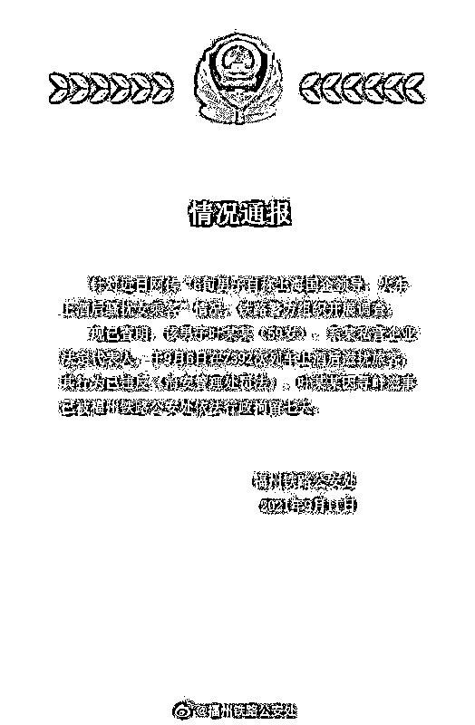

# 醉酒男自称“国企领导”嚣张骚扰女乘客，警方通报揭其真实身份

> 原文：[`mp.weixin.qq.com/s?__biz=MzIyMDYwMTk0Mw==&mid=2247520664&idx=4&sn=7f7143d383edc87154c4a0498019fc5b&chksm=97cb5aa0a0bcd3b66e40abce13081ac19c910f258d030760b6ea23dccc029dc86555e76a4d53&scene=27#wechat_redirect`](http://mp.weixin.qq.com/s?__biz=MzIyMDYwMTk0Mw==&mid=2247520664&idx=4&sn=7f7143d383edc87154c4a0498019fc5b&chksm=97cb5aa0a0bcd3b66e40abce13081ac19c910f258d030760b6ea23dccc029dc86555e76a4d53&scene=27#wechat_redirect)

酒后失言和失德一样可怕，

可总有人喝完酒之后管不住自己，

甚至有些无法无天。

**近日，刘女士通过网络发帖反映自己在列车上被一位六旬男乘客酒后骚扰，对方声称是上海某国企干部。**

[`v.qq.com/iframe/preview.html?width=500&height=375&auto=0&vid=c3274pwo9tu`](https://v.qq.com/iframe/preview.html?width=500&height=375&auto=0&vid=c3274pwo9tu)

男子多次进出车厢起冲突 

刘女士告诉记者，9 月 6 日，她与朋友乘坐 Z392 列车的卧铺，下午戴着面罩躺在下铺休息，期间一名中年男子多次进出刘女士所在车厢寻找一名男乘客，还当面议论了刘女士的面罩，影响了车厢内的乘客休息，之后双方又发生多次争执，期间乘务员 3 次前往调解。

根据刘女士提供的多段视频显示，一名男子在车厢内与她争执，其间该男子称刘女士“戴着面膜像鬼一样”，之后双方还起了肢体冲突，该男子紧紧抓着刘女士的胳膊，还扬言“把她的后台找出来，否则不姓叶（音译）”。

“他好几次进来车厢，就说小姑娘你戴什么面膜睡觉，后面争执就拉我出车厢门，还想打人。”

刘女士告诉记者，自己当天并非戴着面膜休息，因为皮肤对紫外线过敏，而是带着面罩，对方多次进出车厢向其搭话。由于男子一身酒气，并且不断地开关门，女子在害怕之下向列车员求助，而面对列车员的询问，男子却显得非常嚣张。

“他吃过饭回来之后，就闻到了很大的酒气，讲话迟迟顿顿。”刘女士说，自己还听到他的朋友和乘务员说，他是上海某国企的。对方争执了半个多小时，反复进出四五次纠缠她。“他攥着我的手腕不放，说自己是国企领导，还说要查一下我上面有什么人，我的手都被他攥青了！”

刘女士还向记者提供了一张照片，胳膊留有多处淤青，是该男子在拉扯时造成的。回家之后，刘女士将现场拍摄的视频发在了网络，引起了网友的广泛关注。

福州铁路公安已介入调查  

上海中铁三局否认此人就职  

9 月 10 日下午，福建省福州铁路公安找来了刘女士一同乘车的朋友当面询问，“我问是不是内部人员，他们说不是”，刘女士说，铁路警方并未透露对方的具体身份。9 月 10 日晚，记者致电福州铁路公安，工作人员称此事还在调查中，其他情况暂时没有公布。

9 月 11 日上午，记者与中铁三局上海分公司取得联系，并将男子现场视频发给该单位进行辨认，工作人员向记者否认单位中有“叶姓”男职工，并且通过视频、图片辨认也并不认识视频中男子。“目前可以确定，他不是我们中铁三局上海这边的本职员工，年龄大一点的干部，我们都认识都熟悉的，没有这个姓叶的高管。”

当地公安处通报： 

涉事男子被行政拘留 7 天  

9 月 11 日，福建省福州铁路公安处发布情况通报：针对近日网传“6 旬男子自称上海国企领导，火车上酒后骚扰女乘客”情况，铁路警方组织开展调查。

现已查明，该男子叶某某（59 岁），系某私营企业法定代表人，于 9 月 6 日在 Z392 次列车上酒后滋扰旅客，其行为已违反治安管理处罚法。叶某某因寻衅滋事已被福州铁路公安处依法行政拘留 7 天。

来源：中国妇女报官方微信、@福州铁路公安处、猛犸新闻、九派新闻、环球时报、网友评论

← 向右滑动与灰产圈互动交流 →

