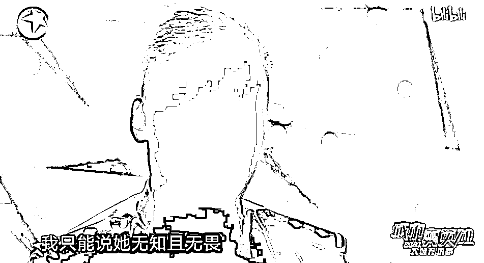

# 她这态度，民警都看不下去了！

> 原文：[`mp.weixin.qq.com/s?__biz=MzIyMDYwMTk0Mw==&mid=2247520664&idx=5&sn=efa3d80c62e2addd1c0ceea0934275d8&chksm=97cb5aa0a0bcd3b611f936dcd42025e2470daf2b605bf664bd5bc546a331a128e8a0415dd2a4&scene=27#wechat_redirect`](http://mp.weixin.qq.com/s?__biz=MzIyMDYwMTk0Mw==&mid=2247520664&idx=5&sn=efa3d80c62e2addd1c0ceea0934275d8&chksm=97cb5aa0a0bcd3b611f936dcd42025e2470daf2b605bf664bd5bc546a331a128e8a0415dd2a4&scene=27#wechat_redirect)

她是家里的掌上明珠，被父母寄予厚望；为了她，父母卖掉房产，供她留学⋯⋯

可她呢？

学无所成辍学归来，不仅吸毒贩毒，竟还号称“想让大家在阳光下吸大麻”……

近日，上海警方刑侦纪录片《大城无小事》里的一起案件引发热议——

兜售毒品还轻描淡写！

她的态度民警也看不下去了

今年元宵节前一天，上海闵行缉毒队得到线索，辖区内一名姓金的女孩从境外购买了新型毒品，当晚就要对外兜售，交易地点是一家酒吧。

民警提前来到酒吧。晚上 11 点左右，金某现身。现场的一段录音显示，女孩向对方兜售的是新型毒品“蘑菇素”。这种毒品中含有的赛洛新属于致幻类毒品，成瘾性、致幻毒性比摇头丸更强，是我国管制的第一类精神药品，我国早在 2013 年发布的《精神药品品种目录》中，赛洛新就在列。

但金某告诉对方，“蘑菇素”无法检测出毒性，还是“合法”商品。

在金某准备离开时，警方上前将其抓捕，在她随身携带的包内，民警搜到了三包卷烟，烟丝里夹杂了致幻物质；随后，在金某的住所，民警又搜到了三种不同类型的致幻成瘾物质。

金某看起来还很年轻，对于吸毒一事，她的态度始终是轻描淡写、十分随意：

**为何吸毒？**

> **“玩了这个会快乐一点，很‘愉悦’（非正常亢奋）。”**

**为何会频繁追求这种方式的“愉悦”？**

> **“那不然追求什么？”**

**现在我国每年有那么多缉毒警察牺牲，不知道吗？**

> **“但是那种都是冰毒什么的。”**

民警还在其微信中发现，**她曾跟别人说“想让大家在阳光下吸大麻……”**

审讯快结束时，民警让其在文件上签字，她直接写了个英文名，就是不写中文名字。

金某这样的态度让民警也看不下去了，怒斥：“谁允许你写英文名的？”一名缉毒警察直言，**“当时感到非常愤怒，她对法律没有丝毫敬畏，我只能说她无知且无畏。”**

另一名警察怒斥，**“我们边防的解放军战士，跟你年纪一样的，为了守卫祖国的领土，牺牲在那边，你（却）在追求新型毒品给你带来的‘快乐’，人家跟你一样的青春、一样的年纪的时候，人家为国家做出了贡献，你为国家做出了什么？你不要从国家这么高的高度了，你为你的家庭做出了什么贡献？”**

金某初中时，父母卖了一套房子，送她出国读书，但她一无所成，两年前辍学回家后，沾染上了毒品，据其介绍，她之前还“玩过大麻”。

审讯结尾，面对民警的一次次教导，金某的泪水渐渐打湿了口罩……

**毒品“乔装打扮”**

**潜伏在我们身边**

****

**近年来，随着互联网的发展，新型毒品层出不穷，这些毒品经过“乔装打扮”，成为奶茶、电子烟、巧克力、止咳水等潜伏在我们身边，让人难以分辨、放松警惕。**

**数据显示，截至 2020 年底，**全球已出现新精神活性物质 1047 种，其中约 450 种为近 5 年新出现的种类。我国已累计发现新精神活性物质 9 大类 317 种，近 3 年就新发现 50 余种。****

**新精神活性物质，是不法分子为逃避打击而对管制毒品进行化学结构修饰所得到的毒品类似物，具有与管制毒品相似或更强的兴奋、致幻、麻醉等效果。**

**为加强对新精神活性物质的滥用管制，我国连续三年开展打击新精神活性物质专项行动，2020 年行动中共缴获新精神活性物质 430 余公斤。**

**今年 5 月，据国家禁毒委员会办公室通报，将整类合成大麻素类物质和氟胺酮等 18 种新精神活性物质列为毒品进行管制，**至此我国已列管 188 种新精神活性物质和整类芬太尼、整类合成大麻素物质，中国也成为了全球第一个整类列管合成大麻素类物质的国家。****

****认清它们的“面目”****

****不吸第一口！****

********

******而作为普通人，究竟该如何防范新型毒品呢？******

******此前，多地公安局曾发布提醒：**学习毒品知识，学会辨识毒品，了解毒品的危害，**懂得“吸毒一口，掉入虎口”的道理，不听信毒品能治病、解脱烦恼和痛苦、带来快乐等谎言。******

********不随意接受陌生人给的零食、饮料等。**不法分子会声称新型毒品不是毒品，而是零食、网红饮料、减肥药等，或谎称不会上瘾。一定要坚决抵制，拒绝毒品要从第一口开始。******

********不结交有吸毒、贩毒行为的人。**如发现亲朋好友中有吸、贩毒行为的人，一要劝阻，二要远离，三要报告公安机关。******

******来源：新华网，巴蜀反诈******

************

******← 向右滑动与灰产圈互动交流 →******

************