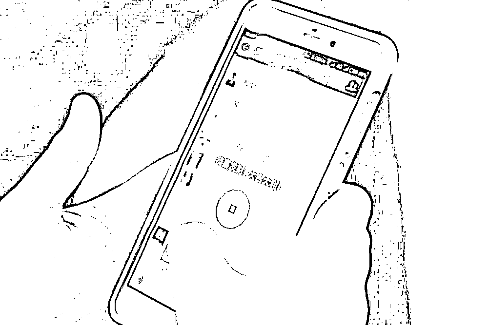
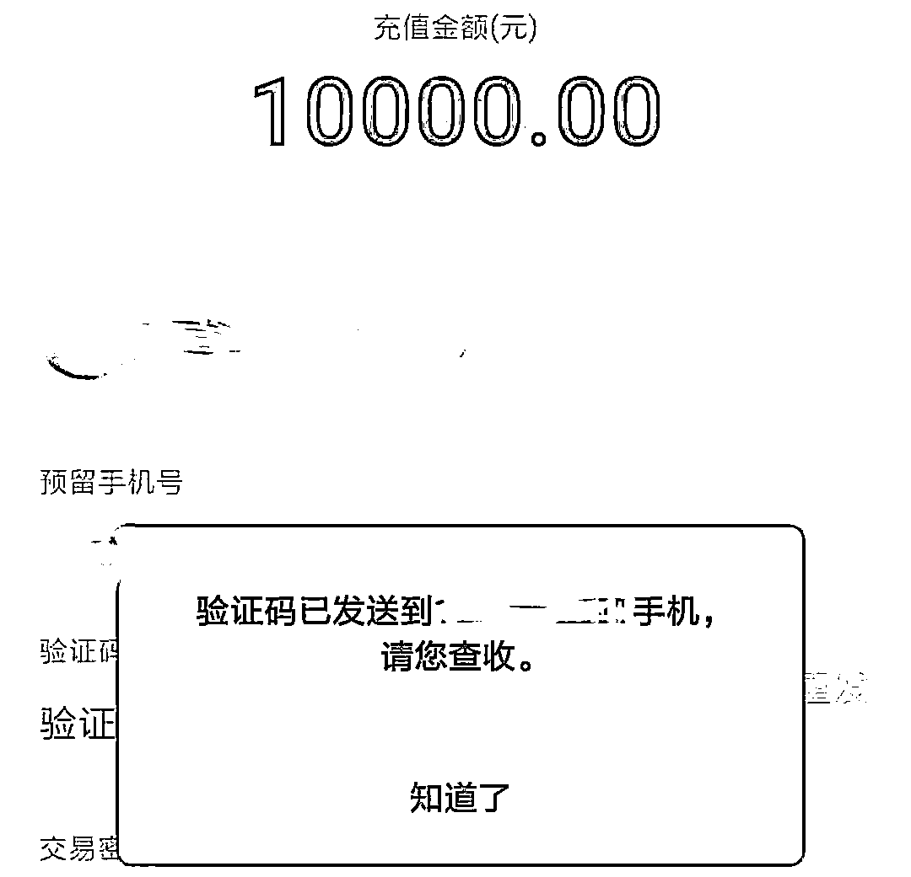
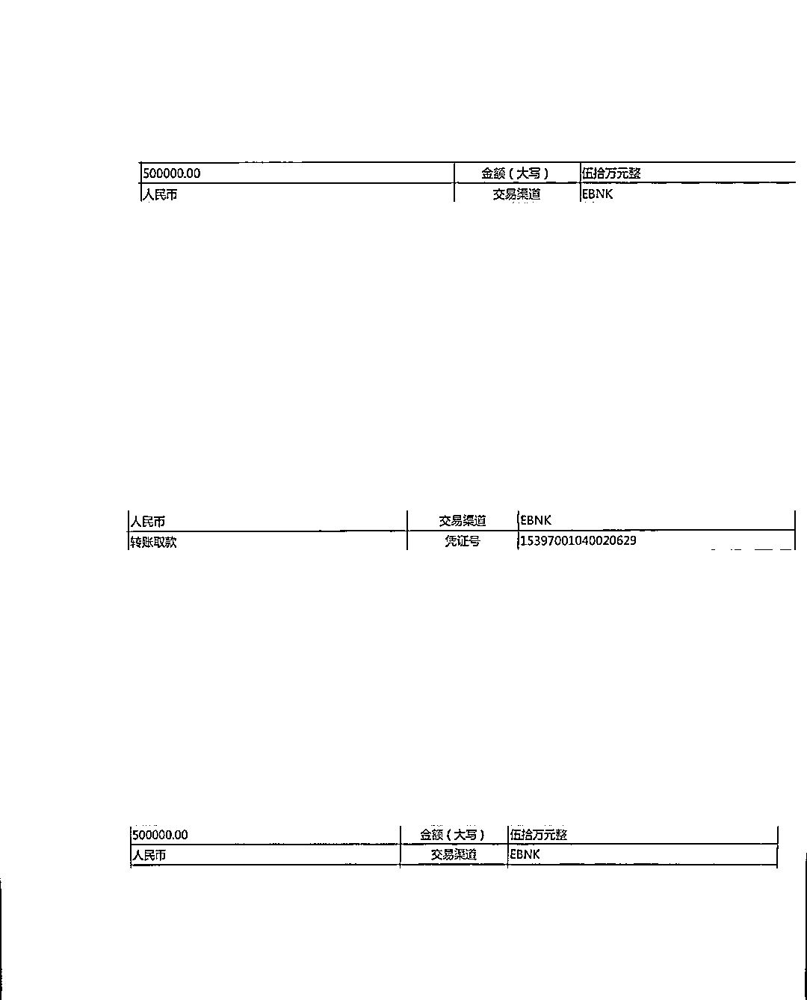
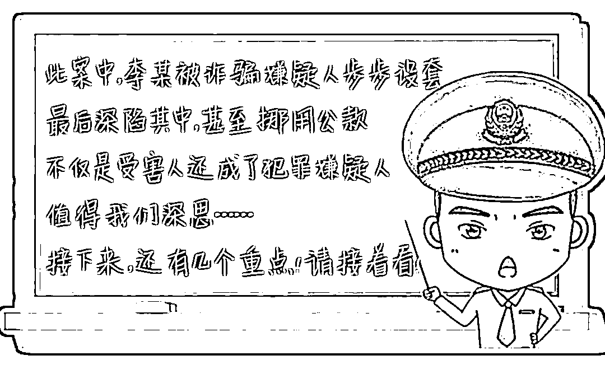

# 女会计先报案后自首，金额高达 600 余万！咋回事？

> 原文：[`mp.weixin.qq.com/s?__biz=MzIyMDYwMTk0Mw==&mid=2247520664&idx=6&sn=c785f11f850c97e3584765740469b3ba&chksm=97cb5aa0a0bcd3b615780d05b2a3b7facf728ca16f11bef1a1f04f4254007b6585c296057326&scene=27#wechat_redirect`](http://mp.weixin.qq.com/s?__biz=MzIyMDYwMTk0Mw==&mid=2247520664&idx=6&sn=c785f11f850c97e3584765740469b3ba&chksm=97cb5aa0a0bcd3b615780d05b2a3b7facf728ca16f11bef1a1f04f4254007b6585c296057326&scene=27#wechat_redirect)

**报案后接着投案自首，** 

**涉案金额竟高达 600 余万元！**

**这是一出什么操作？**

**8 月 16 日**

**山东烟****台芝罘区某装饰公****司会计李某**

**来到辖区派出所，自称来报案和自首**

**这让民警丈二和尚摸不着头脑……**

直到做完两份询问笔录……

民警才明白了事情的来龙去脉 

这是怎么一回事？她到底经历了什么？

**案件回顾**

**红包诱惑  设置**“盈利”**诱饵**时间追溯到 8 月 10 日，李某被拉进了一个抢红包群，群里有人发送了一个名叫“朵聊”的 APP 下载链接，称下载这个 APP 给明星点赞就能赚钱。随后李某下载了该 APP，**并联系上了 APP 内的“派单员”。但“派单员”却告知李某点赞任务已经派完了，现在只有刷单任务可以接。****李某看到这里有些犹豫，但群里一些群友都在发送提现的消息，抱着试试的心态**，李某按照“派单员”的要求开始刷单做任务。第一单任务，李某充值 5000 元赚了 1188 元且顺利提现，这也让她彻底地打消了疑虑。

**此时的李某以为自己找到了一个**

**轻松赚钱的机会，**

**却全然不知等待她的**

**是骗子早已布好的陷阱！**

****步步下套 **诱导继续转账**接下来的操作却不像第一单那么顺利。第二单时，“派单员”给李某下发任务，称刷满一定数量就可提现，而且收益更高。随后，李某陆续投入 10000 元、30000 元、110000 元却一直不能提现。“派单员”以“需再做一单才能提现”“任务失败，再做一单弥补”“需要风控和验资否则无法提现”等理由让她不断投入。此时已深陷其中的李某早已掏空了自己的钱包为了拿回之前的投入**便打起了公司账户的主意****作为会计的她从公司账户****陆续转出****600 余万元****投入其中****直到还是无法提现，****才幡然醒悟**悔恨不已的她主动来到了派出所报案与自首

▲部分转账记录

目前，犯罪嫌疑人李某因涉嫌挪用资金被依法采取刑事强制措施，案件正在进一步审查中，其被诈骗案件也在全力侦办中。

李某的经历让人唏嘘更让人警醒！

一个“刷单”举动不仅让自己成了受害人

还成了犯罪嫌疑人！

**@所有人划重点！仔细认真看！**

**刷单套路演变**

**NO.1 ****刷单诈骗 1.0 版本**

1\. 发送一个淘宝、京东等正规购物链接，让受害人提交订单，但要求不能支付，并给受害人提供一个二维码让其扫码付款，等于骗子只是借用正规购物平台的商品给受害人做了一个展示。

2\. 前期骗子先让受害者刷一两个小单，并返还本金和佣金，先让受害者尝到甜头。

3\. 取得受害人信任后，骗子诱导受害人刷大单，并以各种理由不提现。

**NO.2 ****刷单诈骗 2.0 版本**

1\. 诱导用户下载 App 到手机。

2\. 在 App 中充值，按照要求操作赚钱。

3\. 前期小额投注可以提现。

4\. 后期充值金额变大后，则以各种理由不让你提现，从而完成诈骗。

**NO.3 ****刷单诈骗 3.0 版本**

1\. 在微信群、QQ 群等社交软件上发布虚假“做手工”或“点赞返利”任务。

2\. 要求下载指定 APP 进行接单。

3\. 通过 APP 派发简单的“做手工”或“点赞”任务付给你佣金，取得信任。

4\. 称“手工”“点赞”等任务已派发完，但可以充值成为会员进行抢单，或者让你一边刷单一边排队等待“做手工”或“点赞”任务。

5\. 等你充值之后，就会以“再刷一单”“再充一点”等各种理由让你加大投入，直至把你榨干。

**对比之下不难发现，手段虽升级，但本质却没变，无论是点击链接还是下载 APP 做任务，都是前期让受害者小额获利，后期诱导其大额投入，达到诈骗目的。**

**1、“刷单”本就是违法行为。** 

**2、切勿相信网上类似“足不出户，日进斗金”“轻轻松松赚钱”等兼职刷单信息。**

**3、所有骗局都围绕一个“钱”字，针对新骗局，谨记不听、不信、不转账！**

**4、此外，如果发现被骗，一定要在第一时间报警。**

**最后，再次提醒大家**

**天下没有免费的午餐**

** 不要轻信任何关于刷单的信息**

**牢记不听、不信、不转账！**

来源：芝罘公安、反欺诈金钟罩、熊猫反诈，巴蜀反诈

← 向右滑动与灰产圈互动交流 →

