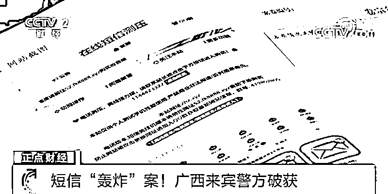
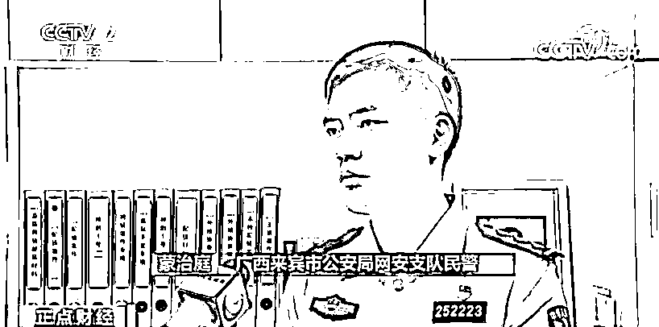
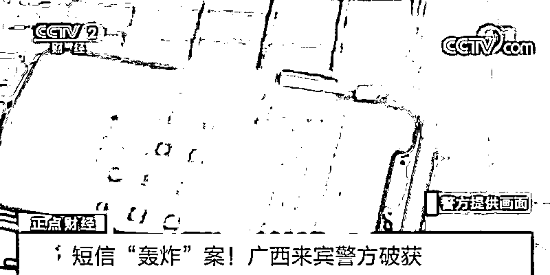

# 一天疯狂轰炸 5 万条信息！警方出手：抓！

> 原文：[`mp.weixin.qq.com/s?__biz=MzIyMDYwMTk0Mw==&mid=2247520664&idx=7&sn=897d67027a659935c928780f74f8afe0&chksm=97cb5aa0a0bcd3b61e15632e25a0ade2ed694ad8ca22ca99ad99caa07f26936340d0bff013fe&scene=27#wechat_redirect`](http://mp.weixin.qq.com/s?__biz=MzIyMDYwMTk0Mw==&mid=2247520664&idx=7&sn=897d67027a659935c928780f74f8afe0&chksm=97cb5aa0a0bcd3b61e15632e25a0ade2ed694ad8ca22ca99ad99caa07f26936340d0bff013fe&scene=27#wechat_redirect)

手机每天连收几万条垃圾短信，平均每分钟就会收到 30 条以上，让手机用户不堪其扰，这就是人称“呼死你”的短信轰炸。12 日，记者从广西来宾市公安局了解到，经过近两个月的连续奋战，该局成功破获了一起“呼死你”黑产违法犯罪案件，这也是广西破获的首例短信轰炸类案件。

[`mp.weixin.qq.com/mp/readtemplate?t=pages/video_player_tmpl&action=mpvideo&auto=0&vid=wxv_2045382730716086273`](https://mp.weixin.qq.com/mp/readtemplate?t=pages/video_player_tmpl&action=mpvideo&auto=0&vid=wxv_2045382730716086273)

△央视财经《正点财经》栏目视频
今年 6 月底，广西来宾公安局网安支队接到举报，有人在互联网上搭建网站等开展短信轰炸、游戏外挂等黑产违法犯罪。来宾公安随即成立工作专班展开调查取证工作。 

警方调查，嫌疑人卓某健，居住在广西来宾武宣县一村里，每天足不出户，名下的银行卡、支付宝等账户却有大量进账。经过近半个月的大数据分析和调查，8 月 24 日，警方将正在实施犯罪活动的卓某健当场抓获。据卓某健供述，2020 年底，他加入一个网络代理服务聊天平台，了解到通过代理短信轰炸等转包服务可以从中赚取差价获利，就在该平台申请开通管理账号成为分站代理，按照日卡、周卡、月卡等规格设置价格后把平台链接撒到各种聊天群里，用户只需要打开链接购买好充值卡，按提示填写相关信息，平台便会自行进行短信轰炸操作。

广西来宾市公安局网安支队民警蒙治庭表示，一天估计能轰炸几万条信息，甚至有五万条左右，是最疯狂的，都没停过。 

据初步统计，卓某健共发展下级代理人员 450 余人。警方介绍，购买使用此款软件的人，多用于非法讨债、敲诈勒索等活动，社会危害性大。目前，卓某健已被公安机关以涉嫌破坏计算机信息系统罪刑事拘留，案件还在进一步侦办中。

来源：央视财经

← 向右滑动与灰产圈互动交流 →

