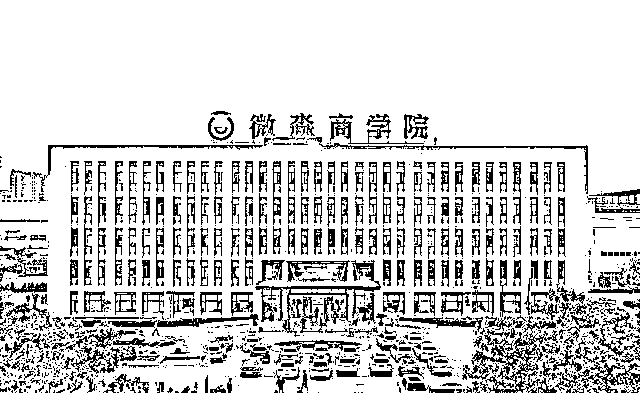
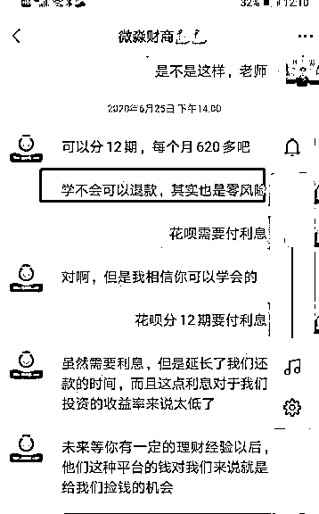
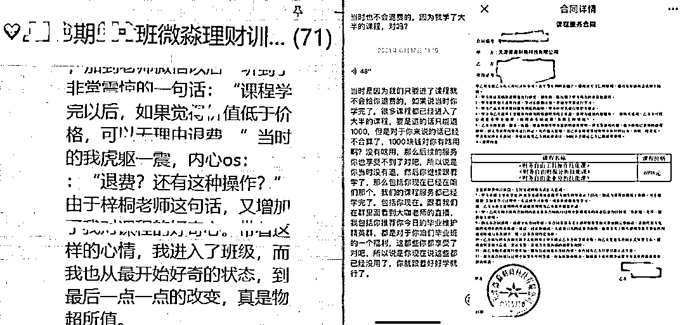
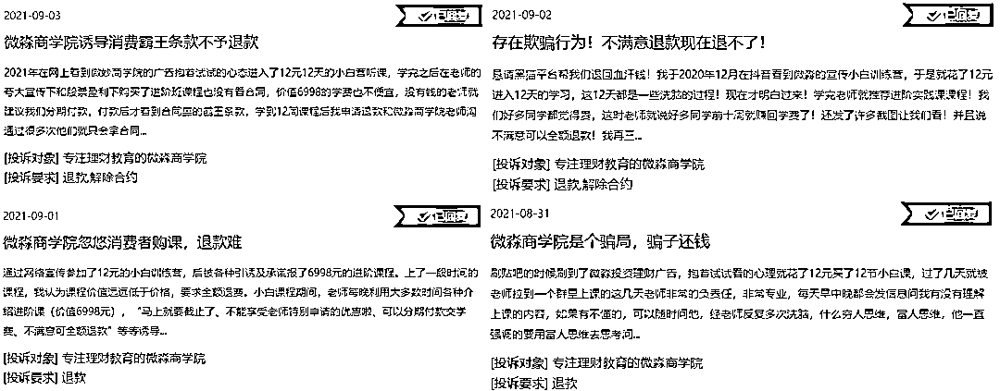
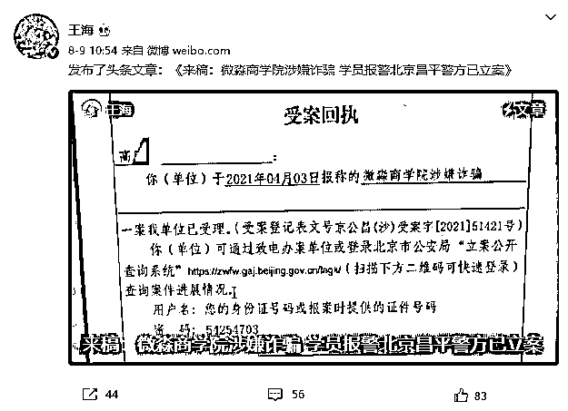
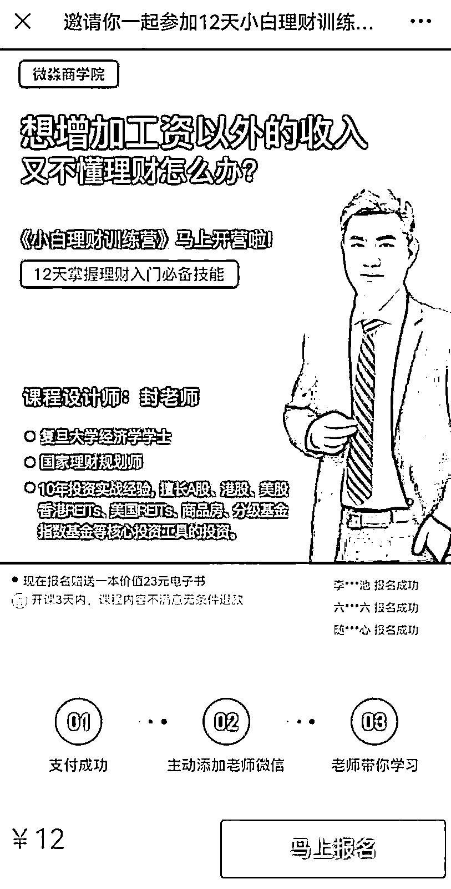
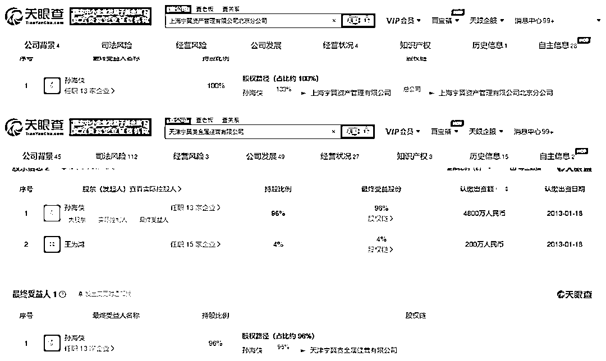

# 被投诉“割韭菜” 百亿微淼商学院冤不冤？

> 原文：[`mp.weixin.qq.com/s?__biz=MzIyMDYwMTk0Mw==&mid=2247520715&idx=1&sn=ecead732036b0c1fd23aeb42ff735c4d&chksm=97cb5af3a0bcd3e50de463ccf23f69173c5694aafcee2d992877c2f1293a7e83a20bb75141a0&scene=27#wechat_redirect`](http://mp.weixin.qq.com/s?__biz=MzIyMDYwMTk0Mw==&mid=2247520715&idx=1&sn=ecead732036b0c1fd23aeb42ff735c4d&chksm=97cb5af3a0bcd3e50de463ccf23f69173c5694aafcee2d992877c2f1293a7e83a20bb75141a0&scene=27#wechat_redirect)

当用户花了 12 元报名参加了微淼商学院的“小白训练营”后，才发现原来后续还有 6998 元的“进阶课程”，而进阶课不仅是财商机构百般推销的重点，更是学员投诉的重灾区。

不少学员质疑，为什么干货内容这么少、还涉嫌荐股等违规操作的课，可以卖到近 7000 元？为什么说好的不满意能退费，到最后钱却要不回来？

“如何从穷人思维过渡到富人思维？”、“你知道什么是‘睡’后收入吗？”、“我，工资之外，3 年赚了 100 万”……近期，以微淼商学院、尔湾科技为代表的财商教育广告在互联网上大量出现。

在这些广告背后的财商机构里，上课的讲师“出身名校”、拥有十年投资或财务工作经验、还有证券资格从业证书、注册会计师证书等专业资格证傍身；合作的机构是知名高校、媒体，还曾有经济界大咖为其站台。种种条件诱惑下，众多小白理财者趋之若鹜。

然而，当用户花了 12 元报名参加了微淼商学院的“小白训练营”后，才发现原来后续还有 6998 元的“进阶课程”，而进阶课不仅是财商机构百般推销的重点，更是学员投诉的重灾区。不少学员质疑，为什么干货内容这么少、还涉嫌荐股等违规操作的课，可以卖到近 7000 元？为什么说好的不满意能退费，到最后钱却要不回来？

数据显示，2021 年 2 月 2 日至今，黑猫投诉平台中微淼商学院的投诉量已从 293 条涨至 2103 条，据此计算，平均每天都至少有 8 位学员进行投诉。

而这样的一家机构，在媒体的报道中号称“估值百亿”、“月赚 2 亿”。鲜明的反差下，不少网友质疑：到底是真理财，还是割韭菜？

**宣传学不会可退费却出现“退费难” 王海：涉嫌诈骗**

“如果没有理财思维，就算给你 100 万，你能守得住吗？”在抖音、微博、微信、知乎等各大平台，几乎都能看到微淼等财商教育平台的广告投放，这些广告打着“财务自由”、“让钱为你打工”等旗号，为的就是吸引具有财务焦虑的各类网民。

微淼商学院官网信息显示，其短视频平台粉丝总量超 420 万，视频累计播放量 5.5 亿次，而这也是微淼商学院获取小白理财者的重要渠道。雷达财经注意到，微淼商学院的产品宣传，层层推进，许多人最初抱着试一试的心态参加入门课程，却在不知不觉间被引入了商家精心布置的“陷阱”。

据南方都市报报道，2020 年 10 月，身患急性红斑狼疮，正处化疗阶段的于女士在百度上被微淼商学院的广告吸引，遂报名了 12 元的小白理财课。“12 块不多，学习一下理财知识也无妨。”

但套路就是从此时开始。一位于 2021 年 3 月报名小白理财课的网友在一次偶然的对老师的质疑后被踢出了群，此后她调查发现，自己在所在班级、报名时间、老师均不同的情况下，所讲内容和群内学员回复的内容却完全相同，甚至连标点符号都完全一致。

无独有偶，有知乎网友也反映称：“我的舍友加起来报了 6 个不同的他们的课程，在 4 个不同的群，里面所谓的老师说着一样的话，发着一样的收益率截图，连同学的问题、感悟都一样，有时候同学也是一样的。”

“复制粘贴”般的课程中，蕴含着微淼逐层推进的重点。于女士称，小白训练营会从讲解基础的金融概念开始，到慢慢向学员灌输“没钱也能变富人”等话术。

此外，微淼宣传人员还宣称，学不会可退款。

有报道称，购买进阶课时，微淼的老师均会承诺上述退费标准。

据谷雨（化名）所述，自己在上小白训练营时，老师曾让同学们发表感言，其中一位同学的感言提到，上进阶课的学员如果觉得价值低于价格，可以无理由退费。

为了增强自身的说服力，群里还会分享收益率惊人的成功案例。“时常发学长学姐的收益图，有的一年赚了几十万，有的一天赚了几万。老师不断灌输投资能让你变富人、改变未来的语言诱惑，让我开始慢慢转变态度。”于女士表示。

而这一切，只是为了推销 7000 元的进阶课做铺垫。不过，于女士因生病一年多没上班，且治病开销很大、经济紧张，对该价格很难接受。

此时，小白理财课老师开始了话术营销。于女士称，“老师说交了学费用不了几天就能赚回来，还提醒我不要跟老公说，等把钱赚到了，再告诉老公，让他看看我是一个不一样的人。”

面对高收益、共情营销、饥饿营销的连番轰炸，于女士没能忍住冲动，匆匆报了进阶课。

除了“耐心规劝”，“老师们”在推销时，甚至还鼓励学员贷款买进阶课。谷雨对雷达财经表示，起初进小白训练营时，老师称不需要贷款。但上了一周的课后，老师就开始“变脸”。“如果你说没钱上进阶课，他们就会给你推荐花呗、京东白条。”

如果学员还是无动于衷，老师便会提出《免息助学贷款》类的服务，尽一切办法促成学员报名。

据于女士描述，起初自己非常积极，每天花五六个小时泡在作业上，晚上学到十一二点，甚至一度让刚刚化疗出院的自己身体上有些吃不消。

但只有小学文化的于女士根本看不懂课程，坚持到第三节课后，于女士无奈之下，私信老师希望退学费，却遭遇了不小阻力。

先是微淼的老师说了很多“鼓励”的话，称要赚钱就不要放弃。后来群里的其他学员收到风声也来劝导，“群里班委私下说我是‘穷人思维’，劝我继续学，还说会手把手教我。”

心生疑窦的于女士在看到一位学员因投诉微淼被踢出群后，觉得自己被骗了。此后她先是在群中疯狂轰炸投诉消息，被踢出群后又和其他维权者一起，通过多方投诉和外部舆论压力，收回了 5000 多元的课时费。“其实啥也没学到。”

值得注意的是，除了于女士之外，还有很多退费无门的学员。据谷雨所述，自己本以为可以自由退费，上进阶课后，再次去咨询，得到的答案却变为了需要上完全部课程，且拿到毕业证书的 2 日内，才可能退费。有学员介绍称，想拿到毕业证，100 分的总分需要达到 80 分，其中实践课占比 60%，因此学员必须完成每周“买基金”的作业。

 

而在这些作业中，则暗含着违规荐股的情况。

早在 2020 年 9 月，就曾有报道揭露，学员质疑，培训师声称不荐股，只教选股方法和挑选基金、信托 Reits 等理财产品的方法，但实际上，培训师会向学员列出一部分候选股票，供其自由选择。“说不推荐股票，但按他们的公式计算出来，好价格基本上就那几只股票。”

在此背景下，谷雨的退费结果经多次投诉仍遥遥无期。“我去了黑猫投诉，还去了领导留言板，都没用。”

而退费难，正是微淼商学院的投诉量在 7 个多月的时间里暴涨超过 1800 条的主要原因。

学员们的“踊跃”投诉，还引起了知名打假人王海的注意，其曾在 1 个月前转发了投诉者的来稿，文章中称微淼商学院涉嫌诈骗，学员报警后，北京昌平警方已立案。

十天后，王海进一步补充道，微淼诈骗已在全国多地警方处立案，为其代言的何润东作为微淼商学院的体验官，应承担连带责任。

**“名师”背景模糊，名校背书暗藏玄机** 

除了难退费，微淼财商团队的“名师”也饱受质疑。

据报道，曾有已离职的微淼进阶课老师在接受媒体采访时透露，微淼招聘进阶课老师只要求专科毕业，没有平台宣称的投资经验，“培训几天就可以上岗，大部分人都没接触过投资，也没有任何国家认受的投资顾问资格证书。”

与该说法相对应的是，此前 BOSS 直聘网站上的招聘信息显示，“财商教育老师”仅需“大专”学历，微淼商学院官网的招聘要求中，对全职在线指导老师也几乎没有除本科学历外的要求。

不过，目前在 BOSS 直聘网站上已无法搜到微淼商学院的招聘信息，公司官网中对任职条件的描述也已改为“985/211 金融、财经、会计专业优先”、“2 年以上金融、证券从业经验。具备 CPA 证书或相关资格证”。

据新京报，甚至有一位 2017 年底购买了微淼进阶课的学员，现在已经晋升为了微淼讲师。

此外，公司创始人的简历也存在诸多疑点。

在其微信《小白理财训练营》的报名页面中，将课程设计师封老师作为宣传重点。微淼称，封老师是复旦大学经济学学士、国家理财规划师，拥有 10 年投资实战经验，擅长 A 股、港股、美股、商品房等多个核心投资工具的投资。

据媒体报道，封老师原名封贺，其百度百科中的词条还提到，封贺 2017 年创立微淼商学院，曾于 2019、2020 年两次荣获央广网“年度教育行业影响力人物”。

然而，红星新闻报道称，封贺复旦大学经济学学士的学习形式为“夜大”，入学难度及含金量均无法与高考、考研相比。

而“国家理财规划师”这一职业证书也已于 2018 年在职业资格认证目录单上被取消。

雷达财经注意到，微淼财商官网中标明的深度合作伙伴中还包括中央财经大学。

具体而言，2020 年 7 月，微淼曾与央财合作打造了财商教育新课程《金融投资与企业管理高级研修班》；2021 年 5 月，微淼商学院还联合央财发布《国民财商教育发展白皮书（2021 年）》。

对此，有报道称央财负责人确认与微淼合作开发上述课程，但声明关于微淼的其他课程与学校没有任何关系。还有网友称，自己曾咨询过央财的校宣传部、组织部以及就业指导中心，均未表示有合作，该课程系与央财教授从业资格的网络培训部一起开发，类似于成人教育，含金量存疑。

**创始人多个关联公司涉嫌诈骗** 

值得关注的是，封贺关联公司涉嫌诈骗。

比如，封贺曾担任“北京金桐商品经营有限公司”的股东，持股比例 45%，该公司于 2021 年 2 月启动了注销程序，决议解散。

金桐公司是何来历？一则相关诉讼显示，其曾在无经营原油资质的情况下，通过欺诈和虚假宣传，诱导客户刘女士网签电子合同，以进行石油产品的期货交易，导致客户短短几天便亏损 48 万余元。

值得一提的是，金桐公司此举属于“二次收割”。因为刘女士在交易石油亏了 48 万之前，刚刚被天津宁翼贵金属经营有限公司忽悠，进行白银现货交易亏了 50 万。而封贺曾任职的上海宁翼资产管理有限公司北京分公司，也带有“宁翼”二字，且这两家“宁翼”公司的最终受益人均为孙海侠。

除此之外，封贺曾持股 45%、现已被注销的上海兰坤实业有限公司，是上海长江联合金属交易中心的 158 号会员单位。

而裁判文书网的一份判决书中，还存留着“上海长江联合金属交易中心通过培训员工形成固定的行骗模式，来操控客户交易、鼓动客户重仓、频繁使用高杠杆，以求在短时间内占有客户亏损和交易手续费提成的记录”。

**财商课乱象被列入专项整治** 

值得一提的是，在媒体的报道中，微淼商学院在 2020 年 12 月就已经拥有了过百亿的估值，这还是在未经过任何一轮融资的情况下达成的。

还有知情人士透露称，微淼的单月收入已超 2 亿人民币，据此计算，每月至多将有超过 2.8 万名学员报名 7000 元的“进阶课”。

而另一家财商课领域的头部公司，坐拥快财商学院、启牛商学院、伴财学堂三大财商教育品牌的尔湾科技，已经于 2021 年 1 月完成了 E 轮融资，累计融资额超 1 亿美元。但启牛的财商课，据新京报等多家媒体揭露，也与微淼存在类似现象。

对此，监管层也曾出手整治。2020 年 11 月，《新晚报》在微信公众号发布的“微淼商学院 12 天小白理财训练营”广告成为了黑龙江省市场监管局公布的 2020 年虚假违法广告十大典型案例。

2021 年 3 月 4 日，北京昌平区市场监督管理局就发出消费警示，15 家教育培训主体被点名，其中北京微淼因被投诉次数达 12 次，位列投诉榜首，而在此前发布的同类名单中（1 月 31 日~2 月 6 日），北京微淼也同样被诉 4 次。

8 月 27 日，国家网信办启动财经类信息专项整治，“财商课”即在此次重点违规问题之列。

在业内专家看来，相关部门应研究出台规范“财商教育”乱象的管理制度，对从事理财培训的从业人员提出明确的金融从业资质要求。各类媒体平台、短视频网站等，也应对“财商”“理财”“荐股”等相关课程进行严格审核，杜绝无序推介。

← 向右滑动与灰产圈互动交流 →

