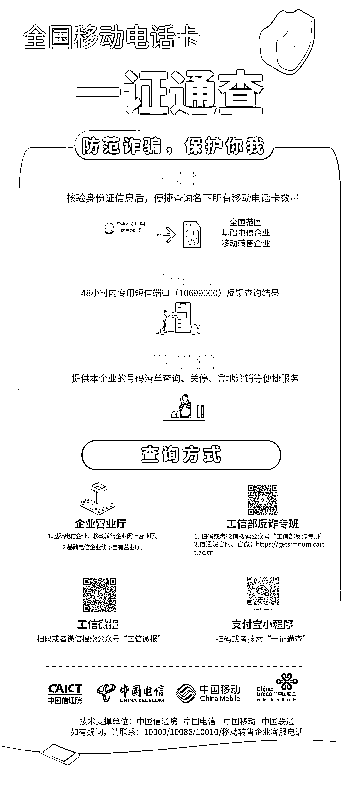

# 快来查查！你名下有几张电话卡？有没有被别人冒用的？

> 原文：[`mp.weixin.qq.com/s?__biz=MzIyMDYwMTk0Mw==&mid=2247520715&idx=3&sn=ee80fac82264f415eae54d419a6cde95&chksm=97cb5af3a0bcd3e5b6f71e0a9bdee34776151243f509ba9601cd92b00c5e300c7ae031438c11&scene=27#wechat_redirect`](http://mp.weixin.qq.com/s?__biz=MzIyMDYwMTk0Mw==&mid=2247520715&idx=3&sn=ee80fac82264f415eae54d419a6cde95&chksm=97cb5af3a0bcd3e5b6f71e0a9bdee34776151243f509ba9601cd92b00c5e300c7ae031438c11&scene=27#wechat_redirect)

我名下有几张移动电话卡？

有没有被别人冒用的？

发现有被冒名办的卡该怎么办？

…………

相信很多小伙伴都有这些忧虑

伴随着工业和信息化部今天推出的

**全国移动电话卡“一证通查”便民服务**

以上忧虑将烟消云散

用户凭借居民身份证

便可查询个人名下登记电话卡数量

如对查询到的电话卡情况有异议

还可通过对应的电信企业

查询明细信息并进行相应处理

***1***

**为何推出“一证通查”？**

**满足用户快速、便捷查询移动电话卡数量的需求****助力防范治理电信网络诈骗**我国电话用户实名登记于 2013 年起全面实施，在工业和信息化部指导下，电信企业实名登记工作逐步规范，身份核验技术能力不断提升。不过，近期在打击治理电信网络诈骗工作中，发现部分涉案电话卡是由诈骗分子冒用他人身份信息办理的手机卡，用户本人并不知情，可能会对用户个人信用产生负面影响。同时，由于缺乏统一的查询途径，用户不了解自己名下电话卡办理情况，难以主动发现自身利益受到侵害，也不利于相关部门防范治理电信网络诈骗行为。此次“一证通查”服务的开通，打破了 93 家省级基础电信企业和 39 家移动通信转售企业相关数据各自独立的局面，实现了全国移动电话卡的统一便捷查询，从根本上破除了手机卡查询难题，规避了不知情办卡的风险，为人民群众维护自身利益、保护个人信用提供了有效途径，将助力打击电信网络诈骗工作。

***2***

**都有哪些查询方式？**

**“一证通查”服务支持线上、线下两种预约查询渠道****线上渠道：**用户可以通过**“工信微报”和“工信部反诈专班”微信公众号、运营商网上营业厅、中国信息通信研究院官方网站、支付宝“一证通查”小程序**等线上渠道提交预约查询申请。48 小时内，服务平台会通过“10699000”专用短信端口告知用户名下所有电话卡数量及其所属的运营企业。**线下渠道：**用户可以持本人二代身份证到各基础电信运营企业营业厅提交预约查询申请。**↓查询方式详见↓****查询时需要注意的是：**① 为了成功使用本服务，用户需要提供本人的身份证号码、以及该身份证下登记的任一手机号码等信息。若查询不成功，要进一步核对信息，并在 24 小时后重新查询。② 如在查询过程中遇到问题，用户可通过查询页面提供的使用指南解决。如果问题仍然不能解决，可拨打任何一家电信企业的客服电话协助解决。③ 在查询过程中，一定要保护好接收到的验证码，不要转发提供给他人。

***3***

**对查询结果有异议咋办？**

**电信企业将进行核实、剥离、关停或销户等处理**除组织推出“一证通查”服务外，工业和信息化部还指导各电信企业建立和完善了号码明细查询、异议号码处置等配套服务机制，对于用户提出异议的号码，电信企业将在核查后依法予以更正、剥离等处理。当用户通过“一证通查”服务查到本人名下移动电话卡数量，与个人掌握情况不一致时，可按照下面步骤做：① 用户可拨打相应电信企业客服电话进行咨询，了解企业的异议号码处理机制。② 各电信企业已开通绿色通道，用户可按照企业的指引，到营业厅等线上线下渠道查询本人名下号卡明细信息。③ 在本人授权下，可进一步对异议号码进行核实、剥离、关停或销户等。下一步，工业和信息化部将联合相关部门继续优化系统功能，支持多种证件类型查询，保障查询系统安全稳定运行。同时，还将组织电信企业共同做好号码明细查询、异地电话卡销户、客服咨询等服务保障工作，确保为群众提供满意便捷的服务。**你名下有几张电话卡？****快按视频操作“一证通查”吧↓↓**

[`mp.weixin.qq.com/mp/readtemplate?t=pages/video_player_tmpl&action=mpvideo&auto=0&vid=wxv_2047296886205644802`](https://mp.weixin.qq.com/mp/readtemplate?t=pages/video_player_tmpl&action=mpvideo&auto=0&vid=wxv_2047296886205644802)

来源：腾讯安全战略研究，工业和信息化部网络安全管理局，中国信息通信研究院 作者：工信微报

← 向右滑动与灰产圈互动交流 →

