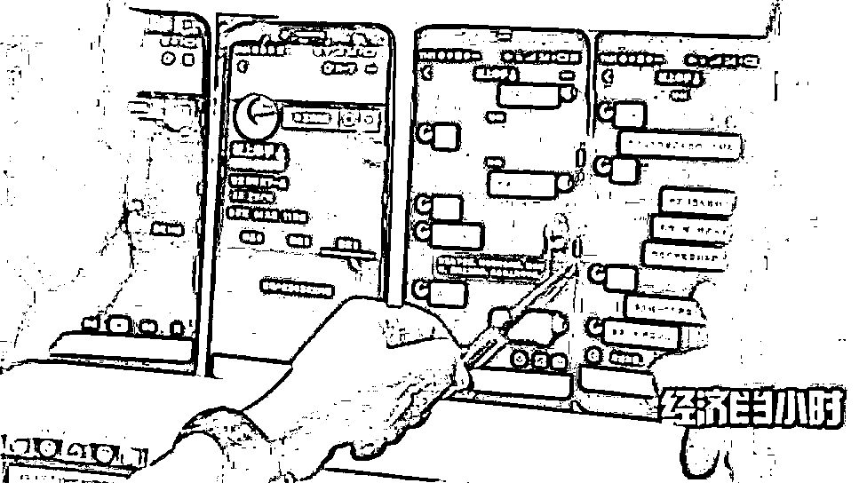
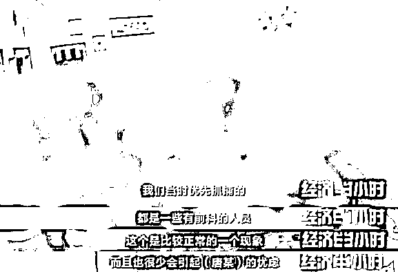

# 暗语藏“毒”！这些短视频竟在传递吸贩毒暗号！

> 原文：[`mp.weixin.qq.com/s?__biz=MzIyMDYwMTk0Mw==&mid=2247520715&idx=4&sn=e64a7e72f002107c9b234a3b98b98414&chksm=97cb5af3a0bcd3e5b31319bc06a93bdd788a12ac1c5bf2abdeb2392b47ea56350a204cc6a4b6&scene=27#wechat_redirect`](http://mp.weixin.qq.com/s?__biz=MzIyMDYwMTk0Mw==&mid=2247520715&idx=4&sn=e64a7e72f002107c9b234a3b98b98414&chksm=97cb5af3a0bcd3e5b31319bc06a93bdd788a12ac1c5bf2abdeb2392b47ea56350a204cc6a4b6&scene=27#wechat_redirect)

提起蓝精灵，人们往往最先想到的是动画片《蓝精灵》中那些活泼可爱的卡通形象。但你可能不知道，蓝精灵也是一种新型毒品的名称。

**“蓝精灵”竟是毒品 警方破获 17000 粒大案**

[`mp.weixin.qq.com/mp/readtemplate?t=pages/video_player_tmpl&action=mpvideo&auto=0&vid=wxv_2045738257354653702`](https://mp.weixin.qq.com/mp/readtemplate?t=pages/video_player_tmpl&action=mpvideo&auto=0&vid=wxv_2045738257354653702)

△央视财经《经济半小时》栏目视频

2020 年 7 月 21 日，吉林省梅河口市公安局禁毒大队在一次查缉行动中，查获 17000 多粒淡蓝色药片。经检验，这些淡蓝色的小药片是被列为第三代新型毒品的“蓝精灵”。

所谓“新型毒品”，是相对鸦片、海洛因这一类传统麻醉毒品而言的。鸦片、海洛因主要取材于天然植物，新型毒品是以化学合成为主的一类精神药品，它直接作用于人的中枢神经系统，有的有兴奋作用、有的有致幻作用，也有的有中枢抑制作用。

新型毒品大多为片剂或粉末，吸食者多采用口服或鼻吸式，具有较强的隐蔽性。

被查获的这一万七千多粒“蓝精灵”是如何进入警方视线的呢？2019 年 11 月，长春海关缉私局查获一个从境外寄来的可疑包裹，收件人为于某，包裹没有填写寄件人。经鉴定，包裹内的药片含有国内管制的新精神类物质。

通过于某，办案人员锁定了一个网名叫“黄药师”的代购。经过深入调查，民警锁定了“黄药师”的真实身份。刘某梅，辽宁省调兵山市人，现居境外某国，长期向国内非法销售各类违禁药品。

仔细梳理了刘某梅的社会关系后，四名与刘某梅联系密切的可疑人员进入民警的视线：刘某梅的弟弟刘某李，同乡冯某、惠某，以及辽宁省阜新市的王某。

当有买家购买“蓝精灵”时，刘某梅就会通知弟弟刘某李把“蓝精灵”从调兵山市寄到北海市的仓库，再由冯某和惠某寄给买家。

就在警方准备抓捕前夕，广西北海的冯某却突然开车去了深圳，原来是要准备在深圳重新开辟一个网点。

在掌握了多方嫌疑人的行踪之后，2020 年 7 月 21 日上午，专案组对相关嫌疑人实施了抓捕。在广西北海的药品仓库里，民警顺利将惠某抓捕归案。

刘某李在辽宁省调兵山市的家中落网。在他的车内发现了大量“蓝精灵”。

2020 年 12 月 29 日，吉林省梅河口市人民法院作出一审判决，刘某李因贩卖毒品罪，被判处有期徒刑两年，冯某、惠某、王某三人因非法经营罪，被判处有期徒刑十个月到两年不等。藏匿在境外的刘某梅已被梅河口警方上网追逃。

**短视频暗藏玄机 竟然在发送吸毒暗号**

[`mp.weixin.qq.com/mp/readtemplate?t=pages/video_player_tmpl&action=mpvideo&auto=0&vid=wxv_2045738594090156034`](https://mp.weixin.qq.com/mp/readtemplate?t=pages/video_player_tmpl&action=mpvideo&auto=0&vid=wxv_2045738594090156034)

△央视财经《经济半小时》栏目视频

2019 年 12 月 19 日傍晚，佛山警方抓获一名涉毒嫌疑人李某宝。

在社交媒体平台上，李某宝上家的昵称是“板上牵手”，这个人一共发布了十多条视频，有 28 个粉丝。这些视频以拍摄手的部分动作为主，多以盘子、瓜子、打火机等作为道具，并配有快节奏的音乐，普通人可能看不出这些动作的含义，但吸毒人员和缉毒民警，却可以一眼看透拍摄者的意图。

民警判断，“板上牵手”正是通过这种“视频暗语”的方式传递吸贩毒的信息。

据李某宝交代，通过近一周的交流，他取得了“板上牵手”的信任，通过快递，购买了毒品。在被民警抓获之前，他总共从“板上牵手”那里购买了两次毒品，就藏在独立包装的槟榔包装袋里。

经过警方仔细排查，嫌疑人“板上牵手”的真实身份终于得到确认。唐某，湖南永州东安人，33 岁，有吸毒前科。

专案组民警又从快递公司调取了唐某近一年收发快递的记录，一个庞大的涉毒网络显现出来。

 由于涉案人员多，辐射范围广，专案组决定，一边侦查取证，一边抓捕审讯，采取先打下线再打上线的方式，进行收网。

专案组民警联合湖南永州警方，在藏毒的地方守株待兔，陆续抓捕了二十名购买毒品的嫌疑人。

2020 年 3 月初，专案组民警发现，唐某在社交媒体平台上的动态出现了异常。他的那些视频开始删除，警方判断唐某应该是有所警觉。2020 年 3 月 19 日，专案组民警迅速抓捕了正在吸食毒品的唐某。

在唐某的住处，当场缴获正在包装的槟榔快递三十多个，内含冰毒约 60 克。此后，警方通过这个网络成功抓获了 205 人，涉及 27 个省市，起获以冰毒为主的毒品 4 公斤左右。

来源：央视财经（ID：cctvyscj）

← 向右滑动与灰产圈互动交流 →

