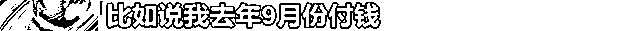
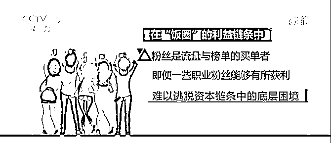
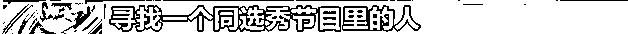

# 起底疯狂“饭圈”

> 原文：[`mp.weixin.qq.com/s?__biz=MzIyMDYwMTk0Mw==&mid=2247520715&idx=5&sn=02976ce8fcc6b1dd5b935264f8f087a2&chksm=97cb5af3a0bcd3e56a06012f8dd579468966e02fe763663404132f66c40b2b1d43c53ac622e8&scene=27#wechat_redirect`](http://mp.weixin.qq.com/s?__biz=MzIyMDYwMTk0Mw==&mid=2247520715&idx=5&sn=02976ce8fcc6b1dd5b935264f8f087a2&chksm=97cb5af3a0bcd3e56a06012f8dd579468966e02fe763663404132f66c40b2b1d43c53ac622e8&scene=27#wechat_redirect)

不久前 

北京市朝阳区人民检察院依法

对曾是一线明星的吴某凡批准逮捕

在吴某凡这类“顶流”背后

还有一个疯狂的“饭圈”

当吴某凡被逮捕后 

**他的“饭圈”粉丝频发“出格”言论**

**欲让劣迹艺人躲避惩罚**

但畸形的“饭圈”不只是粉丝的“秀场” 

“饭圈”的“奇闻异事”也不止一桩 

**明星本人、经纪公司** 

**营销平台和粉丝群体** 

一起制造出了各种“饭圈乱象”

下面待小央为你捋一捋

“饭圈”到底是个啥

**“饭圈”是个什么圈** 

**学术点说** 

**它是一个这样的存在↓**

****

**年龄构成是这样的↓** 

****

**内部组织架构清晰**

**有明确的等级制度↓** 

****

****

**“粉头”经常去接机** 

**在偶像的代言上花费较高** 

**可以拍到很多偶像的照片** 

****更有机会和明星本人或者明星的工作室****

****直接联系****

****得到更多的明星个人信息****

****“粉头”的经济学****

****等级制度必然造成不平等****

****“粉头”通过提供明星的最新信息****

****吸引普通粉丝****

****增加粉丝黏度****

****逐渐形成“后援会”这样的组织****

****掌握话语权****

******部分有话语权的“粉头”们****** 

******既稳定着“饭圈”秩序******

******又保证着“统治集团”的利益******

****他们最擅长“卖惨”、“虐粉”话术****

****让普通粉丝心甘情愿为偶像付出↓****

********

********

********

********

********

****诱导底层粉丝集资****

****鼓吹重复消费****

******利用粉丝对偶像的喜爱******

******反向“圈钱”******

********

********

********

********

********

********

********

********

****今年三月开播的某选秀节目****

****决赛圈前几名选手的集资数额****

****都是千万级别****

********

****募集的资金****

****往往由后援会的几位高级成员****

****直接管理****

****然而****

****由于大额集资缺乏监管****

****部分“粉头”卷钱跑路现象时有发生****

********

****后援会有时也会开发一些明星的应援产品****

****这些周边产品的售价****

****远超成本价****

****“粉头”就可从中获利****

********

********

********

********

********

********

****在利益的推动下**** 

****“脂粉”出现了**** 

****顾名思义**** 

****“脂粉”就是职业粉丝****

****一般默认为明星工作室的某一个员工**** 

****或者是经纪公司雇佣的“水军”****

********

******“脂粉”的一大职能是引导“饭圈”的舆论******

****操控底层粉丝****

****扮演经纪公司的免费水军****

****还不断给底层粉丝洗脑****

****劝导消费****

****向小粉丝灌输一种****

******“对偶像的爱必须用金钱来衡量”的价值观******

********

********

********

****“脂粉”常见话术。****

******资本借势“饭圈”******

******然而****** 

******即使“粉头”在“饭圈”中混成了“人上人”****** 

******也难以逃脱****** 

******资本链条中的底层困境******

************

******随着社交媒体的兴起******

********粉丝社群的传播能力和消费能力********

********也成了一种产品******** 

********可以置换资本和创造经济价值********

******换言之******

******粉丝的行为可以造就明星******

******“饭圈”创造的价值吸引来了资本******

************

************

************

******近年来火爆的“选秀”综艺******

******就是粉丝“造星“的工厂******

******早在 2004 年的“XX 女声”时期******

******就有短信投票、电话投票等******

******用虚拟物品给偶像“打投”的操作******

******魔幻的是****** 

******虚拟物品如今换成了乳制品饮料****** 

********资本成了“饭圈乱象”的推手********

********在平台和品牌方的鼓动之下********

********粉丝疯狂“氪金”买奶********

********倾倒掉乳制品饮料本身********

********只留下瓶盖上的二维码给偶像“打投”******** 

************

******为了让偶像获得更好的“资源”******

******粉丝不得不展现自己的“经济实力”******

******以证明偶像的商业价值******

******而经纪公司、商业平台为了收割流量和利益****** 

******则大肆鼓励粉丝进行非理性的、大额的消费******

************

******一个愿打一个愿挨******

******花样繁多的“割韭菜”行为应运而生******

******比如****** 

******“饭圈”最流行的明星“电子刊”******

******其中主要内容是******

******明星相关的文字、照片******

******或者视音频******

********读者几乎都是明星的粉丝******** 

************

******经纪公司或者商业平台会给粉丝定下******

******一定数值的销售额******

******达到后****** 

******就会解锁一些明星的“福利”******

******比如独家采访或者签名照******

********为了刺激粉丝重复购买********

******他们会设下用户购买排行榜****** 

******或者找到“脂粉”卖惨带节奏****** 

************

******在经纪公司和商业平台看来******

******“电子刊”的购买力和阅读量******

******是明星的流量证和商业谈判筹码******

********“把流量摊开了摆在地上卖”********

********“卖得动就证明你家哥哥红”******** 

********“饭圈”互骂谁输了********

******资本为了收割利益在“饭圈”无孔不入****** 

******除了明晃晃的“割韭菜圈钱行为”******

********经纪公司和商业平台还不断********

********炒作话题甚至制造矛盾********

******明星绯闻、行内恩怨******

******衣着打扮、突发事故****** 

******都可以被设置为导火索****** 

********挑动不同粉丝群体间的“互撕”、骂战********

************

************

************

************

************

************

********经纪公司人为地制造话题******** 

********刺激、包装、打造********

********推出自己的摇钱树********

********商业平台配合明星突出人设******** 

********分一杯羹******** 

******受伤的******

******大概只有在网络最前沿******

******真情实感地“厮杀”的粉丝******

******一不小心******

******就会游走到违法的边缘******

************

******短时间炒作某一个艺人****** 

******推上“顶流”神坛****** 

******其实也和资本运作息息相关****** 

******一些明星艺人开工作室******

******工作室还没有什么作品****** 

******就通过资本市场上的一些操作******

******比如用高额价格收购工作室股权******

******再把股权装回上市公司****** 

******最后让资本市场买单******

********把资本游戏的所有风险********

********都嫁接到资本市场和中小股民身上********

************

******总结说来****** 

********形式多样的“饭圈”乱象背后********

********是“流量至上”畸形导向下的资本黑手********

********而粉丝的无底线追星********

********平台**和经纪公司**的趋利与纵容********

********明星本人对粉丝的引导缺失********

********都为这些乱象添了一把火********

******来源：央视网综合《东方时空》******************

******← 向右滑动与灰产圈互动交流 →******

************