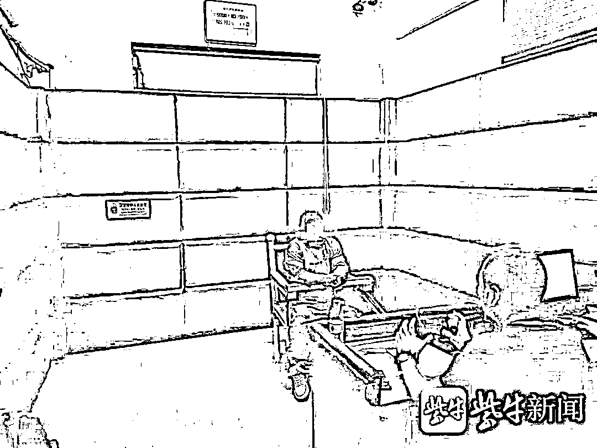

# 结婚两个月儿媳报警称被公公强奸，结果警方却把儿媳抓了

> 原文：[`mp.weixin.qq.com/s?__biz=MzIyMDYwMTk0Mw==&mid=2247520715&idx=6&sn=6d09a415d73a26aa1d5948fd83111998&chksm=97cb5af3a0bcd3e5b1317d5c6b82be0a7e01dcc898992e3de59a04c48262e1645d487628d41b&scene=27#wechat_redirect`](http://mp.weixin.qq.com/s?__biz=MzIyMDYwMTk0Mw==&mid=2247520715&idx=6&sn=6d09a415d73a26aa1d5948fd83111998&chksm=97cb5af3a0bcd3e5b1317d5c6b82be0a7e01dcc898992e3de59a04c48262e1645d487628d41b&scene=27#wechat_redirect)

刚刚领证两个月的儿媳妇报警称，自己被公公强奸了。警方接到报警后不但没有抓了老公公，而是把儿媳给抓了！这是咋回事？原来这名女子伙同“干爹”，以结婚的名义索取高额彩礼，然后再通过闹离婚的手段，来骗得彩礼。近日，建湖警方成功破获系列诈骗案件，犯罪嫌疑人张某等人绞尽脑汁寻找农村大龄单身男子，以结婚为由诈骗彩礼作案 3 起，涉案价值近 40 万元！

张某被抓获

喜事！30 岁的大龄儿子终遇良人

建湖县建阳镇居民孙某，今年刚满 30 岁，但在邻里相亲眼里，这个年龄再不结婚就要打光棍了。于是，刚过完年，他的父母就托人找到了媒人徐某，托其为儿子尽快找个媳妇。

没过几天，徐某介绍了连云港灌南籍女子张某。张某称自己 32 岁，为了打工来到盐城，之前忙着工作就耽误了，表示自己愿意和孙某好好过日子。但是根据家乡风俗，她的“叔叔”陈某提出要礼金 12.6 万元及“四金”首饰。看着漂亮懂事的张某，想着儿子的终身幸福，孙某的父母一咬牙，很爽气地给了礼金，还带着张某去金店花了 8 万元，买了戒指、项链、耳环、手镯等一整套首饰。

2 月初，他们便准备领结婚证了。可是，领证时，孙某惊讶地发现张某身份证上年龄已经 36 岁了。可是，此时礼金给了，亲戚通知了，骑虎难下的孙某只好硬着头皮结婚了。

介绍人徐某被抓获

荒唐！新娘婚后便闹离婚

令孙某没想到的是，刚结婚，张某就像变了个人似的，不仅天天和家人吵闹，还长期在外不回家，家里天天鸡飞狗跳，不得安生。更让孙某气愤的是，4 月初，张某竟然报警，称公公对其实施强奸。

警方调查时，孙某的父亲矢口否认，称是张某主动行为。后警方又了解到，张某竟然有四次婚史，且都为时不长。难道是一场有预谋的骗婚？

通过进一步调查，办案人员发现张某有三次婚姻均曾以各种借口索要价值不菲的彩礼。与男方相识和结婚的过程惊人的相似，都是由其“干爹”陈某或其熟人徐某介绍到兴化、建湖等地相亲、协商、给彩礼，然后结婚。

“干爹”陈某被抓获

落网！职业新娘供出骗婚内幕

8 月下旬，建湖警方相继在盐城响水、阜宁抓获犯罪嫌疑人张某、徐某、陈某，三人对骗婚的行为供认不讳。

据张某交代，2013 年年底，她第一次婚姻离婚后，认识了“干爹”陈某。由于没有经济来源，便在陈某的撺掇下，开始了“骗婚”生涯。陈某对外自称是张某的“叔叔”，负责物色对象，“培训”张某相亲如何说话、婚后如何快速脱身。在陈某的牵线搭桥下，张某先后“嫁”给兴化籍男子李某、王某，共索要礼金 20 余万元。

据办案民警介绍：婚后，张某通过吵闹等方式达到快速离婚的目的。但张某发现，通过这种手段离婚都不可避免要退还少许礼金，便想让自己置于“受害者”的角度进行离婚。于是这一次主动与公公发生关系后，准备报假警，达到不退礼金的目的，没想到弄巧成拙。

警方介绍，农村地区骗婚案件并不鲜见。往往是以结婚为幌子，利用婚姻的方式索要见面礼、介绍费、结婚彩礼诈骗受害者钱财，然后以各种理由“退婚”、寻机逃离，最终达到诈骗钱财的目的。

建湖警方提醒，婚姻诈骗是个“美丽”的陷阱，尤其是处在急于想结婚而又苦于找不到对象阶段的男女要引起注意，并加强防范，遇到“天上掉下来的好媳妇”，一定要查明其身份、家庭、住址等情况。

来源：瓜尔佳，反诈骗先锋

← 向右滑动与灰产圈互动交流 →

