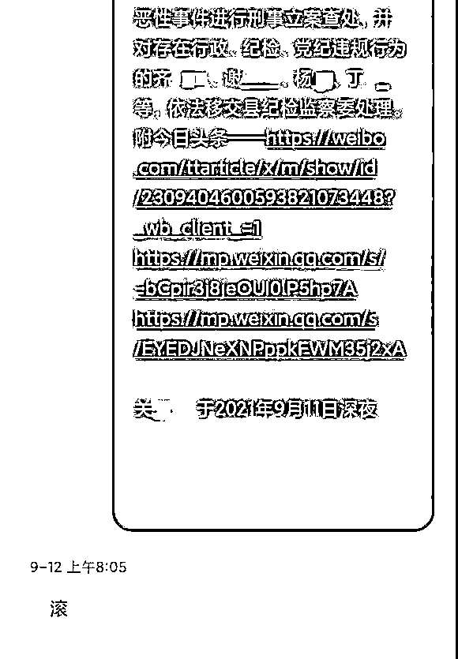

# 回短信叫人“滚”的官员被停职

> 原文：[`mp.weixin.qq.com/s?__biz=MzIyMDYwMTk0Mw==&mid=2247520770&idx=2&sn=01ad0bbffb580338ba3e86917621b1fb&chksm=97cb593aa0bcd02cdeecb4e6c389c413037da1819a90591e032c6352df6bde5ac6ff83726e45&scene=27#wechat_redirect`](http://mp.weixin.qq.com/s?__biz=MzIyMDYwMTk0Mw==&mid=2247520770&idx=2&sn=01ad0bbffb580338ba3e86917621b1fb&chksm=97cb593aa0bcd02cdeecb4e6c389c413037da1819a90591e032c6352df6bde5ac6ff83726e45&scene=27#wechat_redirect)

据悉，“平山县委政法委书记对待群众反映问题简单粗暴回复”问题发生后，石家庄市委高度重视。

[**群众发短信反映情况，平山政法委书记回复“滚”**](http://mp.weixin.qq.com/s?__biz=MzIyMDYwMTk0Mw==&mid=2247520664&idx=1&sn=1e74ed5d081fc0a0697f611a8326738f&chksm=97cb5aa0a0bcd3b6adb5bdc188aa60ae36fe53b6d8b9cec4c9565444bff57f7cc93a1bff6fb6&scene=21#wechat_redirect)。

**9 月 14 日上午，石家庄市委对事件当事人平山县委常委、政法委书记尹惠强作出停职检查处理。**

同时，市委决定，成立两个调查组，由市委组织部牵头，市纪委监委、市委政法委参加，对尹惠强存在的问题进行深入调查；由市委政法委牵头，市公安局、市法院、市检察院参加，对信访人关翠敏反映的信访问题进行全面调查。相关调查结果及处理意见将及时向社会公布，回应社会关切。

公开信息显示，尹惠强曾在元氏县工作，任县委宣传部常务副部长、东张乡党委书记等职。今年 7 月任平山县委常委、政法委书记。

事件回顾

9 月 13 日上午，网民反映平山县委政法委书记尹惠强在回复手机短信时，存在言语不当的行为。平山县委高度重视，立即进行了调查。

经查，9 月 12 日凌晨 1:38，平山县一群众给尹惠强发送手机短信，尹惠强收到陌生人手机短信后，只看到一个网址链接，误以为是电信诈骗信息，于是进行了不当回复。

了解该情况后，平山县第一时间与反映人取得联系，进行了解释说明。

13 日中午，平山县委召开常委会，对尹惠强同志进行了严肃批评，责令其作出深刻检查；对反映人的诉求责成相关部门进行调查核实，依法依规处置。 

来源：央视网

← 向右滑动与灰产圈互动交流 →

