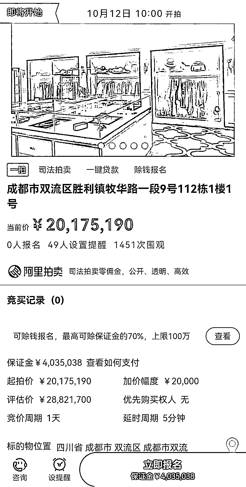
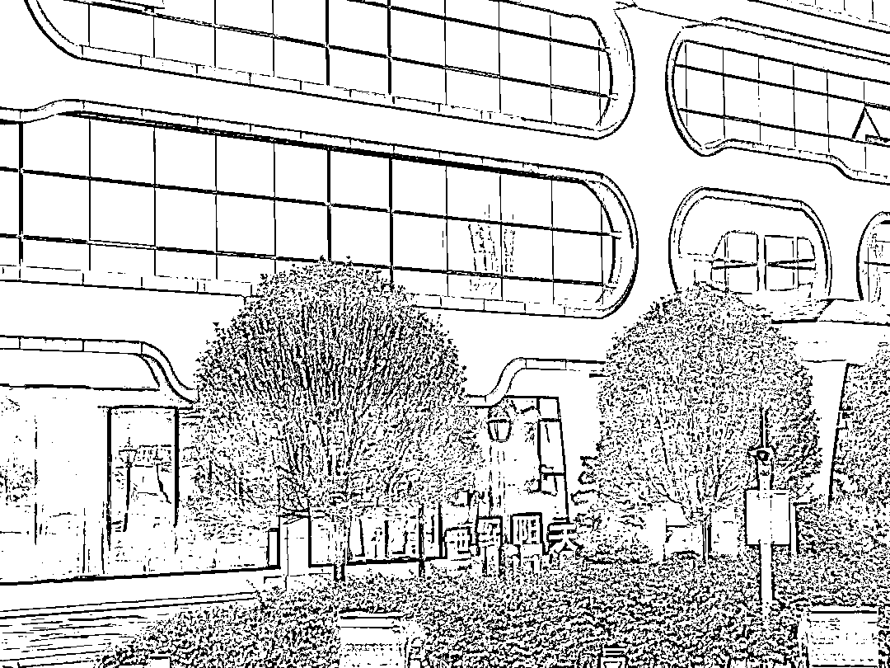
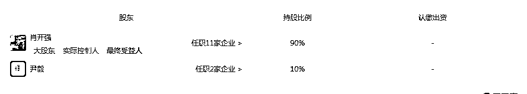
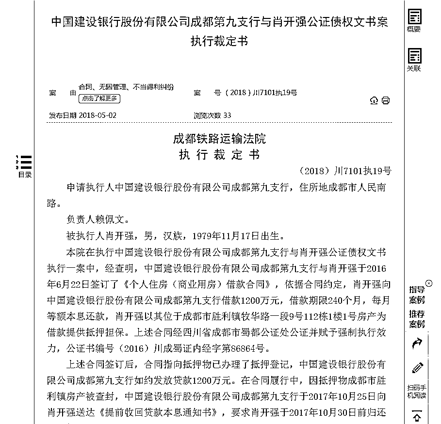

# 2000 万豪宅拍卖，房东系“网络赌场大佬”肖开强，曾买 3 万个比特币洗钱

> 原文：[`mp.weixin.qq.com/s?__biz=MzIyMDYwMTk0Mw==&mid=2247520770&idx=3&sn=edbdbc05006498702a747d68dd937e59&chksm=97cb593aa0bcd02c81a4ccf01ad3a13f9a2f76cce39cb98905f6d57d7360312bafbd223f2d45&scene=27#wechat_redirect`](http://mp.weixin.qq.com/s?__biz=MzIyMDYwMTk0Mw==&mid=2247520770&idx=3&sn=edbdbc05006498702a747d68dd937e59&chksm=97cb593aa0bcd02c81a4ccf01ad3a13f9a2f76cce39cb98905f6d57d7360312bafbd223f2d45&scene=27#wechat_redirect)

“网络赌场大佬”肖开强又一次成为焦点。

红星资本局注意到，成都市铁路运输法院将于 2021 年 10 月 12 日 10 时公开拍卖成都双流区胜利镇牧华路一段 9 号 112 栋 1 楼 1 号房屋，位于牧马山蔚蓝卡地亚小区的该房产面积 875.88 平方米，拍卖价超 2017 万元，保证金 403 万元。截至发稿，该拍卖尚无一人报名。

截图自阿里拍卖

据阿里拍卖披露的信息，该处房产位于牧马山蔚蓝卡地亚，实际评估价达 2882 万余元。

不过，相比于房产本身近 3000 万的价值，更吸引眼球的是，背后房主肖开强私设游戏赌场牟利 11 亿。此外，目前价值约 4.7 万美元/个的比特币也曾作为肖开强洗钱的工具。判决书显示，肖开强靠非法资产购买比特币 32580 个，共花费近 3 亿元。

**9 月 15 日，红星资本局来到这起网络游戏赌博案背后的世纪阳天科技有限公司（以下简称“世纪阳天”）所在地，曾经的网络游戏赌场源头，已经成为了主打教育软件开发的公司。**

**操控网络赌博** 

**非法获利超过 11 亿元**

“罪与非罪就是一层纸”。

据侦办该案件的警官表述，“如果玩家只是购买和消耗游戏币，就不是犯罪，如果玩家的游戏币有渠道可以换回钱，就是赌博平台。”

据媒体报道，肖开强 22 岁大学毕业后开始创业；2004 年，注册成立宜宾在线科技有限公司，决定向软件研发与系统集成、校园即时通讯方向发展；2005 年，这家公司自主研发的网络游戏平台“宜宾在线游戏中心”上线，主打棋牌游戏。

公开资料显示，肖开强曾被评为全国农村青年致富带头人、宜宾市优秀青年企业家。

2009 年 3 月，肖开强注册成立独资子公司四川雄申计算机科技有限公司；2009 年 9 月 14 日，又注册成立世纪阳天，这也成为肖开强犯罪的开端。

2015 年 9 月，肖开强正式上线网络游戏平台，最初被叫做“167 棋牌”或“761 棋牌”。通过后台控制输赢率的方式，让玩家不至于输得太多放弃游戏，也不要赢得太多让平台少赚，并且人工分配更改游戏币数量。

为了快速获利，又要同时避免直接将游戏币与人民币进行兑换，以隐藏犯罪性质，**肖开强找到平台外的第三方提供结算服务，用以让游戏玩家兑换人民币。但事实上，该第三方平台参与平台分股分红，构成共同犯罪主体。**

这也意味着游戏玩家从买币到游戏、兑换，都是肖开强及其公司在背后统一操控。

此外，为隐匿资金流向，肖开强等人还利用他人身份证在黑市购买比特币，用以分红。据判决书，肖开强归案后，在看守所提出书面申请，表示愿意配合变卖掉其比特币钱包内 32580 个比特币为人民币，退出非法获利。这些比特币购买时，共花费近 3 亿元，变卖后得 7.3 亿元，这些钱作为赃款和孳息被全部扣押。

**据判决书，被公安查获后，肖开强控制的游戏平台累计净销售游戏币 227172.2 亿个，非法获利达 11.3842 亿元。**

**涉案“赌场”变教育软件公司？** 

**肖开强仍是实控人**

9 月 15 日，红星资本局来到世纪阳天所在地，该公司工作人员称，**公司目前是一家软件公司，主要从事教育板块内容，游戏内容也在做，公司运营正常。**

世纪阳天公司门口 红星资本局摄

对于具体的教育软件内容，上述工作人员称，**“就是主要做工具类教育软件，比如阅卷工具。”**

天眼查 APP 显示，世纪阳天是一家集互联网技术、系统集成、软件开发、网站建设及推广、多媒体制作、无线增值服务、网络资讯、游戏运营为一体的大型综合性公司。

其经营范围包括研发、销售计算机软硬件、计算机系统集成、动漫设计、销售电子产品等，2018 年 6 月 4 日之后新增技术进出口，货物进出口业务。

**值得一提的是，持股比例达 90%的肖开强目前仍是世纪阳天实控人，不过其在 2018 年 4 月 19 日被台州市公安局分别两次冻结 2700 万人民币，共计 5400 万人民币。**

据公开报道，肖开强和他的涉案员工于 2019 年 3 月 7 日在浙江省台州市椒江区人民法院接受审判。法院指出，由肖开强主导的网络赌博具有跨地域性、非接触性和隐蔽性等特点，该案件涉案金额也成为当时浙江省之首。

2019 年 5 月，该案一审宣判，8 名主犯被判定犯开设赌场罪，分别获刑三至五年，其中肖开强获刑五年，并处罚金 5000 万元。

**2000 万房产被拍卖** 

**系与银行借贷纠纷**

据报道，尽管被删除了服务器数据，此案难以准确评估涉赌金额，但根据不足五分之一的赢率推测，此案的网络赌博平台涉案金额恐在 50 亿元之上。

非法获利之后，肖开强购买比特币、房车、股票等，不过，上述房产被拍卖却系与银行的借贷纠纷。

中国裁判文书网显示，2016 年 6 月 22 日，肖开强与中国建设银行股份有限公司成都第九支行（以下简称“建行第九支行”）签订了《个人住房（商业用房）借款合同》，依据合同约定，**肖开强借款 1200 万元，借款期限 20 年，肖开强以一处房产为借款提供抵押担保。**

不过在合同履行中，建行第九支行以抵押物被查封为由，于 2017 年 10 月 25 日向肖开强送达《提前收回贷款本息通知书》，要求肖开强于 5 日内归还尚欠借款本金 11，544，111.42 元，利息 47，138.46 元，合计约 11，591，250 元。

2018 年 1 月，成都铁路运输法院作出裁定，要求肖开强支付建行第九支行的欠款和利息，并冻结查封他的财产等。不过公开信息显示，2018 年 6 月，法院终止本案执行。今年 8 月，法院再立案，恢复执行此案。

来源：红星资本局

← 向右滑动与灰产圈互动交流 →

