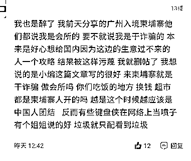

# 网投和诈骗不是所有在柬埔寨中国人的代名词！

> 原文：[`mp.weixin.qq.com/s?__biz=MzIyMDYwMTk0Mw==&mid=2247520770&idx=4&sn=c5dbe9b3196db1bd2a5f00035c9b993e&chksm=97cb593aa0bcd02c900d000d5f5267501b24679b7d65e7ca2cef4c4dc7647ca593fb6029b401&scene=27#wechat_redirect`](http://mp.weixin.qq.com/s?__biz=MzIyMDYwMTk0Mw==&mid=2247520770&idx=4&sn=c5dbe9b3196db1bd2a5f00035c9b993e&chksm=97cb593aa0bcd02c900d000d5f5267501b24679b7d65e7ca2cef4c4dc7647ca593fb6029b401&scene=27#wechat_redirect)

该公众号已被封禁

近年来，许多网络赌博、诈骗公司盘踞东南亚地区，大量中国人或因上当受骗，或出于经济原因自愿前往这些地方从事跨境犯罪活动。 

尤其柬埔寨，此前许多中国人前往从事网投、诈骗公司，恶性事件层出不穷，相关负面新闻铺天盖地，导致柬埔寨给人留下了坏印象，提到柬埔寨，许多人条件反射想到网投和诈骗。

随着国内警方对境外网投、诈骗持续高压打击，“一刀切”排查方式和无差别劝返，导致很多在柬正常经商务工的普通群众也被怀疑涉嫌从事跨境网络赌博和诈骗工作。

 “一刀切” 排查方式

 导致许多出入境柬埔寨的正经人无辜躺枪 

跨境网投、诈骗对中国公民进行招赌吸赌以及诈骗，导致许多国人深陷其中，中国公安部重拳出击严打此类违法犯罪活动。

柬埔寨作为跨境网投、诈骗重灾区之一，身处柬埔寨或曾到过柬埔寨的国人，都成了国内警方重点“调查”的对象。

全国各省警方通过电话、家访等形式，对有柬埔寨出入境记录的国人不断调查排问，甚至有些人直接被当作电信诈骗的嫌疑人。

一名已经回国三个多月的网友称，2020 年 11 月份曾有警察走访他家对其进行调查，当时他已经向警方表明自己在柬埔寨从事正当行业，原以为误解已消除，不会再被怀疑在柬从事黑灰产业。

然而，今年 8 月份他又收到警方“问候”，接通电话没说几句话，直接被问是不是在柬埔寨从事网络赌博诈骗工作，他只好无奈的再次解释当时在柬埔寨从事的是正当行业。

国家对跨境网赌、诈骗打击力度不断加大，警方对有柬埔寨出入境记录的人员调查次数也随之增加，被调查对象需要出具、填写的资料也越来繁杂。

一名同胞在柬埔寨 8 个月时间里，连续被“关心”了 4 次，而且需要填写的资料也越来越多。 

如，签证有效期、出境方式、境外国家城市、境外联系人及电话，甚至详细到工资发放方式、发放工资账号、接收工资账号等等。

金边另外一名从事建筑行业的同胞也突然被警方调查，被要求配合写了许多表格。

不单在柬埔寨从事正当行业的怀疑，一些赴柬人员直接被扣上“来做网投、诈骗”的帽子。

航班满员被扣上网投、诈骗帽子

近期，有网友发帖称，广州飞往金边的航班几乎满员，结果许多人不经思考，直接对乘客进行无差别攻击，称 90%的乘客都是过来柬埔寨从事网投和诈骗的。

航班上一名年轻女乘客在入境柬埔寨隔离后，发帖分享自己的入境攻略，结果被一些网络喷子叫菜农、会所女孩。

该名女乘客不得已追帖，澄清自己是旅行社工作人员，但因无法承受键盘侠恶毒的人身攻击，最后把帖子全部删掉。

当下，从柬埔寨回国确实很难，但是这时候赴柬的人员就一定是从事网投或诈骗的吗？

对不起

网投和诈骗并不是所有在柬中国人的代名词！

以国内现在的政策，警察在机场严控出境人员，赴柬人员被一一进行调查问话。

从工作性质、公司背景，再到工作环境等等，还要出示聊天记录、照片等相关证实材料。

网投、诈骗分子几乎没法逃过警方法眼过海关，所以正常出入境的人绝大部分是到柬埔寨从事正事的人员。

更何况，柬埔寨除了网投、菠菜，还有涵盖衣食住行的正规行业。如，酒店、房地产、互联网、电商、物流、工厂、建筑、餐饮、汇兑、商超等等。

许多中国人在各个领域中投资创业、经商务工，他们各司其职，为自己和家庭创造更好的生活而努力拼搏，同时也为广大在柬华人提供了更加便利的生活。

与国内相比，柬埔寨许多行业，无论是投资还是务工，收入比国内更高，通过正当途径、正当行业追求高收入、高回报的中国人大有人在。

况且，目前柬埔寨疫情趋缓，很多先前回国休假的人返柬复工；一些人回来柬埔寨，继续打理自己的事业和心血，再正常不过！

所以，对柬埔寨华人群体缺乏了解的人，请摘下有色眼镜，看看那些从事正当行业，努力奋斗的在柬中国人。

也请生活失意的喷子们，积点口德，不要对所有在柬中国人进行无差别攻击！因为，网投和诈骗并不是所有在柬中国人的代名词！

来源：柬埔寨头条

← 向右滑动与灰产圈互动交流 →

