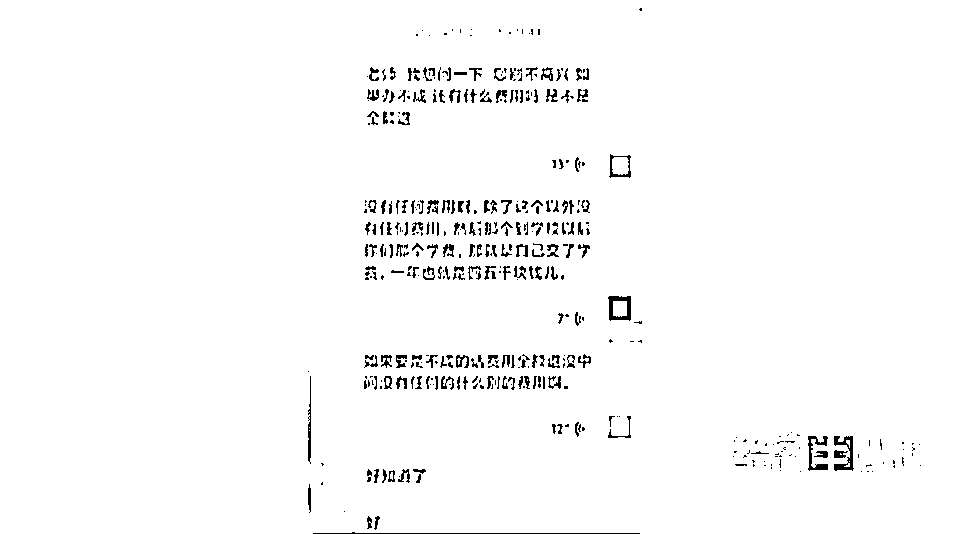
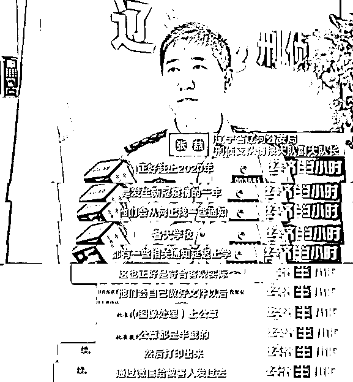
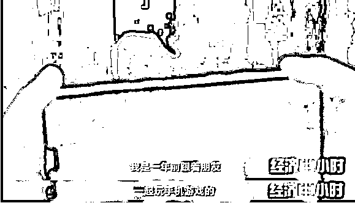
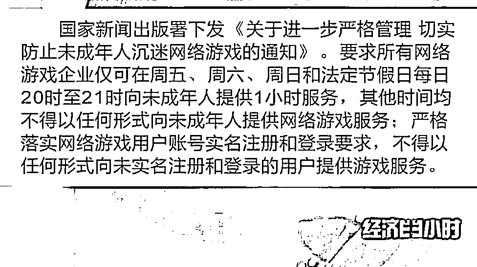

# 81 万元打水漂！没“考上”985，又错过专科录取，这个“特殊通道”不要走……

> 原文：[`mp.weixin.qq.com/s?__biz=MzIyMDYwMTk0Mw==&mid=2247520770&idx=5&sn=a93fc55d67c3066b2a2c4ba32acd2593&chksm=97cb593aa0bcd02cfac8e6f4e54cbc87d5b48e114460ce751a4569ca93e232deb2875ec62a8a&scene=27#wechat_redirect`](http://mp.weixin.qq.com/s?__biz=MzIyMDYwMTk0Mw==&mid=2247520770&idx=5&sn=a93fc55d67c3066b2a2c4ba32acd2593&chksm=97cb593aa0bcd02cfac8e6f4e54cbc87d5b48e114460ce751a4569ca93e232deb2875ec62a8a&scene=27#wechat_redirect)

2021 年 6 月，辽河市公安局接到报警，受害人刘先生称自己因孩子升学的事儿遭遇到了电信诈骗。曾经为他孩子补课的辅导班老师金某收取了刘先生 81 万元，称可以通过特殊渠道，花钱为他孩子办理大学破格录取。

[`mp.weixin.qq.com/mp/readtemplate?t=pages/video_player_tmpl&action=mpvideo&auto=0&vid=wxv_2047221749947105281`](https://mp.weixin.qq.com/mp/readtemplate?t=pages/video_player_tmpl&action=mpvideo&auto=0&vid=wxv_2047221749947105281)

△央视财经《经济半小时》栏目视频

这名所谓的“金老师”，和刘先生签订了一份协议，承诺若事情办不成，将全额返还费用。但后来事情没有办成，而金某只退还了 15 万元。无奈之下刘先生才选择了报警。

警方随后对此案展开了调查，通过调取金某的资金流向，警方发现此案背后另有玄机。

通过调查，警方发现这个团伙以“亲属在教育厅工作”“认识招办领导”“有内部指标”等名义，在骗取被害人信任后，对被害人实施诈骗，称“花钱就可以上大学，办不成全额退款”。学校越好，收费就越高。而被骗的家长不仅仅只有刘某一人，已经涉及 20 多人，而其中被骗数额最大的一笔，达到了 80 多万元。

顾先生的儿子，是 2019 年的高考考生。当时在朋友的介绍下，顾先生找到“金老师”帮儿子报志愿。因为考试分数并不理想，“金老师”的一番话，让顾先生心动了。

可是“金老师”所说的延边大学，一直都没有给顾先生的儿子下发通知书。一心想上好大学的顾先生甚至错过了南方某专科院校的录取通知书。直到今年，警方的一通电话打到顾先生这里，他才知道自己上当受骗了。

近两年的时间已经过去了，顾先生的儿子也错过了上大学最佳机会。据警方介绍，受骗的 20 多名家长，只有两人选择了报警，在长达两年多的时间里，考生和家长难道都没有对此事产生过任何怀疑吗？

为了防止更多家长上当受骗，辽宁警方在今年 5 月采取了收网行动，将犯罪嫌疑人抓获归案。事实上，越来越多的犯罪嫌疑人不仅仅将电信诈骗的魔掌伸向了学生家长，还伸向了未成年的孩子。

2021 年 6 月 12 日，辽宁省彰武县的王先生和妻子存在农村信用社的 29600 元钱突然不翼而飞了。夫妻俩每年种地只能收成一万多元，三万元就是一笔巨款。好端端存在银行的钱怎么会没有了呢？

王先生的儿子小龙平时爱玩一款手机游戏，这款游戏里的人物可以购买道具和装备，但要想得到这些道具和装备，必须花钱买。但对于家境一般的他来说，父母肯定不会同意，而正当小龙为买装备的事儿发愁的时候，突然收到游戏聊天窗口里的一条消息。

平时这些游戏皮肤都在几十甚至上百块钱，而这个人这次竟然要免费送给自己，为了让自己的游戏人物尽快穿上漂亮的皮肤和装备，小王没有多想，就把账号和密码告诉了这个陌生人。五分钟之后，他等待的游戏皮肤并没有到账，而手里的手机却开始不断地往外转钱。

由于此前这类电信诈骗案件，许多诈骗团伙都是藏匿在境外，他们诈骗得手后，很快会把钱从账户里转走，一旦赃款流向境外，再追回来的难度会很大。王先生报警及时，给警方赢得了时间。

防范手游电信防诈骗，防止未成年人沉迷游戏是关键。近日，国家新闻出版署下发通知，对于未成年人的游戏时间给出了规定。

公安机关也提醒家长，要保护好自己的银行卡、支付宝、微信等密码，不要轻易透露给他人，更不要让孩子们掌握这些隐私信息。

来源：央视财经（ID：cctvyscj）

← 向右滑动与灰产圈互动交流 →

