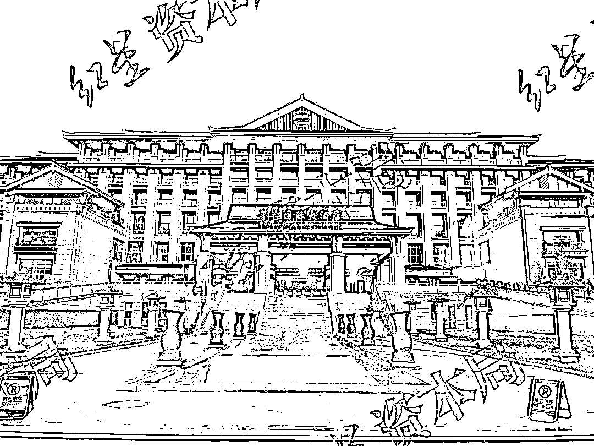
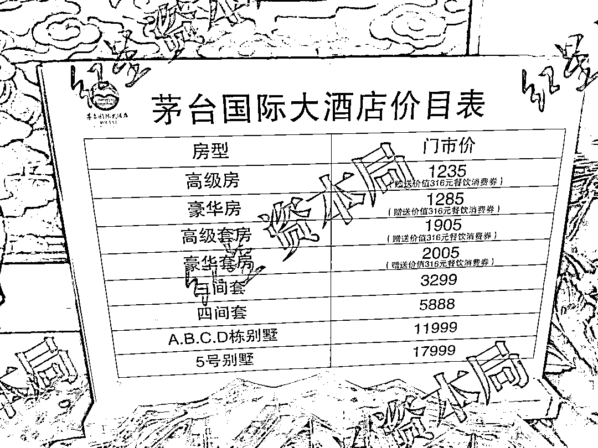
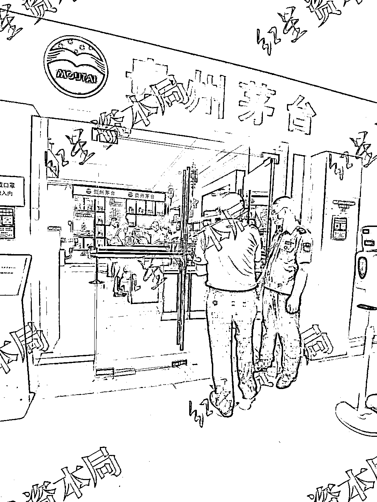
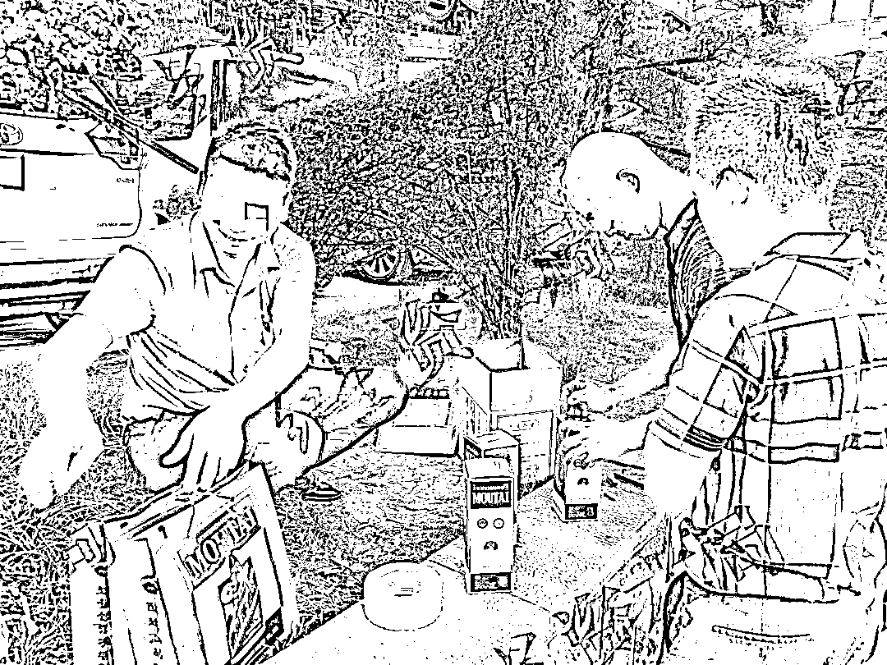
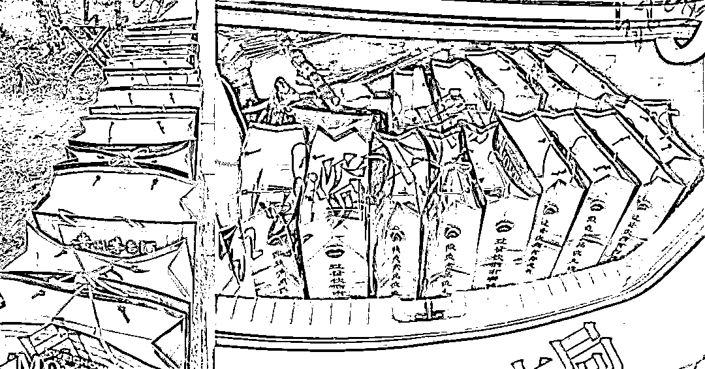
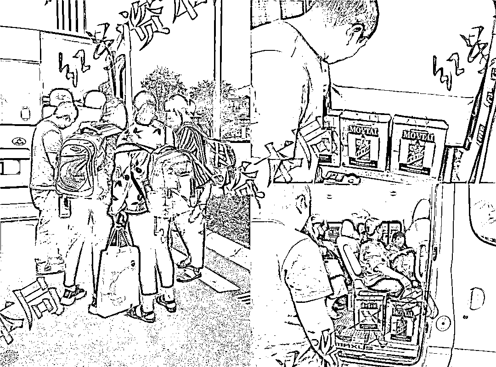
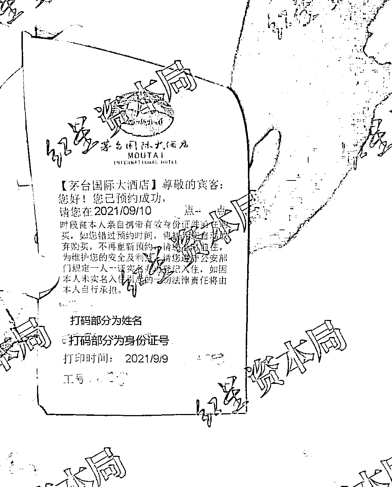
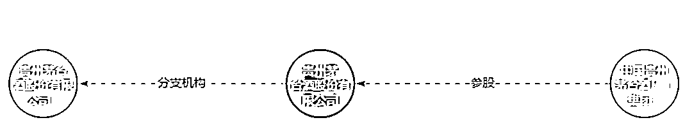
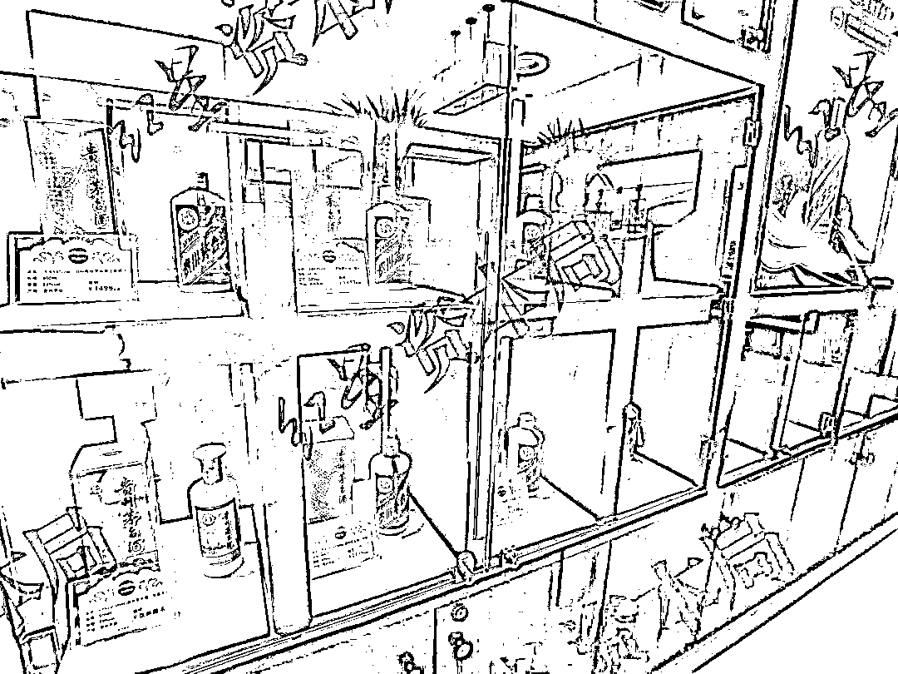
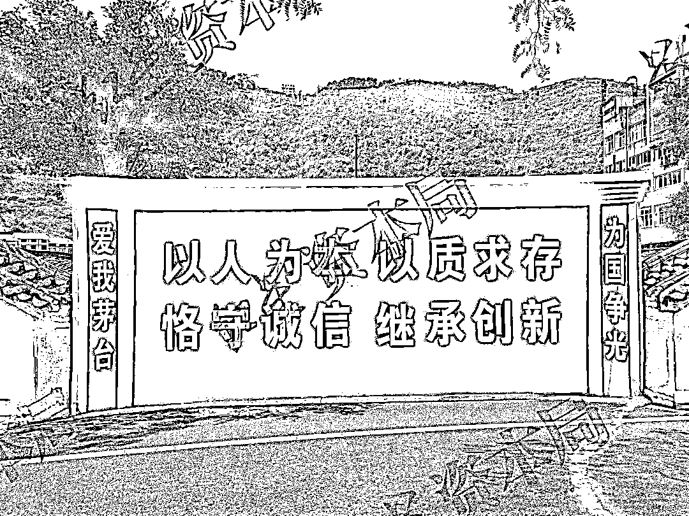

# 钱与权的交易？贵州茅台国际大酒店的秘密：睡着赚钱

> 原文：[`mp.weixin.qq.com/s?__biz=MzIyMDYwMTk0Mw==&mid=2247520824&idx=1&sn=3fcc60927dc45a7ca91dc142b177dbce&chksm=97cb5900a0bcd016e3f5b98c491d15b2c7ed24f89df12728e1a34b1fda77110ee7cac4ac78e1&scene=27#wechat_redirect`](http://mp.weixin.qq.com/s?__biz=MzIyMDYwMTk0Mw==&mid=2247520824&idx=1&sn=3fcc60927dc45a7ca91dc142b177dbce&chksm=97cb5900a0bcd016e3f5b98c491d15b2c7ed24f89df12728e1a34b1fda77110ee7cac4ac78e1&scene=27#wechat_redirect)

如果你去茅台镇旅游，多半会有朋友托你帮忙带两瓶原价的 53 度飞天茅台。

9 月 12 日，我们**走访发现，现在茅台镇只剩下一个可以原价购买的点位——茅台国际大酒店。而这个点位的购买门槛是，必须是酒店的入住客人。**

在这家酒店，价格最低的房型是 1235 元/天的高级房，而且等着入住的人多得很，即便你铁了心要花这笔钱办理入住，也未必排得上号。

酒店火爆的背后，还隐藏着这样的交易——**如果想要走捷径入住酒店，首先得给出 800 元-1200 元的“好处费”，这笔钱或流向酒店员工，甚至茅台公司的“领导”等**。

我们注意到，茅台国际大酒店是贵州茅台（600519.SH）的分支机构。贵州茅台 2021 年中报显示，今年上半年，以酒店收入为主的“其他收入”项，约为 7743 万元。

**茅台镇难买原价飞天茅台**

**全镇仅一个点位，在酒店“睡着赚钱”**

****

**走在茅台镇的街道上，呼吸之间都可以闻到浓重的酒糟发酵的味道。**

**茅台镇是贵州省遵义市仁怀市的下辖镇，这里是酱酒的圣地，也被誉为“中国第一酒镇”。不仅如此，这里还孕育出了总市值超过 2 万亿元的上市公司贵州茅台。**

**需要说明的是，**贵州茅台生产的酒类产品在流通过程中实际上形成了“价格双轨制”**。以 53°飞天茅台酒（以下简称“飞天茅台”）为例，其终端指导价是 1499 元/瓶，但市场价格长期在 3000 元/瓶徘徊。**

**而随着贵州茅台对销售渠道的管控加严，茅台镇曾一度成为全国各地黄牛们的聚集地。**

**有黄牛告诉我们，过去，飞天茅台在本地的放量渠道很多，“运气好的话，去一次茅台镇可以原价买 8 瓶。”**

**9 月 9 日-12 日，我们在茅台镇走访时向多方确认，截至今年年中，茅台镇原有两个点位可以原价购买茅台酒，其中一个是中国酒文化城（景区），因疫情管控暂时关闭，景区内的专卖店也暂停营业。**

**因此，茅台镇现在只剩下一个可以原价购买的点位——茅台国际大酒店。**如果想要在这个点位原价购买飞天茅台，必须入住这家酒店。****

****

**茅台国际大酒店**

**我们了解到，**该酒店的房型分为 8 种，价格在 1235 元/天到 17999 元/天不等。按照该酒店的相关规定，入住的客人以人头计算，每人每天可以原价购买一瓶飞天茅台。****

**据茅台国际大酒店的官网，其共有房间 275 间。假设每个房间入住 2 个人，每人可以购买一瓶飞天茅台，也就是说每天大约会有 550 瓶原价的飞天茅台通过酒店流出。**

**“供应没有限量，有多少个人住，就有多少瓶酒来卖。”酒店内的专卖店工作人员对我们说。**

****

**茅台国际大酒店的价目表**

**假设两个人一起入住一间价格最低的 1235 元/天的高级房，以原价 1499 元购买两瓶飞天茅台，再以 3000 元/瓶的价格转手卖出去，刨掉房费，一天仍能赚到 1767 元。**

****“入住就是赚钱，真的是睡着赚钱。”一名茅台镇当地的居民向我们感慨。****

****贵州当地人不允许入住买酒****

****只接受电话预订，电话长期占线****

********

******“睡着赚钱”听上去很诱人，但想要成为这家酒店的客人并不是一件容易的事，需要先过五关斩六将。以携程为例，即使将时间往后推一个月，页面仍显示：所有房间都是订满状态，无法下单。******

******不过，**茅台国际大酒店的前台工作人员告诉我们，“网上只有图片，没有放房，我们不在网上卖的，只能打电话预订。”********

****我们从工作人员处了解到，**预订酒店房间、购买飞天茅台有诸多限制：******

*******只接受电话预订，且只能预订 3 天内的房间；*******

*******贵州省当地人即便入住该酒店也不能买酒；*******

*******哪怕是住店客人，一个月也最多只能买 6 瓶酒。*******

****据上述工作人员介绍，接预订电话人员的工作时间是 08：00-21：30。9 月 12 日，我们在该时段内先后**拨打了 11 次电话，但始终处于占线状态，无法接通**。****

****“打电话的人比较多，一到那个时间，就会有成百上千个电话打进来，不一定能接到你的。有时候可能还要跟客人解释一些东西，一个电话就要磨蹭 10 多分钟。”上述工作人员说。****

********

****茅台国际大酒店内的贵州茅台专卖店，人多的时段有保安在旁查看相关证明****

****在走访的过程中，我们发现，与茅台国际大酒店相隔一条马路的对面，有一处露天停车场，这里是黄牛们的聚集地。****

****这些黄牛不仅向已经入住的客人高价收购飞天茅台，也向无法入住、失落而归的旅客兜售茅台。****

****有**黄牛告诉我们，他们近期向住店客人开出的收购价在 2800 元-3000 元不等，但售价和市场价差不多**，并不会因为这里是茅台镇而变得便宜。****

********

****茅台国际大酒店对面露天停车场的黄牛们****

****“有的人住我们酒店买了酒，不是拿回家收藏或者喝，而是直接卖给门口的黄牛。价格翻一倍，有的人是经不起这样的诱惑的。”有酒店的工作人员对我们说。****

****奇怪的团体“作案”：****

****一群村民提着茅台上了同一辆车****

********

****在茅台国际大酒店对面的露天停车场，我们添加了一名黄牛向明贵（化名）的微信。他称，自己长期在这个露天停车场附近活动。****

****翻看他的朋友圈，可以发现有多条相似的内容，“出大酒店带票散飞（指散装飞天茅台），有需要的老总看过来。”****

****以他在 9 月 12 日、14 日的朋友圈为例，从晒出的图片来看，他 12 日从茅台国际大酒店带出 20-28 瓶飞天茅台，14 日带出 15-24 瓶。****

******这么多从酒店流出的酒，是怎么快速集中到一个人手上的？**对于我们的疑惑，向明贵并没有正面回答。****

********

****向明贵朋友圈发出的 12 日、14 日照片（拼图）****

****9 月 10 日中午，我们注意到，至少有 6 名打扮相似的女性先后从茅台国际大酒店的大堂出来。****

****她们三两成行，几乎每个人都背着笨重的大书包，说的方言和茅台镇当地的方言相似，每人都手提贵州茅台酒的袋子（内有飞天茅台）。****

****在接受我们询问时，**她们称都是当地人，酒是帮公司的“老板”买的，来住酒店就是为了买飞天茅台，酒店的价格、预订方式她们都不清楚，是“老板”一起订的。******

****而后，这些人先后登上一辆面包车，装酒的袋子被放到车尾或车座附近。****

********

****从茅台国际大酒店走出来的多个人手提贵州茅台酒袋上了同一辆车****

******按照茅台国际大酒店的规定，贵州省的当地人并不能入住酒店，如果这群女性真的都是当地人，为什么她们能成功入住并且买到飞天茅台？******

****“这边有专门做这种生意的，请人住酒店、回收酒，一般是拿外地身份证预订房间，请当地年纪比较大的村民入住，大约会给这些村民 100 元左右。”在当地工作、生活近 10 年的吕思（化名）告诉我们。****

****我们还从另一名住店客人——李二姐（化名）的身上找到了另一种可能性。李二姐称，**虽然她长期在贵州省遵义市生活，但她身份证上的住址仍然是老家重庆，可以顺利入住酒店。******

****在遇到李二姐时，她正在前台咨询：住店客人一个月只能买 6 瓶酒。她上个月 X 号入住酒店、连住 5 天并买酒，那她下一次可以再买酒的时间具体是哪一天？****

****“**那个预约电话有时候的确是打不通。**”李二姐告诉我们，她是通过电话预订的酒店房间，上个月住了 5 天，购买的酒都给了自己的孩子。****

********

****住店客人需要到前台进行预约，在某一时段前往买酒。小票由受访的住店客人提供****

******“没法讲”的预订方式******

******工作人员：领导帮订，担保客人不是黄牛******

************

******9 月 9 日-12 日，我们随机在茅台国际大酒店内截停了 4 批住店客人，每批约 2-5 人（同行者），并询问他们订酒店房间的方式。******

******其中，**只有一批住店客人表示，她们的房间是通过电话预订的，“电话是很难打通，看运气。”********

****另有两批住店客人先后告诉我们，他们所在的公司和中国贵州茅台酒厂（集团）有限责任公司（以下简称“茅台集团”）等有业务往来，是对方帮忙订的房间。****

****天眼查 APP 显示，茅台国际大酒店是上市公司贵州茅台的分支机构，而贵州茅台的控股股东为茅台集团。****

********

****图据天眼查****

****在贵州茅台披露的财报中**，“其他收入”以茅台国际大酒店的收入为主。在今年上半年，这笔收入约为 7743 万元。******

****除了前述的 3 批客人外，另一批住店客人在被问及是如何订到酒店时称，“这个没法讲。”****

****随后，**当时也在场的酒店工作人员对我们透露，“因为他们这种是找领导订的。我直接可以跟你讲，你要是找 XXX（指某领导）订的话，我把整个酒店的房间给你留着都没问题。”******

****“**集团领导可以担保这些人不是黄牛，所以他们说要帮人订房间的话，我们都很乐意先为他们订。**因为这些大多是茅台集团从外地过来的客人，需要入住酒店。所以说，我们这边大部分的房间都会为他们留着。”上述工作人员对我们说。****

****不过，**茅台集团领导们的担保真的真实吗？******

******800-1200 元的“好处费”******

******“‘领导’一个房间一天要收 1000 元”？******

************

******严俊（化名）是茅台镇某酒类品牌的分销商，他告诉我们，上周，他的外地亲戚们来到茅台镇，顺利住进茅台国际大酒店，连住了 5 天。******

******“**这都是要找关系，找那些‘领导’才住得进去，但是‘领导’一个房间一天要收 1000 块钱。**”严俊告诉我们，他的亲戚买了酒以后出来再卖掉，赚其中的差价。******

****以严俊告知的信息推算，其亲戚连住 5 天可买 10 瓶飞天茅台（一个房间 2 个人头），房费、购酒费、“好处费”一共 26165 元，以 3000 元/瓶的价格再卖出去，仍能赚 3835 元。****

****“**你想，假如我是‘领导’，我给你开 10 个房间，我一天就能拿到 1 万块（好处费），5 天就有 5 万块。所以很多人（有意见），真正来旅游的人住不了，全是那些炒酒的住进去，这个价格就是这么炒起来的。”**严俊对我们感慨。****

****9 月 9 日-12 日，我们先后遇到两位声称可以帮订茅台国际大酒店房间的人。****

****其中，赵维刚（化名）是报价最低的，除了正常的房费外，收“好处费”800 元/天/间。他告诉我们，他认识茅台大酒店的工作人员，但要每天晚上 8 点后才能确定是否可以入住。****

****“每天晚上 8 点左右，如果说有多余的房间，或者说预留的房间没开出去，那 TA（指其认识的工作人员）相当于就是可以拿出来、卖给我们，也是可以正常买酒的。”赵维刚称，这种不能指定房型，要看当天放出来的是哪一种。****

********

****茅台国际大酒店内专卖店的展示柜****

****除了赵维刚外，前文提到过的黄牛向明贵，也声称可以提供这一项“服务”，但要收 1200 元/天/间的“好处费”。不过，他并未透露是通过什么渠道去预订房间。****

******“找对人了，就住得进去。”**向明贵还告诉我们，最近茅台集团正在办接待，想要入住需要等一等，有房间时会联系记者。截至发稿，向明贵尚未再联系我们。****

******钱权交易是否存在？******

******贵州茅台：没听说过该情况，会反映******

************

******从多方打听的情况来看，茅台国际大酒店甚至是茅台集团内部，似乎存在有钱权交易的行为。记者向酒店前台工作人员询问相关问题时，对方称，“你去问问他们房间号（等信息），我们可以查一查。”******

******9 月 16 日，我们致电贵州茅台的证券部电话，**其工作人员称，“这种情况还没有听过，我们这边会反映一下，去大酒店那边问问。”********

****事实上，市场上一直有观点认为，贵州茅台生产的酒类产品在流通过程中实际形成了“价格双轨制”，巨大的价格差是产生腐败的根源。****

****我们注意到，2019 年 5 月，茅台集团党委原副书记、原董事长、贵州茅台原董事长袁仁国被开除党籍、开除公职。****

****经查，袁仁国把茅台酒经营权作为拉拢关系、利益交换的工具，进行政治攀附，捞取政治资本；大搞权权、权钱交易，大肆为不法经销商违规从事茅台酒经营提供便利，严重破坏茅台酒营销环境；大搞“家族式腐败”……****

****据中央纪委国家监委网站，**从袁仁国被通报“双开”至 2020 年 7 月，茅台集团及其子公司已有至少 13 名高管被查。******

********

****茅台集团内的标语****

****在今年 8 月 30 日晚间，贵州省人民政府在官网连发两封涉及茅台的人事通知文件，贵州茅台发公告称收到文件，将按相关规定尽快召开会议对职务调整进行审议，待审议通过后生效。****

****按照相关文件，高卫东不再担任茅台集团的董事长兼董事、贵州茅台的董事长兼董事等职务，由丁雄军接任。也就是说，茅台“新掌门”丁雄军目前上任还不足一个月。****

****要怎么解决“价格双轨制”带来的种种问题，这恐怕是摆在丁雄军面前的第一个难题。****

********

****← 向右滑动与灰产圈互动交流 →****

********