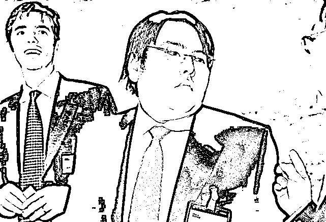
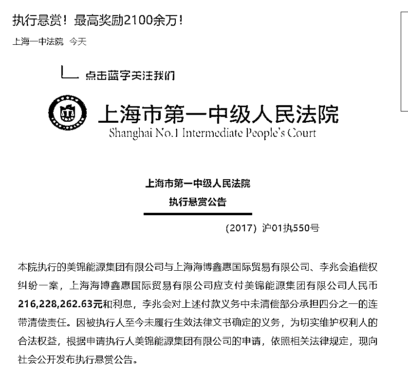
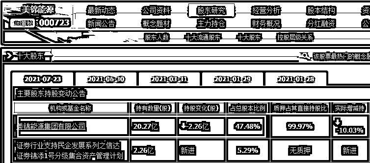
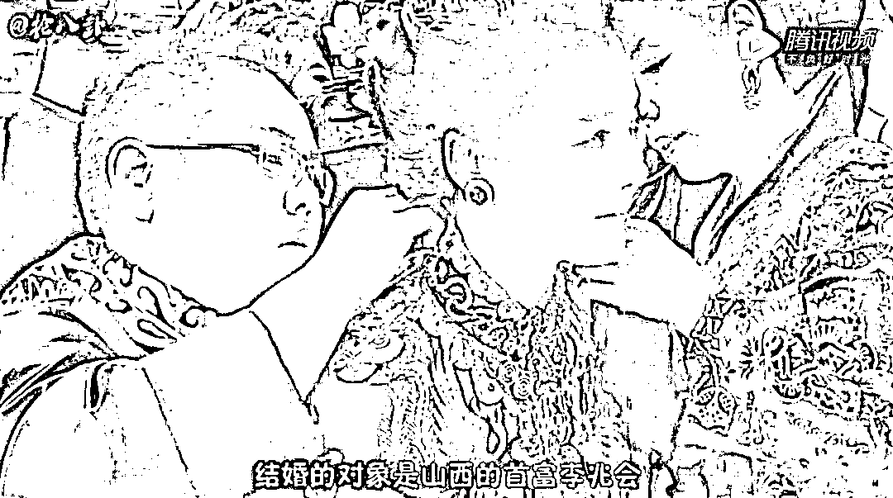

# 举报人最高奖励 2100 万！山西前首富成“老赖”下落不明被悬赏

> 原文：[`mp.weixin.qq.com/s?__biz=MzIyMDYwMTk0Mw==&mid=2247520824&idx=2&sn=4d71d5198968f4ca4d6d365f105719f5&chksm=97cb5900a0bcd0167d880c4c48e5c659571bf372d1a24f6bb928ac5eaa441a3866cb37287b62&scene=27#wechat_redirect`](http://mp.weixin.qq.com/s?__biz=MzIyMDYwMTk0Mw==&mid=2247520824&idx=2&sn=4d71d5198968f4ca4d6d365f105719f5&chksm=97cb5900a0bcd0167d880c4c48e5c659571bf372d1a24f6bb928ac5eaa441a3866cb37287b62&scene=27#wechat_redirect)

9 月 15 日，**上海市第一中级人民法院公开发布了一则执行悬赏公告。按照悬赏公告，举报人最高可获 2100 万元赏金。** 

**公告悬赏的其中一位被执行人李兆会是山西海鑫集团原董事长**，出生于 1981 年的他曾是山西省最年轻的首富，如今却欠下巨额债务，下落不明。

上海一中院发布执行悬赏公告

涉前山西首富李兆会

9 月 15 日，上海市第一中级人民法院公开发布一则执行悬赏公告。

公告显示，上海一中院执行的美锦能源集团有限公司与上海海博鑫惠国际贸易有限公司、李兆会追偿权纠纷一案，**上海海博鑫惠国际贸易有限公司应支付美锦能源人民币 2.16 亿元和利息，李兆会对上述付款义务中未清偿部分承担四分之一的连带清偿责任。**

因**被执行人至今未履行生效法律文书确定的义务**，为切实维护权利人的合法权益，根据申请执行人美锦能源集团有限公司的申请，依照相关法律规定，法院向社会公开发布执行悬赏公告。

**本次执行悬赏期限为一年**，**从 2021 年 9 月 10 日起至 2022 年 9 月 9 日为止**。

执行线索条件和奖金如下：

1.举报人提供李兆会下落并成功找到李兆会，美锦能源集团有限公司承诺奖励举报人人民币 10 万元，奖励金额在找到李兆会之日起三个工作日向举报人支付。

2.举报人提供真实有效且法院尚未掌握的被执行人名下财产线索，一旦查明属实、具备执行条件并实际执行到位，美锦能源集团有限公司承诺**按实际执行到位金额的 10%予以奖赏。**

李兆会为生于 1981 年的山西前首富、海鑫集团董事长。海鑫集团曾是山西最大民营企业，是仅次于太钢集团的山西第二大钢铁企业。

值得注意的是，上海海博鑫惠国际贸易有限公司（以下简称“海博鑫惠”）也与李兆会有关联。据澎湃新闻此前报道，海博鑫惠公司董事长李兆霞是李兆会的妹妹，该公司法定代表人张亚敏曾是海鑫集团办公室主任。

550 亿上市公司怒了！

举报人最高可得奖金 2100 万

两个以上举报人举报同一线索的，悬赏奖金由先举报的一方获得；联名举报的，由联名方共同获得、自行分配。申请执行人的代理人、有义务提供被执行人财产线索的人员、人民法院工作人员及其近亲属或者存在其他不应发放悬赏奖金情形的，不得领取悬赏奖金。

也就是说，**如果成功提供举报线索，帮助法院将涉案资金全部执行到位，举报人最高可得高达 2162 万元的奖金。**

上海一中院同时表示，对提供财产线索的人员身份及其提供线索的有关情况予以保密，但为发放悬赏奖金需要告知申请执行人的除外。

值得注意的是，申请执行人美锦能源集团有限公司（以下简称“美锦集团”）是上市公司美锦能源（000723.SZ）的控股股东，在中华全国工商业联合会 2020 年 9 月发布的《2020 中国民营企业 500 强榜单》中，美锦集团位列第 413 位。**公开信息显示，美锦能源目前总市值 556 亿元，美锦集团最新持股 20.27 亿股，占总股本比为 47.48%。**

涉 2 亿官司！山西前首富不知所踪

红星资本局注意到，美锦集团与海博鑫惠及李兆会所涉案件为一起追偿权纠纷案。

中国裁判文书网于 2017 年 9 月 19 日发布的该案判决书显示，海博鑫惠于 2013 年向 B 银行外高桥支行贷款 2 亿元，美锦集团、李兆会、案外人 A 股份公司、A 公司为此笔贷款保证人。

后因海博鑫惠出现重大经营风险，B 银行外高桥支行于 2014 年 3 月 13 日向上海第一中院提起诉讼，请求判令被告海博鑫惠向其归还借款本息，美锦集团、A 股份公司、A 公司及被告李兆会承担连带担保责任。

在该案诉讼期间，**美锦集团于 2014 年 9 月 24 日代海博鑫惠向 B 银行外高桥支行偿还本金 2 亿元及利息 16228262.63 元，本息共计 216228262.63 元。因海博鑫惠未向美锦集团偿还上述代偿款，遂被起诉。**

最终，上海市一中院于 2017 年 3 月 15 日判决海博鑫惠应于判决生效之日起十日内向美锦集团支付代偿款本金 216228262.63 元及利息；被告李兆会对海博鑫惠上述确定的付款义务中未清偿部分承担四分之一的连带清偿责任。

而时至今日，**海博鑫惠仍未向美锦集团偿还上述代偿款，李兆会也不知所踪**。

曾高调迎娶女星

接班十年企业破产

海鑫集团曾是山西最大民营企业，是仅次于太钢集团的山西第二大钢铁企业。

作为山西省规模最大的民营企业，在李兆会的父亲李海仓执掌海鑫集团时期，集团资产总额达 40.36 亿元，成为地方支柱企业。但是在 2003 年的农历新年之前，李海仓在办公室突遭枪杀。在爷爷的主持下，年仅 22 岁的李兆会成为海鑫集团的董事长，山西最年轻的首富成为这个年轻人的新头衔。2008 年胡润中国富豪排行榜显示，当年李兆会以 125 亿元资产登顶山西首富。

公众更为熟知的是李兆会与女明星车晓 2010 年花费不菲的婚礼，在当时的新闻图片报道中，婚礼现场明星环绕，婚车达到数百辆，看上去热闹无比。

然而，伴随李兆会一同长大的海鑫集团却并未变得根基牢固，在多重因素的作用下，连同“海鑫系”的其他企业一同走向了破产。

按照新华社的报道，由于受钢铁行业产能过剩、市场不景气、金融部门抽贷以及内部管理等因素影响，海鑫集团从 2013 年年底开始资金吃紧，并于 2014 年 3 月份被迫全面停产。当时海鑫集团现有负债及对外担保数字约为 104.59 亿元，而整个海鑫集团的账面资产仅 100.68 亿元，负债率超过 100%。2014 年，海鑫集团进入破产程序。成为当时国内最大的民营企业破产案。

最终，由北京建龙集团对海鑫集团实施并购重组。

来源 ： 中国经营报、每日经济新闻、上观新闻、红星新闻、潇湘晨报

← 向右滑动与灰产圈互动交流 →

