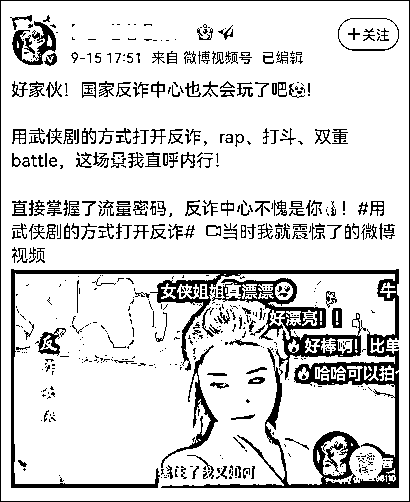
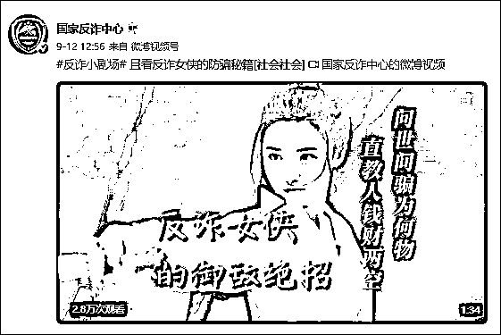
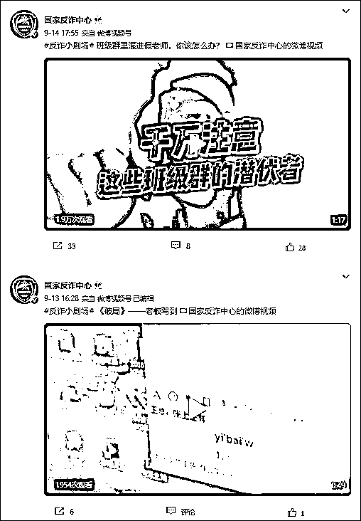

# 国家反诈中心可太会玩了！

> 原文：[`mp.weixin.qq.com/s?__biz=MzIyMDYwMTk0Mw==&mid=2247520824&idx=3&sn=49fb261f25158f742ca31763db3564f3&chksm=97cb5900a0bcd01675d16f10b14d469572292f24657699291a9ba91e45dd08b28e68a704b7f7&scene=27#wechat_redirect`](http://mp.weixin.qq.com/s?__biz=MzIyMDYwMTk0Mw==&mid=2247520824&idx=3&sn=49fb261f25158f742ca31763db3564f3&chksm=97cb5900a0bcd01675d16f10b14d469572292f24657699291a9ba91e45dd08b28e68a704b7f7&scene=27#wechat_redirect)

昨日（9 月 15 日），@国家反诈中心 出品的番剧更新了。而这次放出的《反诈小剧场》，更是让追完番的一众网友直呼内行，“用武侠剧的方式打开反诈，rap、打斗、双重 battle，直接掌握了流量密码，反诈中心不愧是你！”

<mpvideosnap class="js_uneditable custom_select_card channels_iframe" data-pluginname="videosnap" data-id="export/UzFfAgtgekIEAQAAAAAA4ns0sXNG-gAAAAstQy6ubaLX4KHWvLEZgBPE-IIUG2skXJz-zNPgMIsmZjHB4O8QT8S4WO3HgmFT" data-url="https://findermp.video.qq.com/251/20304/stodownload?encfilekey=XGocBFxVWK5dcyOOqpEU47RpBHQIvlhnLaNeKH8vwYlg10AtmbkoE3hAbHoHflFjWrgyVdHTSt7df7AZdKDftrRnugkyJjYMArrcJBxrZXWTyKdbzbj08QBtel4uoBfQwbKvWaUkiaegvTfH63icMsg7mQQU7SXjuHiaDAw9wpYlt6m7diatSicUcZw&amp;adaptivelytrans=0&amp;bizid=1023&amp;dotrans=0&amp;hy=SH&amp;idx=1&amp;m=5da387b1cb31e741c5239130d6c1cee5&amp;token=AxricY7RBHdXAA4z9ewHVpT5O7Z6nW8Ceic64tHkL9uJh0QV7urM2BnfjCGkZmMw54OKelyVyUDSc" data-headimgurl="http://wx.qlogo.cn/finderhead/naPHoFY2n5RbMAtGqzo9ckMfibVp0q0ibxrXTlibsWcADSLwpyqibytoNw/0" data-username="v2_060000231003b20faec8c4e28810cbd1cc04ee30b07781d4bd3e0aff07d40a3378c3c524ff8b@finder" data-nickname="国家反诈中心" data-desc="【终极对决】反诈的最终 battle，有何必胜秘籍？#反诈小剧场" data-nonceid="6916967285998405487" data-type="video"></mpvideosnap>

*这集的《反诈小剧场》名叫“终极对决”，以武侠剧的形式，呈现反诈的“必胜秘籍”，内容一如既往的短小、精悍。*

*故事开头，便是一段武侠剧中经典的竹林追逐剧情。身着蓝衣外罩白纱的“反诈女侠”提着剑，一路追缉“伪客服”。*

**

*“伪客服”不敌，跌坐在地，开启嘴炮模式：“擒住了我又如何，还有千万诈骗派弟子在江湖中行走，更何况还有师父呢。”*

**

*“反诈女侠”微微一笑，收了剑，“好，那我会会你师父。”擒贼先擒王，安排上。*

**

*接下来，便是一身漆黑的大 boss——“诈骗派掌门”出场。只听他慢条斯理地下了战书，“听闻女侠一路打败本门徒儿，今日不如切磋切磋。”*

**

*“反诈女侠”淡然以对，“那便恭敬不如从命。”*

**

*你以为接下来就是高手过招，竹叶纷飞的场景吗？不，只见“诈骗派掌门”随手掀开帷帽，掏出不知哪儿来的金色话筒称，“君子动口不动手，不如 rap 一战。”*

**

*语罢，这位“诈骗派掌门”就摆起姿势，开启“硬核”说唱：“这位女侠看来还是太过年轻，不要以为打败徒弟就是反诈精英。”*

**

*“反诈女侠”自然不怵，随即下场 battle，“什么骗局套路今日你便尽管使出，待你招数用尽立马让你走投无路。”*

**

*“诈骗派掌门”嚣张姿态依旧，细数起本门派的各类诈骗“功法”：“美女教你投资，给你情感抚慰。孤单宅男遇上，完全戳中软肋。”“网上兼职刷单，分分钟就入套。各个转我本金，想要赚钱门道。”“冒充贷款客服，骗你注销账号。大把存款钞票，进我口袋真妙。”*

**

**

*“反诈女侠”一一破解，“牢记陌生美女不会如此亲近，如果推荐理财，你可千万别相信。”“记住刷单兼职，都是诈骗圈套。勤勤恳恳工作，才是生钱正道。”“不轻信、不贪心，官方渠道多验证。花样再多，只要谨慎，骗子还是太嫩。就算诈骗手段稀奇古怪花样多，只要不信不贪，轻松就把骗局戳。”*

**

**

*而就在两人互相 battle 期间，“诈骗派掌门”眼看局势不好，暗戳戳从腰封中摸出暗器偷袭。“反诈女侠”不慌不忙，抽出剑击落飞镖，并反身一剑将“诈骗派掌门”击倒在地。*

**

**

**

*随着“诈骗派掌门”倒地吐血，这场战斗以“反诈女侠”的胜利落下帷幕。最后，屏幕上缓缓出现三排字，点明“必胜秘籍”——“克服贪恋，保持警惕，远离网络诈骗”。*

**

*这条多重元素混杂的普及防诈骗知识短视频，经由@国家反诈中心 发出后就引来了不少网友热议。许多看完这一出“大戏”的网友纷纷感叹，国家反诈中心“也太会玩了”，“这比单纯说教更让人印象深刻”。*

**

**

**

**

*甚至还有网友建议，国家反诈中心可以拍个连续剧，“可能收视率还挺高的”。*

**

**

*实际上，国家反诈中心自今年起，就出过不少集《反诈小剧场》，包括此轮引起热议的“武侠篇”也都有前集。*

**

**

*除了《反诈小剧场》外，国家反诈中心还开设了《反诈 MV》《反诈明星说》《全民反诈接力挑战》栏目。其中，《反诈 MV》不仅有改编歌曲，传统曲艺也紧跟“反诈”潮流。《反诈明星说》则邀请奥运冠军、明星演员一起反诈防骗。*

*今年 7 月，国家反诈中心还跨界联合芒果 TV 刑侦剧 IP《谎言真探》，与阿里巴巴推出了线上反诈剧本杀《谁在说谎》，并与知乎合作推出反诈公益微电影《信念》，讲述犯罪分子行骗的惯用套路，张晞临、周也等演员参演其中。*

*另外，值得一提的是，随着一些反诈宣传员的出圈，如反诈民警老陈，国家反诈 app 也被带火。据央视财经频道 9 月 8 日报道，近日，在各个软件下载中心的榜单中，国家反诈 app 的下载量出现猛增。而随着反诈工作的持续进行，该 app 半年时间内的下载总量已经超过了两亿次。*

**

*而据公安部数据统计，2021 年 1 至 7 月，全国共破获电信网络诈骗案件 18.5 万起，抓获犯罪嫌疑人 24.7 万名，同比分别上升 41.3%和 109.6%。同时，6、7 月全国电信诈骗案件立案数同比下降 12%和 9.4%，快速上升势头得到初步遏制。*

*来源：观察者网*

**

*← 向右滑动与灰产圈互动交流 →*

**