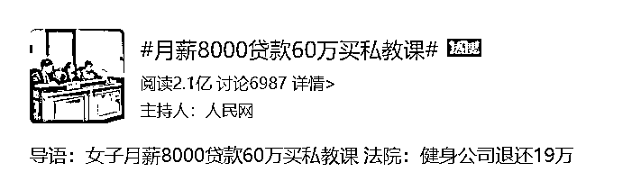
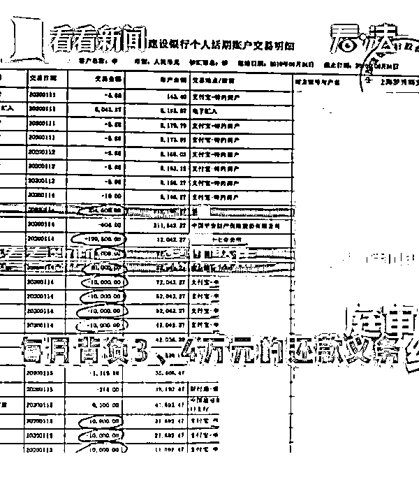
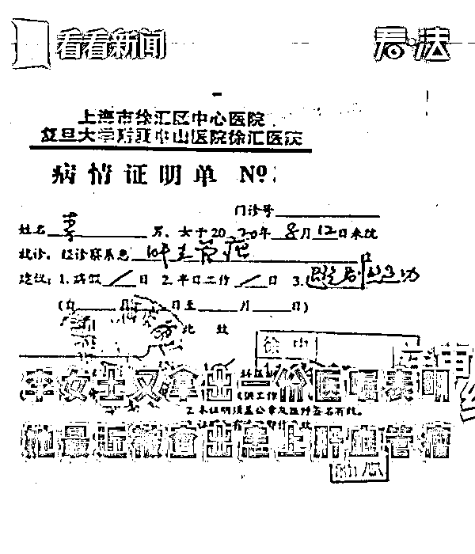

# 女子月薪 8000 网贷 60 万买私教课，退费遭拒，法院判了！

> 原文：[`mp.weixin.qq.com/s?__biz=MzIyMDYwMTk0Mw==&mid=2247520824&idx=4&sn=fdd824e8bb3a463f098dd337b8e475d0&chksm=97cb5900a0bcd016c7062a75f8d00cf3d110fa65c091bde4818260f6226a2bf5be1a6087cc09&scene=27#wechat_redirect`](http://mp.weixin.qq.com/s?__biz=MzIyMDYwMTk0Mw==&mid=2247520824&idx=4&sn=fdd824e8bb3a463f098dd337b8e475d0&chksm=97cb5900a0bcd016c7062a75f8d00cf3d110fa65c091bde4818260f6226a2bf5be1a6087cc09&scene=27#wechat_redirect)

近日在上海，李女士为了减肥一个月内贷款买了 60 万私教课，每月还贷 3、4 万，课程已经被安排到了 2034 年。

2019 年年末至 2020 年年初，短短二十多天的时间里，李女士在她长期光顾的健身房购买了 60 余万元的私教课程，然而，2020 年 10 月，李女士却将健身房告上了法庭，要求退还私教课程费用。

网贷 60 万买私教课

课程已排到 2034 年

李女士从 2014 年起就是这家健身房的会员，只是之前从来都没有尝试过私教课程。到了 2019 年，李女士听教练说，私教课的减肥效果很好，于是试着购买了一些课。 

几节课下来，李女士觉得效果还不错，决定再购买一些课时，这时候教练告诉她，店里正好推出了一个折扣力度很大的优惠活动。

随后，在短短二十多天的时间里，李女士陆续买下了 60 余万元的私教课程。这 60 余万元的私教课程分别对应了 14 份私教计划协议书，根据这些协议书的内容，李女士的课程已经被安排到了 2034 年。

图片来源：看看新闻

既然效果很好，李女士为什么又要退课呢？李女士说，一个原因是经济压力：她在购买这些课程时，健身房向她推荐了网贷，她办理了高额贷款。现在每月要承担 3、4 万元的还贷压力，让她不堪重负。

不过，健身房却表示，这些说辞，不过是李女士为了退课的借口。他们没有鼓动李女士贷款，健身私教合同都是她自愿签署的。

毕竟李女士已经在黑纸白字的合同上签了字，如果仅仅说自己当时一时冲动，并不能成为解除合同的理由。随后，李女士提出了另一个解除合同的理由：自己最近被查出患上了肝血管瘤，医生建议避免剧烈运动。

她认为，身自己的体和经济状况都已经无法继续履行原私教协议，故诉至法院，要求判令解除原被告签订的未到期的 13 份《舒适堡私人训练计划协议书》，并要求被告退还原告课程费 560,600 元。

鉴于此，健身房也同意了李女士解除合同的要求，但是也提出，李女士应该按照合同，支付 20%的手续费。被告健身房辩称，自 2014 年 5 月 27 日至 2020 年 8 月 1 日，李女士一共向舒适堡购买了价值 623,300 元的私教课程，其中已经使用 414,700 元的私教课程，尚有 208,600 元的私教课程未使用。

李女士觉得实在有些离谱，更何况，自己因为身体原因需要解除合同，不算违约，根本就不应承担这个费用。

图片来源：看看新闻

法院：健身公司退还 19 万

根据相关的法律规定，提供格式条款的一方应当采取合理的方式提示对方注意免除或者减轻其责任等与对方有重大利害关系的条款，按照对方的要求，对该条款予以说明。但经过法庭调查，健身房并没有尽到说明义务。

法院要求被告提供支付涉案合同相对应营销成本的凭据，用以明确其损失，但被告补充提供的证据并不足以证明其损失。故法院根据本案实际情况，酌情**按未履行课程金额的 5%计算其损失。**

据此，法院依法判决解除原告李女士与被告健身房签订的 5 份未履行完成的《私人训练计划协议书》；被告于本判决生效之日起十日内退还原告李红课程费**194,085 元。**

最终，法院酌情认定李女士承担 5%的违约责任。

花呗、借呗、信用卡，

3 万 5 买健身课

据悉，25 岁的小海是 java 工程师，平时工作起来久坐不动，还经常加班到深夜。几年下来，小海已比学生时代胖了好几圈。去年 7 月，小海在加班结束的回家路上，路过一家健身房，被推销的健身活动吸引了。

在健身教练的一通游说下，小海当即决定办卡、买私教课。按教练定的训练计划，小海买了 2600 元的半年卡一张，又花了三万二买了 30 节常规私教课和 48 节康复私教课。

几个课加起来总价有三万五，小海一下子拿不出这么多钱，就通过借呗、花呗分期、信用卡等方式，分成多笔订单支付了这笔钱。

第二天中午，小海睡了一觉起来越想越后悔，打起了退堂鼓，晚上 8 点多回复教练：“我有点想退钱，我不想干了。”

小海还表示，自己这等于是借贷款买课，“我为此不安了一整天，我怕我信用违规，也怕家里出了事情急需用钱，我是该退钱还是来上课？”

健身教练就劝小海说：“每个月就还 2000 多元，你安心锻炼，我们给你做好了计划。”

但随后小海就明确表示：“我爸妈明确反对我付钱，我怎么退钱？”

小海没有出现在健身房，而是继续在微信上与教练沟通退钱的事。小海表示，愿意对健身房有一定的赔偿，希望把买私教课的钱都退给自己。但健身教练一直都不回答小海能否退款，只是翻来覆去地喊他去锻炼。

随后，他将健身房起诉到西湖法院，**请求判令解除与健身房签订的会员健身协议书以及私教课程协议，退还全部合同款项 3.5 万，如对被告造成损失，他愿意赔偿相关损失。**

近日，西湖法院法官组织双方庭前调解。

法官就向健身房指出，其提供的合同中有不少加重消费者责任、排除消费者主要权利的格式条款，且相关格式条款并未采用足以引起对方注意的文字、符号、字体等特别标识，按相关法律规定，这样的条款属于无效条款。

同时，法官也向小海指出，虽然他买课后没再去健身房运动过，但是双方签订合同后，健身房为合同的履行也做了一定的准备，产生了部分成本，他也应当承担一部分解除合同的违约责任。

最后，**健身房同意协商退款，愿意退还 95%的合同款项，共计 33250 元**，小海也表示愿意承担 5%的责任。双方就此达成调解。

警惕“预付费”变成“套路贷”

据央视新闻，**消费者们应警惕“预付费”变成“套路贷”的模式**，

**中国政法大学传播法研究中心副主任朱巍**接受采访时表示：

对消费者本身来说，他透支了自己的收入。对于商家来讲的话，它控制不了预付费网贷的来源。对于网贷机构来说的话，它也没有办法去监管商家提供的服务合不合适、会不会有退款的情况。

据了解，目前网络借贷的监管主体并不在教育主管部门和市场监管部门，法律学者就建议出台网贷预付费管理规定，遏制互联网金融风险。

在缺乏监管和准入门槛的情况下，网络贷款很可能带来预付费的风险。而在“网购潮”风靡的同时，记者还注意到，一些经营者利用拼团、团购等方式吸引用户，从而进行违规预收费。

来源：潇湘晨报

← 向右滑动与灰产圈互动交流 →

