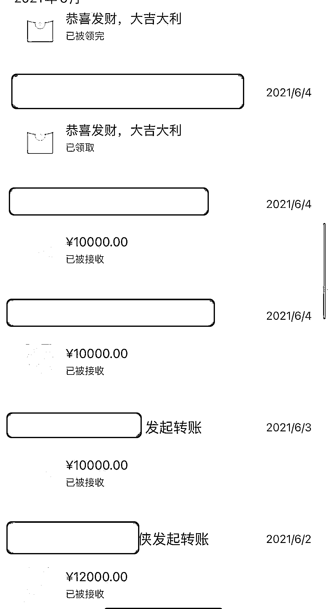
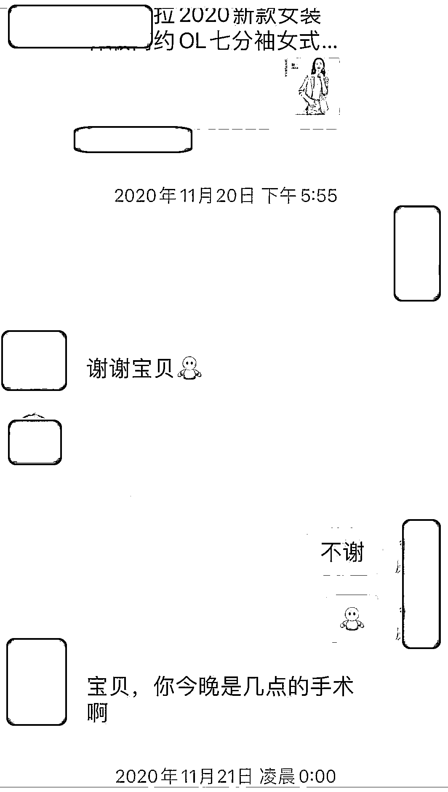
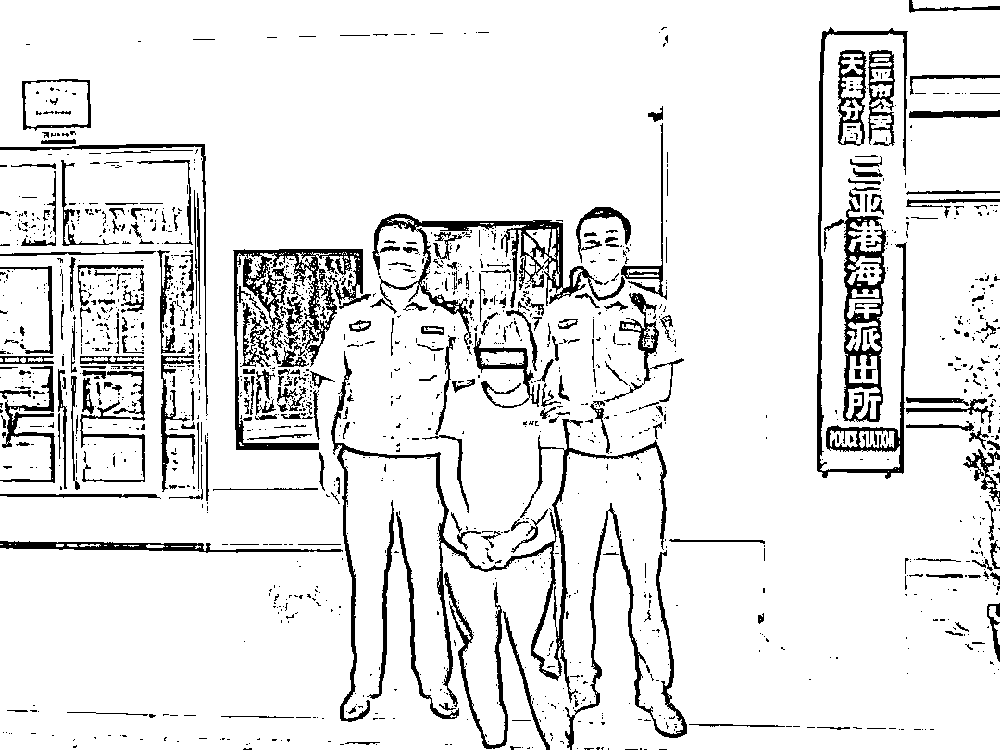

# 46 岁阿姨一人分饰三角，同时跟两兄弟网恋，骗了他们 40 万！

> 原文：[`mp.weixin.qq.com/s?__biz=MzIyMDYwMTk0Mw==&mid=2247520824&idx=5&sn=c62cb90cd0d4a256a8efd670a344e5ee&chksm=97cb5900a0bcd0167c06069a2e45270c048d227371d84bee80298ddcd279ea52050cd3f3e2d4&scene=27#wechat_redirect`](http://mp.weixin.qq.com/s?__biz=MzIyMDYwMTk0Mw==&mid=2247520824&idx=5&sn=c62cb90cd0d4a256a8efd670a344e5ee&chksm=97cb5900a0bcd0167c06069a2e45270c048d227371d84bee80298ddcd279ea52050cd3f3e2d4&scene=27#wechat_redirect)

“那个你日思夜想的女网友一定是个美女？”

“不！她可能是一名抠脚大汉，也可能是一位年近 5 旬的老阿姨！”    

记者今天从海南省公安厅海岸警察总队第四支队获悉，该支队破获一起利用网恋实施诈骗的案件，抓获犯罪嫌疑人 1 名，涉案金额 40 余万元。

陌生女子加微信

“我们亲兄弟俩被女网友诈骗了很多钱，一定要帮我们把这个女的绳之以法……” 

8 月 9 日，海南省三亚市公安局天涯分局三亚港海岸派出所民警接到群众黄某（男，30 岁）报警称，其与兄弟黄某某（男，27 岁）因网上交友不慎，被女网友诈骗了 40 余万元。

接警后，三亚港海岸派出所高度重视，立即成立专案组展开案件攻坚工作。

2019 年初，嫌疑人以“小美”的身份在三亚某餐厅内主动搭讪并添加了当事人黄某的微信，声称其侄女长得非常漂亮，而且黄某一表人才，愿意把自己的侄女介绍给黄某。

随后，“小美”把自己的另外一个私人微信号推荐给了黄某。天真的黄某以为天降爱情，主动跟这个“小美”虚构的“侄女”聊了起来，坠入爱河。

据介绍，通过一段时间的热恋网聊后，这个虚构的女网友以算命先生建议一年内不宜见面为由，多次拒绝了黄某的邀约，然后这个女网友开始以要过节、住院看病、家人过世、找工作等名义，在短短一年多的时间内，先后诈骗黄某 23 万余元。

女子扮演三“角色” 

为了骗取更多的钱财，在得知黄某还有一个亲弟弟的情况后，这个女网友声称自己还有一个漂亮的闺蜜，想要介绍给黄某的弟弟黄某某。

于是，“小美”再次把自己的另一个微信号推荐给了黄某的弟弟。就这样，“小美”以同样的方式和套路，从黄某的弟弟身上诈骗了 17 万余元。

8 月 8 日，黄某和弟弟黄某某在一次聊天中谈到各自女网友的事情，两人吃惊地发现，他们的女网友居然私下都跟他们借了很多钱，而且通过对比语音发现，他们各自的女友似乎是同一个女子。

期间，黄某和黄某某兄弟俩在同时拨打语音电话时，对方只能接听一个人的电话。当兄弟两发现自己被同一个“女网友”欺骗了感情和钱财后，便主动向派出所报警求助。

经调查，民警确认黄某和黄某某的女网友其实就是同一个女子，而这个女子就是黄某 2019 年在餐馆吃饭时遇到的那个主动搭讪和添加微信的女子“小美”，而“小美”的真实身份就是犯罪嫌疑人欧某（女，46 岁）。

 “相亲”是假诈骗是真

根据当事人黄某和黄某某介绍，民警初步确认，该起诈骗案件是一起非常典型的网络诈骗案件，嫌疑人通过微信交友，以网络恋爱的方式骗取当事人的信任和感情，随后以各种借口向当事人借钱或索取钱财，并最终达到诈骗钱财的目的。

在调查中，民警还发现欧某在 2018 年就以网络交友的方式实施过诈骗，后被公安机关打击处理，因身体不适，被取保候审。

事后，欧某不但没有收敛，反而变本加厉，采用同样的套路和手段，对未婚单身男性实施网聊诈骗。

8 月 26 日，在充分掌握犯罪嫌疑人欧某的日常活动轨迹后，专案组民警在三亚某街道将欧某成功抓获。

经讯问，犯罪嫌疑人欧某对涉嫌诈骗黄某、黄某某 40 余万元的违法犯罪事实供认不讳。

目前，欧某已经被公安机关依法刑事拘留，案件正在进一步审理中。

来源 ： 法制日报，潇湘晨报

← 向右滑动与灰产圈互动交流 →

