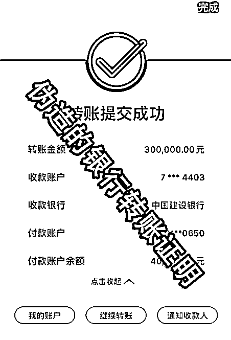

# 警惕！“组织部长”突然的关心...

> 原文：[`mp.weixin.qq.com/s?__biz=MzIyMDYwMTk0Mw==&mid=2247520824&idx=6&sn=6845433c96ce0b94a7132ee59a6bf51b&chksm=97cb5900a0bcd01665597df87f2f8ee7530cbb0b8b642156b81c74569b7ffbccc530f3ae289f&scene=27#wechat_redirect`](http://mp.weixin.qq.com/s?__biz=MzIyMDYwMTk0Mw==&mid=2247520824&idx=6&sn=6845433c96ce0b94a7132ee59a6bf51b&chksm=97cb5900a0bcd01665597df87f2f8ee7530cbb0b8b642156b81c74569b7ffbccc530f3ae289f&scene=27#wechat_redirect)

最怕空气突然安静

最怕“领导”突然的关心

……

近日，南京出现多起

****冒充领导诈骗****

诈骗分子冒充政府领导

取得受害人信任

****以帮助亲戚资金周转为由****

****实施诈骗****

********

**诈骗套路**

**0****1****添加好友**

骗子通过各种途径收集领导的****姓名、职务、证件照****等个人信息，****伪装成领导本人的微信********。****为增加可信度，会在朋友圈转发一些政务信息。

**0****2****拉近距离**

建立联系后，骗子为博取受害人的信任，以领导的身份嘘寒问暖，****假装********关心企业运营状况，********以及********受害人********的********工作、生活情况****，总有一种方式能让受害者卸下心防。

**0****3****虚假转账**

之后便以各种花式借口，要求受害者进行转账。主要话术无非是****亲戚做生意需要资金周转****或****奉上级命令需私人账户转一笔钱****等。

总之就是抓住受害人****不愿意得罪领导、不愿意得罪熟人、以为受领导重视遐想连篇****等心理特点。

这时骗子提出****先把钱转到受害人账户****，再由受害人转出。为让受害人放心，骗子还会发送****转账证明****。

一切看起来都合情合理，但其实****转账证明是****PS 的****，P 图效果足够骗过受害人。

**0****4****要求垫付**

事实上，受害人永远不可能收到这笔钱。但骗子会以****银行大额转账有延迟，亲戚********又********急需用钱****为由，要求受害人先行垫付。有了前面的铺垫，受害人往往就放松了警惕，从而上当受骗。

在此期间，骗子利用受害人对领导心存敬畏、不敢质疑的心理，****频繁使用****“尽快”********、********“马上”********、********“立即”等催促性的词语****。

既营造了紧张气氛，又利用时间压制，使受害人在短时间内失去怀疑真假的正常思维而上当受骗。当骗子收到钱后，便将受害人微信拉黑。

友情提醒

1、突然有领导干部添加微信的，要谨慎甄别。特别是****涉及转账、汇款等****，务必通过电话、见面等途径核实确认。

2、凡涉及资金转账交易，应谨慎对待，严格遵守单位财务审批制度及流程。同时要**保护好个人及单位信息，防止信息泄露**。

3、如遇诈骗，请**保留聊天记录，转账记录，联系方式等，及时拨打 110 或者 96110 报警**。

来源：南京网警、江苏网警

← 向右滑动与灰产圈互动交流 →

