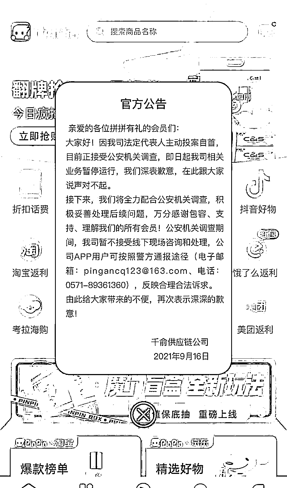

# “拼拼有礼”操盘手去自首了，彻底崩盘！

> 原文：[`mp.weixin.qq.com/s?__biz=MzIyMDYwMTk0Mw==&mid=2247520863&idx=1&sn=ab0b36a85fb9c24f181da09ab7a353d1&chksm=97cb5967a0bcd07149052c7a0b79f44400075a6e9e51eb6db9ed76132e08f45f45e129dce477&scene=27#wechat_redirect`](http://mp.weixin.qq.com/s?__biz=MzIyMDYwMTk0Mw==&mid=2247520863&idx=1&sn=ab0b36a85fb9c24f181da09ab7a353d1&chksm=97cb5967a0bcd07149052c7a0b79f44400075a6e9e51eb6db9ed76132e08f45f45e129dce477&scene=27#wechat_redirect)

**什么是资金盘？所谓资金盘是指“通过高收益激发不明所以的投资者的贪欲，进行非法集资，以拉人头滚动或静态资金流通的形式，拆东墙补西墙，即前面加入会员的本金和利息都来源于新加入会员的本金，本质就是金字塔式传销诈骗。所以一旦没有新鲜血液注入，平台操盘手无利可图，就会崩盘卷款跑路！**

* * *

今日警方发布公示，拼拼有礼所隶属公司的法人刘某，正式向警方投案自首，目前警方已经成立对应负责部门专门调查拼拼有礼一案。

而后在今天上午，拼拼有礼官方也在 app 首页的弹窗公告里面公布了此事，实锤上的实锤，彻底凉了： 

而后又传出了拼拼有礼公司所在大楼的物业公示，物业所述公司直接表明了态度，让拼拼有礼公司尽快搬走： 

总之，一石激起千层浪，一切皆因贪念起，一切终亡于欲望，受苦受难的承担后果的，最终还是散户，还是大家。 

拼拼有礼这个项目，之前给过我的看法，我的看法就是根本活不到操盘手所说的 9.26 日给前面两个项目提现：

为什么拼拼有礼的企业法人，会选择在 9.15 号投案自首？

这一切都是背后真正的操盘手所策划的，之前很多内幕网上流传众多，大部分都是真实的，只有一点是不确定，那就是幕后黑手究竟卷走了多少大家的血汗钱。

拼拼有礼，一个打折拼团概念的社交电商类的资金盘，就这么彻底烟消云散。 

好在，我们还有可爱的人民警察，今天微信群里面流传比较多的一个视频讲解的很好，我就不给大家放视频了，直接来个总结：

**三个重点：**

1、警方会根据后台的数据和相关数据，进行梳理，然后整理汇总后，进行提供给法院；

2、警察叔叔说大家亏损的钱，肯定会回来，但是具体比例，并不清楚，根据钱的剩余情况；

3、大家多多留心警察叔叔发布的公告，所有的消息以警方通报为准，切勿传谣信谣。

另外还有，大家现在应该就能够清楚，到底谁是真正的对你好的人，谁是真正能够值得交朋友的人，之前在朋友圈里面大肆宣扬拼拼有礼的那些高级领导人，现在怎么朋友圈仅三天可见，玩家问什么信息都不回复了？ 

你们当时的承诺呢？你们当时吹得牛皮呢？你们当时不是说是散户小白看不懂-拼拼有礼这个伟大的模式么？在盲盒玩法出来的时候，不是吹嘘着超越某宝某猫吗？ 

怎么现在三缄其口，屁都不放一个了呢？

呸，你们妄为人。

2016 年的重庆苗龙，2018 年的 iac 互助盘，包括云联惠 plustoken 等，到目前还仍然在调查追缴中，最近的就是去年的秘乐短视频，很多高级领导人以为已经过去了就没事了，但是事实却是，很多秘乐的高级领导人都一一被抓捕归案。

天道有轮回，苍天饶过谁，要想人不知，除非己莫为，挣得余生贫，且看斯人垂，骑驴看账本，咱们边走边瞧。 

在这里，小编还是得多说几句，拼拼有礼这件事，对于散户来说，挺残忍的，我看了那些维权的视频，心情是五味陈杂。 

关于拼拼有礼，一旦进入调查取证阶段，剩下的就是走公检法的流程，估计几个月事件，应该就能够有官方的最终定论，希望拼拼有礼一路走好。 

盘子最终结局无非就那么几种，新人可能还觉得拼拼有礼死掉这件事情不可思议，但我们这些老江湖觉得并没有什么，只是害惨了那些仍在坚持信仰的散户，他们天真热烈，满怀期待。

友情提示:

遇事要果断，割肉要趁早，远离任何形式资金盘。

2021 年 5 月份，拼拼有礼租下办公大楼，为了弥补上两个盘子产生的泡沫，操盘手不得不兵行险招，公开站台公开办公公开吸引投资人入金投资；

2021 年 6 月份，拼拼有礼操盘手在网络上面招募到了十大创世领袖，这是个人均是网络传销大师，精通互联网资金盘项目推广，旗下团队成员，在网络都是推广项目的精英；

2021 年 6 月末，拼拼有礼的支付通道、购物通道、第三方物流等才算是正式完善，项目开始逐步走向稳定期； 

2021 年 7 月份，拼拼有礼项目开始在业内声名鹊起，就像一个横空出世的天才少年一样，用一个月的时间，完成了其他项目一年都做不到的成就，用户数量远超百万，app 一度因为用户太多而关停；

2021 年 7 月末，拼拼有礼操盘手看着账户上几个亿的资金，喜忧参半，喜的是有钱了，忧的是这些钱来的太快，而且不干净，该怎么洗白呢？想到了一个好主意，在杭州余杭区，决定买一栋价值 2.5 亿的大楼；

2021 年 8 月上旬，拼拼有礼的火爆程度完全超出了大家的认知，那个时候所有的人都已经被洗脑成功，就死心塌地的认为拼拼有礼是新时代的产物，所有参与拼拼有礼的玩家都是有福报的人，操盘手觉得自己赚钱，玩家觉得自己在赚钱，那么请问拼拼有礼里面的人都赚钱，那么谁赔钱呢? 

**当时有句经典的回复：“就你们这些观望和瞎评论的傻逼在亏钱”**

2021 年 8 月末，盛极必衰，物极必反，果不其然，拼拼有礼出现了多重问题，提现不到账，封号，不发货，搞新模式，清空领导人奖励等等，然而到了这个时候，还是有一些忠实粉丝在支持拼拼有礼的，但是拼拼有礼的操盘手在干吗？ 

他们在疯狂的转移资金，不断地利用公告等手段忽悠大家耐心等待，等待等待，直到现在，钱转移的差不多了，这个替死鬼刘某直接来了个自首。

请问幕后的操盘手，你们这样做，对得起大家对你们的信任吗？对得起你自己的良知吗？活着的时候你如何面对你的父母兄弟孩子，当你死的那天你如何面对你的先人列祖列宗？

很多人觉得资金盘无情，资金盘确实是无情，但是人有情，不过"拼拼有礼的操盘手"和那些借机欺骗大家的高级领导人没有感情，因为他们压根就不是人。

之前刚出问题的时候，很多人来咨询我该怎么办，我都建议他们割肉离场，很多人都不愿意，一是心疼钱，二是觉得拼拼确实走出了一条不一样的路。

我说:不是我们不能有理想，即使我们有再好的想法，再多的策略，也扛不住领头人胡乱操作，带头大哥初心不正，我们这些人再如何努力，也航行不到正确的彼岸，所以尽快割了吧。

8 月份听我的话，能够果断割肉的，现在还能剩一辆奥迪，要是到了九月份割肉只剩下一辆奥拓，如果是十月和十一月割肉，那可能只能买几袋奥妙洗衣粉，现在，想割肉也没了，就剩皮包骨和那点理想，并且车门焊死，想下车都不可能。

**做互联网金融的人经常说一句话:选择不对，努力白费，的确如此，跟对人做对事永远是我们一生需要去考虑的事。**

很多人倾注太多心血在这个行业，最终却大都获得一个失望的结局，这绝不是个人的问题，是行业悲哀，资金盘算不上正规金融，或者连金融都算不上，只能说是骗局，只不过从中偶尔会走出几个修成正果的项目，大多数人为了这万分之几的几率而去拿真金白银搏杀，我觉得是一个错误的选择。

这个行业如果你不是三头六臂火眼金睛，千万别来，一入这行深似海，从此再也离不开。无论是你的钱还是你的人，皆如此。

这里人性复杂,骗局丛生，如果能别来，尽量别来。

来源：暗火盘界

← 向右滑动与灰产圈互动交流 →

