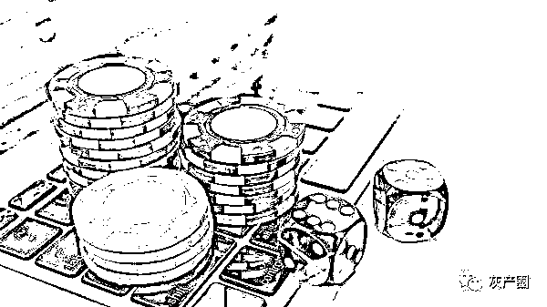

# 3 万人网上参赌，每月资金流水 60 亿！

> 原文：[`mp.weixin.qq.com/s?__biz=MzIyMDYwMTk0Mw==&mid=2247520863&idx=2&sn=277154137da5f74e95046b7f7c674564&chksm=97cb5967a0bcd071286e07ba35b606d268cb356b27c3d89a8ce28e82640c839cad16f624eb86&scene=27#wechat_redirect`](http://mp.weixin.qq.com/s?__biz=MzIyMDYwMTk0Mw==&mid=2247520863&idx=2&sn=277154137da5f74e95046b7f7c674564&chksm=97cb5967a0bcd071286e07ba35b606d268cb356b27c3d89a8ce28e82640c839cad16f624eb86&scene=27#wechat_redirect)

每月资金流水约为 60 亿！

赌场月“推广费”百万!

高峰时 3 万人网上参赌!

这个东南亚某国

经营规模最大的线上赌场

被淮南警方出手覆灭了

[`mp.weixin.qq.com/mp/readtemplate?t=pages/video_player_tmpl&action=mpvideo&auto=0&vid=wxv_2049967800034689025`](https://mp.weixin.qq.com/mp/readtemplate?t=pages/video_player_tmpl&action=mpvideo&auto=0&vid=wxv_2049967800034689025)

2020 年 1 月，民警在工作中发现：有大量人员通过网络平台进行网络赌博活动。随着侦查工作的深入，一个庞大的跨境网络赌博集团渐渐露出冰山一角。鉴于案情重大，3 月 26 日，淮南市公安局成立联合专案组，全力开展侦办工作。

这是一家“发迹”之初就设在境外的网络赌博公司。2016 年 4 月，该网络赌博公司在境外开始营业，2017 年 12 月，公司转移到东南亚某国，**赌博网站下设 5 大赌盘，每月资金流水约为 60 亿元**，每月用于赌场推广费用约 100 万元，**高峰时****3 万人网上参赌**，成为在该地区经营规模最大的线上赌场。

**这是一个运维模式、组织架构完整的犯罪集团。**5 名股东中，有 2 人兼任一赌盘主管，其余四个赌盘也有专门的主管人员。20 多名成员分别承担从客服话务到后勤取款等各项任务。该组织拥有专门的技术团队，提供服务器托管、系统维护等技术支持，方便参赌人员**在赌博网站或 App 上进行充值**、**赌博和提现操作**。其中，10 余人专门负责赌博网站运营，并且想方设法逃避公安部门的打击。为维持资金流转，该公司通过国内外数十个渠道大量购买个人账户与对公账户，雇佣专门负责“取现”的团伙。仅 2019 年 4 月至 2020 年 4 月间该团伙就为网络赌博公司**取现 1.5 亿**。为招揽生意，该集团外包网络宣传“推广团队”，通过“某度”“某点睛平台”等搜索引擎招揽赌客。如此“一条龙”的网络经营模式，让他们赚的盆满钵满，而法网也在张开……

2020 年 9 月 9 日，该案件被公安部列为特大跨境网络赌博案督办。首恶务除，把握关键、深挖幕后，全链条打击！安徽省公安厅对案件侦办提出了具体指示要求。全体参战民警紧密配合、戮力攻坚，成功抓获了该组织全部股东和各环节主要操盘人员，最大限度扣押冻结涉案资产。

通过侦查，办案民警首先摸清了赌场平台运营情况、犯罪团伙主要架构，以及资金链、技术链、利益链等关键节点的团伙骨干分子的情况。特别是挖出了隐藏在幕后的 3 名股东团伙成员。在省公安厅的协调调度和统一指挥下，10 个抓捕组、3 个冻结组分赴福建省厦门、南安、泉州和上海等地实施抓捕和涉案资产冻结工作。雷霆出击、利剑出鞘，犯罪嫌疑人相继落网，冻结资金 2400 余万元，查封不动产价值折合人民币 1 亿余元、涉案车辆 2 辆、手机 10 部、电脑 4 台，追缴现金 530 余万元。

团伙主要犯罪嫌疑人被抓获后，专案组民警在跨境赌博、非法经营、信用卡诈骗及侵犯公民个人信息犯罪等方面，不断深挖线索，积极侦办。专案组精准梳理出人员、技术、资金、利益链和跨境通道，逐步明确犯罪团伙架构下各层级人员身份。随后，专案组又分别抓获该赌博利益链条上的相关犯罪嫌疑人 13 人，查扣涉案资产 1 个亿。

锲而不舍，多管齐下，针对仍处于境外的在逃人员，专案组“一人一专班”，落实包保责任，多次赴在逃人员家属所在地，持续不断开展政策宣讲、亲情感化等工作，打消在逃人员逃避法律制裁的侥幸心理，敦促其投案自首。最终，该案 4 名境外在逃人员全部回国投案。至此，该特大跨境网络赌博案境内外主要犯罪嫌疑人全部归案，网络赌博平台及相关利益链条被彻底铲除。

来源：警方微信公众号，利箭在行动

← 向右滑动与灰产圈互动交流 →

