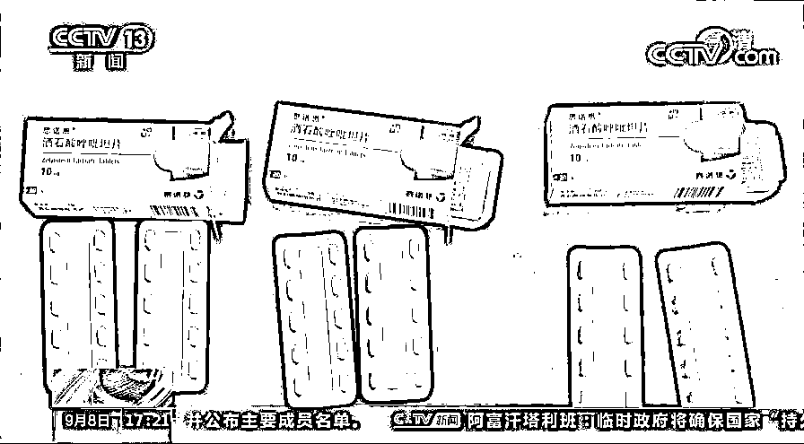
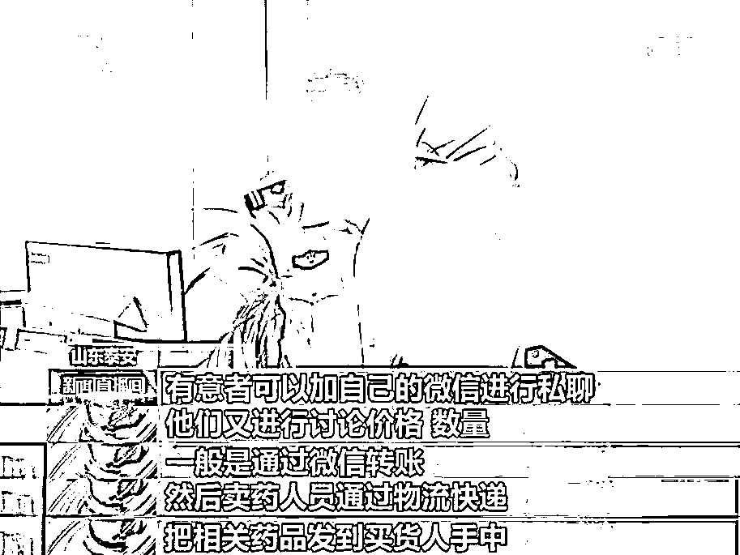
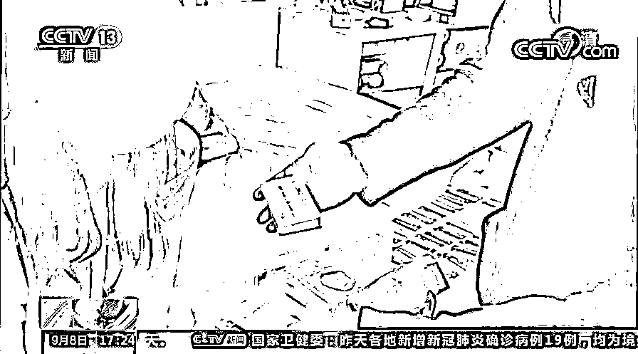
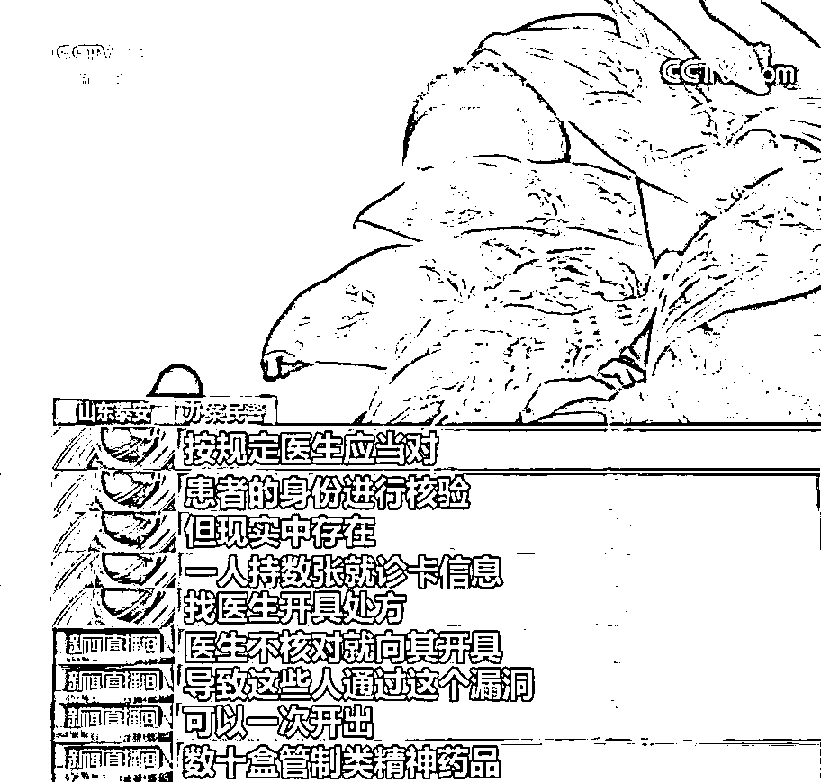

# 贷款 20 万买“药品”牵出贩毒大案！

> 原文：[`mp.weixin.qq.com/s?__biz=MzIyMDYwMTk0Mw==&mid=2247520863&idx=3&sn=0324a92c8d99bfb5abf306ec3d622ccc&chksm=97cb5967a0bcd07143ee09104fdbe9b84d34d8624a03bd93d24d018f01735d2a93927c981c29&scene=27#wechat_redirect`](http://mp.weixin.qq.com/s?__biz=MzIyMDYwMTk0Mw==&mid=2247520863&idx=3&sn=0324a92c8d99bfb5abf306ec3d622ccc&chksm=97cb5967a0bcd07143ee09104fdbe9b84d34d8624a03bd93d24d018f01735d2a93927c981c29&scene=27#wechat_redirect)

**近日，泰安宁阳警方摧毁了一个横跨鲁、苏、皖、粤四省，贩卖国家管制精神药品的犯罪网络，抓获犯罪嫌疑人 6 名。经查，该案犯罪嫌疑人在一年多的时间里，共贩卖管制精神药品酒石酸唑吡坦 60000 多片。2021 年 9 月 8 日，中央电视台新闻频道《新闻直播间》栏目对此案进行报道。** 

 **[`mp.weixin.qq.com/mp/readtemplate?t=pages/video_player_tmpl&action=mpvideo&auto=0&vid=wxv_2039403696626728963`](https://mp.weixin.qq.com/mp/readtemplate?t=pages/video_player_tmpl&action=mpvideo&auto=0&vid=wxv_2039403696626728963)** 

****女子贷款 20 万****

****网购国家管制精神药物牵出贩毒大案****

**前段时间，泰安宁阳县公安局禁毒大队民警获得线索——辖区女性居民王某某通过网络社交平台大量购买酒石酸唑吡坦服用。**

**王某某从 2020 年初到 2021 年 3 月份，多次从网络购买（酒石酸）唑吡坦，没有钱就四处借款，从网上贷款，她一共贷了将近 20 万，买了 1000 余盒酒石酸唑吡坦。**

****

****酒石酸唑吡坦有效成分为唑吡坦，用于治疗失眠症，使用唑吡坦可导致身体和精神依赖，依赖程度随剂量和治疗时间的增加而提高，该药必须凭借医生处方开具、严格按照剂量要求服用。医生处方医嘱酒石酸唑吡坦每次用量最多两片，连续服用最长不能超过四周。****

****而王某某已对该药产生了强烈的依赖性，最大服用量每次竟达 20 多片，**2020 年 4 月，她还被家人送到戒毒医院戒毒脱瘾。从医院购买一盒 20 片装的酒石酸唑吡坦是 60 块钱左右，王某某从网络上购买花了 240 块钱，相当于 4 倍医院的价格。**

**警方调查发现，王某某非法购买服用酒石酸唑吡坦并非个案，**在她身后隐藏着一个贩卖国家管制精神药物的犯罪网络。**警方侦查发现，王某某的酒石酸唑吡坦来源于广东的易某，而易某的上家则是江苏南京的苏某。易某在手机某社交聊天软件上开设了专门的聊天室，吸引有需求的人购买酒石酸唑吡坦。嫌疑人一般通过微信转账，再通过物流快递把相关药品发到买货人手中。******

**苏某是南京某医院的收费员，他在某社交聊天软件里也有自己的聊天室。北京的王某、广东佛山的容某服用酒石酸唑吡坦成瘾，他们均是在网上与苏某勾连，大量购买酒石酸唑吡坦。自 2020 年 6 月以来，王某先后从苏某手里购买每盒 20 片的酒石酸唑吡坦 700 多盒。**容某购买 300 多盒，他单次服用剂量更是达到惊人的 100 多片。****

****钻漏洞****

****收费员捡拾就诊卡购买管制药品****

**那么，苏某大量向外销售的酒石酸唑吡坦又是从哪儿来的呢？**

**苏某利用在医院做收费员的工作便利，钻医院的漏洞，捡拾他人大量的就诊卡，利用这些就诊卡，再利用医院开具的处方药管理漏洞，从医院开出大量的国家管控精神药品处方，然后再进行购买。**

**苏某在 9 个多月的时间里，以每盒 60 多元的价格从医院购出酒石酸唑吡坦 3000 多盒，同时，医院护工张某为谋取非法利益，利用收集他人的就诊卡非法购出该药卖给苏某。苏某在社交聊天软件上以每盒 90 至 110 元的价格向外销售牟利。**抓捕时，民警在苏某和张某家中，共查获用于作案的就诊卡 111 张。**安徽芜湖籍某药品的医药代表吴某为挣取差价，曾向苏某销售过 600 盒酒石酸唑吡坦。吴某的酒石酸唑吡坦来自于芜湖同乡张某某，而张某某则是酒石酸唑吡坦的医药代表。**

****

**张某某联系安徽铜陵一家医院的药剂师余某，余某为获取非法利益，从医院开出 600 余盒唑吡坦。余某将该批唑吡坦卖给张某某，张某某又卖给吴某，吴某加价每盒 30 到 50 元不等，再卖给苏某。** 

**铜陵市某医院药剂师余某私自违法开出的这 600 盒酒石酸唑吡坦，竟然占到医院进货总量的一半还多。在这个贩卖酒石酸唑吡坦犯罪网络中，医院收费员，药剂师勾结医药代表和社会无业人员大量贩卖国家管制精神药品，反映出一些医院对此类药品管理的漏洞。**

****

**按规定，医生应当对患者身份进行核验，但现实中存在一人持数张就诊卡信息找医生开具处方的情况，医生不核对就开具处方，导致这些人通过漏洞可以一次开出数十盒管制类精神药品。造成大量的精神药品脱离医院管控，流向了非法渠道。**

**目前，该案 6 名犯罪嫌疑人已由泰安宁阳警方依法移送检察机关审查起诉。**

**来源：泰安公安  央视新闻 、山东公安 、利箭在行动**

****

**← 向右滑动与灰产圈互动交流 →**

****