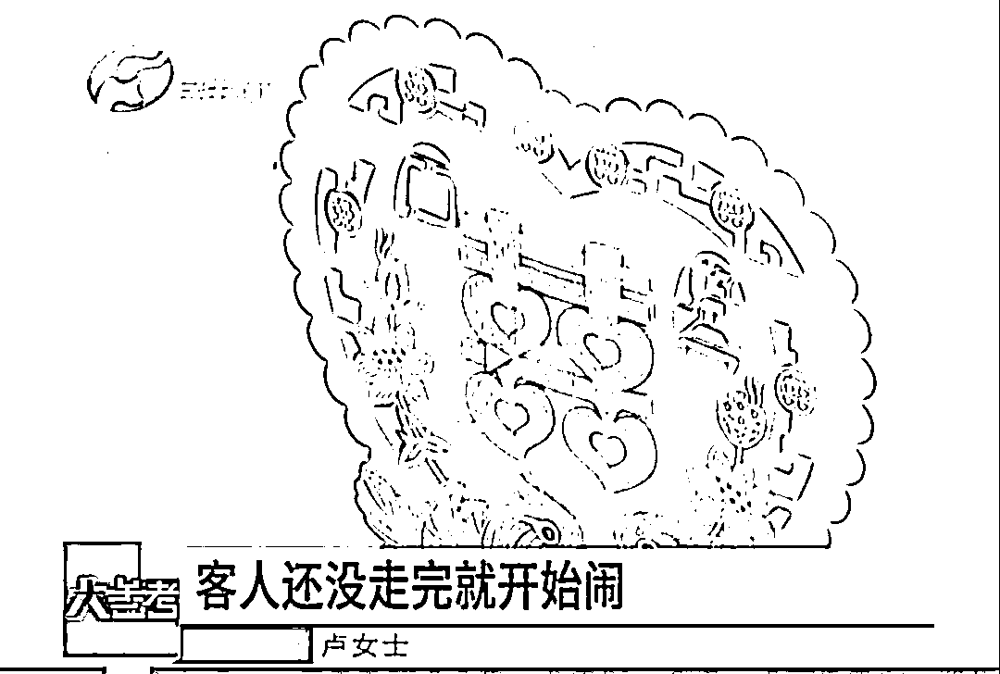
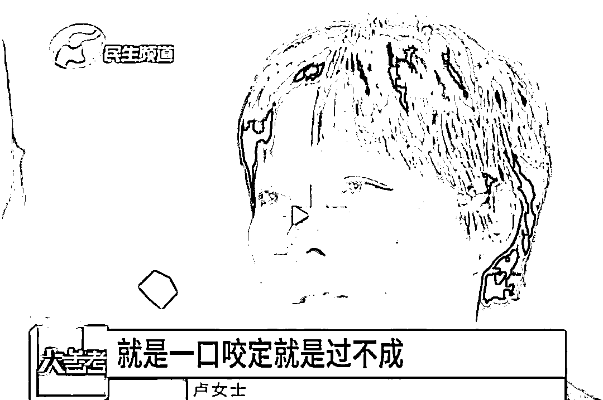
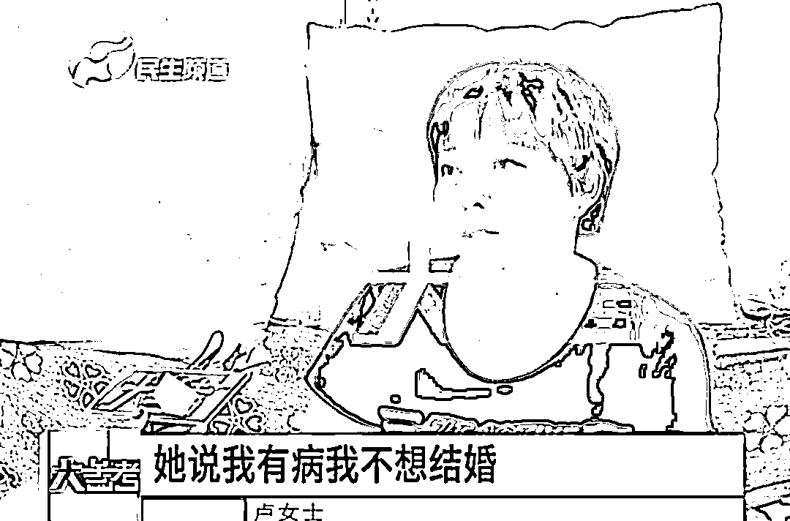
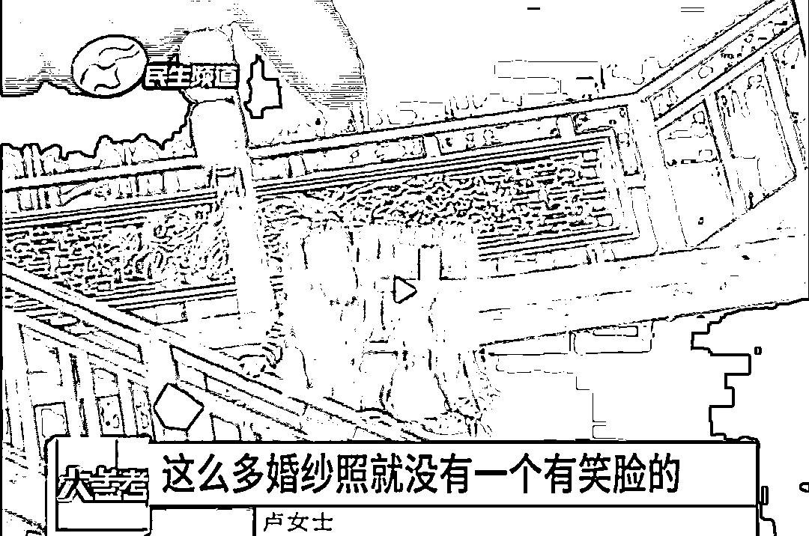
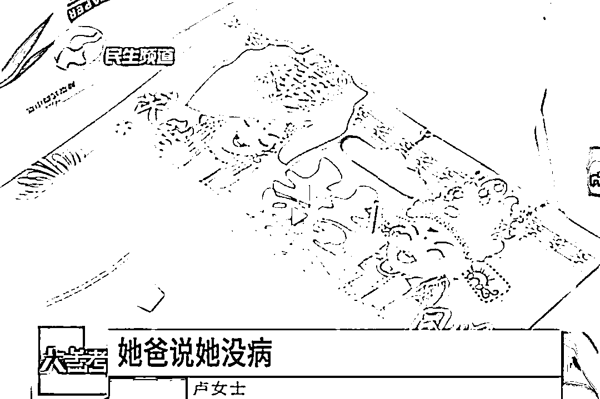
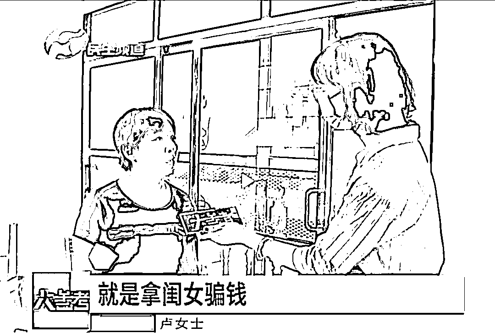
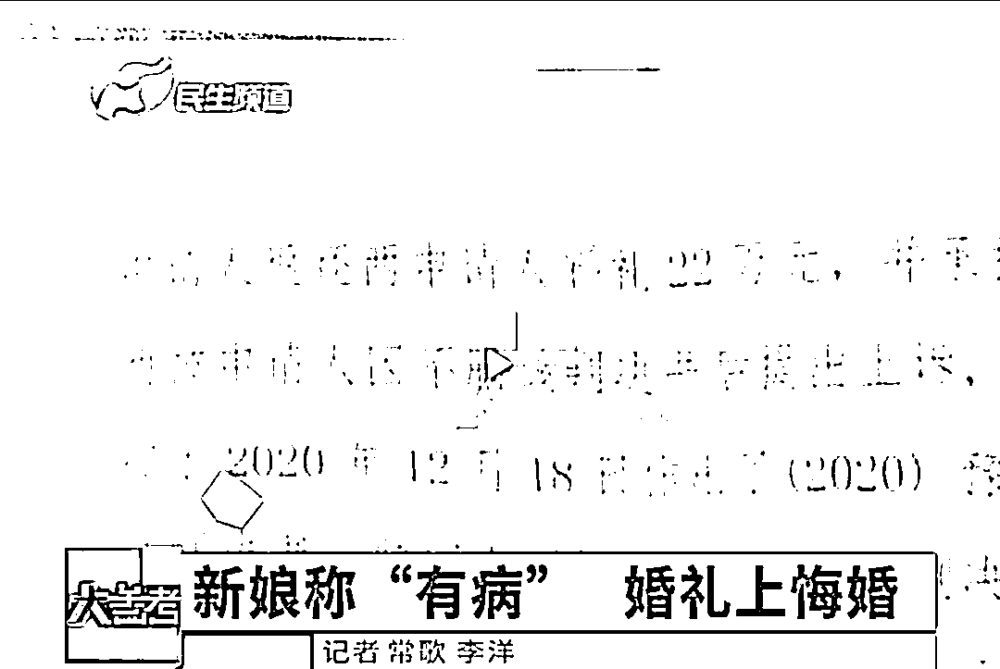

# 新娘当着婚礼宾客面自称“有病”跪求悔婚

> 原文：[`mp.weixin.qq.com/s?__biz=MzIyMDYwMTk0Mw==&mid=2247520863&idx=4&sn=f8497b4244ec7c556150599e2dec43fa&chksm=97cb5967a0bcd071d817d233c342dec71b0b98e53e4e34b8cf0f33b5c60feb55f6a54c4ebb7e&scene=27#wechat_redirect`](http://mp.weixin.qq.com/s?__biz=MzIyMDYwMTk0Mw==&mid=2247520863&idx=4&sn=f8497b4244ec7c556150599e2dec43fa&chksm=97cb5967a0bcd071d817d233c342dec71b0b98e53e4e34b8cf0f33b5c60feb55f6a54c4ebb7e&scene=27#wechat_redirect)

据河南广播电视台民生频道《大参考》栏目报道，河南商丘的卢女士，因为儿子的婚姻问题难受不已。

在 2020 年 6 月 10 日，花 30 多万给儿子举办的婚礼上，刚过门的儿媳妇竟在婚礼现场，当着宾客的面自称”有病“跪求他们要悔婚。卢女士一家最终同意悔婚，但女方却又拒绝退还 30 多万元的彩礼和礼金。 

[`mp.weixin.qq.com/mp/readtemplate?t=pages/video_player_tmpl&action=mpvideo&auto=0&vid=wxv_2051499955311247364`](https://mp.weixin.qq.com/mp/readtemplate?t=pages/video_player_tmpl&action=mpvideo&auto=0&vid=wxv_2051499955311247364)

**新娘自称有病**

**婚礼现场跪求悔婚**

2020 年 6 月 10 日，商丘市睢阳区的卢女士花了 30 多万为儿子举办了一场风风光光的婚礼，谁知婚礼当天，新娘要悔婚。

卢女士说：“结婚当天我儿媳妇磕了头，客人还没走完就开始闹，不过了她说。她说我对不起你们。”

“她头一句开始说不过，我脑子蒙了一下，一片空白啥都不知道了，我也没办法，我这样哄那样哄她都不愿意，就是一口咬定过不成。”

记者来到卢女士给儿子儿媳装修好的新房里，看到家里的家具都是崭新的，按说两人从订婚到举办婚礼也有小半年的时间，女方怎么就突然之间反悔了呢？

卢女士：“她说你给你儿子找个好的吧，我有病我不想结婚。我说那你啥毛病啊？她说就是好好的就笑了，好好的就哭了，她说就这样。”

为什么不想结婚还走到这一步了？新娘说自己爹脾气不好，自己在家不敢说话。

卢女士还向记者展示了新房里的钉子孔，那里原本挂着的婚纱照，“这么多婚纱照就没有一个有笑脸的，摄影师都气坏了，咋有结婚不笑的。”

“她不想结婚她也没跟我们说啊，不会逼她的，我们何必呢？”

**父亲称新娘没病**

**家人却拒退彩礼钱**

纵然是万般不愿意，但由于新娘哭闹不止，在婚礼后的第二天，卢女士还是和儿子一起，把新娘送回了她的父母家，希望新娘的父母能够从中劝说。

“她妈也没办法，她哭得跟啥一样，她说我不想结婚，非得让我嫁人。她爸回来就是吵她，她爸说她没病。”

不管是否像新娘所说她有某种疾病，又或者有其他不得已的原因，卢女士深知强扭的瓜不甜，眼看着日子确实是没法过了，但是 30 多万元已经花了，事情不能如此不了了之。

卢女士：“你闺女想嫁人就嫁人，现在婚姻自由， 她想同意就同意，不想同意你不能强逼啊。这现在花那么多钱，你不跟我们过日子，你的目的是啥？闺女不跟人过，老人拿着钱不给人家，现在弄到这一步，就是拿闺女骗钱。”

在今年年初，卢女士也是向商丘市睢阳区人民法院提起诉讼，最终法院判决新娘一家应该退还礼金和彩礼钱 22 万元，并承担诉讼费。目前该案件已经进入强制执行阶段。

来源 ：潇湘晨报综合河南广播电视台民生频道《大参考》栏目

← 向右滑动与灰产圈互动交流 →

