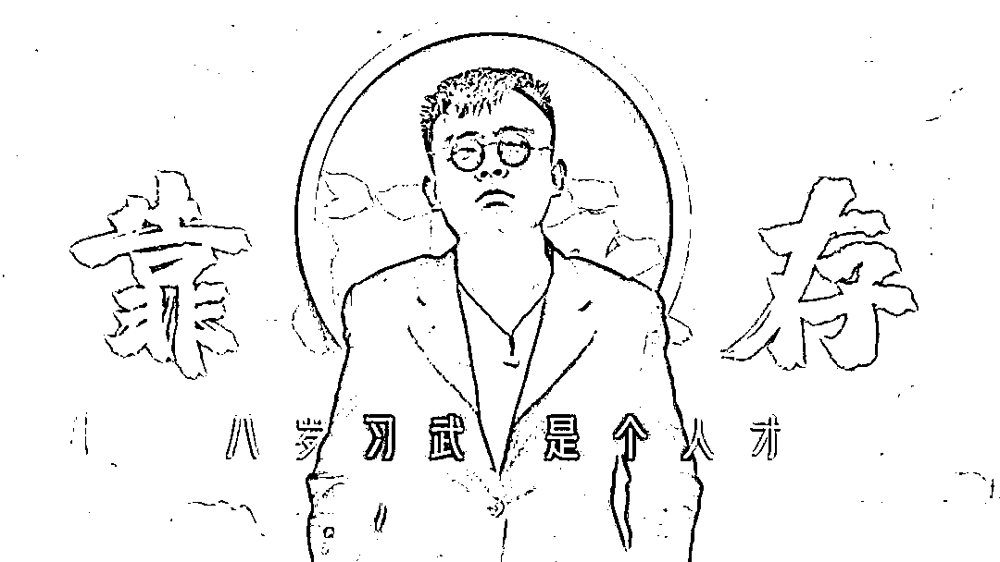

# 铁山靠，靠不住！

> 原文：[`mp.weixin.qq.com/s?__biz=MzIyMDYwMTk0Mw==&mid=2247520912&idx=2&sn=32d96fb3a238348eb2623ceb2c774d79&chksm=97cb59a8a0bcd0bea3acecdf62b973060057cac983581c188b7e92759e996166b13f431738e0&scene=27#wechat_redirect`](http://mp.weixin.qq.com/s?__biz=MzIyMDYwMTk0Mw==&mid=2247520912&idx=2&sn=32d96fb3a238348eb2623ceb2c774d79&chksm=97cb59a8a0bcd0bea3acecdf62b973060057cac983581c188b7e92759e996166b13f431738e0&scene=27#wechat_redirect)

长期用地方方言骂人吸引流量，粉丝超 1200 万网红主播“铁山靠”被抖音永久封禁了。

据了解，“铁山靠”来自山东滨州的普通农村家庭，自称八岁习武。“吃猫大队”“邦邦两拳”“怕啥来啥”等热梗均来自此人。

# **“铁山靠”被永久封禁**

**曾被抖音处罚 102 次** 

9 月 16 日，抖音公告称一些用户存在内容低俗、恶意博眼球等问题，已永久封禁有关账号 17487 个，其中包括粉丝超 1200 万的网红“铁山靠”。

**9 月 17 日，抖音安全中心就封禁“铁山靠”发布了特别说明。**

****

**“铁山靠”照片**

**图|“铁山靠”抖音**

**抖音称，在平台直播期间，**该主播长期存在以地方方言骂人吸引流量，以低俗内容恶意博眼球等行为，严重违反了平台公约约定，并漠视提醒和警告屡次违反，因违反平台规定受到直播中断及以上处罚 102 次。****

********

**与此同时，**该主播的粉丝群体存在互踩互撕、控评等畸形“饭圈文化”现象**，对网络生态环境造成了极大不良影响。**

**根据相关规定要求，决定对该帐号进行**永久封禁。****

****

# ****长期以方言骂人****

# ****3 个月吸引 1200 多万粉丝****

# **据极目新闻报道，“铁山靠”自称 8 岁习武，是山东滨州人。** 

**据其此前在直播中自述，他幼年出生在农村家庭，此前曾在工厂里上班，也做过一些小买卖。**

**后来接触直播后，在快手进行直播。“铁山靠”转战抖音后，他以家乡话作为自己的直播风格，开始了自己的视频创作、直播 PK 之路。**

**据相关数据统计平台显示，在 2021 年 6 月 15 日之前，“铁山靠”的粉丝涨幅平平，日增仅百余人。但在 6 月 15 日之后，他的粉丝出现井喷式增长，**短短 3 个月，“铁山靠”已收获粉丝 1279.6 万人。****

**在 7 月 17 日一天，“铁山靠”直播人数峰值达到了 136.1 万人，总计观看人数高达 3894.1 万人。**

****

**铁山靠 90 天吸粉近 1280 万人**

**图|数据网站截图**

**据星榜数据，7 月 12 日到 7 月 18 日，“铁山靠”凭借单周涨粉 363 万，排在抖音涨粉周榜第一。**

**记者在“铁山靠”的直播回放中注意到，大多数时候，他的直播风格比较犀利。面对他人的请求，“铁山靠”会选择不理会并回怼。**

**同时，每当他人询问铁山靠是谁的时候，**他会用“我是嫩爹”作为回复，这句话成了他的口头禅，他还会在 PK 的直播连续辱骂。****

**在铁山靠走红后，其粉丝开始自称“靠家军”，有粉丝甚至将“铁山靠”的言语做成车贴贴在车上。**

****低俗“网红”接连遭到抵制****

**9 月 2 日晚，在某短视频平台拥有 700 万粉丝的网络红人“郭老师”被平台永久封禁，同时，其自制短视频在各社交网络集体下架。**

**这位郭老师过去曾被视为“土味网红”代表。2018 年，她在多个短视频平台开设直播账号，因自创的“郭言郭语”受到部分网友追捧。**

****

**图片来源：东方网评论微博**

**此外，今年 7 月初，一条名为《人类高质量男性》的视频在各大平台走红。视频里的男子梳着大油头的他动作表情极度浮夸，说话内容却磕磕巴巴。不少网友为猎奇而来。**

****

**9 月 2 日，国家广播电视总局网站发布《关于进一步加强文艺节目及其人员管理的通知》，提出坚决抵制低俗“网红”、无底线审丑等泛娱乐化倾向。同日，文旅部发布《网络表演经纪机构管理办法》，提出要加强对经纪机构的管理，**约束表演者行为，坚持正确的价值导向，治理娱乐圈乱象。****

**北京日报此前发表评论称，不知从何时起，审丑在网上成了一股潮流，一些网民对于畸形低俗的东西颇有兴致，面对批评也总认为不过娱乐消遣而已，没必要上纲上线。一些另类网红恰是抓住了这种猎奇、窥私的心理，靠大肆炫丑来吸睛圈粉。**

**评论还称，炫丑令人作呕，炒丑、审丑亦是病态，切不可放任自流，由他们搞得网络空间乌烟瘴气。倘若靠放屁啃脚、撒泼打滚就能名利双收，对社会价值观也无疑是一种冲击与扭曲。**

**来源 ： 新闻晨报综合、每日经济新闻、极目新闻、北京日报、抖音官方微博、巴蜀反诈******

**← 向右滑动与灰产圈互动交流 →**

****