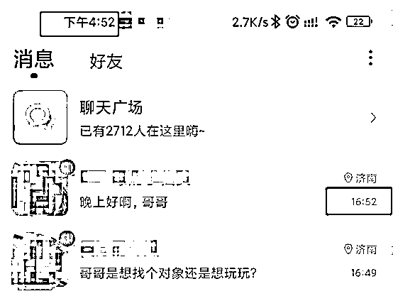
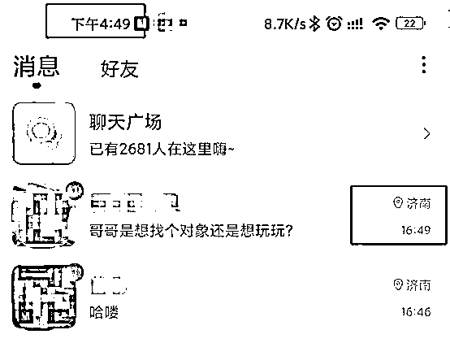
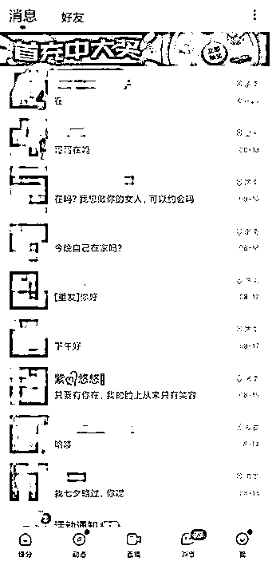
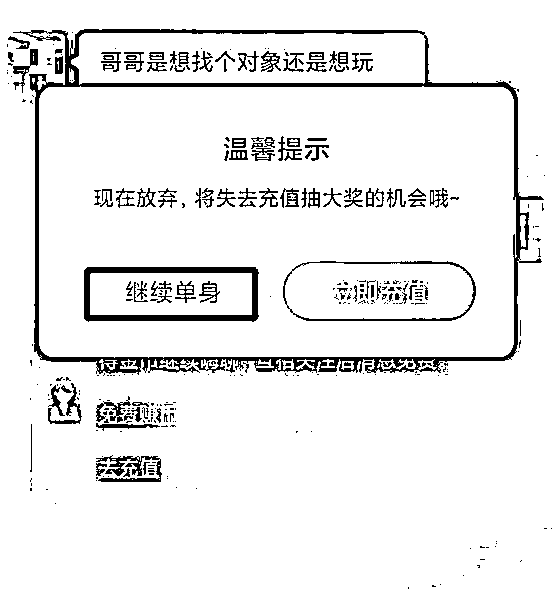
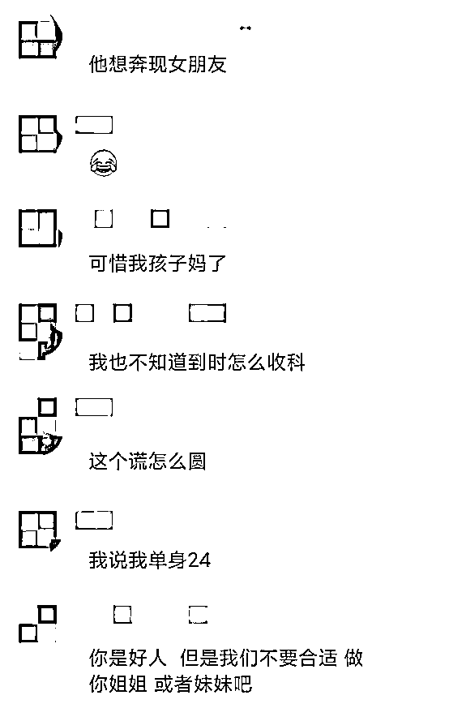

# 8 元仅发 14 条信息，在爱聊 APP 上和你聊天的或是兼职女聊手！

> 原文：[`mp.weixin.qq.com/s?__biz=MzIyMDYwMTk0Mw==&mid=2247520912&idx=3&sn=86357ad8cceaa9acef1290efcdb047e8&chksm=97cb59a8a0bcd0be7c1c4667645487f168030aa461087df5bedc5134e7f4726d3ab5415c2ef0&scene=27#wechat_redirect`](http://mp.weixin.qq.com/s?__biz=MzIyMDYwMTk0Mw==&mid=2247520912&idx=3&sn=86357ad8cceaa9acef1290efcdb047e8&chksm=97cb59a8a0bcd0be7c1c4667645487f168030aa461087df5bedc5134e7f4726d3ab5415c2ef0&scene=27#wechat_redirect)

生活节奏太快，社交圈层闭塞，大城市病越来越严重，异性交友难上加难。有社交平台就盯上了孤独人群的细分市场。8 块钱买 100 个金币，仅能给陌生人发送 14 条信息，金币用完要继续充钱才可以继续互动。

近日，齐鲁晚报·齐鲁壹点记者通过使用爱聊 APP 调查发现，隔着屏幕与你聊天互动的有可能是以赚取聊天佣金为目的的“陪聊手”，一位爱聊用户向记者坦露，自己身边一位朋友靠在爱聊 APP“陪聊”一天能赚几千元。

8 块钱发 14 条消息

异性打招呼原来是套路

众所周知，一般在陌生人社交平台上，大多是男性用户跟女性用户打招呼的居多，而在爱聊 app 上记者发现，男性用户反而更受欢迎，这是为什么呢？

记者在爱聊 app 上，注册了一个男性账号，注册成功后就不断会有异性主动打招呼，尤其是当账号每次被主动登陆的时候，这些女性用户都会监控到，并第一时间发来消息。

记者粗略的统计下，在一天的时间内，主动打招呼的女性加起来大约在 50 人左右。其中不乏一些比较露骨的话术，诸如上来就喊“老公”，还有的直接问“约的还是找长期关系的呀？”，“在吗？我想做你的女人，可以约会吗”……语言之露骨让人咂舌。

一位使用过爱聊的李先生向齐鲁晚报·齐鲁壹点记者感慨道：“哪个单身男性经得起这样的语言诱惑，我就因这种打招呼充值了不少钱，最终也没啥效果”。随后，记者尝试跟打招呼女性互动发现，每一个新用户有发 20 多条信息的权限，超出免费的部分，如果想要向用户打招呼或者发消息都需要付费。

记者在用完 20 几次免费聊天次数后，就无法再正常发送消息。其系统自动提示免费消息次数已用完，需要进行充值，而如果选择退出不充值，系统按钮则会显示“继续单身”的字样。按照系统提示记者先后充值了两笔，第一次充值 1 元为首充权益，总共发了 22 条消息。而第二次充值了 8 元，发了 14 条消息。按照这样计算下来，每发一条消息需要支付 0.57 元。

当然，如果双方选择了互相关注，则不需要再进行付费。

据一位平台陪聊手胡倩（化名）告诉记者“通常女性用户是不会进行回关的，因为关注之后就没有了收益，只能继续找些话题，继续和男性进行互动”。

陪聊手也能发展下线

一天抽佣几千元

记者通过使用爱聊发现，根据平台推送机制，男性发消息是要付费，而女性回复消息则会赚取平台给予的佣金。对于这种主打陌生人付费聊天的模式，爱聊 COO 杨锦程在此前接受媒体采访时给予的评价是“付费模式社交会提高了社交的门槛和效率，也代表了对话方的恳切态度。”

事实果真如此吗？究竟是达到了“诚恳”的目的，还是诞生了“擦边职业”呢？

记者通过付费聊天，认识了上述提到的女性用户胡倩。据胡倩介绍，她本身是一名电商从业者，在爱聊上做陪聊手只是“副业”，“哪有真的女生在上面是为了交友找对象的，大家只不过是为了配料，赚佣金而已。”胡倩一语道破了这里面的玄机。

胡倩做这种专业的陪聊手有五六年的时间，之前在别的平台做，后来爱聊诞生后，就成了她的主要阵地。据了解，爱聊的前身叫陌声，2017 年 7 月上线，2020 年 6 月：用户突破 7000 万人。2021 年 2 月，陌声品牌重磅升级，正式更名为爱聊。6 月，爱聊 APP 启用新 Slogan：单身交友就上爱聊。在爱聊上陪聊赚钱成了一项很好的兼职。在使用过程中，记者发现了网上有很多陪聊手群体。记者在爱聊上与一位女性陪聊手聊天中得知，有的陪聊手一天平均能赚几千元。

胡倩向记者说，自己一个人一天就是回复再多消息也不可能赚几千元，想要赚的多赚的快就要发展“下线”。这样就可以提取“下线”收益的 10%作为酬劳。“也就是说她每赚得 100 元我可以获得 10 元收益”。“我总共拉到爱聊的用户近 300 人，看到没事做的宝妈朋友就推荐他们到爱聊做个陪聊手做个副业，好的时候一天光抽下线的佣金就有几百元的收益”。

胡倩说，看似还不错的收益，其实大头还是被平台给拿走了。“男性发一条消息大概 8、9 毛钱，而到我们手里的只有 40%，并且这 40%再提现的时候还会扣除 30%的手续费。”

按照胡倩的说法，按 100 元来计算，“聊手”到账的钱也之后也就不到 30 块钱。近 7 成的钱被爱聊平台给抽走了。

也就是说，这种主打陌生人社交的方式，其实沦为了一种敛财的工具。

虽然平台有审核机制

但是你以为对面是美女也可能是油腻大汉

记者花了 30 多块钱，以表妹想做陪聊手的名义，与一位爱聊上的陪聊手艾玛（化名），并且成功取得了对方的 qq 号码，添加成为了好友。

艾玛向记者说，当“陪聊”首先要扫码注册下载爱聊 APP，她再三强调一定要注册女号，一旦注册后性别是无法更改的。

“刚注册的前几天比较关键，账号内的照片、状态、头像一定要包装好，不需要主动给男的聊天，系统会帮你推送但一定要及时回复。”这位“陪聊手”向记者进行了经验分享

对于能赚多少钱，其向记者说，“赚多少主要看勤奋度没有很固定，前几天很重要。

最开始，记者用女号和网上搜索到的女生网图注册了一个账号。刚注册完，就不断有人打招呼，粗略统计大概有 20 几个人发来消息。记者回复了约 20 条左右的信息，赚取了两块多钱的佣金。系统显示，首次取现满 5 块钱就可以了。

记者通过实测发现，通常在爱聊回复一条消息的所谓“聊手”的收益在 1-2 毛钱左右，提现时还会扣手续费。

因为该账号没有实名认证，发了 20 多条信息后，记者的账号显示不能再回复信息了。需要进行实名认证后再取现。

“这种机制也有漏洞，陪聊手完全可以找一个女性朋友进行实名认证，然后再以她的口气在网上聊天，反正也不见面也不视频，对方压根不知道是个男的。”一位用户向记者表示。

陌生人聊天的套路越来越深

以相亲名义 7 个小时刷 3 万多礼物

不仅是爱聊，像主打相亲直播的方式的社交平台更是套路满满。

六七个小时刷了 3 万多元礼物，这是某平台用户小邓在相亲直播中的消费记录。

小邓向齐鲁晚报·齐鲁壹点记者表示，其在某社交软件上，点进平台推送的红娘主播的弹窗，在直播间由红娘给他和女嘉宾牵线。一进一出小邓刷了 3 万多元礼物。

“这个主播的套路特别深，不停的让我给女嘉宾刷礼物，一会说心动了要给女嘉宾礼物表示一下，就跟游戏闯关一样。”

据小邓介绍，红娘把这个相亲的套路做的很隐蔽，反正就是不停的刷礼物一关关过，一直说最后一个，其实还有下一个等着你。相亲到最后说有观众需要搞个派对，直播间几个人就刷几个派对游艇。”

小邓发现不对就没有给，红娘就说我宣布相亲失败。小邓算了算，晚上九点多连线，一直到凌晨三四点才结束，他总共打赏了一百多次，累计金额高达 35578 元。最后别说牵手成功，连女嘉宾的联系方式都没有拿到。

除了陌生人交友平台，在婚恋网站上，诸如此类的问题也屡见不鲜。

用户张华（化名）向记者表示， 6 月 3 号，珍爱网门店以“有符合我择偶标准的对象”让我去缴费，我前后总共花费 11500 元。但实际体验后发现，事实与其最初介绍的情况并不一样，“见面前对我隐瞒其生育过两孩的事实，见面后才如实告知”。于是，张华在 7 月初向门店投诉，提出退款申请。“该门店主管以退款流程需要两个月等借口拖延，期间仍以各种理由向我推荐相亲，故意拖延服务期，现在服务期结束珍爱网不同意退款。”

专家：平台规则本身容易滋生“聊手“

线上虚构美好的异性 让男性在幻想中丧失警惕

对于此类问题，记者采访到中国法学会消费者权益保护法研究会副秘书长陈音江，其表示，线上付费聊天的这种方式本身是消费者花钱购买服务，而作为平台来讲，要把收费所提供的服务相匹配。如果说存在一些所谓“陪聊手”甚至与承诺不相符的服务以此来骗取聊天费用的话，这就侵犯到了消费者的合法权益。

而对于平台给与聊天返佣金。陈音江说，这样的规则，本身就容易滋生所谓“聊手”的出现，一旦形成规模，就容易导致服务质量下降。陈音江提醒说，对于消费者来说，使用陌生人社交平台时还是要自身提高警惕。多了解平台的模式，不要盲目相信某个平台从而陷入陪聊陷阱。一旦感觉不对劲就换一个平台尝试尝试，切莫投入过多的金钱。

而站在心理学的角度，国家二级心理咨询师徐力向记者剖析说，线上交友过程中，面对虚拟的美好与现实的骨感，大脑会自动开启心理防御机制来过滤现实的痛苦，完成自我心理保护。然而，不法商家就利用了这种心理防御机制，通过迷人心智的甜言蜜语、虚构美好的异性人设来制造大脑的美好幻想，让男性消费者在编织的幻想中丧失警惕，自动过滤负面消极信息，在平台的引导下一步步地付出时间和金钱，从而掉入平台编织的“美好陷阱”。

来源：齐鲁晚报·齐鲁壹点，巴蜀反诈

← 向右滑动与灰产圈互动交流 →

