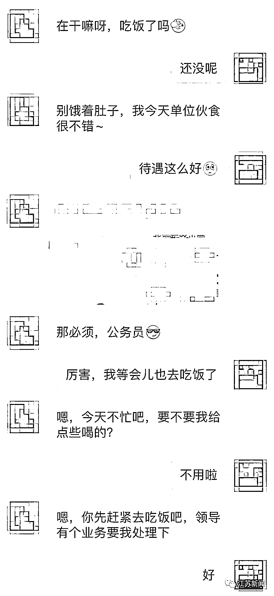
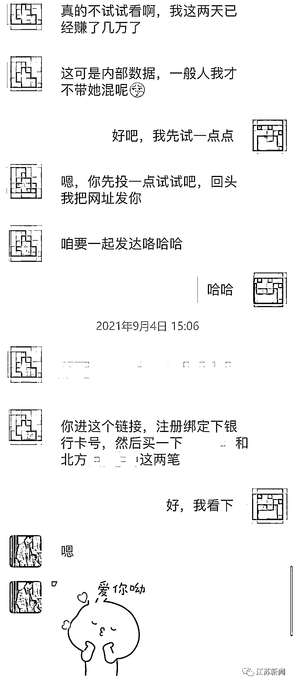
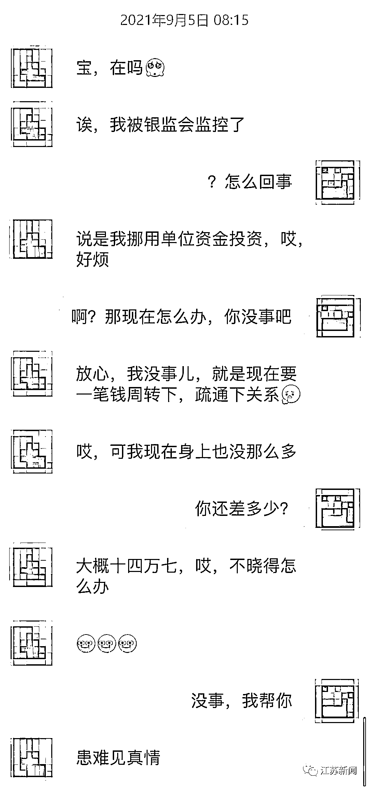

# 认识一周，被骗 102 万元！

> 原文：[`mp.weixin.qq.com/s?__biz=MzIyMDYwMTk0Mw==&mid=2247520912&idx=4&sn=91ea74ec1244c64f74d138f6bcca71b3&chksm=97cb59a8a0bcd0bea60523d3489c7d833b3d69a7713660d60ccb3e5d28ed2d4df288589021b3&scene=27#wechat_redirect`](http://mp.weixin.qq.com/s?__biz=MzIyMDYwMTk0Mw==&mid=2247520912&idx=4&sn=91ea74ec1244c64f74d138f6bcca71b3&chksm=97cb59a8a0bcd0bea60523d3489c7d833b3d69a7713660d60ccb3e5d28ed2d4df288589021b3&scene=27#wechat_redirect)

你投入的是感情，

骗子却只盯着你的钱。

9 月 17 日下午，

南京警方通报了一起

以谈恋爱为由编织起的“甜蜜陷阱”，

提醒大家注意杀猪盘骗局。

南京市民郭女士最近在某社交软件上结识了一名男网友。随着聊天的深入，两个人的关系也逐渐升温。而本以为遇见了“真命天子”的郭女士却轻信男网友掌握“内部信息”，投资理财“稳赚不赔”，一步步落入由谎言编织起的“甜蜜陷阱”，**在短短一周内被骗 102 万元**。

**套路解析**

**0****1**

**甜甜的恋爱来敲门？**

**要当心！**

网友自称姓程，每天都会和郭女士聊天，对其嘘寒问暖。并表示自己是某单位公务员，甚至经常发“单位定位”。帅气、暖男、孝顺、能力强的“人设”，很快赢得了郭女士的好感两人关系逐渐升温。

**0****2**

**发财的机会天上掉？**

**不能信！**

没多久，程某透露自己买理财可以赚钱，眼光精准且有“内部数据”。在程某的鼓动和高息诱惑下，郭女士投资了两笔钱，顺利赚取并提现了 6000 元。郭女士彻底卸下心理防线。

**0****3**

**心上人“落难”求相救？**

**都是套路！**

次日，程某告诉郭女士，他因为挪用单位资金被“银监会”监控，需要借款周转、疏通关系。**郭女士便向程某转账 15 万元**。此后程某又以“打点领导、打通关系”为由多次借款。

为帮“男友”脱离困境，郭女士一边借钱给“男友”一边加大投资，而后却发现平台资金无法赎回，在平台“客服”的引诱下，又转账十余次进行解冻。**此时郭女士已转账 102 万元**，意识到被骗的她连夜到公安机关报案。

**警方提醒**

**天降奇缘，当心！**

**真命天子，当心！**

这正是典型的“杀猪盘”诈骗，此类骗局的受害人一旦上当受骗，金钱上的敲骨吸髓和感情上的巨大创伤，对于受害者而言，无异于“灭顶之灾”。再次提醒，网络交友务必谨慎！

**内部数据，骗局！**

**高人指点，骗局！**

投资理财

要到正规金融机构、证券公司，

切勿被犯罪分子高收益高回报

稳赚不赔等虚假信息蒙蔽双眼，

导致个人财产遭受重大损失。

天上掉馅饼的事情永远都不会发生！

来源：江苏新闻，巴蜀反诈

← 向右滑动与灰产圈互动交流 →

