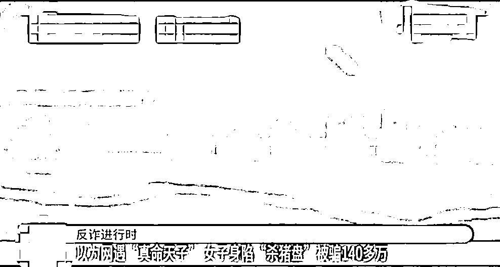
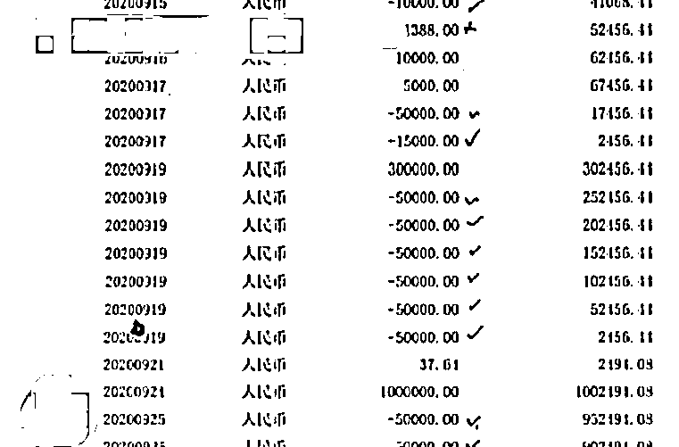
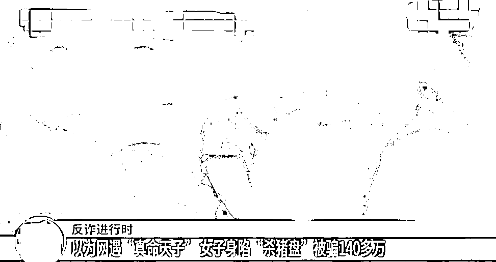
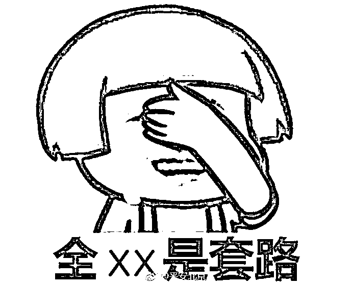

# 网遇“真命天子”？女子被骗 140 万！

> 原文：[`mp.weixin.qq.com/s?__biz=MzIyMDYwMTk0Mw==&mid=2247520912&idx=5&sn=51ebee68777d72e449e7cdfea097bf5f&chksm=97cb59a8a0bcd0be8b7788eaa2da493ae7789ccf79c3046b5549fe5c9aedc61692a51892191e&scene=27#wechat_redirect`](http://mp.weixin.qq.com/s?__biz=MzIyMDYwMTk0Mw==&mid=2247520912&idx=5&sn=51ebee68777d72e449e7cdfea097bf5f&chksm=97cb59a8a0bcd0be8b7788eaa2da493ae7789ccf79c3046b5549fe5c9aedc61692a51892191e&scene=27#wechat_redirect)

**你以为你遇到了你的“真命天子”？** 

**实则是“杀猪盘”!**

[`mp.weixin.qq.com/mp/readtemplate?t=pages/video_player_tmpl&action=mpvideo&auto=0&vid=wxv_2051385424018735107`](https://mp.weixin.qq.com/mp/readtemplate?t=pages/video_player_tmpl&action=mpvideo&auto=0&vid=wxv_2051385424018735107)

无锡江阴的梅女士 2020 年在某短视频平台上认识了一名自称张某的男子，张某**“温柔体贴、单身、做工程的”**，让梅女士以为自己终于遇到了**“真命天子”**。

为了方便聊天，梅女士与张某互相添加了社交账号。在愉快地聊了**5 天左右**后确立了男女朋友关系。随后自称张某的男子 以在**网上投资赚了点钱**为由，建议她要不要一起投资。梅女士就也答应了。

过来一段时间，张某向梅女士介绍了一个所谓的**投资网站**，并指导她在网站上投注买大小和单双。因为这个网站需要**联系客服充值**，梅女士就试着**充了万把块钱**。梅女士没想到很快就提现成功，小赚了一笔。之后，张某继续让梅女士在平台上充值投资。梅女士也比较相信张某，就继续投入。

从 2020 年 9 月 15 日至 9 月 26 日，梅女士在平台上共充值了**140 多万**元。直到 26 日晚上，梅女士想要提现，网站客服却以**账户异常**为由让她**继续支付保证金**。梅女士才察觉出不对劲，赶紧报了案。

警方初步调查发现，梅女士是遭遇了典型的**“杀猪盘”**诈骗，所谓**“高富帅****”**男友也只不过是诈骗团伙编造出来的一个人。

江阴市公安局反诈中心民警夏元说：“我们对这个案件进行研判分析，发现极有可能是蜗居在**缅甸北部**的一个**境外诈骗团伙**所为。”

江阴市公安局城中派出所民警张宁源说：“经侦查，我们确定了相关人员的身份。但是因为嫌疑人当时大多在缅甸，对我们抓捕有很大的影响。”

今年 7 月，江阴警方通过调查发现，该团伙中 14 名嫌疑人已经回国，遂实施抓捕，这 14 名嫌疑人全部归案。

据嫌疑人交代，他们一般会先在网上下载一些**明星、网红的照片**作为头像，再将自己包装成单身、多金的**“高富帅”**。很多被害人被这种假象迷惑，以为自己找到了真爱，根本想不到跟她聊天的其实不止一个人。而他们的作案目标也非常明确，几乎都是锁定国内**30-40 岁左右**的、有一定**经济基础**的女性。

**既然“高富帅”男友是假的，所谓的投资网站当然也是假的!**

夏元说：“事实上这个网站根本**不具备转账提现、充值**的功能。所有的充值、转账都是在后台人为操作的。**你照我说的投，肯定会赢；我想让你亏，你肯定会亏。**”

据了解，该团伙成员锁定被害人后，通常会花 5 天时间来**沟通感情、建立信任**。到第 6 天的时候，就会**在聊天中引入钓鱼网站**。整个诈骗过程其实非常短暂，手段也比较老套，但犯罪嫌疑人却能够利用各种**诈骗话术**，牢牢把握被害人的心理，让被害人深陷其中、无法自拔。

目前，江阴警方已核实到串并案件**30**起，涉案价值**300 余万元**。案件仍在进一步侦办中。

来源：荔枝新闻，江苏网警

← 向右滑动与灰产圈互动交流 →

