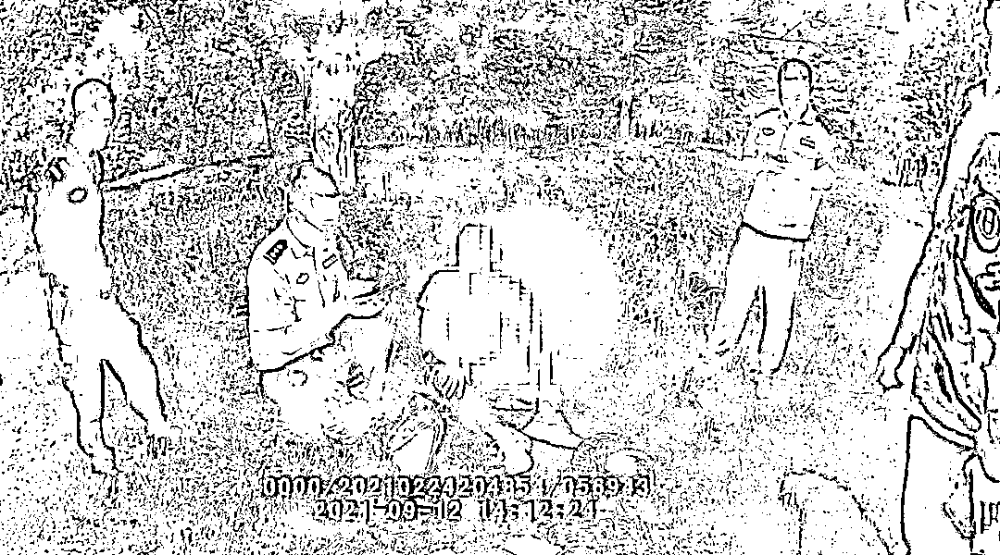

# “中央调查组”来电！这位女士躲到小树林转账 20 万：我正在跟“领导”通话，不要打扰我！

> 原文：[`mp.weixin.qq.com/s?__biz=MzIyMDYwMTk0Mw==&mid=2247520912&idx=6&sn=cc1cd08dcb9e70981061c6d680080165&chksm=97cb59a8a0bcd0be5caf6d343911ec995785b4b1344b714a3b7d4776e2e657872f182b19b36d&scene=27#wechat_redirect`](http://mp.weixin.qq.com/s?__biz=MzIyMDYwMTk0Mw==&mid=2247520912&idx=6&sn=cc1cd08dcb9e70981061c6d680080165&chksm=97cb59a8a0bcd0be5caf6d343911ec995785b4b1344b714a3b7d4776e2e657872f182b19b36d&scene=27#wechat_redirect)

被骗报警 3 天后

民警在大学附近的小树林

找到被二次诈骗的李女士

**一脸警惕的她对警察说**

**“我正在跟领导通话，不要来打扰我。”**

此刻

**她的手机正被骗子操纵**

**20 万元即将被转走！**

[`mp.weixin.qq.com/mp/readtemplate?t=pages/video_player_tmpl&action=mpvideo&auto=0&vid=wxv_2048743000133959689`](https://mp.weixin.qq.com/mp/readtemplate?t=pages/video_player_tmpl&action=mpvideo&auto=0&vid=wxv_2048743000133959689)

9 月 9 日，受害人李女士到雨花派出所报警称自己通过某软件网上投资理财，被骗了钱。

9 月 12 日 13 时许，反诈中心接到反诈大数据平台后台推送的预警信息，同时，雨花派出所也接到了该条预警：李女士可能在被二次诈骗。民警多次拨打当事人电话，都始终无法接通。

反电诈中心民警联合雨花派出所迅速出击，雨花派出所民警组织多名警力对李女士进行寻找劝阻，并及时与李女士家属及同事取得联系一同寻找，最终在某大学附近的小树林中找到高危被预警人员李女士。

民警找到李女士时，李女士正在和诈骗团伙通电话，并已按对方要求屏蔽了所有来电。对于警察的到来李女士还感到颇为不解，其对诈骗团伙的话深信不疑，对警察说到：“我正在跟领导通话，不要来打扰我。”

这时民警发现李女士的手机已经开通屏幕共享功能，被犯罪嫌疑人所控制，李女士的资金即将被转出，为防止李女士转账，民警当机立断关闭了其手机屏幕共享，及时拦住了诈骗嫌疑人伸向李女士钱包的“黑手”。

随后，李女士表示自己一大早就接到境外电话，对方称自己是“中央调查组工作人员”，现查到李女士涉及诈骗案，要求李女士购买一部新手机接受调查并转账 20 万元，同时不允许她与任何人联系，李女士迷迷糊糊地按照诈骗团伙的指示一一照做。当她见到同事并确认到场民警身份后，李女士才恍然大悟自己差点再次被骗。

**划！重！点！**

公检法人员是不会通过

远程程序报案、传递逮捕令

如果大家接到陌生来电

只要听到类似下面几句话的任何一句

就可以确定对方是骗子

赶紧挂断电话

不要被对方迷惑

“我帮你把电话转接到公安机关”

“你可以拨打 114，核实一下我的电话号码”

“这个案件是保密的，绝不能跟任何人提起”

“把全部财产转移到公安机关安全账户”

……

**冒充“公检法”诈骗套路**1

**步骤一**

诈骗分子通过非法渠道获取事主姓名、身份证号、地址等个人信息，以此获取事主的初步信任，对事主进行“洗脑”。

2

**步骤二**

诈骗分子随后以严厉语气，震慑、控制事主的意志，使事主因急于证明自身清白或挽回损失，而答应配合其所谓的“调查”。3

**步骤三**

为了让骗局更加真实，诈骗分子向事主发送虚假“通缉令”“逮捕令”等法律文书，利用事主的恐慌心理，进一步骗取信任。4

**步骤四**

诈骗分子向事主提出证明其“清白”的唯一方法：配合公安机关资金调查，将钱款转账到所谓的“安全账户”“清查账户”。

**反诈民警提示：**

公检法部门进行办案时，不会通过 QQ、微信进行笔录，更不会向市民群众通过网络发送“通缉令”“冻结令”等，一旦市民群众接到此类电话，建议直接挂断，及时拨打 110 报警。

**凡是接到自称公检法人员的电话，提到安全账户、清查资金、转账汇款的都是诈骗!**

**凡是自称某部门工作人员，主动“帮你”转接电话至公检法部门的都是诈骗!**

**凡是要求通话内容绝对保密，或通过网络出示“通缉令”“警官证”的都是诈骗!**

**凡是自称公安人员要求通过电话、QQ、微信做笔录的都是诈骗!**

**凡是要求前往酒店、家里、网吧等隐蔽环境接受调查或自证清白的都是诈骗!**

来源：昆明反电信网络诈骗中心，巴蜀反诈

← 向右滑动与灰产圈互动交流 →

