# "郭美美，你的二郎腿不要翘，好吧"

> 原文：[`mp.weixin.qq.com/s?__biz=MzIyMDYwMTk0Mw==&mid=2247520967&idx=2&sn=9f8a3793f4c9f71527dad2d402e5b63c&chksm=97cb59ffa0bcd0e97626c763346b76652d6995057a4c2a8cec58f74274120b6a23a22d86f8b5&scene=27#wechat_redirect`](http://mp.weixin.qq.com/s?__biz=MzIyMDYwMTk0Mw==&mid=2247520967&idx=2&sn=9f8a3793f4c9f71527dad2d402e5b63c&chksm=97cb59ffa0bcd0e97626c763346b76652d6995057a4c2a8cec58f74274120b6a23a22d86f8b5&scene=27#wechat_redirect)

网红、卖减肥药、熟悉的面孔、犯罪嫌疑人，名叫郭某某，几个“关键词”一出，具体是谁想必大家已经知道了。 

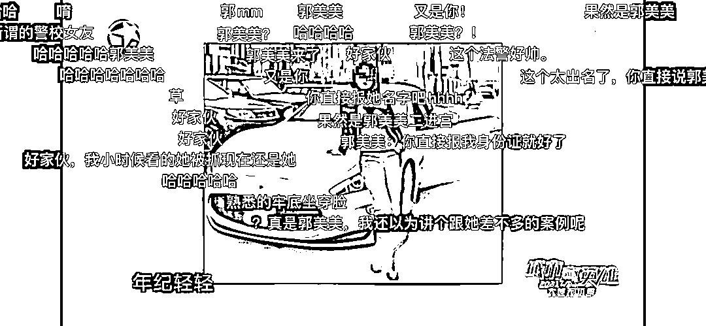

没错，就是郭美美！

昨晚（17 日），上海警务侦查纪录片《大城无小事·城市真英雄 2021》播出的最新一期中，曝光了郭美美案更多细节及抓捕、审讯现场。比如，她坚称自己对所售卖减肥药品中含有西布曲明一事不知情，审讯现场，还翘起了二郎腿，民警当场制止。

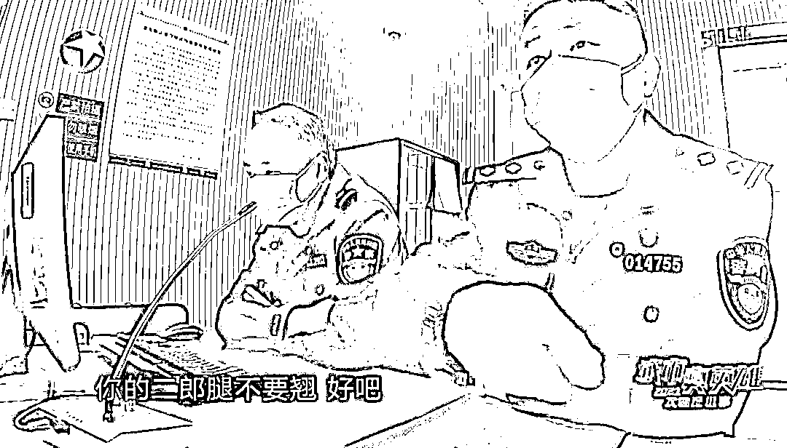

去年 11 月，浦东分局经侦支队的民警接到举报，有微商在销售一款减肥糖，每盒 699 元，号称减肥效果非常明显。

然而，很多买过的网友在网上发帖，吃完减肥糖，瘦是瘦了，可副作用极其明显，睡不着觉、心慌、手抖、头晕……

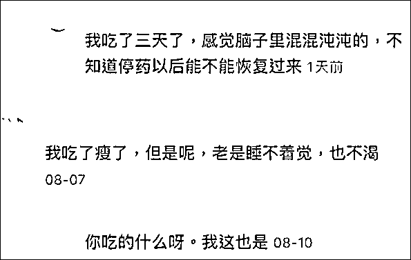

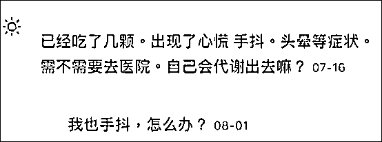

警方调查发现，原来这款减肥药里含有国家明令禁止添加的西布曲明成分。西布曲明是一种中枢神经抑制剂，食用者会产生血压升高、心率加快、厌食、失眠、肝功能异常等副作用，严重者会导致猝死。早在 2010 年，我国食品药品监督管理局就要求停止西布曲明生产、销售和使用。

由于此案涉及“微商”这种模式，警方研判，此案的犯罪嫌疑人涉及分销商、生产商等多人，这些人分散在全国不同地方。

今年 3 月，浦东分局经侦支队各路人马分赴全国各地，在当地警方的支持下，对涉案人员集中抓捕，同时找到了三个非法生产基地。

所谓生产基地， 就是这种看起来是仓库的地方，买点原材料，自己混合一下，变成玫红色的小药丸。

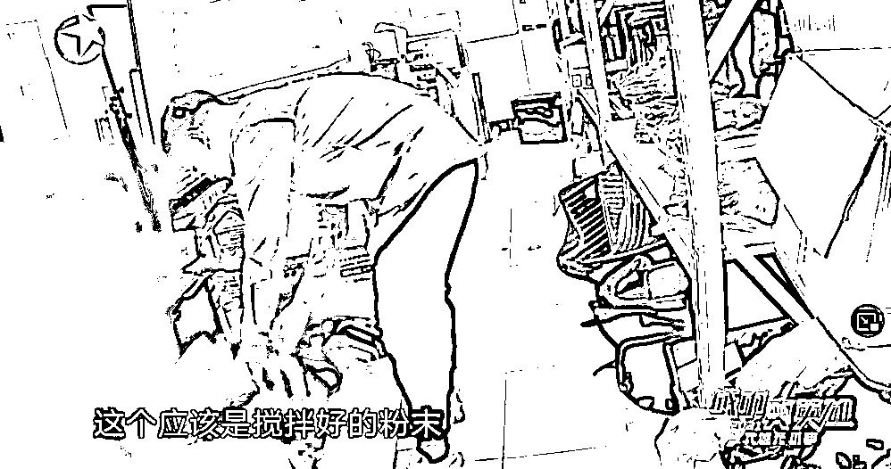

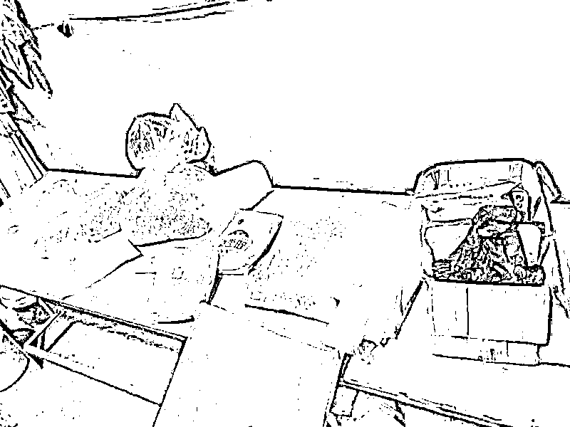

明知故犯的嫌疑人会将这些产品装在不同的分装袋子里，有些为了规避快递公司查验，会将这种小药丸装在猫粮、狗粮袋子里。

原来一颗药丸的成本价是 8 毛，可经过两级分销商加码，到达顾客手里后，一粒高达 69 元。

因此，就这么一袋看似不起眼的“狗粮”，最终能卖 100 多万。

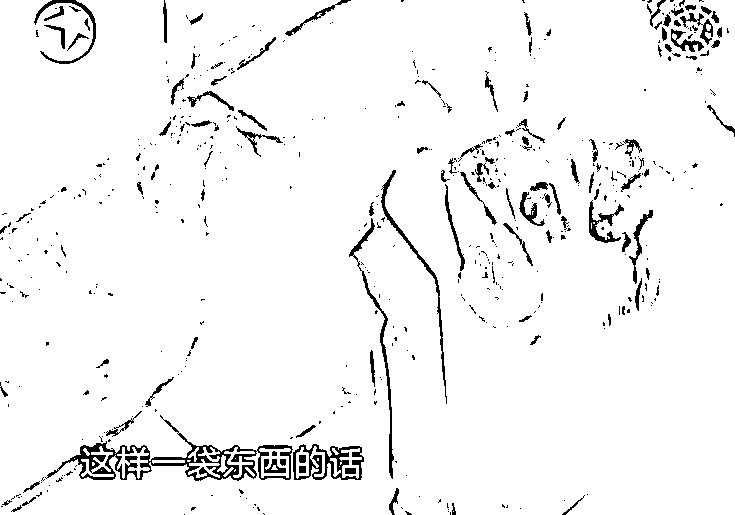

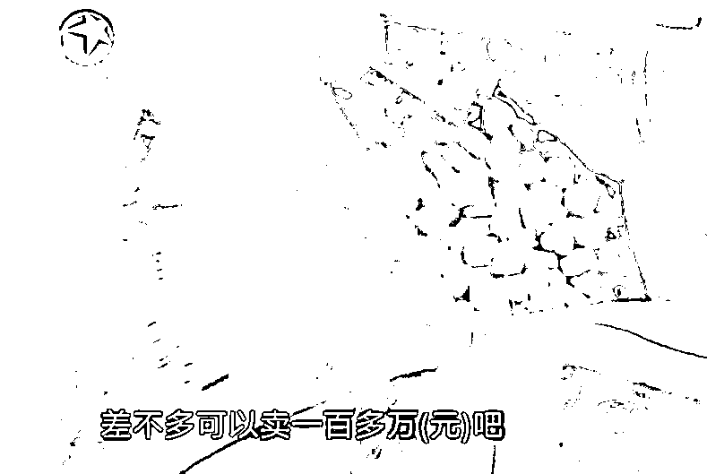

在抓捕到的销售商中，就有郭美美的身影。

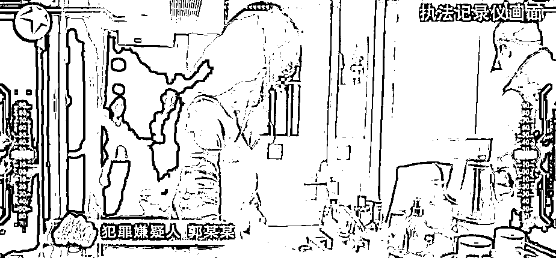

2014 年，郭美美因涉嫌开设赌场罪被抓，警方查明她以每次高达数十万的价码，多次进行性交易，随后，郭美美被判刑五年。2019 年 7 月刚刚出狱。

如今，出狱不到两年又被抓，弹幕也一片震惊。

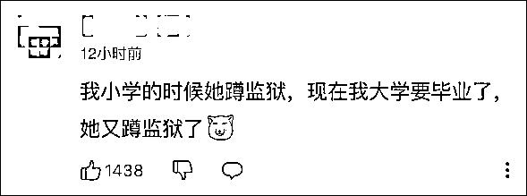

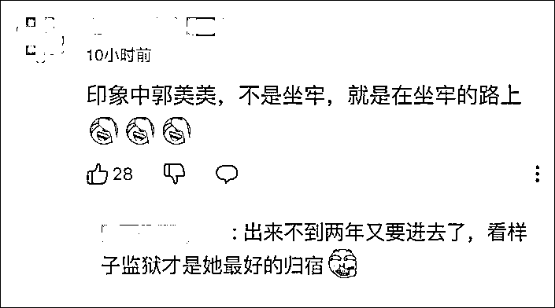

审讯过程中，郭美美态度随意轻浮，甚至翘起了二郎腿，随后被民警及时制止。她自称什么都不知道，“我 1 月 20 日才开始卖（减肥糖）的，我到现在都是懵的”，还称“我是认罚的，不能说自己不知道就不认罪认罚”。

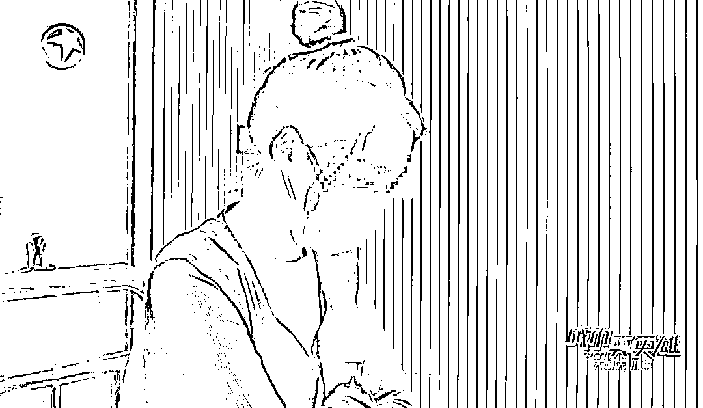

经过前期数月的缜密侦查，今年 4 月份，上海经侦支队民警先后抓获涉嫌生产、销售有毒有害减肥类保健食品的嫌疑人曾某某、周某某、郭某某等 75 人。捣毁生产窝点 3 处、销售窝点 24 处，现场查获有毒有害减肥类保健食品 65000 余粒、生产原料约 34 公斤、生产设备 3 台以及外包装 20000 余件，涉案金额达 5000 万余元。涉案嫌疑人因涉嫌生产、销售有毒有害食品罪被警方依法采取强制措施。

7 月，上海铁路运输检察院（下称“上海铁检院”）依法对郭某某等 13 人以销售有毒、有害食品罪提起集中公诉。

今年 8 月 13 日，上海铁检院公开审理了这个销售有害食品案件，郭美美表示认罪，公诉机关建议对其判处有期徒刑 2 年 9 个月，法院未当庭宣判。郭美美当庭痛哭，说她自己从 2014 年就出事坐牢，出狱后仅一年再次被抓，她表示很后悔，“我觉得自己活得挺失败，今年都 30 岁了，好像做什么都是错。”

来源：观察者网

← 向右滑动与灰产圈互动交流 →

