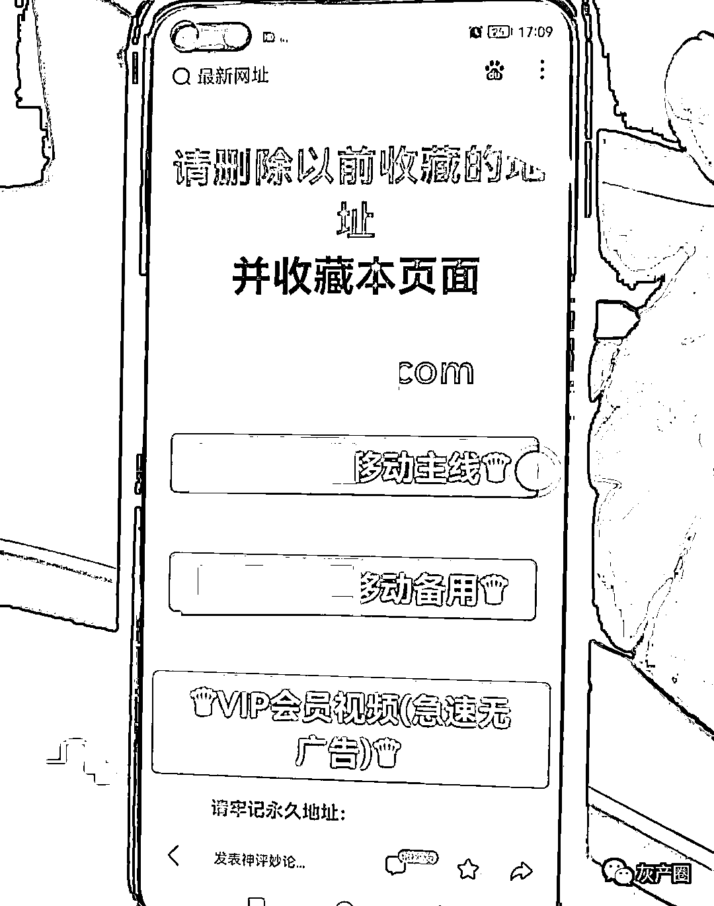
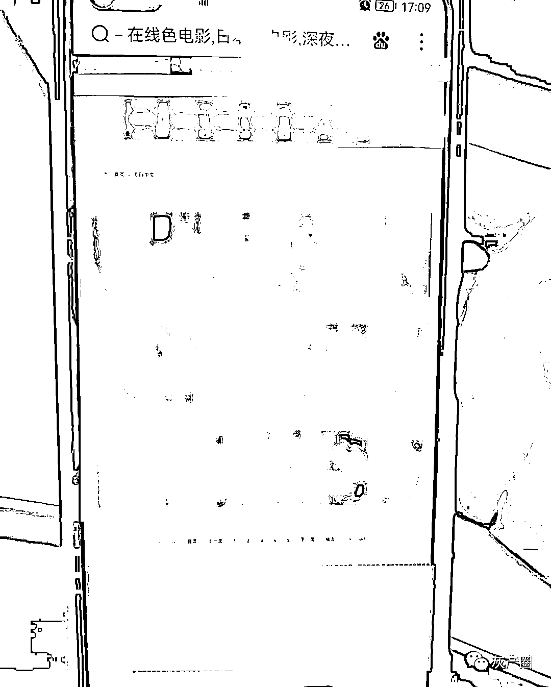
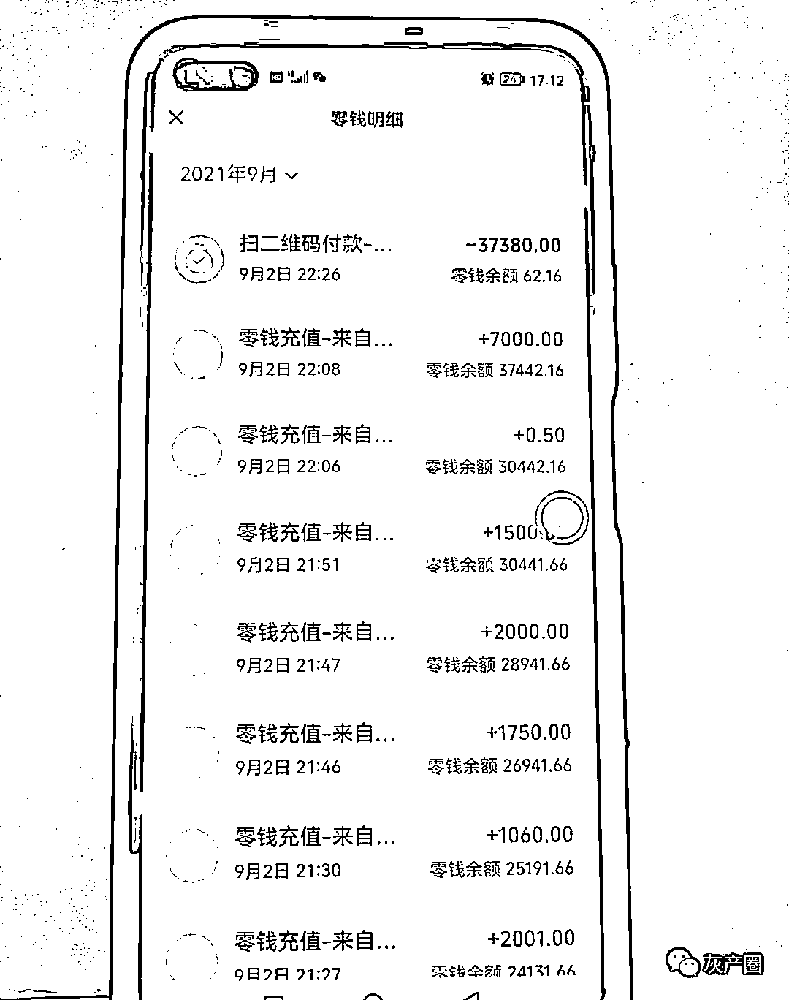
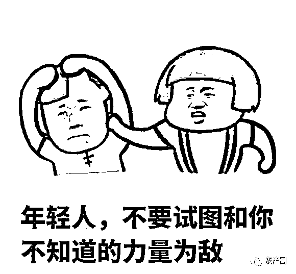

# 不要以为在色情网站上赌博会没事，“被洗钱”了你知道吗？

> 原文：[`mp.weixin.qq.com/s?__biz=MzIyMDYwMTk0Mw==&mid=2247520967&idx=3&sn=4059984bfc7c27dc1112b9adb4e9aa3d&chksm=97cb59ffa0bcd0e930718a0f68f0b94a8030101397ff68101208645a95f81b5d6eacc09797c3&scene=27#wechat_redirect`](http://mp.weixin.qq.com/s?__biz=MzIyMDYwMTk0Mw==&mid=2247520967&idx=3&sn=4059984bfc7c27dc1112b9adb4e9aa3d&chksm=97cb59ffa0bcd0e930718a0f68f0b94a8030101397ff68101208645a95f81b5d6eacc09797c3&scene=27#wechat_redirect)

出租、出售、出借个人账户等 

被利用于电信网络诈骗的

一旦触及“帮信罪”将受到相关惩戒

我市阜沙 W 先生

没有出租、出售、出借

但他的银行卡却被惩戒了

这到底是什么原因引起的呢？

仅输了几百块的网络赌博

资金流转却高达七万多

01

浏览 HS 网站参与网络赌博

9 月 2 日，W 先生闲来无聊，在浏览色情网站过程中弹出美女界面，写着充值多少送多少的赌博邀请。酒后的 W 先生没控制住自己，于是注册了账户开始玩起网络赌博。刚开始赢得特别容易，对方让 W 先生把银行卡照片发过去，钱就会打到银行卡，可越到后面却越来越难赢。W 先生只要一输，对方就发二维码让他支付。

02

仅输几百块钱，资金流转达到 7 万多

W 先生玩了两三个小时，在 W 太太回家后就停了下来。虽然时间不短，但也仅输了几百块。然而 W 先生却发现自己的银行卡被公安机关冻结了。这张是 W 先生的工资卡，冻结了可咋整？W 先生瞬间成了热锅上的蚂蚁。

03

最终还是被惩戒

原来 W 先生此次参与网络赌博，他银行卡的流入资金流高达 7 万多元，其实是被诈骗团伙利用于洗钱，W 先生过程中进入的“赢钱”实则是电信网络诈骗的赃款。根据《中国人民银行广州分行、广东省公安厅关于联合建立出租、出借、买卖银行卡及账户的涉案单位和个人惩戒机制的通知》，W 先生 5 年内将被暂停在广东省开立的银行账户非柜面业务以及支付账户的所有业务，并不得在广东省内新开账户。

小编提醒

网络赌博是违法行为

还可能被利用洗钱

最少将面临银行账户被冻结的惩戒

请广大市民注意

切勿参与网络赌博

更不要出租、出借、出售个人账户

不要让自己成为不法分子的帮凶

不要给生活造成不便

来源：中山市反诈骗中心

← 向右滑动与灰产圈互动交流 →

