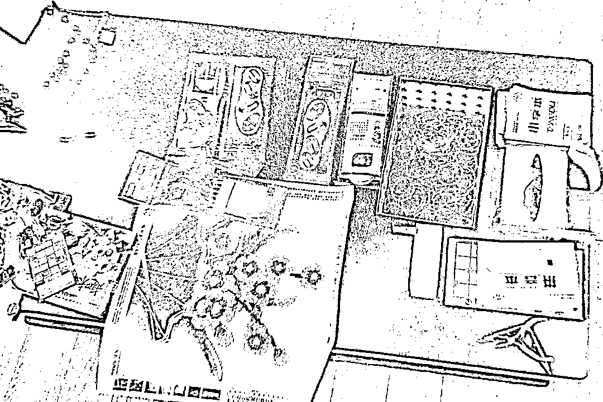
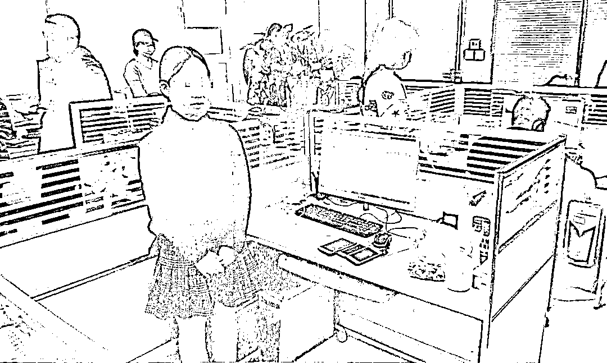

# 18 万多人被骗、涉案金额高达 1.31 亿元的骗局：绣鞋垫、串手珠的手工兼职背后......

> 原文：[`mp.weixin.qq.com/s?__biz=MzIyMDYwMTk0Mw==&mid=2247520967&idx=4&sn=f36a84c58cf29ea4a878a6f1d3262a5b&chksm=97cb59ffa0bcd0e9141c4e38a79160a47d55e900930bd71a332024170fc23ef880cc00ae571b&scene=27#wechat_redirect`](http://mp.weixin.qq.com/s?__biz=MzIyMDYwMTk0Mw==&mid=2247520967&idx=4&sn=f36a84c58cf29ea4a878a6f1d3262a5b&chksm=97cb59ffa0bcd0e9141c4e38a79160a47d55e900930bd71a332024170fc23ef880cc00ae571b&scene=27#wechat_redirect)

  做点轻松的手工活

就能至少日赚 100 元

多交入职费还能晋升管理层 

这样的好事

心动之前可要擦亮双眼

金玉其外 

内里却隐藏着一个上亿元的阴谋

“轻松”的兼职

2018 年，方某梅偶然间在网上看到一则兼职招聘信息，说是做手工活就可以赚钱，她立刻动了心。

“**公司设置了三个档次的‘入职费’，兼职 488 元、代理 688 元、总代 988 元**，做代理可以通过招收新人拿提成，差不多可以拿到新加入人员‘入职费’的 60%左右；如果做总代，除了可以拿提成，还可以在招收满 100 个新人后晋升为组长，承担一定的管理职责，每月领固定工资。” 方某梅交代。

方某梅交了 988 元的入职费用，准备大赚一笔。

交了“入职费”没几天，她就收到了公司寄来的手工活半成品，包括手珠、鞋垫、抱枕等。按照公司招聘时的说法，她只要用针线将鞋垫、抱枕上的图案绣出来，然后将成品寄回公司，就可以得到报酬。

事实并非如此。

“鞋垫和抱枕很难绣，就算我一直不间断绣，也要 4 到 5 天才能绣完一双鞋垫。如果把公司寄来的半成品全部绣完，**需要不间断绣一个多月，而报酬只有 100 多元**。”方某梅交代。原来公司是故意把非常难绣的半成品寄给他们，目的就是让他们无法完成，为领取报酬设置障碍。

发给被害人的半成品 

被害人詹某对此深有感触，“在公司发布的招聘广告中，需要做的手工活都是非常容易的，而实际收到的半成品非常难绣。我尝试了一下，估计一个月都绣不完，投入和回报明显不划算。” 但由于被骗金额不大，詹某没有选择报警。

走向“高层”的道路

当方某梅发现绣手工活无法赚到钱后，她开始招聘新人。 

“会发一些广告，内容一般是‘手工活简单易做，在家就能赚钱，随机发货简单手工’等。” 方某梅交代，“1 个月我就招满了 100 人，除了可以拿每个新人‘入职费’的提成，还晋升为组长，每月有 2000 元固定底薪。”

当上了组长后，就有了一定的管理职责。组长会把交完“入职费”的兼职人员拉到群里，每天在群里发结算、支付报酬的图片，以此制造其他兼职人员都赚钱的假象。“**其实这些图片都是假的，是 PS 合成的，目的就是为了让他们觉得完不成手工活是自己个人的原因，不是公司的原因，防止他们报警**。” 方某梅交代。

由于方某梅“善于管理”，到了 2018 年底，她已经成为了公司的“高管”，主要工作变成了研发“产品”、研究 “话术”、提升团队“业绩”、应对“负面舆情”等。

针对被害人可能提出的问题，方某梅等人会事先准备“话术”，让“讲课老师“把“话术”发到客服群中，以便统一回复。有时候方某梅等人也会研究新的“产品”，比如鞋垫特别难绣，大家的意见很大，就要用有其他难绣的手工活去替代鞋垫。最终，方某梅成为犯罪集团中仅次于闫某志、李某丽的重要人物。

诱骗加盟费，东窗事发

2019 年 6 月 9 日，浙江省嘉兴市嘉善县公安局罗星派出所接到报案，报案人称自己在做手工兼职工作过程中共支付 1388 元后，对方就再也联系不上。浙江省嘉兴市嘉善县公安局于 2019 年 6 月 11 日立案。随后，警方陆续抓捕了闫某志、李某丽和方某梅，并进行讯问。

2021 年 2 月 8 日，浙江省嘉兴市人民检察院指控三人犯诈骗罪，向浙江省嘉兴市中级人民法院提起公诉。

法院经审理认为，2018 年以来，被告人闫某志、李某丽以非法占有为目的，招募被告人方某梅等人，先后以“领航国际”、“尚美工艺”和“新创电商”公司名义，在微信朋友圈等网络平台推广手工活，宣称入职后可无限期领取手工活，虚构手工活简单易做、日赚百元的事实，伪造虚假收入照片，诱骗被害人交纳加盟费。

被害人交纳加盟费后，被告人闫某志、李某丽、方某梅等人利用拖延结算、发货时间，延长被害人回货周期、加大手工活难度等手段，迫使被害人放弃完成手工活或者继续领取手工活，从而达到非法占有加盟费的目的。被害人寄回的车挂、鞋垫、钻石画及珠串等手工活成品，堆放在陕西、安徽等地的仓库内，未进行正常的销售活动。被告人闫某志、李某丽等人还通过设立组长群、高层群等大量微信工作群对诈骗活动进行管理，设置组长、高层助理、高层等职务管理诈骗人员。 

2018 年 1 月至案发，被告人闫某志、李某丽等人通过上述方式累计诈骗 18 万余人次，累计诈骗金额达 1.31 亿余元。被告人方某梅累计诈骗金额达 1.27 亿余元，获取违法所得 62.5 万余元。

公司“办公”场所

2021 年 8 月 9 日下午，浙江省嘉兴市中级人民法院对这起涉案金额高达 1.31 亿余元的诈骗案一审公开宣判。

犯罪集团首要分子、主犯闫某志被判处无期徒刑，剥夺政治权利终身，并处没收个人全部财产；主犯李某丽、方某梅分别被判处有期徒刑十四年、十二年，剥夺政治权利四年、二年，并处罚金。犯罪集团其他被告人另案处理。

普法时间

《中华人民共和国刑法》第二百六十六条规定：诈骗公私财物，数额较大的，处三年以下有期徒刑、拘役或者管制，并处或者单处罚金；数额巨大或者有其他严重情节的，处三年以上十年以下有期徒刑，并处罚金；**数额特别巨大或者有其他特别严重情节的，处十年以上有期徒刑或者无期徒刑，并处罚金或者没收财产**。

被告人闫某志、李某丽、方某梅等人以非法占有为目的，组建诈骗犯罪集团，利用电信网络技术手段，虚构事实、隐瞒真相，骗取他人财物，数额特别巨大，其中被告人闫某志、李某丽涉及诈骗金额 1.31 亿余元，被告人方某梅涉及诈骗金额 1.27 亿余元，其行为均已构成诈骗罪。

被告人闫某志系犯罪集团首要分子、主犯，依法应当按照集团所犯全部罪行处罚。被告人李某丽、方某梅在共同犯罪中，地位、作用显著，均系主犯，应按其组织、领导或参与的全部犯罪论处。被告人方某梅到案后能够如实供述自己的罪行，依法可以从轻处罚。法院遂依法作出上述判决。

来源：潇湘晨报，巴蜀反诈

← 向右滑动与灰产圈互动交流 →

