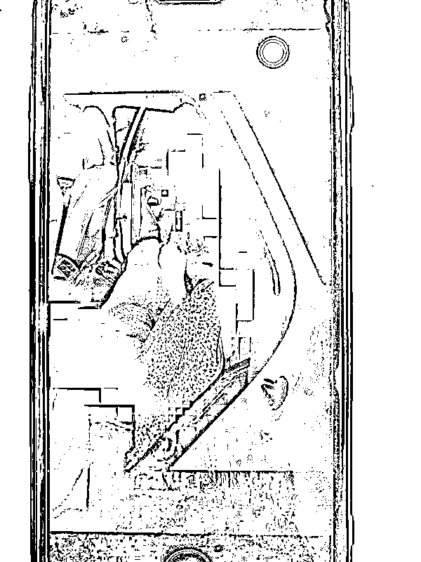
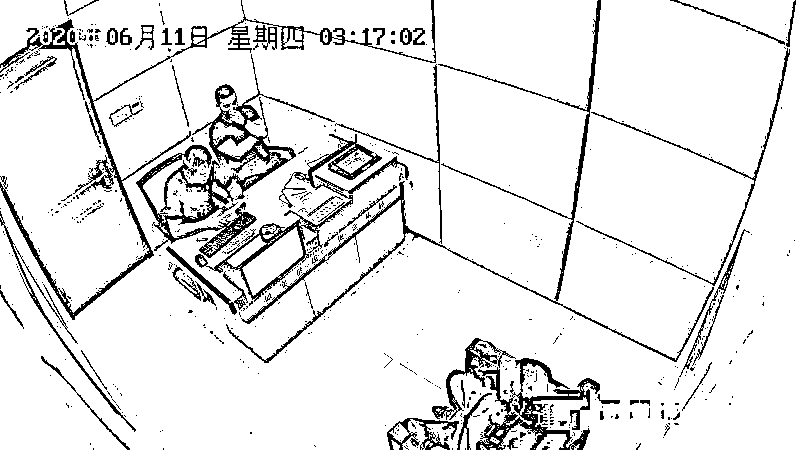

# 专门敲诈“在地库里震(che)动(zhen)的车子”：一个月他们得手 7 次！

> 原文：[`mp.weixin.qq.com/s?__biz=MzIyMDYwMTk0Mw==&mid=2247521025&idx=2&sn=4c0ea674ab7528a5e61b780adce1e151&chksm=97cb5839a0bcd12f5d7694412d210fa33a5453819140c552a118318447113b952e264a03a649&scene=27#wechat_redirect`](http://mp.weixin.qq.com/s?__biz=MzIyMDYwMTk0Mw==&mid=2247521025&idx=2&sn=4c0ea674ab7528a5e61b780adce1e151&chksm=97cb5839a0bcd12f5d7694412d210fa33a5453819140c552a118318447113b952e264a03a649&scene=27#wechat_redirect)

杨某和王某是杭州某物业服务公司的保安，两人经常有目的地去地下车库巡逻，**一旦发现有车子“震动”，就立马冲上去，一人负责手电筒打光，一人负责拍照。**拍完照片后，就扬言要曝光，而受害人往往会因个人隐私选择“花钱消灾”。 

500 元、1000 元、2000 元……每次尝到甜头后，杨某和王某觉得这真是个万无一失的行当。随后，胆子也来越大，“费用”也越要越多。

直到遇到了“不按套路出牌”的季先生。

俗话说：**“常在河边走，哪有不湿鞋。”**这句话用在犯罪嫌疑人杨某和王某身上太合适不过了。

6 月 10 日，杨某和王某在地下车库再次发现“震动”车辆，由于前几次的成功经验，所以在这次敲诈过程中，杨某提出要 2000 元的“封口费”。

**然而，这次的受害人季先生的态度比较强硬，只愿拿出 400 元。**

杨某和王某决定见好就收。

谁曾想，**等两人把照片删除后，季先生便选择了报警。**

接警后，杭州钱塘新区义蓬派出所民警马康明迅速赶到现场。根据报警人季先生的描述，找到了保安杨某和王某，并将两人传唤至派出所调查。

经审查，杨某和王某对自己敲诈勒索的犯罪事实供认不讳。

据杨某和王某交代，今年 5 月初，两人在地下车库巡逻时，无意中发现偏辟处有一辆奇怪的轿车。车子停着却未熄火，而且车身还在不停地摇动。

俩人猜想肯定有人在玩“车震”。于是，杨某便将照片偷偷拍下，然后开始拍打车窗：**“你们在干什么？我要报警了”。 **

男的衣冠不整地下来恳求道：“大哥，我只是偶尔出来玩玩，求你了，不要报警......”

杨某抬起右手，把拇指和食指搓揉给受害人看。受害人明白，这是要钱的手势，就说：“大哥，辛苦了，去买点烟抽抽吧.....那个照片能不能删掉呀。”边说边递上 500 元现金，希望两人能把照片删掉。

杨某和王某相视一眼，**拿了钱，删掉照片就走了。**

就这样，初尝甜头的杨某和王某**开启了“生财之道”。**

杨某和王某觉得，来这种地方“车震”的，基本都是偷情的，料着人家也不敢报警。于是，两人经常相约，利用职务之便，在值班巡逻时，特意在偏辟处、车辆少的地方转悠，专盯这样“特殊”的轿车，实施敲诈。

5 月底，杨某和王某两人照例在地下车库寻找目标，他们锁定了一辆车体晃动的黑色福特。

按照惯例做法，拍好照后，杨某便说道：“你们在干什么，我要打电话报警曝光。”

受害人一听便紧张了，“不要报警了，我给你点钱买点香烟”。于是，拿出 300 元给杨某。

杨某随口说了句，少了点。受害人一听就急了，连忙用微信转了 1000 元给杨某。随后，杨某删掉照片并要求受害人删除转账记录。

事后，杨某通过微信，转给王某 500 元。

直到遇到季先生，两人才落入法网。**此时，杨某和王某已成功得手 7 次。**

目前，犯罪嫌疑人杨某和王某因涉嫌敲诈勒索被警方依法刑事拘留，案件还在进一步侦办中。

 来源：巴蜀反诈

← 向右滑动与灰产圈互动交流 →

