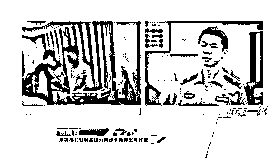
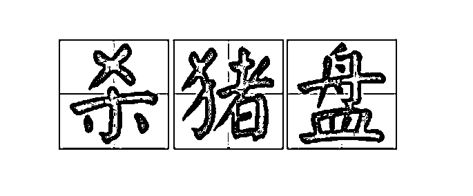
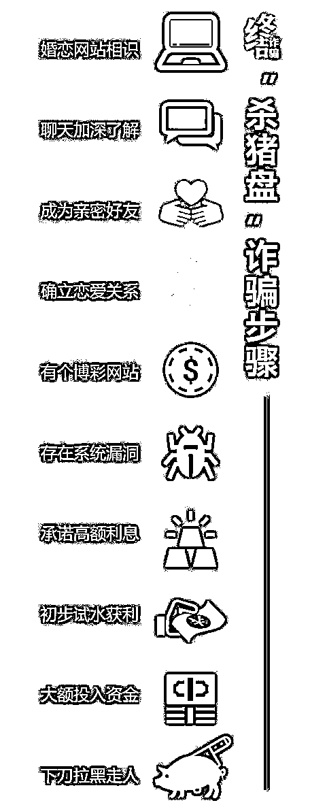
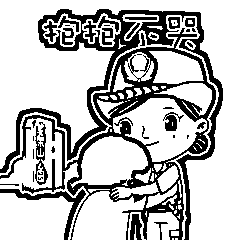

# 警惕！一女子被骗 690 余万元……

> 原文：[`mp.weixin.qq.com/s?__biz=MzIyMDYwMTk0Mw==&mid=2247521025&idx=4&sn=14e8c028eb7b90053ef655bdbef827f8&chksm=97cb5839a0bcd12f9b7ff834524a7e54bf54c9745fedad1e2e74bf442591721718e671f80222&scene=27#wechat_redirect`](http://mp.weixin.qq.com/s?__biz=MzIyMDYwMTk0Mw==&mid=2247521025&idx=4&sn=14e8c028eb7b90053ef655bdbef827f8&chksm=97cb5839a0bcd12f9b7ff834524a7e54bf54c9745fedad1e2e74bf442591721718e671f80222&scene=27#wechat_redirect)

茫茫人海中

隔着手机屏幕

温柔深情的“高富帅”

眼光独到的“投资才俊”

处处细致入微

时时嘘寒问暖

试问

有几个女生

抵挡得住这样的“春风拂面”？

但有的甜蜜背后

却暗藏着巨大陷阱！

[`v.qq.com/iframe/preview.html?width=500&height=375&auto=0&vid=wxv_1975719380625702919`](https://v.qq.com/iframe/preview.html?width=500&height=375&auto=0&vid=wxv_1975719380625702919)

**观看《深圳警讯》节目完整视频↑**

**# 案件分析 #**

2019 年 8 月 1 日，深圳市公安局盐田分局接事主陈某报案称，其在网上认识一名男子，恋爱一段时间后，在对方推荐下投资虚拟货币，被骗 690 余万元人民币。

接报后盐田分局立即开展侦查，发现藏匿于某外国的诈骗团伙，初步研判涉案人员有数十人。

目前直接诈骗事主的黄某已抓捕归案，并对其在某外国从事电诈活动，于 2019 年诈骗事主 690 余万元的事实供认不讳。

甜言蜜语后

等待她的却是接踵而至的噩梦

数百万投资和一片真心

全部打了水漂

原来

小陈邂逅的并非是美丽的爱情

而是血本无归的***“杀猪盘”诈骗***

现实生活中还有许多人和小陈一样

在陌生网友的感情攻势之下沦陷

进而被以“投资”“副业”

等名义诈骗

直到对方消失或投资款无法提现

才恍然大悟被骗

但为时已晚

在骗局中投入感情的那个人被骗子称为***“猪”***建立信任叫***“养猪”***下手诈骗叫***“杀猪”***这种著名的骗局有个很形象却又残酷的名字

**诈骗套路解析**

**1.通过各种渠道寻找目标**

骗子会通过聊天软件或婚恋网站搜索加好友，通常会锁定财富相对丰厚，且对情感有一定需求的人。

**2.利用虚拟网络打造高端人设**

骗子惯用的人设大多爱生活、更爱投资理财，经常会在社交平台发高颜值、展示高品质生活的照片。

**3.随时陪伴取得信任**

骗子添加了好友后，会利用嘘寒问暖，甜言蜜语，对你关怀备至，让你深陷“热恋”，取得你的信任之后，伺机问你对投资有没有兴趣，潜移默化地用各种话术逼你就范。大多数人就会试着小额投入几笔，骗子会通过后台操作，让你小赚几笔。

**4.引诱到虚假平台进行投资**

当你初次投资尝到甜头之后，骗子会声称自己已经掌握了这个平台的规律，只要跟着他（她）投资稳赚不赔。这时，你已经深信不疑，便往平台里面大量投入。

**5.销声匿迹**

等到受害人投入大量金额之后，看到平台金额并未增加，准备将里面的金额提现，发现提不出来。再想与对方交涉时，骗子已经销声匿迹。等到受害人恍然大悟，发现自己上当受骗后，已经为时已晚。

（图片来源：终结诈骗）

**深圳警方在此提醒**

**不要轻易相信**

**突然对你嘘寒问暖的贴心人**

**热心带你发财的好心人**

**他们可能是“骗子”**

**渴望爱情是人类的天性**

**希望大家追逐理想爱情的时候**

**不要忘记多留一份警惕**

**一旦发现遭遇诈骗**

**请保留好证据**

**及时拨打 110 报警**

来源：深圳公安，阻击诈骗

← 向右滑动与灰产圈互动交流 →

