# 被骗 110 万！波士顿大学中国留学生坠入诈骗陷阱，对方自称“政府官员”...

> 原文：[`mp.weixin.qq.com/s?__biz=MzIyMDYwMTk0Mw==&mid=2247521069&idx=1&sn=474daeed5b8e533f527158814a1c03ef&chksm=97cb5815a0bcd1034689f1785b3104622a5a5ce1ba3aa1f9cbcbf12f8cceff9ffa130667cdc4&scene=27#wechat_redirect`](http://mp.weixin.qq.com/s?__biz=MzIyMDYwMTk0Mw==&mid=2247521069&idx=1&sn=474daeed5b8e533f527158814a1c03ef&chksm=97cb5815a0bcd1034689f1785b3104622a5a5ce1ba3aa1f9cbcbf12f8cceff9ffa130667cdc4&scene=27#wechat_redirect)

国外大学开学了，骗子也迎来了“旺季”...开学不到两周，波士顿大学就公布了多起涉及学生的电信诈骗案件：冒充慈善机构、电信公司、政府部门……

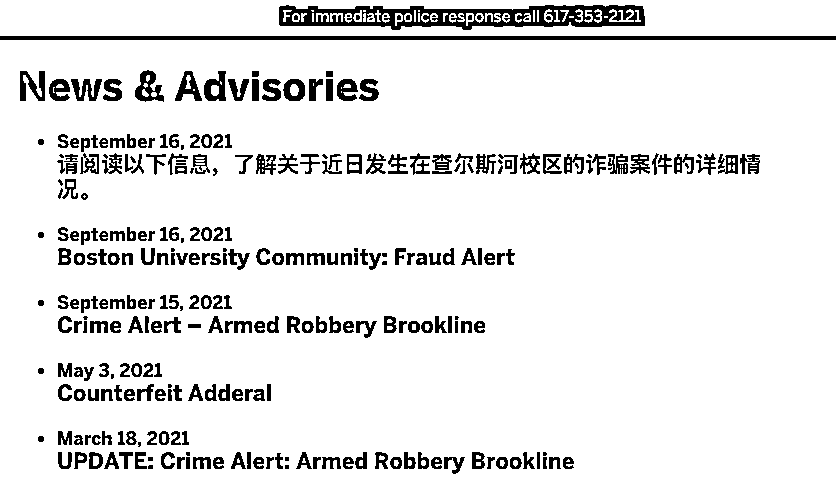

**波士顿大学在官网上直接贴出中文警示中国留学生**

据悉，自 9 月初以来，两名波士顿大学的中国留学生被不法分子**骗走超过 175,000 美元，合计超过 110 万人民币！**

根据警方披露的信息，案件 1 情况如下：2021 年 9 月 15 日，一名波士顿大学的学生首先接到了陌生人来电，来电人**自称为任职于中国政府的工作人员**。来电人在通话中**指责学生参与了一起犯罪案件**，并通过精心设计的手段将来电号码**伪装成中国驻美使馆的电话号码**，进一步**欺骗学生与一名身着官方制服的人员进行视频通话**。嫌疑人告诉学生解决该问题的唯一方式是向海外账户汇款。该名学生在联系波士顿大学校警前**通过几次交易向该账户共汇汇款$150,000 美金。**

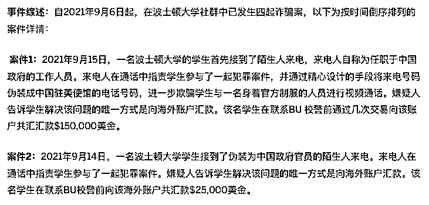

案件二情况如下：2021 年 9 月 14 日，一名波士顿大学学生接到了**伪装为中国政府官员的陌生人来电**。来电人在通话中**指责学生参与了一起犯罪案件**。嫌疑人告诉学生解决该问题的唯一方式是向海外账户汇款。该名学生在联系 BU 校警前**向该海外账户共汇款$25,000 美金。**

很多留学生家长担心孩子在海外的各种安全问题，没想到，最大的危险居然是来自“同胞”！ 

诈骗者还通过视频与学生交谈，视频里显示他们穿着**正式的制服**。他们“使用”了中国大使馆的**实际电话号码进行呼叫**（其实是使用了非法的虚拟呼叫软件，伪造了来电号码）。

诈骗者随后告诉学生，解决问题的唯一方法是电汇。**在联系警方之前，这名学生分期转账支付了 15 万美元。**

波士顿大学在学校的官网上同样**用中文告诫中国留学生如何防止电信诈骗。**其中包括：如何识别网络骗子、不要相信陌生人电话、不要轻信承诺而付款、审视支付方式、向身边人征询等等。 

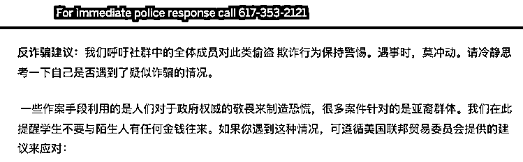

这已经不是第一次针对留学生的骗局发生。去年，一位留美的王同学接到了一通电话，自称是美国警察局，说王同学本人涉嫌诈骗等严重违反美国法律的事情，会被遣返。对于没有做过这类事情的王同学肯定分外慌张，告诉“警察”他没有做过。**于是“警察”让他汇款两万美元到指定账户，帮助他审核案件，并且嘱咐他不要去旁人接触，否则会有危险。**

于是，“天真的”王同学，独自跑到了郊区的公园静坐了很久，也不敢和别人联系。还好王同学不是真正的出事，而两万美元也就当花钱买个教训了。

**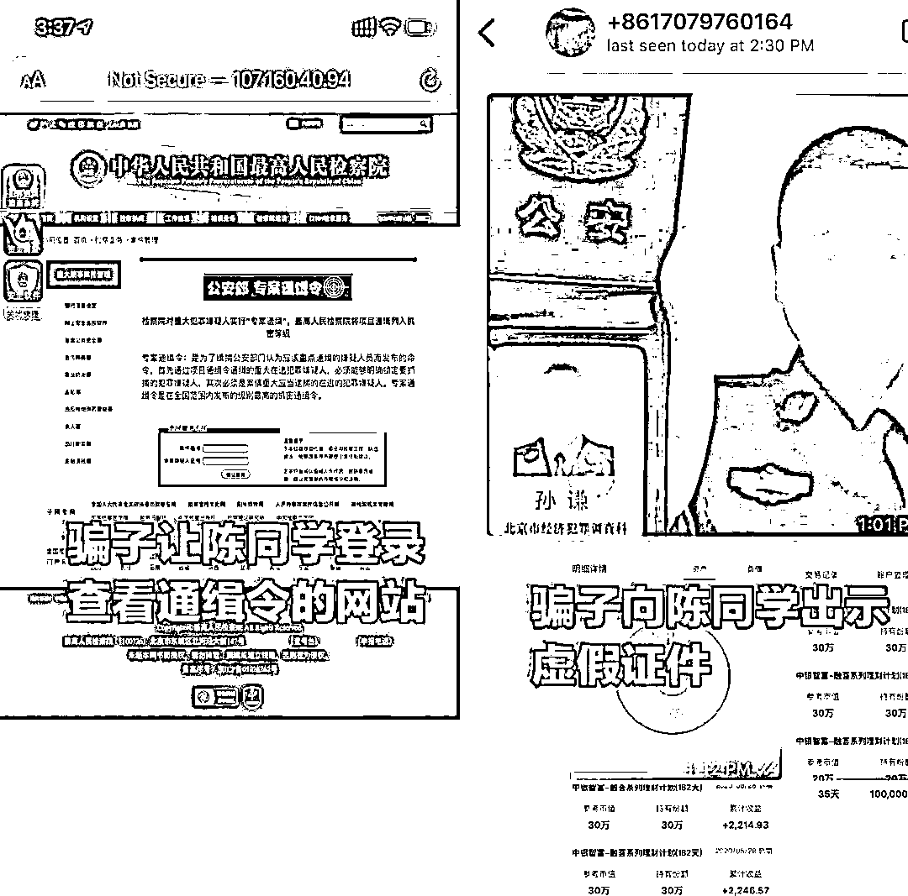类似骗局的常见套路**

**另外，一些骗子还会称自己是 IRS（美国税务局），声称受害人没有交税要被驱逐出境。**对方还直接说出了留学生的学校、专业、家庭住址等信息，并说如果不补税，立刻会被遣返。

波士顿大学是美国著名的大学之一，排名常年位居美国大学排行榜前 50。学校有超过 1 万名的国际学生，其中中国学生 4000 多人，是广受中国学生欢迎的美国大学之一。 

最近几年，针对留学生的电信诈骗案层出不穷。犯罪分子瞄准留学生大多来自经济殷实家庭；同时留学生刚来国外，对国外的法律、文化尚不熟悉，**在陌生环境下更容易上当受骗。**

中国驻海外的使领馆此前多次警示留学生提防电信诈骗，也披露过多起留学生被骗案件。但 2021 年秋季刚一开学，又有学生被骗，真是防不胜防啊！

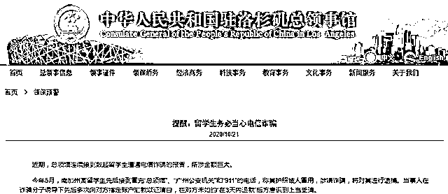

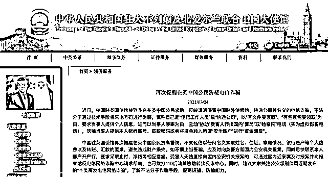

自出国以后，许多在海外各国的华人、留学生及其在国内的家长，就成了诈骗分子盯上的目标。

近来，中国驻西班牙大使馆、中国驻英国大使馆均发布了防范诈骗提示。此前，中国教育部也针对回国留学生遇到的诈骗行为发布严正声明。

但诈骗分子仍十分狡猾。据澳大利亚诈骗调查机构 ACCC 今年 3 月发布的报告显示，**该机构去年收到的 32200 个威胁诈骗报告中，年轻人和英语为第二语言的人被骗比例最高，其中 18-24 岁的受骗人损失累计超过 580 万美元。**

因此，今天我们给大家整理了最新的海外诈骗手段和案例，希望能帮助大家识破常见的诈骗手段。

**诈骗手段一：私人交易**

这类诈骗常见于微信群和朋友圈，最典型的是换汇诈骗，诈骗分子通常会以 “优惠汇率”为诱饵，在收到转账汇款后即将受骗人拉黑并注销账号，或直接“玩失踪”，更有甚者以未收到转账为由向警方报警，趁机敲诈勒索。

**真实案例：**

据开头提到这名中国留学生讲述，3 月 14 日，一名男子在 UCL 的微信二手群中表示自己有两千英镑，想以 8.6 的汇率来换人民币。

中国留学生添加其微信并表达换汇意愿后，对方非常客气，一直用 “您”来称呼中国留学生，并称需要支付一千磅即人民币 8600 元的定金。

通过这 15 分钟的交流，该男子很快让中国留学生放下戒备。

她表示，“加上骗子的朋友圈很正常，支付宝账号也是实名认证，所以非常相信他。再加上我正好也需要这笔钱，爸妈转给来也比较麻烦，就转了。”

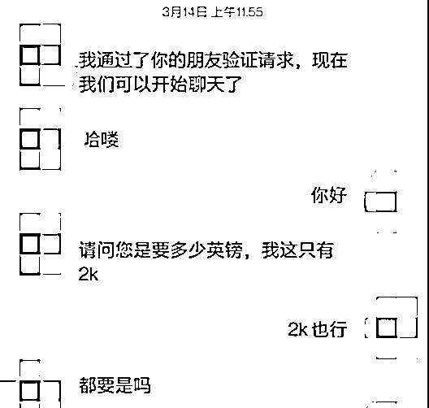

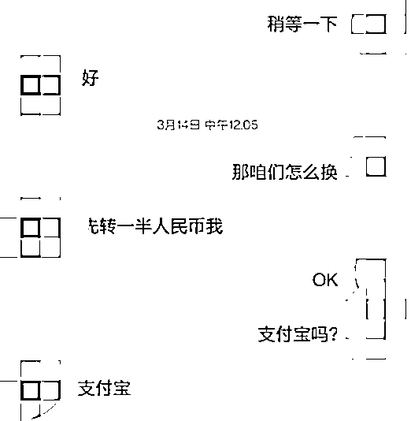

然而转账后该男子并没有遵守约定，而是声称要“去银行”才能转账，这时留学生已意识到不对劲并提出质疑。但男子连连找借口，以“手机 APP 被突然要更新”，“要切换国外的 APP”，为由不进行转账，并要求留学生等他 5 分钟。 

5 分钟之后，中国留学生发现对方已将朋友圈清零、在支付宝上把留学生拉黑，当留学生多次尝试联系对方时，对方均无应答。

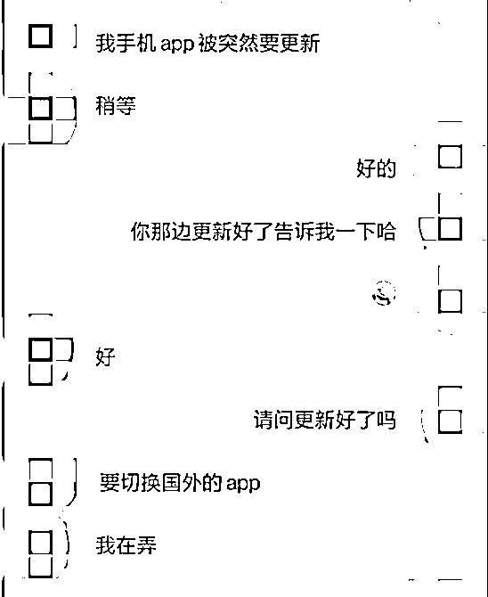

而就在这名同学将被骗经历发布在网上后，另一名中国留学生也留言表示自己遇到了类似的诈骗分子。

上述留学生还透露，另一位在伦敦国王学院（KCL）就读的中国留学生也被诈骗，经济损失近万元人民币。也就是说，近来已有至少三名中国留学生陆续被骗。

据中国留学生描述，行骗者应该是一个团伙，他们有好几个微信号，几个号互相推荐。

**诈骗手段二：虚拟绑架**

这类不法分子通常会致电留学生的国内亲属并谎称留学生被绑架，利用信息不对称和恐惧心理诈骗。而这也是最常见的诈骗手段之一，本台采访的人中半数都有接到过类似的电话。

**真实案例：**我爸曾接到过国内电话，说我在英国被绑架了，然后电话背景音还有人惨叫，弄的很逼真。

**真实案例二：**（我的）朋友亲戚都有接到。就是说你犯法了或是卷入了什么案子，有法院传单，要联系谁谁，最后目的就是骗钱。

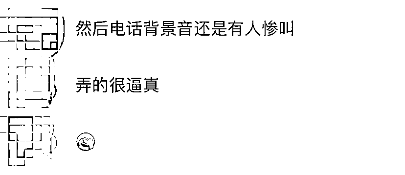

**诈骗手段三：假冒大使馆等权威机构**

这种电话诈骗手段通常有 “剧本”，诈骗者会冒充权威机构，比如海关、大使馆、税务局、各、移民局或快递公司等，在电话中以“包裹有违禁物品” “证件过期”、“涉及重大案件”、“面临被遣返”等理由，诱导受骗人进行银行转账。不法分子还会提供受害人的正确身份信息，以博取信任。

**真实案例：**据一名在英国利兹就读的留学生说，他第一次接到诈骗电话是去年刚到英国的时候，他第一次在亚马逊上网购，收到东西后诈骗电话就来了。对方先是要这名留学生提供身份证信息，并声称他寄回国的包裹被海关扣了，里面有违禁物品。据这名留学生表示，继‘皇家邮政’后，他后来还接到过‘深圳移民局’的电话。

**网络爆料案例**：据一名在英国的留学生在公开的社交媒体上爆料称，本月初，她接到一名陌生女子来电，对方自称是银行 Monzo 的代表，并声称这名留学生的账号可能被盗。该陌生女子指示留学生上网查询有没有可疑转账，留学生照做后发现真的有可疑转账（这时候还没有成功转到钱），并对其放松了警惕。

随后，电话中的女子哄骗这名留学生开设新的银行账号，并将钱转到新账号中。这名留学生表示，尽管有所怀疑，但对方所说的信息都是真实的。期间对方还多次有礼貌地请她耐心等待。于是她向陌生女子指定的账户转了 3300 英镑（约合人民币近 3 万元）。

然而大约 20 分钟后，对方突然挂掉，她打过去时已无法接通，她这才意识到被骗了。在这条爆料贴的下方，另一名在英国就读的留学生反映，她也有过一样的经历并被骗取 6500 英镑，最后通过给银行举报诈骗，得到了全数补偿。

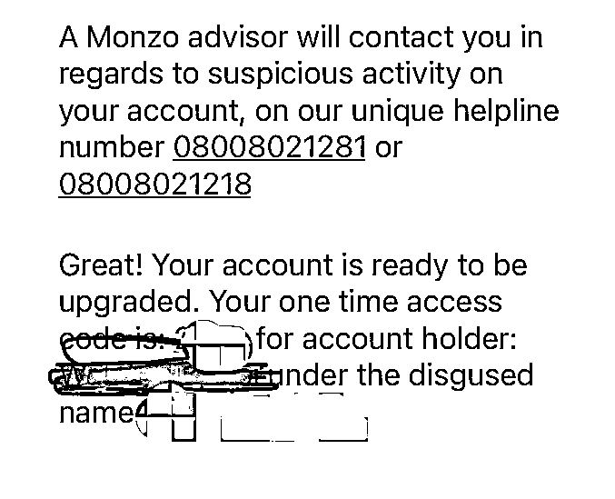

来源：社交媒体（本台尝试联系当事人，但尚未得到回复）

**诈骗手段四：交友软件上的钓鱼**

这类不法分子通常会用外貌假资料在交友网站注册账号，添加你之后频繁与你聊天并关怀备至，让你对其产生信任甚至是恋爱的错觉。时机成熟后，不法分子会引诱你转账。有的更加危险，会以约会为由将其哄骗到指定地点，从而实施抢劫。

**真实案例：**一名在伦敦某大学就读的 P 同学说，“我在交友软件上和她配对之后，她就开始使劲撩人。一段时间后，我们交换了私人联系方式，对方继续撩。但是当我要求视频时，对方不肯，我这才察觉到不对劲。当我查看她的社交媒体 ins 时，发现上面只有几张照片，而且都是很模糊的，时间跨度也很大，当下就反应过来我被骗了。”

P 同学表示，“像这种就属于欺骗感情，但我一位在美国创业的朋友就没有那么幸运了”。据 P 同学转述，这位创业者同样是在交友网站上被骗子盯上，因为他已经很信任对方，便一次性为对方转账 5 个比特币。转完账才发现对方消失不见。

P 同学提醒说，怀疑自己遇到这类骗局时，可以查看对方社交媒体、或是要求对方按照指示拍照，以验证对方身份。另外还可以上网搜对方电话号码，因为骗子通常会更换不同电话卡，所以都会选择注册门槛较低的电话运营商。总之，网络交友不要心存不切实际的幻想。

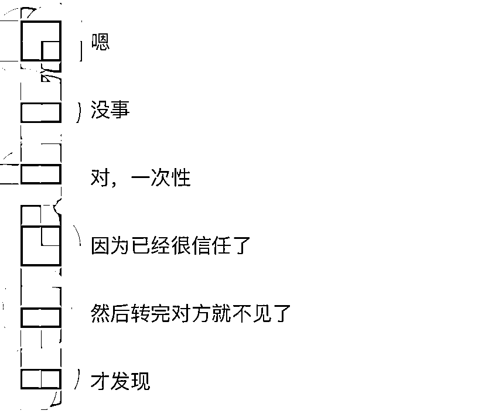

**诈骗手段五：电件或短信钓鱼**

常见钓鱼邮件或者短信内容有英国税务局（HMRC）退税、某品牌声称你中奖、Paypal 或者银行说你账户有问题等等。最近比较常见的手段是骗子谎称是“皇家邮政（Royal Mail）”，声称你有一个包裹需要支付邮费，并哄骗你点进骗子提供的付款链接。

**真实案例：**据一名伦敦上班族表示，“皇家邮政”的短信他就收到过，点开后网站也是，超级逼真。

**真实案例二****：**一名曾在 KCL 就读的中国留学生则说，她经常收到钓鱼邮件，声称她需要补交快递费用，或 Paypal 密码需要更改。但一点邮件地址，显示的就是一串乱码，这说明邮件不是来自官方，而是伪装成官方邮件的样子。

**诈骗手段六：虚拟绑架电信诈骗（进阶版）**

在另一种更为狡猾的虚拟绑架手段中，诈骗分子会谎称留学生涉嫌犯罪，并威胁受害人假装自己被绑架，否则他们遭到刑事惩罚。诈骗者随后会利用这些照片声称学生已被绑架，以勒索学生家庭上缴“赎金”。

去年 8 月，澳大利亚警方表示，2020 年以来已有 8 名留学生遭遇“虚拟绑架”电信诈骗，损失金额达 320 万澳元（约合 1600 万人民币）。

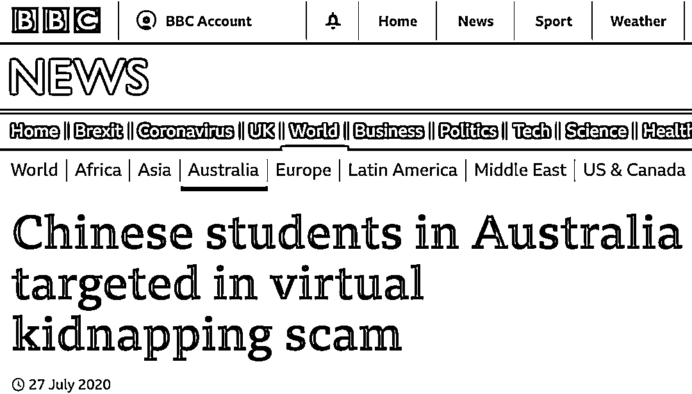

**真实案例：**去年 6 月，一名中国父亲曾收到视频，显示其在澳大利亚留学的女儿被绑架，他被骗转账 200 万澳元，约合人民币 998 万元。另一对中国父母收到他们 22 岁的女儿被蒙住眼睛的视频后，被骗 2 万美元。

**诈骗手段七：打折学费、超低价机票等**

还有一种常见的陷阱是“打折学费” “超低价机票”“折扣门票”“代缴费用”等。常见的做法是，不法分子通过微信、短信、论坛等渠道发布一些“优惠”的信息，声称自己的信用卡有返现折扣，而返现部分正是留学生可以省下的钱。但实际上，这些信用卡都是盗刷的。一但学校/银行察觉到了不对，这笔由盗刷而来的学费会被追回/拦截，但这个时候，受害人已经把钱转给了骗子，即使受害者即便立即报警，被骗的资金也非常难以追回。受骗人还可能被指控涉嫌金融诈骗。

**真实案例：**2019 年 9 月，两名在美国新罕布什尔大学就读的中国留学生因陷入“打折学费”陷阱，被控犯 A 类信用卡欺诈罪。

根据他们的描述，当时，一名陌生人通过短信联系到了他们，声称可以 6 折代缴学费，同时还能用折扣价帮买汽车保险、帮付房租等，两人便相信了对方，答应让对方代付学费。事实上，陌生人帮留学生交学费所用的信用卡是盗用别人的。

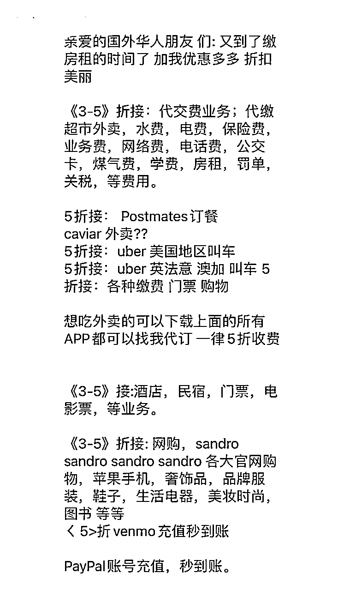

防范诈骗，最重要的是不要轻信以任何名义索取姓名、住址、家庭情况、银行账户等个人信息以及转账、汇款的要求。

如不慎上当受骗，可以及时向英国警方和国内公安机关报案，同时尽快联系本人账户开户行，要求采取止付、冻结等相应措施。受害人无法直接向国内公安机关报案的，可通过国内近亲属及时报案并向报案地反电信网络诈骗中心请求帮助，也可拨打 110 后请其协助转接反诈中心。

参考：

https://mp.weixin.qq.com/s/8L39nQgWL5nl90NUKgXdUg

https://mp.weixin.qq.com/s/Tru3_nhEsB9YgqsJ4-vaAQ

本文内容综合整理自 IVYPEDIA 留学私塾、留学字典及网络媒体公开报道，仅用于信息分享，转载请注明，版权归原作者所有，如有侵权请联系删除...

来源：赢留学，阻击诈骗

← 向右滑动与灰产圈互动交流 →

